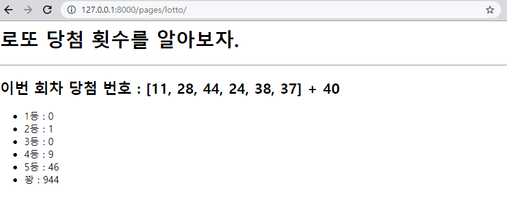
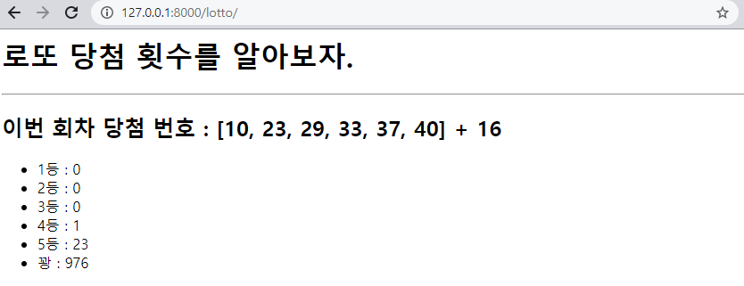

# [1] 랜덤



### views.py

```python
from django.shortcuts import render

# Create your views here.
import random
def lotto(request):
    numbers = list(range(1,46))
    pick_number = random.sample(numbers, 7)
    random_num = pick_number[:6]
    bonus = pick_number[-1]
    win = [0]*6
    for i in range(1000):
        N = random.sample(numbers, 7)
        cnt = 0
        getbonus = False
        for n in N:
            if n in pick_number:
                cnt += 1
            if n == bonus:
                getbonus = True
        if cnt >= 6:
            win[0] += 1
        if cnt == 5:
            if getbonus:
                win[1] += 1
            else:
                win[2] += 1
        if cnt == 4:
            win[3] += 1
        if cnt == 3:
            win[4] += 1
        if cnt < 3:
            win[5] += 1     
    context = {
        'pick_number' : pick_number,
        'random_num': random_num,
        'bonus': bonus,
        'win': win 
    }
    return render(request, 'pages/lotto.html', context)
```


### urls.py

```python
from django.contrib import admin
from django.urls import path
from . import views

app_name = 'pages'
urlpatterns = [
    path('admin/', admin.site.urls),
    path('lotto/', views.lotto),
]
```


### lotto.html

```django

  <h1>로또 당첨 횟수를 알아보자.</h1>
  <hr>
  <h2>이번 회차 당첨 번호 : {{ random_num }} + {{ bonus }}</h2>
  <ul>
    <li>1등 : {{ win.0 }}</li>
    <li>2등 : {{ win.1 }}</li>
    <li>3등 : {{ win.2 }}</li>
    <li>4등 : {{ win.3 }}</li>
    <li>5등 : {{ win.4 }}</li>
    <li>꽝 : {{ win.5 }}</li>
  </ul>

```


# [2] API 이용



### views.py

```python
from django.shortcuts import render

# Create your views here.
import random
import requests
## api
def lotto(request):
    url = 'https://www.dhlottery.co.kr/common.do?method=getLottoNumber&drwNo=1'
    response = requests.get(url)
    lotto = response.json()
    winno = []
    for i in range(1, 7):
        winno.append(lotto[f'drwtNo{i}'])   # 당첨번호 6개
    bonus = lotto['bnusNo']                 # 보너스 번호

    numbers = list(range(1,46))
    win = [0]*6
    getbonus = False
    for i in range(1000):
        pick_num = random.sample(numbers, 6)
        cnt = 0
        getbonus = False
        for n in pick_num:
            if n in winno:
                cnt += 1
            if n == bonus:
                getbonus = True
        if cnt == 6:
            win[0] += 1
        if cnt == 5:
            if getbonus:
                win[1] += 1
            else:
                win[2] += 1
        if cnt == 4:
            win[3] += 1
        if cnt == 3:
            win[4] += 1
        if cnt < 3:
            win[5] += 1     
    context = {
        'lotto' : lotto,
        'winno': winno, 
        'bonus': bonus,
        'win': win,
    }
    return render(request, 'pages/lotto.html', context)
```


### urls.py

```python
from django.contrib import admin
from django.urls import path
from . import views

app_name = 'pages'
urlpatterns = [
    path('admin/', admin.site.urls),
    path('lotto/', views.lotto),
]
```


### lotto.html

```django

  <h1>로또 당첨 횟수를 알아보자.</h1>
  <hr>
  <h2>이번 회차 당첨 번호 : {{ winno }} + {{ bonus }}</h2>
  <ul>
    <li>1등 : {{ win.0 }}</li>
    <li>2등 : {{ win.1 }}</li>
    <li>3등 : {{ win.2 }}</li>
    <li>4등 : {{ win.3 }}</li>
    <li>5등 : {{ win.4 }}</li>
    <li>꽝 : {{ win.5 }}</li>
  </ul>

```