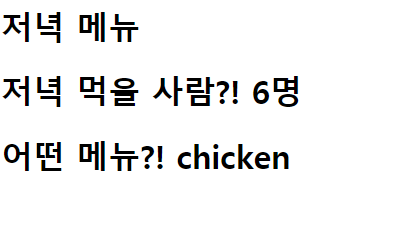

1. intro/urls.py

   ```python
   from django.contrib import admin
   from django.urls import path
   from pages import views
   
   urlpatterns = [
       path('admin/', admin.site.urls),
       path('dinner/<str:menu>/<int:count>/', views.dinner),
   ]
   ```

   

2. pages/views.py

   ```python
   from django.shortcuts import render
   
   # Create your views here.
   def dinner(request, menu, count):
       context = {
           'menu': menu,
           'count': count,
       }
       return render(request, 'dinner.html', context)
   ```

   

3. templates/dinner.html

   ```html
   
     <h1>저녁 메뉴</h1>
     <h1>저녁 먹을 사람?! {{ count }}명</h1>
     <h1>어떤 메뉴?! {{ menu }}</h1>
   
   ```

   