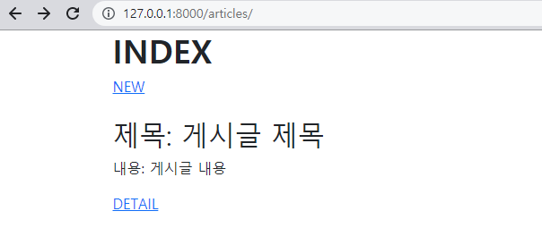
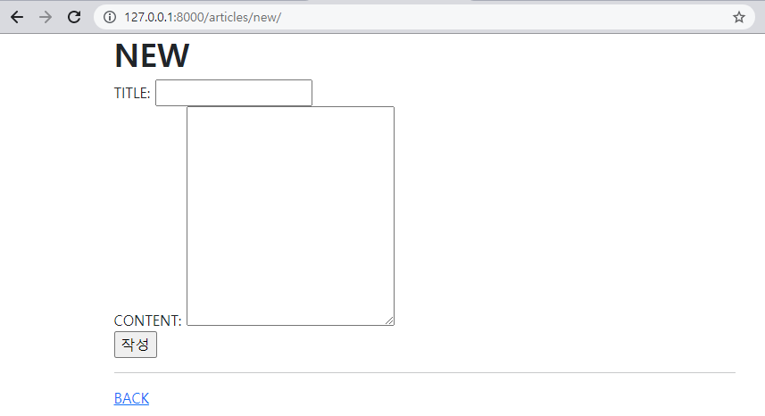

(1) Read



```django



  <h1 class="fw-bold">INDEX</h1>
  <a href=>NEW</a>
  <br></br>
  <h2>제목: 게시글 제목</h2>
  <p>내용: 게시글 내용</p>
  <a href="">DETAIL</a>

```

(2) Create



```django



  <h1 class="fw-bold">NEW</h1>
  <form action="" method="POST">
    <label for="title">TITLE: </label>
    <input type="text" name="title" id="title"><br>
    <label for "content">CONTENT: </label>
    <textarea name="content" id="content" cols="30" rows="10"></textarea><br>
    <input type="submit" value="작성">
  </form>
  <hr>
  <a href="">BACK</a>

```

