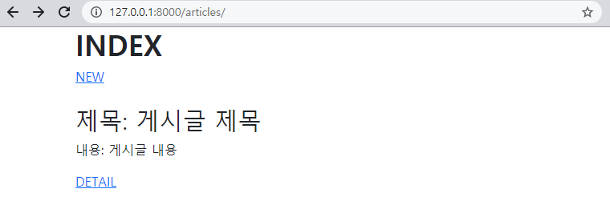
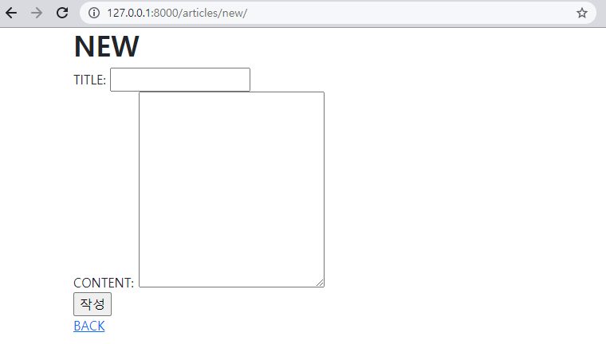
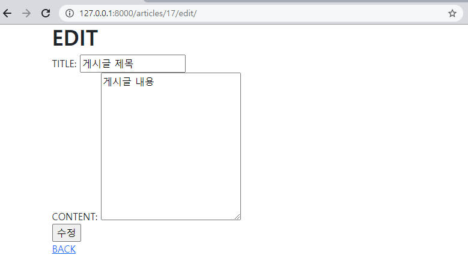

### (1) Read



* #### index.html

```django



  <h1 class="fw-bold">INDEX</h1>
  <a href=>NEW</a>
  <br></br>
  <h2>제목: 게시글 제목</h2>
  <p>내용: 게시글 내용</p>
  <a href="">DETAIL</a>

```


### (2) Create



* #### new.html

```django



  <h1 class="fw-bold">NEW</h1>
  <form action="" method="POST">
    
    <label for="title">TITLE: </label>
    <input type="text" name="title" id="title"><br>
    <label for "content">CONTENT: </label>
    <textarea name="content" id="content" cols="30" rows="10"></textarea><br>
    <input type="submit" value="작성">
  </form>
  <a href="">BACK</a>

```


### (3) Detail


* #### detail.html
```django



  <h1 class="fw-bold">DETAIL</h1>
  <hr>
  <h1>{{ article.title }}</h1>
  <p>{{ article.content }}</p>
  <p>작성일 : {{ article.created_at }}</p>
  <p>수정일 : {{ article.updated_at }}</p>
  <a href="">EDIT</a>
  <form class="d-inline" action="" method='POST'>
    
    <a href="">DELETE</a>
  </form>
  <br>
  <a href="">BACK</a>

```


### (4) Update



* #### edit.html
```django



  <h1 class="fw-bold">EDIT</h1>
  <form action="" method="POST">
    
    <label for="title">TITLE: </label>
    <input type="text" name="title" value="{{ article.title }}"><br>
    <label for "content">CONTENT: </label>
    <textarea name="content" cols="30" rows="10">{{ article.content }}</textarea><br>
    <input type="submit" value="수정">
  </form>
  <a href="">BACK</a>

```


### (5) Delete

* #### views.py

```python
def delete(request, pk):
    article = Article.objects.get(pk=pk)
    if request.method == 'POST':
        article.delete()
        return redirect('articles:index')
    else:
        return redirect('articles:detail', article.pk)
```


### ◆ views.py

```python
from django.shortcuts import render, redirect
from .models import Article

# Create your views here.
def index(request):
    articles = Article.objects.all()
    context = {
        'articles': articles,
    }
    return render(request, 'articles/index.html', context)

def new(request):
    return render(request, 'articles/new.html')

def create(request):
    title = request.POST.get('title')
    content = request.POST.get('content')
    article = Article(title=title, content=content)
    article.save()
    return redirect('articles:index')

def detail(request, pk):
    article = Article.objects.get(pk=pk)
    context = {
        'article' : article,
    }
    return render(request, 'articles/detail.html', context)

def delete(request, pk):
    article = Article.objects.get(pk=pk)
    if request.method == 'POST':
        article.delete()
        return redirect('articles:index')
    else:
        return redirect('articles:detail', article.pk)


def edit(request, pk):
    article = Article.objects.get(pk=pk)
    context = {
        'article' : article,
    }
    return render(request, 'articles/edit.html', context)

def update(request, pk):
    article = Article.objects.get(pk=pk)
    article.title = request.POST.get('title')
    article.content = request.POST.get('content')
    article.save()
    return redirect('articles:detail', article.pk)
```

