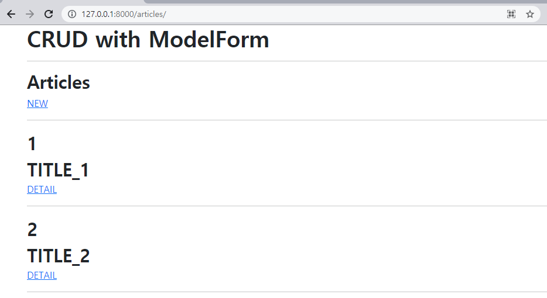
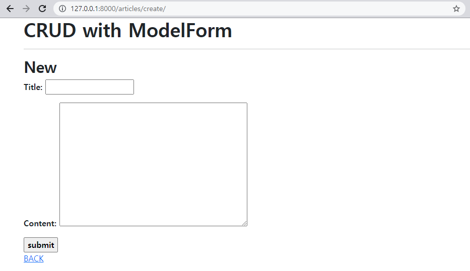
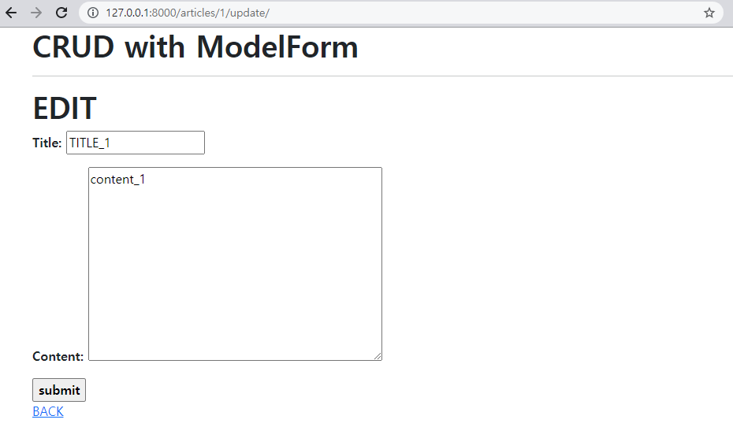

### (1) Read



* index.html

```django



  
  <h2 class='fw-bold'>Articles</h2>
  <a href="">NEW</a>
  <hr>
  
    <div class='fw-bold fs-2'>{{ article.pk }}</div>
    <div class='fw-bold fs-2'>{{ article.title }}</div>
    <a href="">DETAIL</a>
    <hr>
  

```




* create.html

```django



  <h2 class='fw-bold'>New</h2>
  <form action="" method="POST" class='fw-bold'>
    
    {{ form.as_p }}
    <input type="submit" value='submit' class='fw-bold'>
  </form>
  <a href="">BACK</a>

```


### (3) Detail


* detail.html

```django



  <h2 class='fw-bold'>DETAIL</h2>
  <hr>
  <h3 class='fw-bold'>글 번호: {{ article.pk }}</h3>
  <h3 class='fw-bold'>글 제목 : {{ article.title }}</h3>
  <p class='fs-5'>글 내용 : {{ article.content }}</p>
  <p>글 생성시각: {{ article.created_at }}</p>
  <p>글 수정시각: {{ article.updated_at }}</p>
  <a href="">EDIT</a><br>
  <form action="" method="POST">
    
    <input type='submit' value='DELETE'>
  </form>
  <hr>
  <a href="">BACK</a>

```


### (4) Update



* update.html

```django




  <h1 class='fw-bold'>EDIT</h1>
  <form action="" method="POST" class='fw-bold'>
    
    {{ form.as_p }}
    <input type="submit" value='submit' class='fw-bold'>
  </form>
  <a href="">BACK</a>

```


### (5) Delete

별도 페이지 없음


### ■ Views.py

```python
from django.shortcuts import get_object_or_404, render, redirect
from .models import Article
from .forms import ArticleForm
from django.views.decorators.http import require_http_methods, require_POST, require_safe

# Create your views here.
@require_safe
def index(request):
    articles = Article.objects.order_by('pk')
    
    context = {
        'articles': articles,
    }
    return render(request, 'articles/index.html', context)

@require_http_methods(['GET', 'POST'])
def create(request):
    if request.method == 'POST':
        form = ArticleForm(request.POST)
        if form.is_valid():
            article = form.save()
            return redirect('articles:detail', article.pk)
    else:
        form = ArticleForm()
    context = {
        'form': form,
    }
    return render(request, 'articles/create.html', context)

@require_safe
def detail(request, pk):
    article = get_object_or_404(Article, pk=pk)
    context = {
        'article': article,
    }
    return render(request, 'articles/detail.html', context)

@require_POST
def delete(request, pk):
    article = get_object_or_404(Article, pk=pk)
    if request.method == 'POST':
        article.delete()
        return redirect('articles:index')
    return redirect('articles:detail', article.pk)


@require_http_methods(['GET', 'POST'])
def update(request, pk):
    article = get_object_or_404(Article, pk=pk)
    # update
    if request.method == 'POST':
        form = ArticleForm(request.POST, instance=article)
        if form.is_valid():
            form.save()
            return redirect('articles:detail', article.pk)
    # edit
    else:
        form = ArticleForm(instance=article)
    context = {
        'form': form,
        'article': article,
    }
    return render(request, 'articles/update.html', context)
```


### ■ forms.py

```python
from articles.models import Article
from django import forms
   
class ArticleForm(forms.ModelForm):
    title = forms.CharField(
        label='Title',
        widget=forms.TextInput(
            attrs={
                'class': 'my-title',
                'maxlength': 10
            }
        )
    )
    content = forms.CharField(
        label='Content',
        widget=forms.Textarea(
            attrs={
                'class': 'my-content',
                'rows': 10,
                'cols': 50,
            }
        )
    )
    class Meta:
        model = Article
        fields = '__all__'
```


