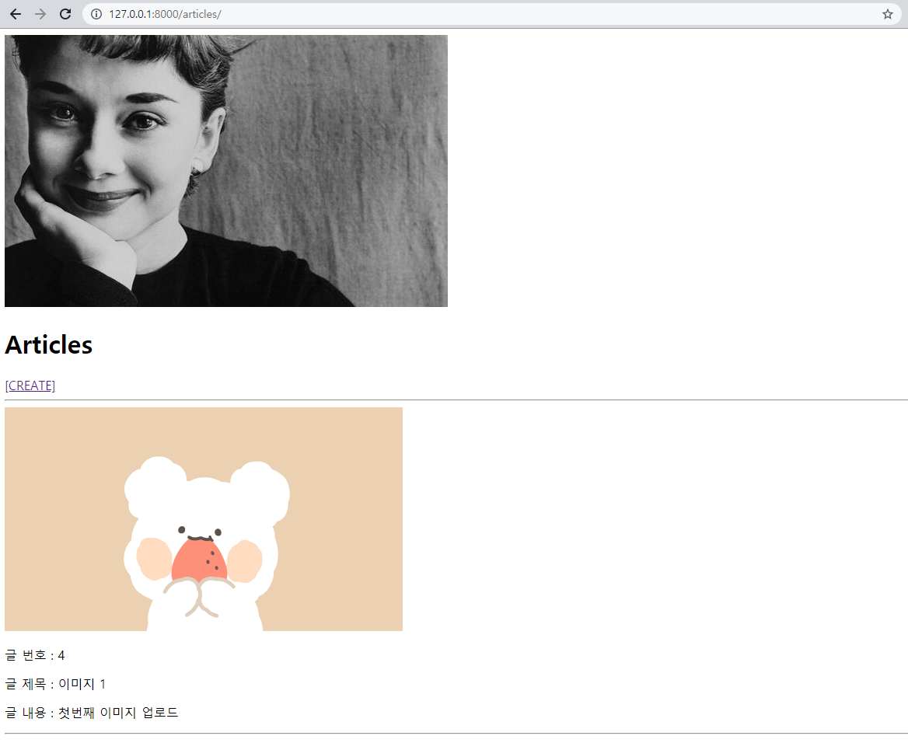

### 1. 이미지 출력 해결

* `settings.py`에 추가

```python
STATICFILES_DIRS = [
	BASE_DIR / 'static',
]
```


### 2. 이미지를 첨부하여 게시글 작성 

* `django_06_workshop/urls.py`  수정

  ```python
  from django.contrib import admin
  from django.urls import path, include
  from django.conf import settings
  from django.conf.urls.static import static
  
  urlpatterns = [
      path('admin/', admin.site.urls),
      path('articles/', include('articles.urls')),
  ] + static(settings.MEDIA_URL, document_root=settings.MEDIA_ROOT)
  ```

  > `from django.conf import settings`
  > `from django.conf.urls.static import static`
  >
  > `+ static(settings.MEDIA_URL, document_root=settings.MEDIA_ROOT)`
  >
  > 추가


* `create.html` 수정

  ```django
  <!DOCTYPE html>
  <html lang="en">
  <head>
    <meta charset="UTF-8">
    <meta http-equiv="X-UA-Compatible" content="IE=edge">
    <meta name="viewport" content="width=device-width, initial-scale=1.0">
    <title>Document</title>
  </head>
  <body>
    <h1>CREATE</h1>
    <form action="" method="POST" enctype="multipart/form-data">
      
      {{ form.as_p }}
      <input type="submit">
    </form>
    <a href="">[back]</a>
  </body>
  </html>
  ```

  >  form  태그 변경
  >
  >  `<form action="" method="POST" enctype="multipart/form-data">`


### 결과 사진

