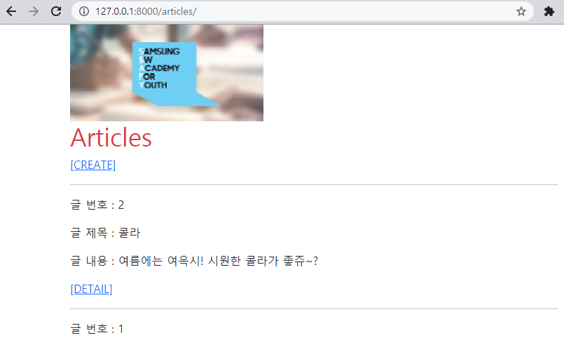
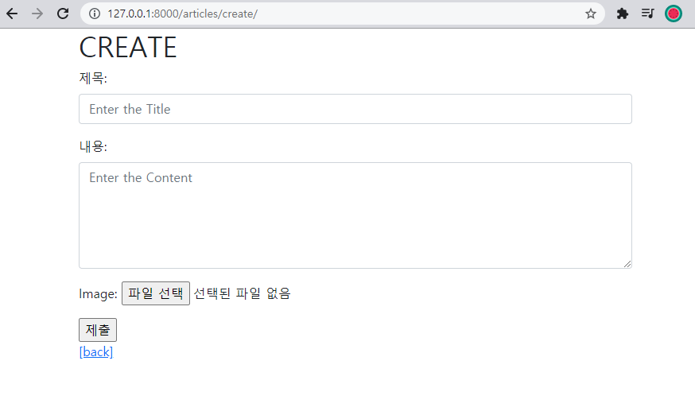
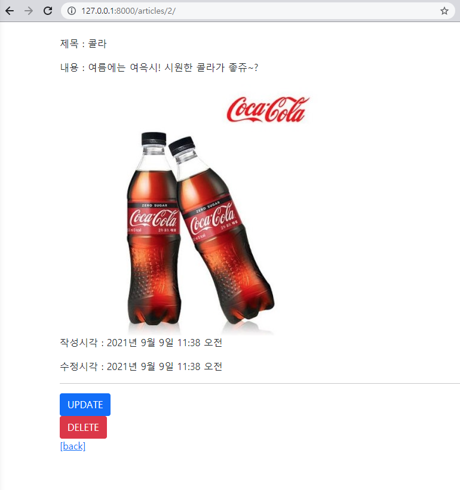
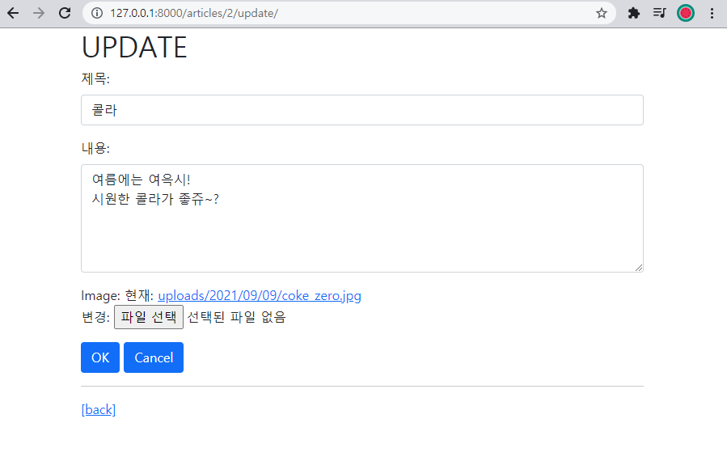

## 기본 설정

### crud/settings.py

```python
TEMPLATES = [
    {
        'BACKEND': 'django.template.backends.django.DjangoTemplates',
        'DIRS': [BASE_DIR / 'articles',],
        'APP_DIRS': True,
        'OPTIONS': {
            'context_processors': [
                'django.template.context_processors.debug',
                'django.template.context_processors.request',
                'django.contrib.auth.context_processors.auth',
                'django.contrib.messages.context_processors.messages',
            ],
        },
    },
]
```

> base.html을 articles/templates에 생성


## 1. Read



```django
# index.html



  
  <h1 class="text-danger">Articles</h1>
  <a href="">[CREATE]</a>
  <hr>
  
    <p>글 번호 : {{ article.pk }}</p>
    <p>글 제목 : {{ article.title }}</p>
    <p>글 내용 : {{ article.content }}</p>
    <a href="">[DETAIL]</a>
    <hr>
  

```


## 2. Create



```django
# create.html



  <h1>CREATE</h1>
  <form action="" method="POST" enctype="multipart/form-data">
    
    
    {{ imageform.as_p }}
    <input type="submit" value="제출" accept="image/*">
  </form>
  <a href="">[back]</a>

```


## 3. Detail



```django
# detail.html



  <br>
  <p>제목 : {{ article.title }}</p>
  <p>내용 : {{ article.content }}</p>
  
    
  
  <p>작성시각 : {{ article.created_at }}</p>
  <p>수정시각 : {{ article.updated_at }}</p>
  <hr>
  <a href="">
    <button class="btn btn-primary">UPDATE</button>
  </a>
  <form action="" method="POST">
    
    <button class="btn btn-danger">DELETE</button>
  </form>
  <a href="">[back]</a>

```


## 4. Update



```django
# update.html



  <h1>UPDATE</h1>
  <form action="" method="POST" enctype="multipart/form-data">
    
    
    {{ imageform.as_p }}
    
  </form>
  <hr>
  <a href="">[back]</a>

```


## files

### crud/urls.py

```python
from django.contrib import admin
from django.urls import path, include
from django.conf import settings
from django.conf.urls.static import static

urlpatterns = [
    path('admin/', admin.site.urls),
    path('articles/', include('articles.urls')),
] + static(settings.MEDIA_URL, document_root=settings.MEDIA_ROOT)
```

### crud/settings.py

```python
INSTALLED_APPS = [
    'articles',
    'bootstrap5',
    'django.contrib.admin',
    'django.contrib.auth',
    'django.contrib.contenttypes',
    'django.contrib.sessions',
    'django.contrib.messages',
    'django.contrib.staticfiles',
]

STATIC_URL = '/static/'
STATICFILES_DIRS = [
	BASE_DIR / 'static',
]
MEDIA_ROOT = BASE_DIR / 'media'
MEDIA_URL = '/media/'
```


### articles/models.py

```python
from django.db import models

# Create your models here.
class Article(models.Model):
    title = models.CharField(max_length=10)
    content = models.TextField()
    created_at = models.DateTimeField(auto_now_add=True)
    updated_at = models.DateTimeField(auto_now=True)
    def __str__(self):
        return self.title

class ArticleImage(models.Model):
    image = models.ImageField(upload_to='uploads/%Y/%m/%d', blank=True)
    def __str__(self):
        return self.title
```

### articles/forms.py

```python
from django import forms
from .models import Article, ArticleImage

class ArticleForm(forms.ModelForm):
    title = forms.CharField(
        label='제목: ',
        widget=forms.TextInput(
            attrs={
                'class': 'my-title',
                'placeholder': 'Enter the Title',
                'maxlength': 10
            }
        )
    )
    content = forms.CharField(
        label='내용: ',
        widget=forms.Textarea(
            attrs={
                'class': 'my-content',
                'placeholder': 'Enter the Content',
                'rows': 5,
                'cols': 50,
            }
        )
    )
    class Meta:
        model = Article
        fields = ('title','content',)

class ArticleImageForm(forms.ModelForm):
    image = forms.ImageField(
        label='Image'
    )
    class Meta:
        model = ArticleImage
        fields = ('image',)
```

### articles/views.py

```python
from django.shortcuts import render, redirect, get_object_or_404
from django.views.decorators.http import require_http_methods, require_POST, require_safe
from .models import Article, ArticleImage
from .forms import ArticleForm, ArticleImageForm

# Create your views here.
@require_safe
def index(request):
    articles = Article.objects.order_by('-pk')
    context = {
        'articles': articles,
    }
    return render(request, 'articles/index.html', context)

@require_http_methods(['GET', 'POST'])
def create(request):
    if request.method == 'POST':
        form = ArticleForm(request.POST, request.FILES)
        imageform = ArticleImageForm(request.POST, request.FILES)
        if form.is_valid():
            article = form.save()
            imageform.save()        
            return redirect('articles:detail', article.pk)
    else:
        form = ArticleForm()
        imageform = ArticleImageForm()
    context = {
        'form': form,
        'imageform': imageform,
    }
    return render(request, 'articles/create.html', context)

@require_safe
def detail(request, pk):
    article = get_object_or_404(Article, pk=pk)
    articleimage = get_object_or_404(ArticleImage, pk=pk)
    context = {
        'article': article,
        'articleimage': articleimage,
    }
    return render(request, 'articles/detail.html', context)

@require_POST
def delete(request, pk):
    article = get_object_or_404(Article, pk=pk)
    articleimage = get_object_or_404(ArticleImage, pk=pk)
    article.delete()
    articleimage.delete()
    return redirect('articles:index')

@require_http_methods(['GET', 'POST'])
def update(request, pk):
    article = get_object_or_404(Article, pk=pk)
    articleimage = get_object_or_404(ArticleImage, pk=pk)
    if request.method == 'POST':
        form = ArticleForm(request.POST, request.FILES, instance=article)
        imageform = ArticleForm(request.POST, request.FILES, instance=articleimage)
        if form.is_valid():
            form.save()
            imageform.save()
            return redirect('articles:detail', article.pk)
    else:
        form = ArticleForm(instance=article)
        imageform = ArticleImageForm(instance=articleimage)
    context = {
        'article': article,
        'form': form,
        'imageform': imageform,
    }
    return render(request, 'articles/update.html', context)
```


