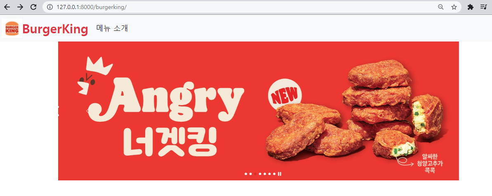
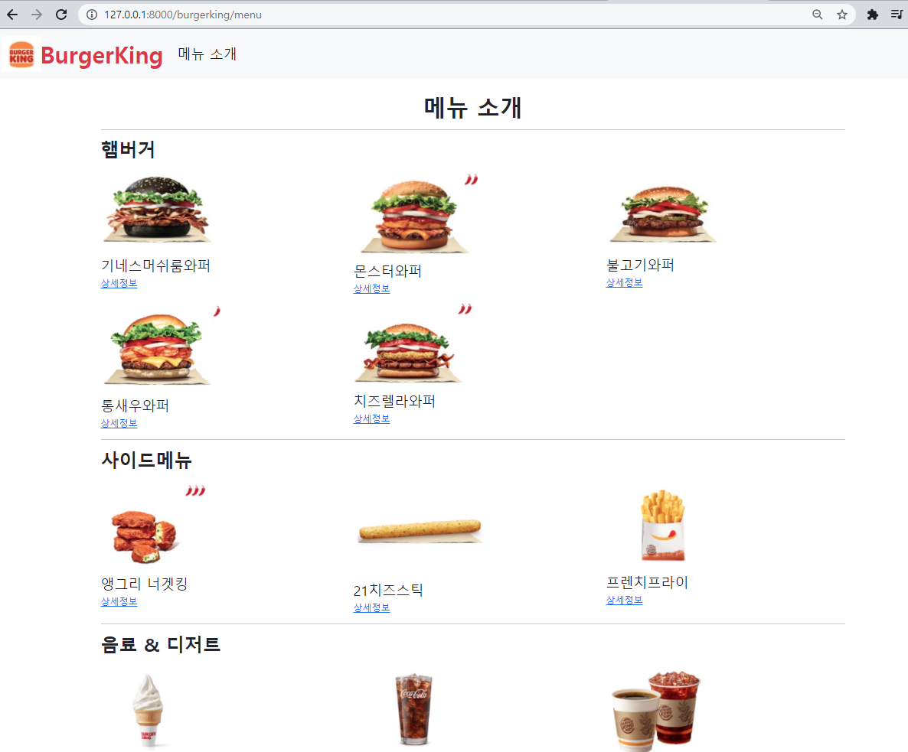
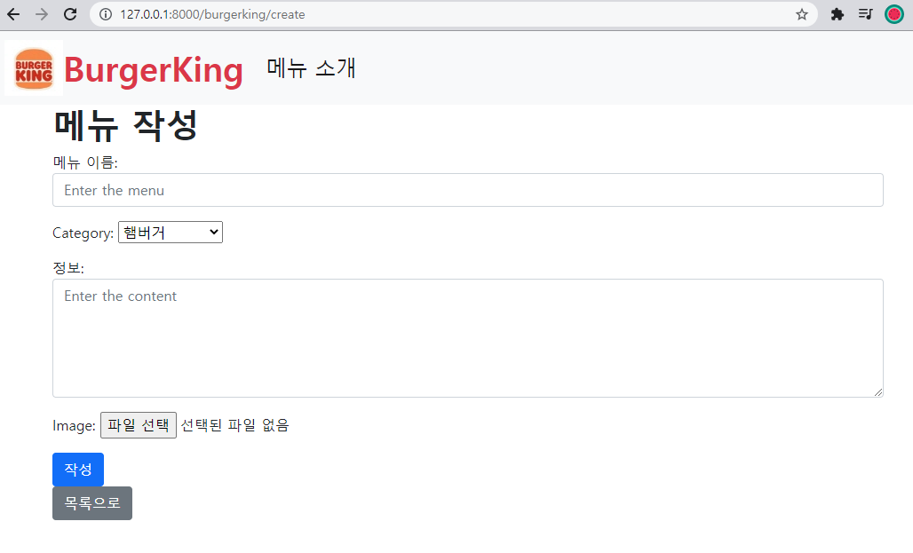
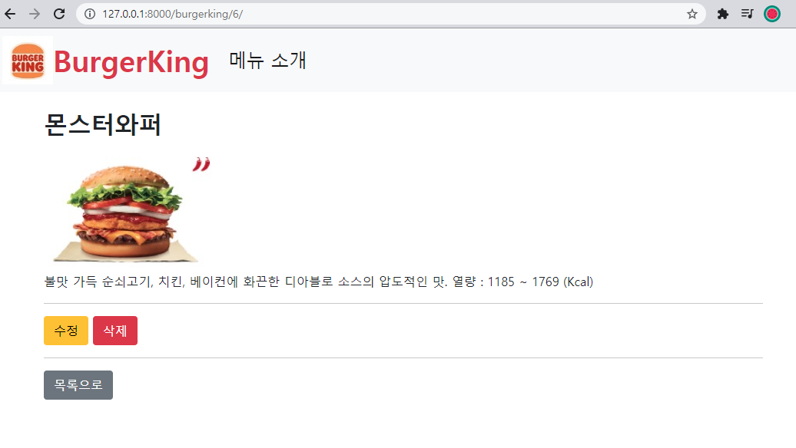
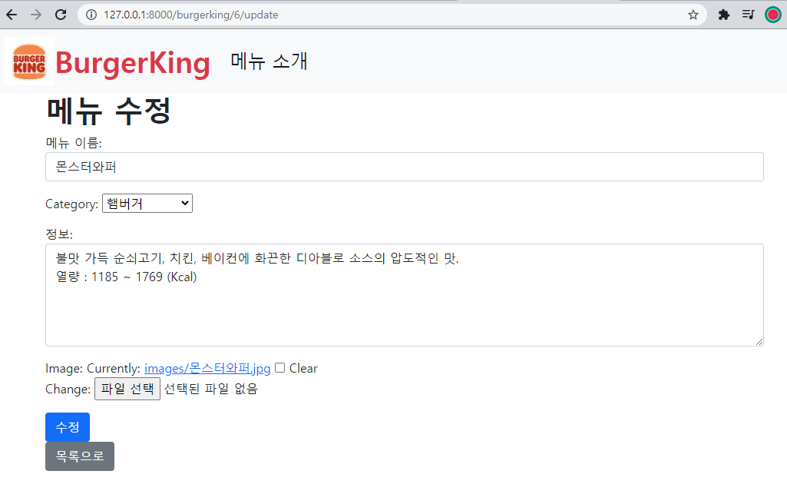

# myproject - burgerking

> 버거킹 메뉴판 만들기

* 프로젝트 이름 : my project

* 앱 이름 : burgerking

* 모델 : 

  ```python
  class Burgerking(models.Model):
      menu = models.CharField(max_length=50)
      category = models.CharField(max_length=50)
      content = models.TextField(max_length=100)
      image = models.ImageField(upload_to='images/',blank=True,)
      updated_at = models.DateTimeField(auto_now=True)
  ```

  * menu : 음식 메뉴 이름
  * category : '햄버거, 사이드메뉴, 음료&디저트' 3가지
  * content : 음식 설명
  * image : 음식 이미지
  * updated_at : 수정한 시간


## index.html




* carousel 형식으로 이미지 3개가 넘어감

* navbar
  * BurgerKing 클릭 시 => index 페이지
  * 메뉴 소개 클릭 시 => menu 페이지


## menu.html



* 메뉴판 형식


* 상세정보 클릭 시 => detail 페이지
* 메뉴 작성 클릭 시 => create 페이지


## create.html



## detail.html



* 수정 클릭 시 => update 페이지
* 삭제 클릭 시 => delete됨


## update.html



