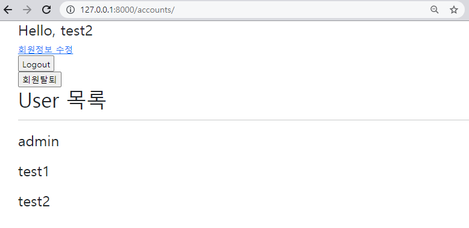
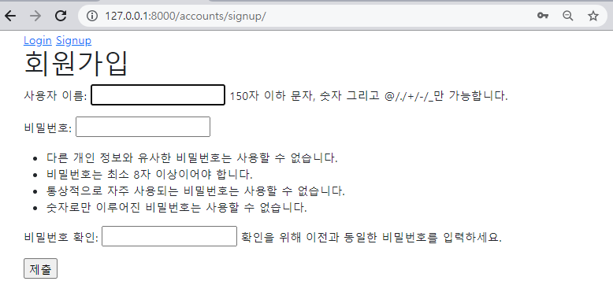

## ❖ Accounts CR

### 1. /accounts/ 

유저 목록을 출력하는 페이지를 나타낸다.


```python
# accounts/urls.py
from django.urls import path
from . import views

app_name = 'accounts'
urlpatterns = [
    path('', views.users, name='users'),
]
```

```python
# accounts/views.py
from django.contrib.auth.models import User

def users(request):
    users = User.objects.order_by('username')
    context = {
        'users': users
    }
    return render(request, 'accounts/users.html', context)
```


```django
<!-- accounts/users.html -->



  <h1>User 목록</h1>
  <hr>
  
    <p class='fs-3'>{{ user.username }}</p>
  

```





### 2. /accounts/signup/ 

회원가입 작성을 위한 페이지를 나타낸다. 유저를 생성하는 기능을 수행한다

```python
# accounts/urls.py
from django.urls import path
from . import views

app_name = 'accounts'
urlpatterns = [
    path('', views.users, name='users'),
    path('signup/', views.signup, name='signup'),
]
```

```python
# accounts/views.py
from django.contrib.auth.forms import UserCreationForm

def signup(request):
    if request.method == 'POST':
        form = UserCreationForm(request.POST)
        if form.is_valid():
            user = form.save()
            auth_login(request, user)
            return redirect('articles:index')
    else:
        form = UserCreationForm()
    context = {
        'form': form,
    }
    return render(request, 'accounts/signup.html', context)
```

```django
<!-- accounts/signup.html -->



  <h1>회원가입</h1>
  <form action="" method="POST">
    
    {{ form.as_p }}
    <input type="submit">
  </form>


```




