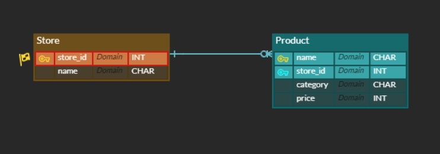

### ❖ Modeling 

편의점 상품 관리 프로그램을 제작하기 위해 모델링을 해야 하는 업무가 주어졌다. “모델링”은 개발해야 할 소프트웨어의 밑그림으로써 반드시 먼저 고려해야 할 중요한 요소 중 하나이다.

### ❖ ERD

다음 조건을 참고하여 ERD와 models.py를 자유롭게 작성하고, 작성한 모델링에 대한 소개와 작성하게 된 이유에 대해 간략히 작성하고 발표하시오. 

1) 지점별 편의점들이 존재한다. 
2) 각 상품들은 특정 조건별로 분류 할 수 있다.
3) 단, User는 고려하지 않는다.

우선 편의점의 목록(Store)을 만들었다. store_id는 편의점별 인덱스. 고유의 숫자이고, name은 지점이름이다.

편의점별로 상품 목록(Product)을 만들어 각각 편의점에 상품이 여러개 있을 수 있도록 연결해주었다. name은 상품이름, store_id는 Store 테이블을 참조하는, 상품이 있는 편의점 id이다. 그리고 상품안에 category를 만들어 조건별로 분류할 수 있게 했다. 

한 편의점에 없거나 하나 혹은 여러개의 상품이 있을 수 있게 연결했고, 상품은 한 편의점에 있도록 만들어서 store_id가 기본키가 되도록 하여 식별관계로 나타냈다.

