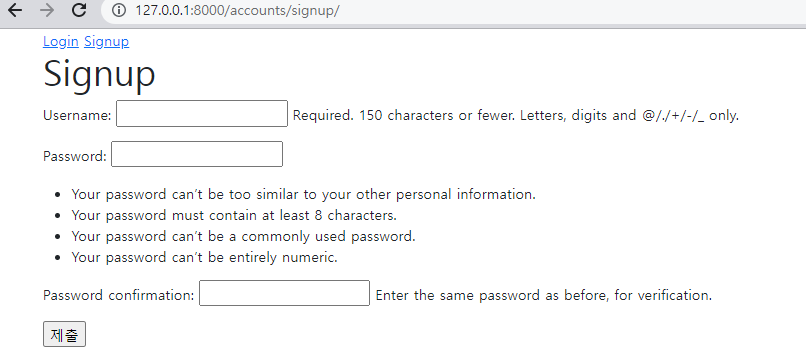
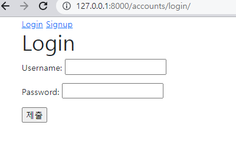
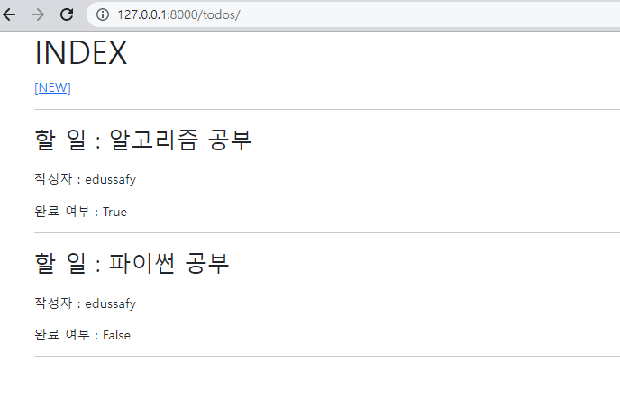
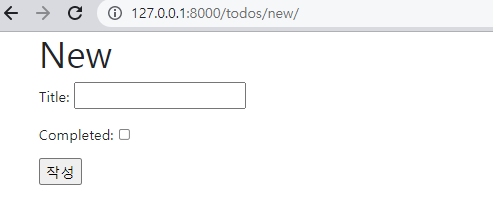

1. 회원가입

   

 

2. 로그인

   

    ```python
    # accounts/views.py
    from django.shortcuts import redirect, render
    from django.contrib.auth import login as auth_login
    from django.contrib.auth.forms import AuthenticationForm
    from django.views.decorators.http import require_http_methods
    from .forms import CustomUserCreationForm 
    
    @require_http_methods(['GET', 'POST'])
    def login(request):
        if request.user.is_authenticated:
            return redirect('todos:index')
    
        if request.method == 'POST':
            form = AuthenticationForm(request, request.POST)
            if form.is_valid():
                auth_login(request, form.get_user())
                return redirect(request.GET.get('next') or 'todos:index')
        else:
            form = AuthenticationForm()
        context = {
            'form': form,
        }
        return render(request, 'accounts/login.html', context)
    
    @require_http_methods(['GET', 'POST'])
    def signup(request):
        if request.user.is_authenticated:
            return redirect('todos:index')
    
        if request.method == 'POST':
            form = CustomUserCreationForm(request.POST)
            if form.is_valid():
                user = form.save()
                auth_login(request, user)
                return redirect('todos:index')
        else:
            form = CustomUserCreationForm()
        context = {
            'form': form,
        }
        return render(request, 'accounts/signup.html', context)
    ```
   
   ```python
   # accounts/models.py
   from django.contrib.auth.models import AbstractUser
   
   class User(AbstractUser):
       pass
   
   # accounts/forms.py
   from django.contrib.auth.forms import UserCreationForm
   from django.contrib.auth import get_user_model
   
   
   class CustomUserCreationForm(UserCreationForm):
   
       class Meta:
           model = get_user_model()
           fields = UserCreationForm.Meta.fields
   ```
   
   ```html
   # login.html
   
   
     <h1>Login</h1>
     <form action="" method="POST">
       
       {{ form.as_p }}
       <input type="submit">
     </form>
   
   
   # signup.html
   
   
   
     <h1>Signup</h1>
     <form action="" method="POST">
       
       {{ form.as_p }}
       <input type="submit">
     </form>
   
   ```
   
   


3. Todo 목록 (index)



4. Todo 생성 (new)

   

   ```python
   # todos/models.py
   from django.db import models
   from django.conf import settings
   
   # Create your models here.
   class Todo(models.Model):
       author = models.ForeignKey(settings.AUTH_USER_MODEL, on_delete=models.CASCADE)
       title = models.CharField(max_length=100)
       completed = models.BooleanField(default=False)
   
       def __str__(self):
           return self.title
   
   # todos/forms.py
   from django import forms
   from .models import Todo
   
   class TodoForm(forms.ModelForm):
   
       class Meta:
           model = Todo
           fields = ('title', 'completed',)
   ```

   ```python
   # todos/views.py
   from django.shortcuts import render, redirect
   from django.contrib.auth.decorators import login_required
   from .models import Todo
   from .forms import TodoForm
   
   @login_required
   def index(request):
       # todos = Todo.objects.all()
       todos = request.user.todo_set.all()
       context = {
           'todos': todos,
       }
       return render(request, 'todos/index.html', context)
   
   @login_required
   def new(request):
       if request.method == 'POST':
           form = TodoForm(request.POST)
           if form.is_valid():
               todo = form.save(commit=False)
               todo.author = request.user      # 컬럼이름 : author_id
               todo.save()
               return redirect('todos:index')
       else:
           form = TodoForm()
       context = {
           'form': form,
       }
       return render(request, 'todos/new.html', context)
   ```

   ```html
   # index.html
   
   
   
     <h1>INDEX</h1>
     <a href="">[NEW]</a>
     <hr>
     
       <p class='fs-3'>할 일 : {{ todo.title }}</p>
       <p>작성자 : {{ todo.author }}</p>
       <p>완료 여부 : {{ todo.completed }}</p>
       <hr>
     
   
   
   # new.html
   
   
   
     <h1>New</h1>
     <form action="" method="POST">
       
       {{ form.as_p }}
       <input type="submit" value="작성">
     </form>
   
   ```

   


