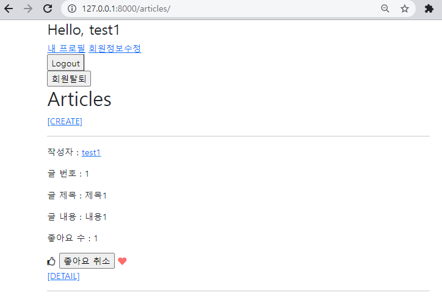

### 1. Model

```python
class Article(models.Model):
    user = models.ForeignKey(settings.AUTH_USER_MODEL, on_delete=models.CASCADE)
    like_users = models.ManyToManyField(settings.AUTH_USER_MODEL, related_name='like_articles')
    title = models.CharField(max_length=10)
    content = models.TextField()
    created_at = models.DateTimeField(auto_now_add=True)
    updated_at = models.DateTimeField(auto_now=True)

    def __str__(self):
        return self.title
```


### 2. url & view

```python
# url.py
urlpatterns = [
	path('<int:article_pk>/like/', views.likes, name='likes'), ...
]

# views.py
@require_POST
def likes(request, article_pk):
    article = get_object_or_404(Article, pk=article_pk)
    if article.user.is_authenticated:
        if article.list_users.filter(pk=request.user.pk).exists():
            article.like_users.remove(request.user) 	# 좋아요 취소
        else:  
            article.like_users.add(request.user)	 	# 좋아요
        return redirect('articles:index')
    return redirect('articles:login')
```


### 3. Template



* index.html

```django



  <h1>Articles</h1>
  
    <a href="">[CREATE]</a>
  
    <a href="">[새 글을 작성하려면 로그인하세요.]</a>
  
  <hr>
  
    <p>작성자 : <a href="">{{ article.user }}</a></p>
    <p>글 번호 : {{ article.pk }}</p>
    <p>글 제목 : {{ article.title }}</p>
    <p>글 내용 : {{ article.content }}</p>
    <p>좋아요 수 : {{ article.like_users.count }}</p>
    <div>
      <form action="" method="POST">
        
        
          <i class="far fa-thumbs-up"></i>
          <input type="submit" value='좋아요 취소'>
          <i class="fas fa-heart" style="color: #ff6b6b;"></i>
        
          <i class="far fa-thumbs-up"></i>
          <input type="submit" value='좋아요'>
          <i class="fas fa-heart"></i>
        
      </form>
    </div>

    <a href="">[DETAIL]</a>
    <hr>
  


```

