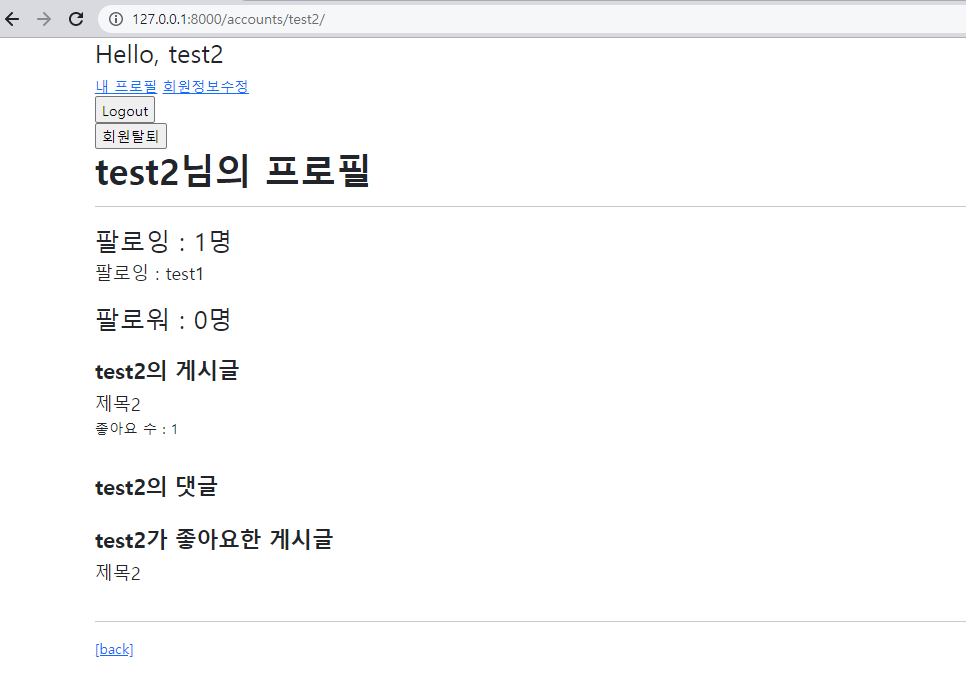
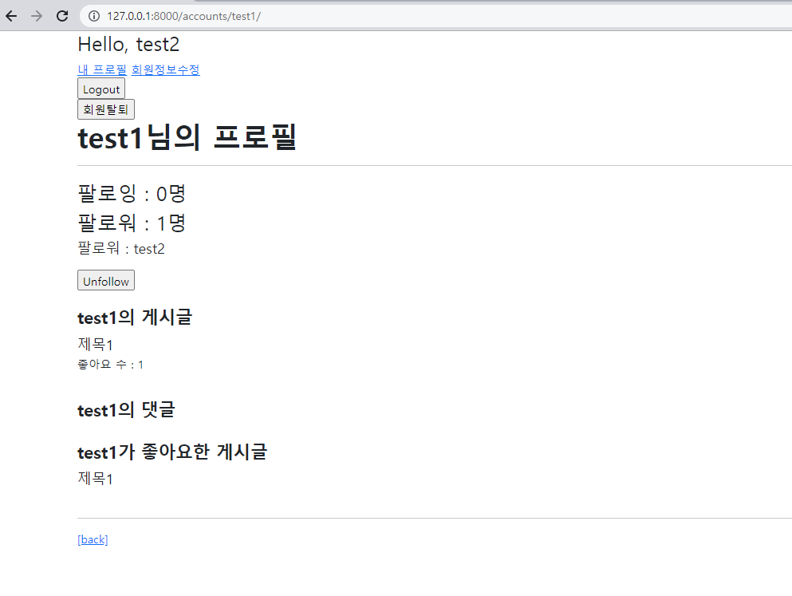

### 1. Model & Form

```python
# accounts/models.py
class User(AbstractUser):
    followings = models.ManyToManyField('self', symmetrical=False, related_name='followers')
```


### 2. url & view

```python
# accounts/urls.py
app_name = 'accounts'
urlpatterns = [
    path('login/', views.login, name='login'),
    path('logout/', views.logout, name='logout'),
    path('signup/', views.signup, name='signup'),
    path('delete/', views.delete, name='delete'),
    path('update/', views.update, name='update'),
    path('password/', views.change_password, name='change_password'),
    path('<username>/', views.profile, name='profile'),
    path('<int:user_pk>/follow/', views.follow, name='follow'),
]

# accounts/views.py
def profile(request, username):
    person = get_object_or_404(get_user_model(), username=username)
    context = {
        'person': person,
    }
    return render(request, 'accounts/profile.html', context)

@require_POST
def follow(request, user_pk):
    if request.user.is_authenticated:
        person = get_object_or_404(get_user_model(), pk=user_pk)
        if person != request.user:
            if person.followers.filter(pk=request.user.pk).exists():
                person.followers.remove(request.user)
            else:
                person.followers.add(request.user)
        return redirect('accounts:profile', person.username)
    return redirect('accounts:login')
```


### 3. template





```html
# profile.html



  <h1 class='fw-bold'>{{ person.username }}님의 프로필</h1>
  <hr>

  <div>
    <div class='fs-3'>
      팔로잉 : {{ person.followings.all|length }}명
    </div>
    
      <p class='fs-5'>팔로잉 : {{ follow }}</p>
    

    <div class='fs-3'> 
      팔로워 : {{ person.followers.all|length }}명
    </div>
    
      <p class='fs-5'>팔로워 : {{ follower }}</p>
    

    
      <div>
        <form action="" method="POST">
          
          
            <input type="submit" value="Unfollow">
          
            <input type="submit" value="Follow">
          
        </form>
      </div>
    
  </div>
  <br>


  <h4 class='fw-bold'>{{ person.username }}의 게시글</h4>
  
    <div class='fs-5'>{{ article.title }}</div>
    <p>좋아요 수 : {{ article.like_users.count }}</p>
  
  <br>
  
  <h4 class='fw-bold'>{{ person.username }}의 댓글</h4>
  
    <div>{{ comment.content }}</div>
  
  <br>

  <h4 class='fw-bold'>{{ person.username }}가 좋아요한 게시글</h4>
  
    <div class='fs-5'>{{ article.title }}</div>
  
  <br>

  <hr>
  <a href="">[back]</a>

```

