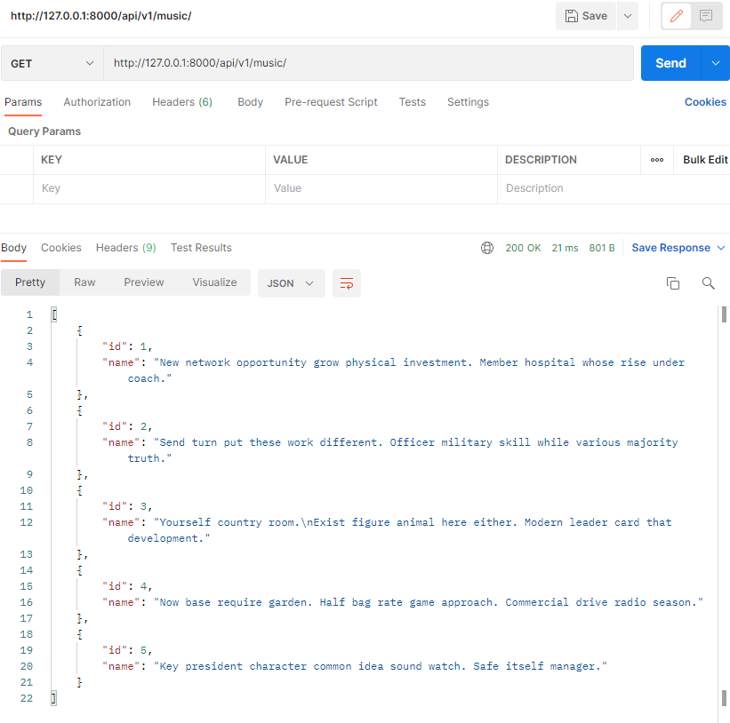
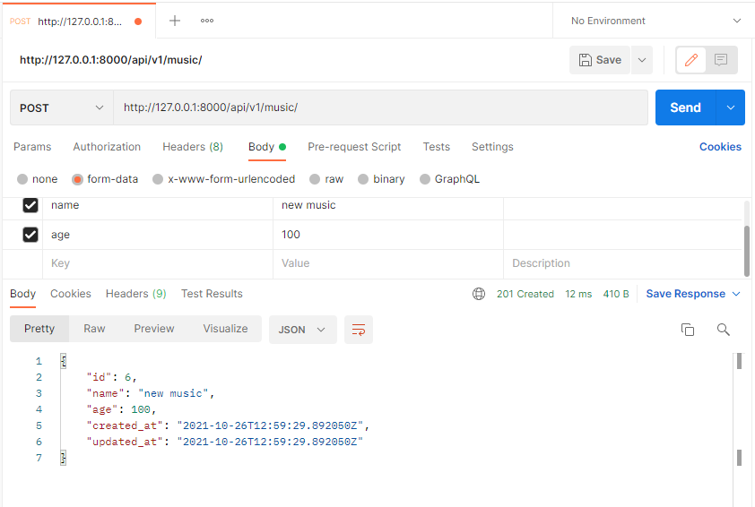
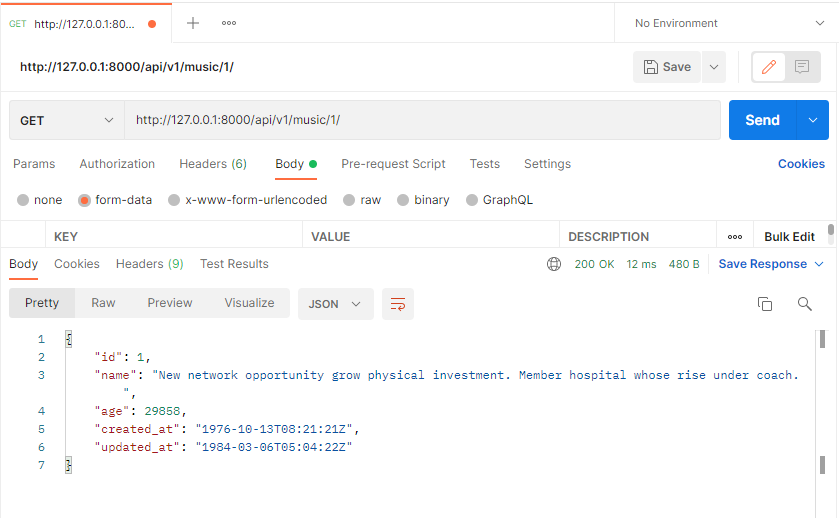
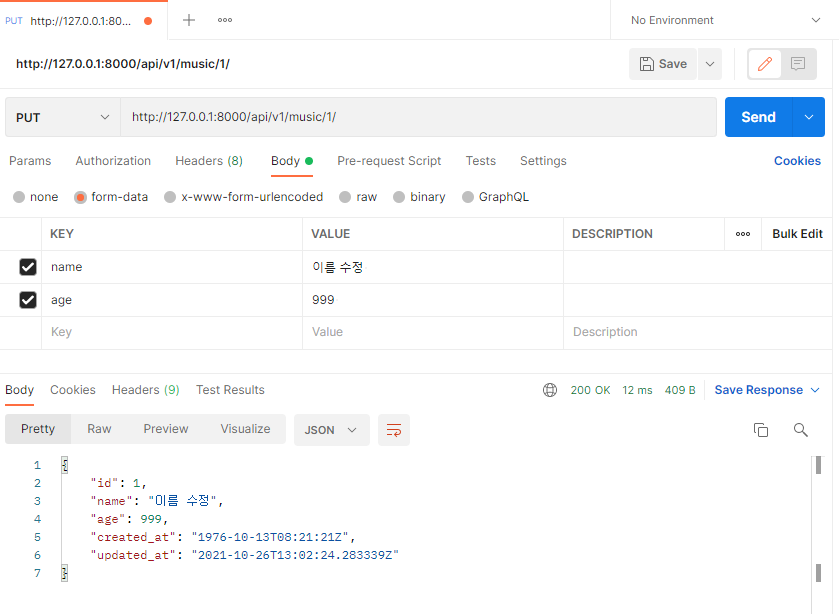
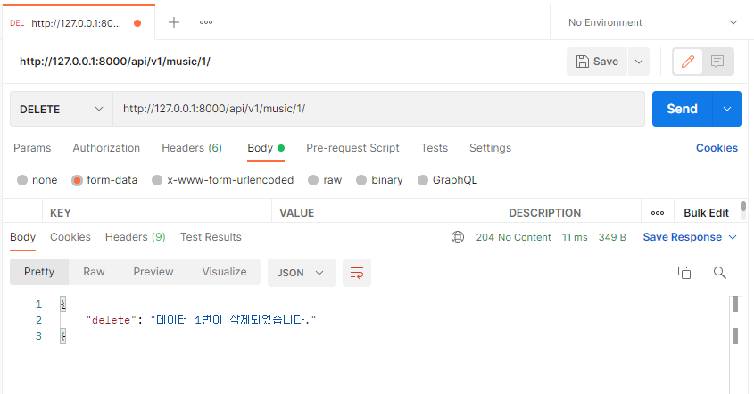

## Django REST Framework - Music 

```python
# serializers.py
from rest_framework import serializers
from .models import Music

class MusicListSerializer(serializers.ModelSerializer):

    class Meta:
        model = Music
        fields = ('id', 'name',)
        read_only_fields = ('music',)

class MusicSerializer(serializers.ModelSerializer):

    class Meta:
        model = Music
        fields = '__all__'

# views.py
from rest_framework.response import Response
from rest_framework.decorators import api_view
from rest_framework import status

from django.shortcuts import render, get_list_or_404, get_object_or_404

from .models import Music
from .serializers import MusicListSerializer, MusicSerializer
from music import serializers


@api_view(['GET', 'POST'])
def music_list(request):
    # 전체 리스트 조회
    if request.method == 'GET':
        musics = get_list_or_404(Music)
        serializer = MusicListSerializer(musics, many=True) 
        return Response(serializer.data)
    
    # 게시글 생성
    elif request.method == 'POST':
        serializer = MusicSerializer(data=request.data)
        if serializer.is_valid(raise_exception=True):
            serializer.save()
            return Response(serializer.data, status=status.HTTP_201_CREATED)


@api_view(['GET', 'DELETE', 'PUT'])
def music_detail(request, music_pk):
    music = get_object_or_404(Music, pk=music_pk)
    
    if request.method == 'GET':
        serializer = MusicSerializer(music)
        return Response(serializer.data)

    elif request.method == 'DELETE':
        music.delete()
        data = {
            'delete': f'데이터 {music_pk}번이 삭제되었습니다.'
        }
        return Response(data, status=status.HTTP_204_NO_CONTENT)

    elif request.method == 'PUT':
        serializer = MusicSerializer(music, data=request.data)
        if serializer.is_valid(raise_exception=True):
            serializer.save()
            return Response(serializer.data)
```


#### - GET api/v1/music/




#### - POST api/v1/music/ 




#### - GET api/v1/music/<music_pk>/ 




#### - PUT & DELETE api/v1/music// 




