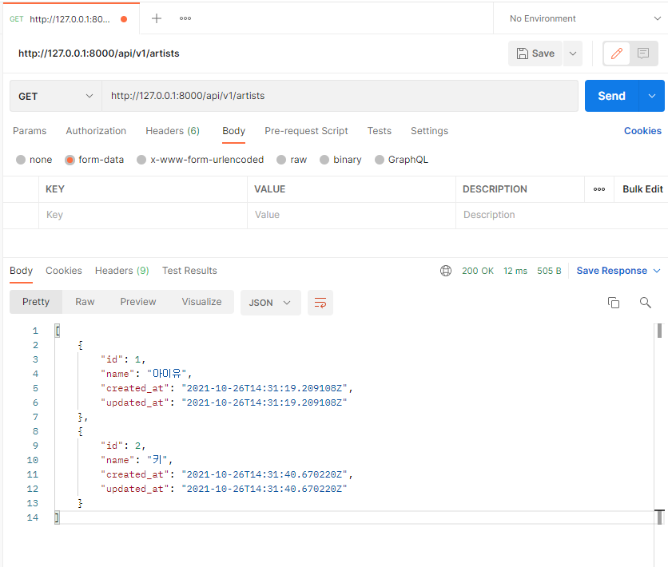
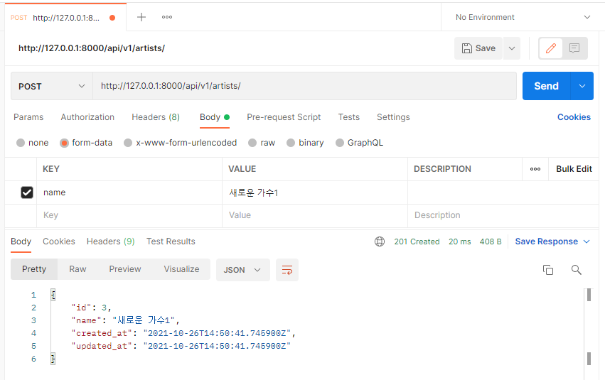
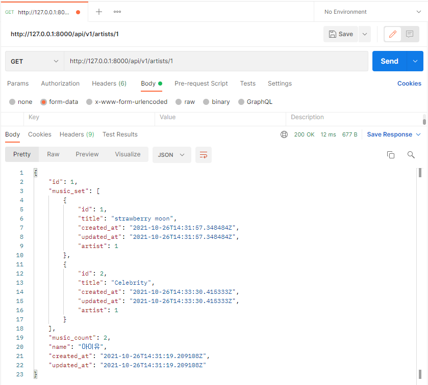
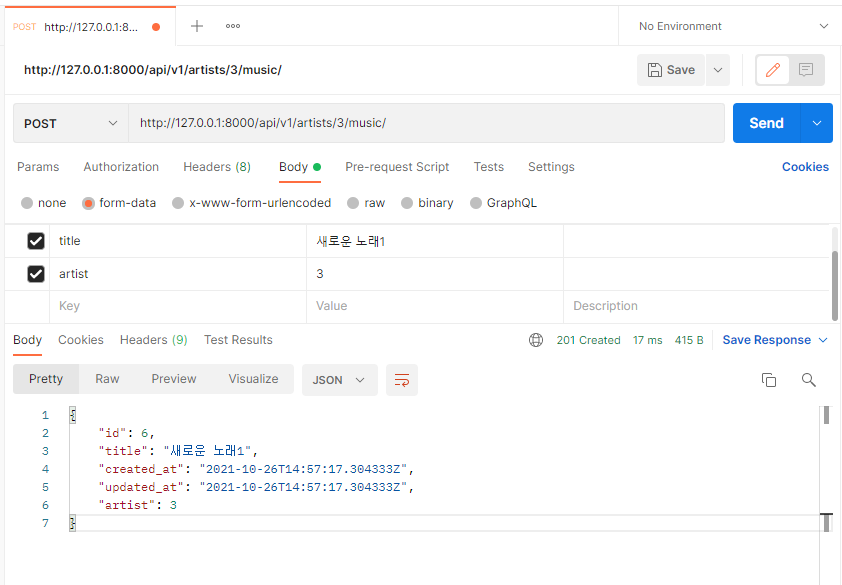
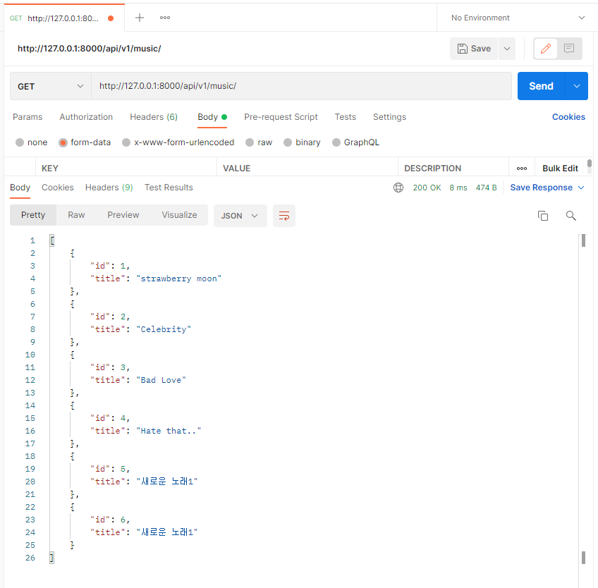
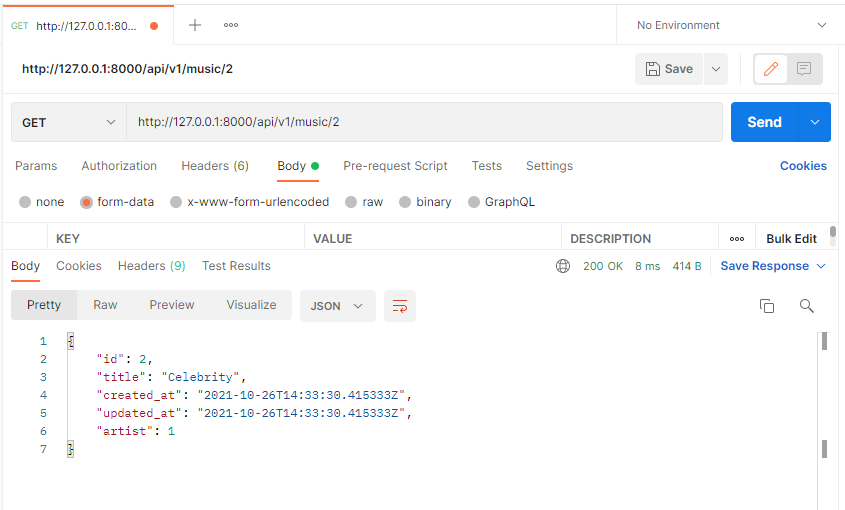
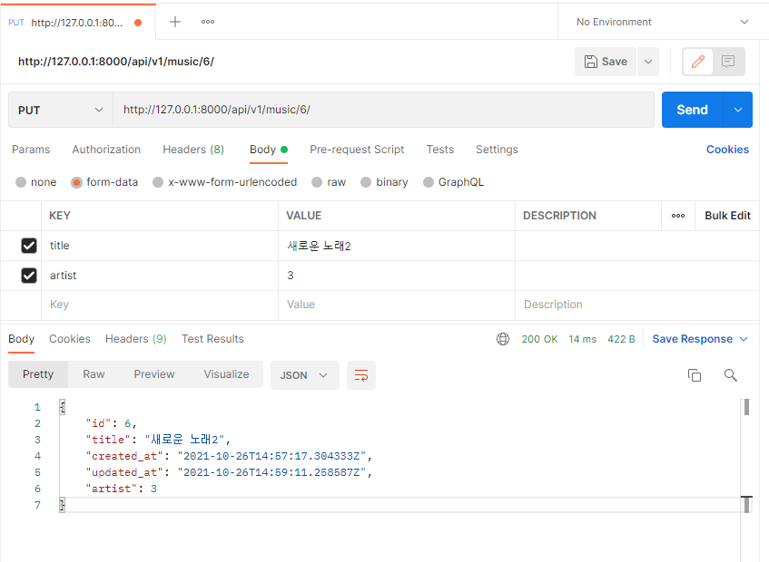
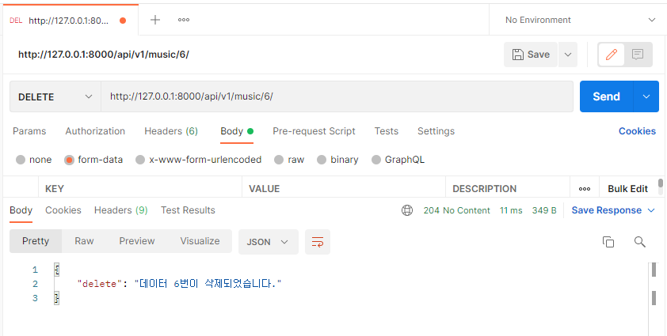

## Django REST Framework - Artist, Music

```python
# models.py
from django.db import models

class Artist(models.Model):
    name = models.CharField(max_length=100)
    created_at = models.DateTimeField(auto_now_add=True)
    updated_at = models.DateTimeField(auto_now=True)

    def __str__(self):
        return self.name

class Music(models.Model):
    title = models.CharField(max_length=100)
    artist = models.ForeignKey(Artist, on_delete=models.CASCADE)
    created_at = models.DateTimeField(auto_now_add=True)
    updated_at = models.DateTimeField(auto_now=True)
    
    def __str__(self):
        return self.title

    
# serializers.py
from rest_framework import serializers
from .models import Music, Artist

class ArtistListSerializer(serializers.ModelSerializer):

    class Meta:
        model = Artist
        fields = ('id', 'name',)
        read_only_fields = ('artist',)

class MusicListSerializer(serializers.ModelSerializer):

    class Meta:
        model = Music
        fields = ('id', 'title',)

class MusicSerializer(serializers.ModelSerializer):

    class Meta:
        model = Music
        fields = '__all__'

class ArtistSerializer(serializers.ModelSerializer):
    music_set = MusicSerializer(many=True, read_only=True)
    music_count = serializers.IntegerField(source='music_set.count', read_only=True)

    class Meta:
        model = Artist
        fields = '__all__'

        
# views.py
from rest_framework.response import Response
from rest_framework.decorators import api_view
from rest_framework import status

from django.shortcuts import render, get_list_or_404, get_object_or_404

from .models import Music, Artist
from .serializers import MusicListSerializer, MusicSerializer, ArtistListSerializer, ArtistSerializer
from music import serializers


@api_view(['GET', 'POST'])
def artist_list(request):
    if request.method == 'GET':
        artists = get_list_or_404(Artist)
        serializer = ArtistListSerializer(artists, many=True)
        return Response(serializer.data)

    elif request.method == 'POST':
        serializer = ArtistListSerializer(data=request.data)
        if serializer.is_valid(raise_exception=True):
            serializer.save()
            return Response(serializer.data, status=status.HTTP_201_CREATED)


@api_view(['GET'])
def artist_detail(request, artist_pk):
    artist = get_object_or_404(Artist, pk=artist_pk)
    serializer = ArtistSerializer(artist)
    return Response(serializer.data)


@api_view(['POST'])
def music_create(request, artist_pk):
    artist = get_object_or_404(Artist, pk=artist_pk)
    serializer = MusicSerializer(data=request.data)
    if serializer.is_valid(raise_exception=True):
        serializer.save(artist=artist)
        return Response(serializer.data, status=status.HTTP_201_CREATED)


@api_view(['GET'])
def music_list(request):
    music = get_list_or_404(Music)
    serializer = MusicListSerializer(music, many=True) 
    return Response(serializer.data)


@api_view(['GET', 'DELETE', 'PUT'])
def music_detail(request, music_pk):
    music = get_object_or_404(Music, pk=music_pk)
    
    if request.method == 'GET':
        serializer = MusicSerializer(music)
        return Response(serializer.data)

    elif request.method == 'DELETE':
        music.delete()
        data = {
            'delete': f'데이터 {music_pk}번이 삭제되었습니다.'
        }
        return Response(data, status=status.HTTP_204_NO_CONTENT)

    elif request.method == 'PUT':
        serializer = MusicSerializer(music, data=request.data)
        if serializer.is_valid(raise_exception=True):
            serializer.save()
            return Response(serializer.data)
```


#### - GET & POST api/v1/artists/

> GET



> POST




#### - GET api/v1/artists/<artist_pk>/




#### - POST api/v1/artists/<artist_pk>/music/




#### - GET api/v1/music/




#### - GET & PUT & DELETE api/v1/music/<music_pk>/

> GET



> PUT



> DELETE


