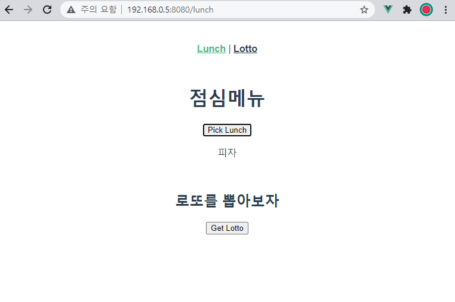
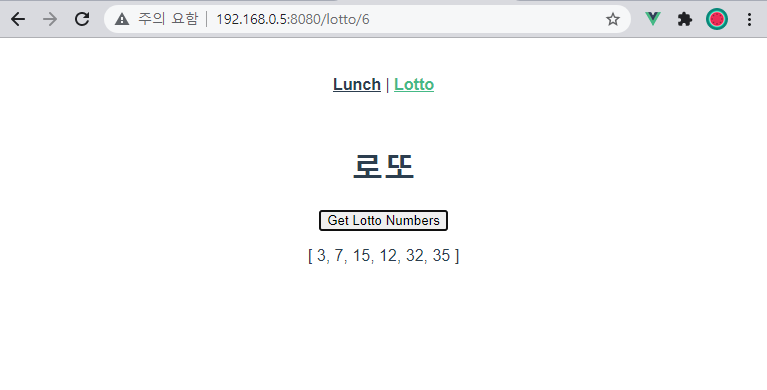

## Vue CLI - 점심메뉴, 로또 앱





### App.vue

```vue
<template>
  <div id="app">
    <div id="nav">
      <router-link :to="{ name: 'TheLunch' }">Lunch</router-link> |
      <router-link :to="{ name: 'TheLotto' }">Lotto</router-link>
    </div>
    <router-view/>
  </div>
</template>
```


### index.js

```js
import Vue from 'vue'
import VueRouter from 'vue-router'
import TheLotto from '../views/TheLotto.vue'
import TheLunch from '../views/TheLunch.vue'

Vue.use(VueRouter)

const routes = [
  {
    path: '/lotto/6',
    name: 'TheLotto',
    component: TheLotto,
  },
  {
    path: '/lunch',
    name: 'TheLunch',
    component: TheLunch,
  }
]

const router = new VueRouter({
  mode: 'history',
  base: process.env.BASE_URL,
  routes
})

export default router

```


### TheLunch.vue

```vue
<template>
  <div>
    <h1>점심메뉴</h1>
    <button @click='getLunch'>Pick Lunch</button>
    <p>{{ selectedLunch }}</p>
    <br>
    <h2>로또를 뽑아보자</h2>
    <button @click="TheLotto">Get Lotto</button>
  </div>
</template>

<script>
import _ from 'lodash'

export default {
  name: 'TheLunch',
  data: function () {
    return {
      selectedLunch : null,
    }
  },
  methods: {
    getLunch: function () {
      this.selectedLunch = _.sample(['국밥', '짜장면', '라면', '햄버거', '피자'])
    },
    TheLotto: function () {
      this.$router.push({ name: 'TheLotto' })
    }
  }
}
</script>
```


### TheLotto.vue

```vue
<template>
  <div>
    <h1>로또</h1>
    <button @click='getLuckyNums'>Get Lotto Numbers</button>
    <p>{{ selectedLuckyNums }}</p>
  </div>
</template>

<script>
import _ from 'lodash'

export default {
  name: 'TheLotto',
  data: function () {
    return {
      selectedLuckyNums : null
    }
  },
  methods: {
    getLuckyNums: function () {
      const numbers = _.range(1, 46)
      this.selectedLuckyNums = _.sampleSize(numbers, 6)
    }
  }
}
</script>
```


