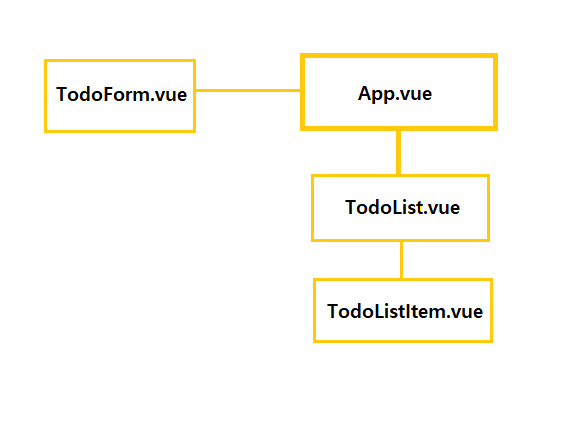
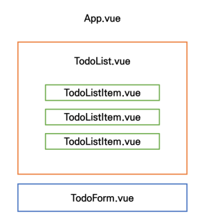

### Vuex - todo project 계획





> TodoForm을 통해 todo를 입력받으면, todo 목록에 추가되어 TodoListItem 자리에 출력된다.


* Components

  * TodoList.vue : todo 목록 (TodoListItem 컴포넌트의 부모)

    ```vue
    <template>
      <div>
        <todo-list-item></todo-list-item>
      </div>
    </template>
    
    <script>
    import TodoListItem from '@/components/TodoListItem'
    
    export default {
      name: 'TodoList',
      components: {
        TodoListItem,
      },
    }
    </script>
    ```

    

  * TodoListItem.vue : 개별 todo 컴포넌트 (TodoList 컴포넌트의 자식)

    ```vue
    <template>
      <div>Todo</div>
    </template>
    
    <script>
    export default {
      name: 'TodoListItem',
    }
    </script>
    ```

    

  * TodoForm.vue : todo를 입력받는 컴포넌트

    ```vue
    <template>
      <div>Todo Form</div>
    </template>
    
    <script>
    export default {
      name: 'TodoForm',
    }
    </script>
    ```

    

  * App.vue : 최상위 컴포넌트 (TodoList 컴포넌트, TodoForm 컴포넌트의 부모)

    ```vue
    <template>
      <div id="app">
        <h1>Todo List</h1>
        <todo-list></todo-list>
        <todo-form></todo-form>
      </div>
    </template>
    
    <script>
    import TodoList from '@/components/TodoList'
    import TodoForm from '@/components/TodoForm'
    
    export default {
      name: 'App',
      components: {
        TodoList,
        TodoForm,
      }
    }
    </script>
    ```

    

