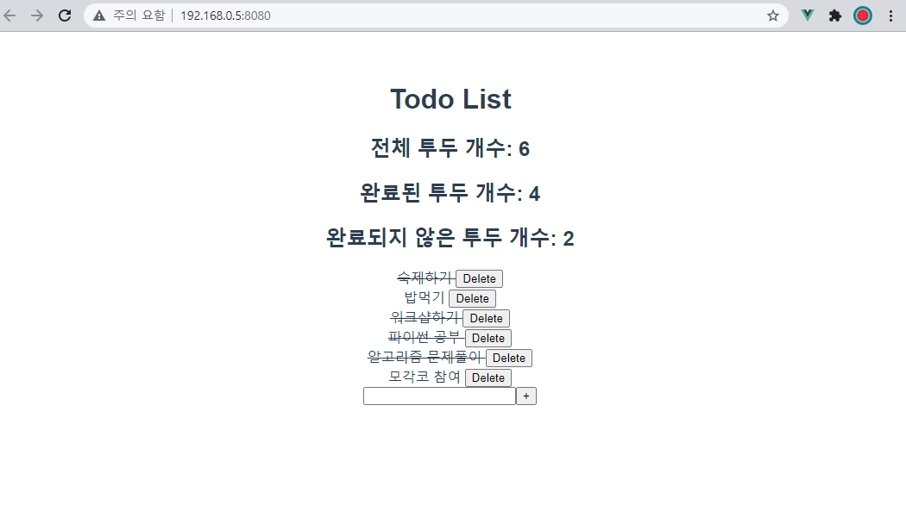

* index.js

  ```js
  import Vue from 'vue'
  import Vuex from 'vuex'
  import createPersistedState from "vuex-persistedstate"
  
  Vue.use(Vuex)
  
  export default new Vuex.Store({
    plugins: [createPersistedState()],
    state: {
      todos: []
    },
    mutations: {
      CREATE_TODO: function (state, todoItem) {
        state.todos.push(todoItem) // state 변경
      },
      DELETE_TODO: function (state, todoItem) {
        const index = state.todos.indexOf(todoItem)
        state.todos.splice(index, 1)
      },
      UPDATE_TODO_STATUS: function (state, todoItem) {
        state.todos = state.todos.map(todo => {
          if (todo === todoItem) {
            return {
              ...todo, // JS spread syntax
              isCompleted: !todo.isCompleted
            }
          } else {
            return todo
          }
        })
      }
    },
    actions: {
      createTodo: function ({ commit }, todoItem) {
        commit('CREATE_TODO', todoItem)
      },
      deleteTodo: function ({ commit }, todoItem) {
        commit('DELETE_TODO', todoItem)
      },
      updateTodoStatus: function ({ commit }, todoItem) {
        commit('UPDATE_TODO_STATUS', todoItem)
      }
    },
    getters: {
      completedTodosCount: function (state) {
        return state.todos.filter(todo => {
          return todo.isCompleted === true
        }).length
      },
      uncompletedTodosCount: function (state) {
        return state.todos.filter(todo => {
          return todo.isCompleted === false
        }).length
      },
      allTodosCount: function (state) {
        return state.todos.length
      },
    },
    modules: {
    }
  })
  ```

* App.vue

  ```vue
  <template>
    <div id="app">
      <h1>Todo List</h1>
      <h2>전체 투두 개수: {{ allTodosCount }}</h2>
      <h2>완료된 투두 개수: {{ completedTodosCount }}</h2>
      <h2>완료되지 않은 투두 개수: {{ uncompletedTodosCount }}</h2>
      <todo-list></todo-list>
      <todo-form></todo-form>
    </div>
  </template>
  
  <script>
  import { mapGetters } from 'vuex'
  import TodoList from '@/components/TodoList'
  import TodoForm from '@/components/TodoForm'
  
  export default {
    name: 'App',
    components: {
      TodoList,
      TodoForm,
    },
    computed: {
      ...mapGetters([
        'completedTodosCount',
        'uncompletedTodosCount',
        'allTodosCount'
      ])
    }
  }
  </script>
  
  <style>
  #app {
    font-family: Avenir, Helvetica, Arial, sans-serif;
    -webkit-font-smoothing: antialiased;
    -moz-osx-font-smoothing: grayscale;
    text-align: center;
    color: #2c3e50;
    margin-top: 60px;
  }
  </style>
  ```

* TodoList.vue

  ```vue
  <template>
    <div>
      <todo-list-item
        v-for="todo in todos"
        :key="todo.date"
        :todo="todo"
      >
      </todo-list-item>
    </div>
  </template>
  
  <script>
  import { mapState } from 'vuex'
  import TodoListItem from '@/components/TodoListItem'
  
  
  export default {
    name: 'TodoList',
    components: {
      TodoListItem,
    },
    computed: {
      ...mapState([
        'todos',
      ]),
      
    }
  }
  </script>
  ```

* TodoListItem.vue

  ```vue
  <template>
    <div>
      <div>
        <span 
          @click="updateTodoStatus(todo)"
          :class="{ 'is-completed': todo.isCompleted }"
        >
        {{ todo.title }}
        </span>
        <button @click="deleteTodo(todo)">Delete</button>
      </div>
    </div>
  </template>
  
  <script>
  import { mapActions } from 'vuex'
  
  export default {
    name: 'TodoListItem',
    props: {
      todo: {
        type: Object,
      }
    },
    methods: {
      ...mapActions([
        'deleteTodo',
        'updateTodoStatus',
      ])
    }
  }
  </script>
  
  <style>
  .is-completed {
    text-decoration: line-through;
  }
  </style>
  ```

* TodoForm.vue

  ```vue
  <template>
    <div>
      <input 
        type="text"
        v-model.trim="todoTitle"
        @keyup.enter="createTodo"
      >
      <button @click="createTodo">+</button>
    </div>
  </template>
  
  <script>
  export default {
    name: 'TodoForm',
    data: function () {
      return {
        todoTitle: null,
      }
    },
    methods: {
      createTodo: function () {
        const todoItem = {
          title: this.todoTitle,
          isCompleted: false,
          date: new Date().getTime(),
        }
        if (todoItem.title) {
          this.$store.dispatch('createTodo', todoItem) // actions 호출
        }
        this.todoTitle = null
      }
    }
  }
  </script>
  ```

  
