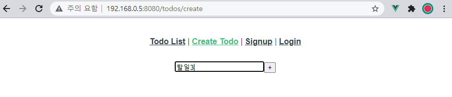
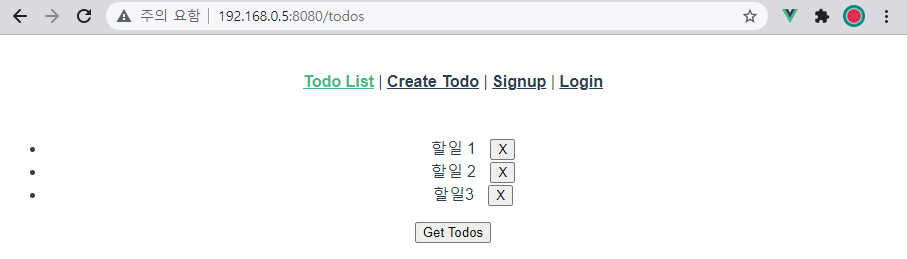
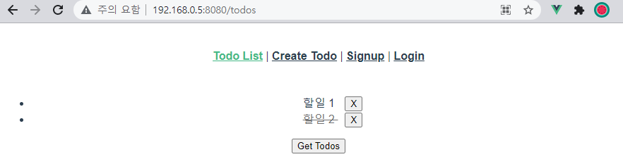

#### 1. Todo 데이터를 가져오는 과정에서 발생하는CORS Policy 관련 이슈 해결

```python
# server/settings.py
INSTALLED_APPS = [
    'corsheaders',...
]
MIDDLEWARE = [
    'corsheaders.middleware.CorsMiddleware', ....
]

CORS_ALLOW_ALL_ORIGINS = True
```

```bash
$ pip install django-cors-headers
```


#### 2. Todo Create & Read

```js
// views/todos/CreateTodo.vue
createTodo: function () {
    const todoItem = {
        title: this.title,
    }

    if (todoItem.title) {
        axios({
            method: 'post',
            url: 'http://127.0.0.1:8000/todos/',
            data: todoItem
        })
            .then(res => {
            console.log(res)
            this.$router.push({ name: 'TodoList' })
        })
            .catch(err => {
            console.log(err)
        })
    }
}
```






#### 3. Todo Delete

```js
// views/todos/TodoList.vue
deleteTodo: function (todo) {
    axios({
        method: 'delete',
        url: `http://127.0.0.1:8000/todos/${todo.id}/`
    })
        .then(res => {
        console.log(res)
        this.getTodos()
    })
        .catch(err => {
        console.log(err)
    })
},
```


#### 4. Todo Update (+ 실시간취소선 toggle)

```js
// views/todos/TodoList.vue
    updateTodoStatus: function (todo) {
      // 4번 문제
      const todoItem = {
        ...todo,
        is_completed: !todo.is_completed
      }

      axios({
        method: 'put',
        url: `http://127.0.0.1:8000/todos/${todo.id}/`,
        data: todoItem,
      })
        .then(res => {
          console.log(res)
          todo.is_completed = !todo.is_completed
        })
      },
    },
  created: function () {
    this.getTodos()
  }
```



