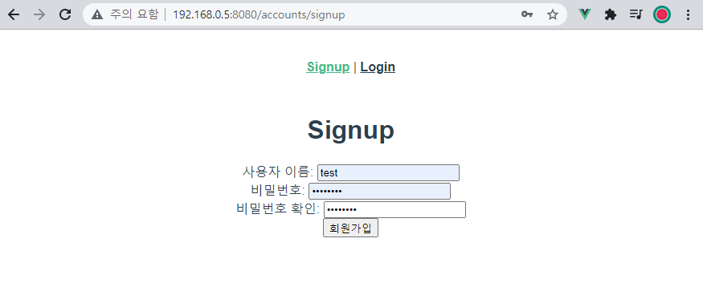
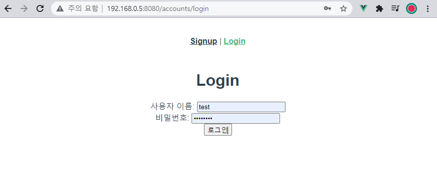
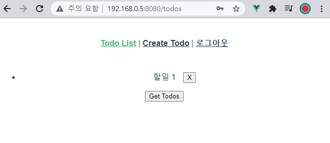
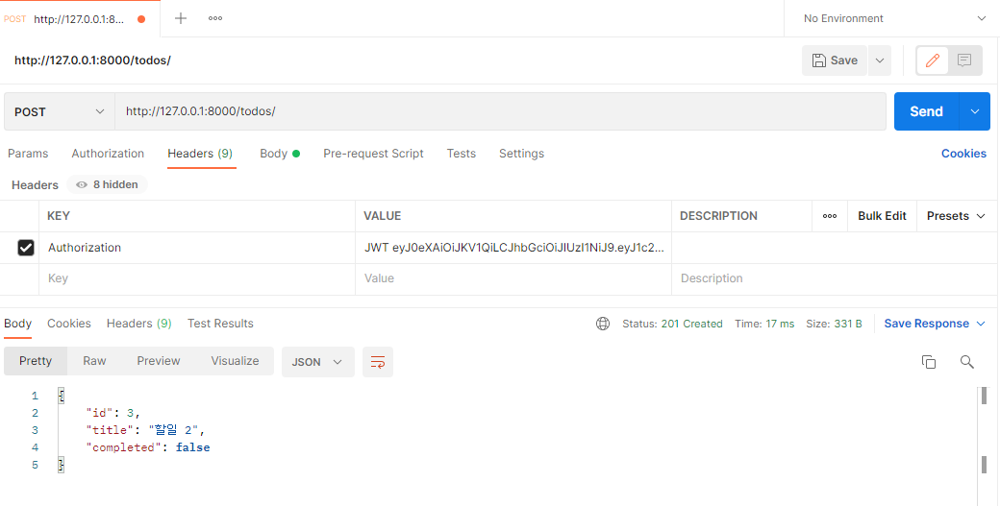
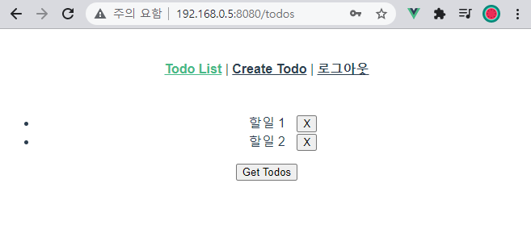

* ### signup



```python
# todos/models.py
from django.db import models
from django.conf import settings

class Todo(models.Model):
    user = models.ForeignKey(settings.AUTH_USER_MODEL, on_delete=models.CASCADE)
    title = models.CharField(max_length=50)
    completed = models.BooleanField(default=False)
    
# accounts/views.py
@api_view(['POST'])
@permission_classes([AllowAny])
def signup(request):
    password = request.data.get('password')
    password_confirmation = request.data.get('passwordConfirmation')

    if password != password_confirmation:
        return Response({'error': '비밀번호가 일치하지 않습니다.'}, status=status.HTTP_400_BAD_REQUEST)
		
    serializer = UserSerializer(data=request.data)
    if serializer.is_valid(raise_exception=True):
        user = serializer.save()
        user.set_password(request.data.get('password'))
        user.save()
        return Response(serializer.data, status=status.HTTP_201_CREATED)
```

```vue
<template>
  <div>
    <h1>Signup</h1>
    <div>
      <label for="username">사용자 이름: </label>
      <input 
        type="text" 
        id="username"
        v-model="credentials.username"
      >
    </div>
    <div>
      <label for="password">비밀번호: </label>
      <input 
        type="password" 
        id="password"
        v-model="credentials.password"
      >
    </div>
    <div>
      <label for="passwordConfirmation">비밀번호 확인: </label>
      <input 
        type="password" 
        id="passwordConfirmation"
        v-model="credentials.passwordConfirmation"
        @keyup.enter="signup"
      >
    </div>
    <button @click="signup">회원가입</button>
  </div>
</template>
```

```js
  name: 'Signup',
  data: function () {
    return {
      credentials: {
        username: null,
        password: null,
        passwordConfirmation: null,
      }
    }
  },
  methods: {
    signup: function () {
      console.log(this.credentials)
      axios({
        method: 'post',
        url: 'http://127.0.0.1:8000/accounts/signup/',
        data: this.credentials
      })
        .then(() => {
          // console.log(res)
          this.$router.push({ name: 'Login'})
        })
        .catch(err => {
          console.log(err)
        })
    }
  }
```


* ### login



```python
# server/settings.py
REST_FRAMEWORK = {
    'DEFAULT_PERMISSION_CLASSES': (
        'rest_framework.permissions.IsAuthenticated',
    ),
    'DEFAULT_AUTHENTICATION_CLASSES': (
        'rest_framework_jwt.authentication.JSONWebTokenAuthentication',
    ),
}

import datetime
JWT_AUTH = {
    'JWT_EXPIRATION_DELTA': datetime.timedelta(days=1),
}

# accouts/urls.py
from django.urls import path
from . import views
from rest_framework_jwt.views import obtain_jwt_token

urlpatterns = [
    path('signup/', views.signup),
    path('api-token-auth/', obtain_jwt_token),
]
```


```vue
<template>
  <div>
    <h1>Login</h1>
    <div>
      <label for="username">사용자 이름: </label>
      <input 
        type="text" 
        id="username"
        v-model="credentials.username"
      >
    </div>
    <div>
      <label for="password">비밀번호: </label>
      <input 
        type="password" 
        id="password"
        v-model="credentials.password"
      >
    </div>
    <button @click="login">로그인</button>
  </div>
</template>
```

```js
  name: 'Login',
  data: function () {
    return {
      credentials: {
        username: null,
        password: null,
      }
    }
  },
  methods: {
    login: function () {
      axios({
        method: 'post',
        url: 'http://127.0.0.1:8000/accounts/api-token-auth/',
        data: this.credentials,
      })
        .then(res => {
          console.log(res)
          localStorage.setItem('jwt', res.data.token)
          this.$emit('login')
          this.$router.push({ name: 'TodoList' })
        })
        .catch(err => {
          console.log(err)
        })
    }
  }
```


* ### logout



```vue
// App.vue
<template>
  <div id="app">
    <div id="nav">
      <span v-if="isLogin">
        <router-link :to="{ name: 'TodoList' }">Todo List</router-link> | 
        <router-link :to="{ name: 'CreateTodo' }">Create Todo</router-link> |
        <router-link @click.native="logout" to="#">로그아웃</router-link>
      </span>
      <span v-else>
        <router-link :to="{ name: 'Signup' }">Signup</router-link> |
        <router-link :to="{ name: 'Login' }">Login</router-link> 
      </span>
    </div>
    <router-view @login="isLogin=true"/>
  </div>
</template>

<script>
export default {
  name: 'App',
  data: function () {
    return {
      isLogin: false,
    }
  },
  methods: {
    logout: function () {
      this.isLogin = false
      localStorage.removeItem('jwt')
      this.$router.push({ name: 'Login' })
    },
  },
  created: function () {
    const token = localStorage.getItem('jwt')
    if (token) {
      this.isLogin = true
    }
  }
}
</script>
```


* ### CreateTodo





```js
  methods: {
    setToken: function () {
      const token = localStorage.getItem('jwt')
      const config = {
        Authorization: `JWT ${token}A`
      }
      return config
    },
    createTodo: function () {
      const todoItem = {
        title: this.title
      }

      if (todoItem.title) {
        axios({
          method: 'post',
          url: 'http://127.0.0.1:8000/todos/',
          data: todoItem,
          headers: this.setToken(),
        })
          .then(res => {
            console.log(res)
            this.$router.push({ name: 'TodoList' })
          })
          .catch(err => {
            console.log(err)
          })
        this.title = null
      }
    }
  }
```

