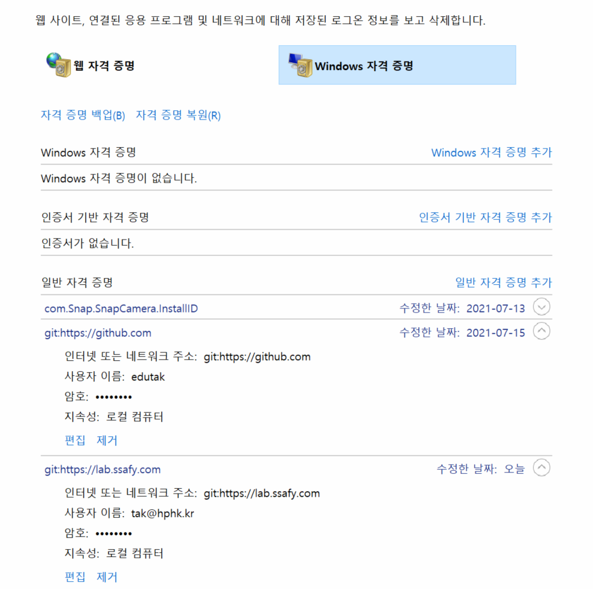

# 로그인 관련된 오류

> 로그인은 윈도우에서 자격 증명 관리자에서 관리
>
> 절대! git config와는 상관 없음

```bash
# 예시
@DESKTOP-DJV91VV MINGW64 ~/Desktop/gitlab_test (master)
$ git push -u origin master
remote: HTTP Basic: Access denied
fatal: Authentication failed for 'https://lab.ssafy.com//test.git/'
```


* 아래에서 지우고 제거 하고 다시 등록 해보는 것을 추천

