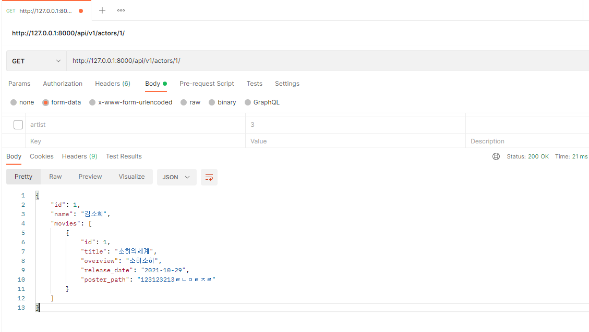
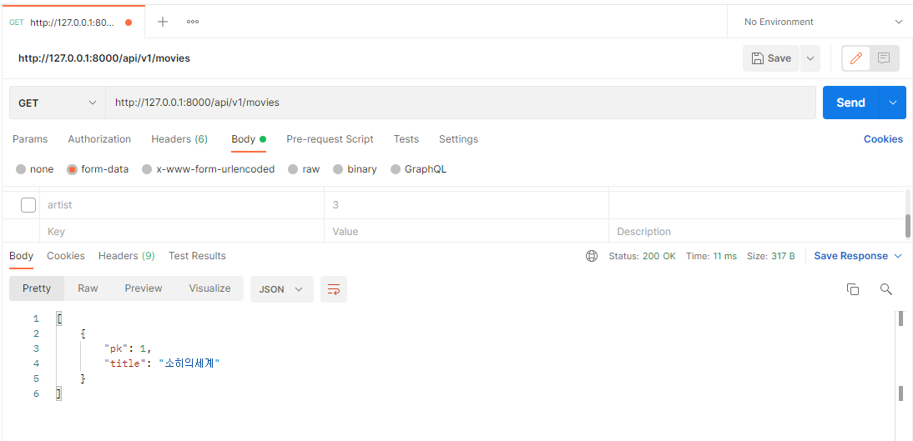
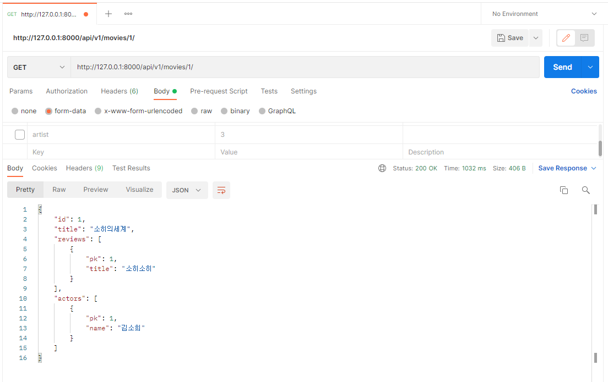
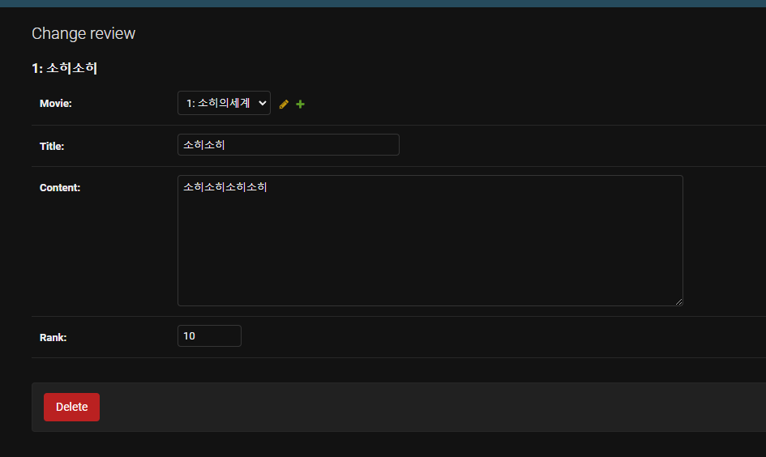
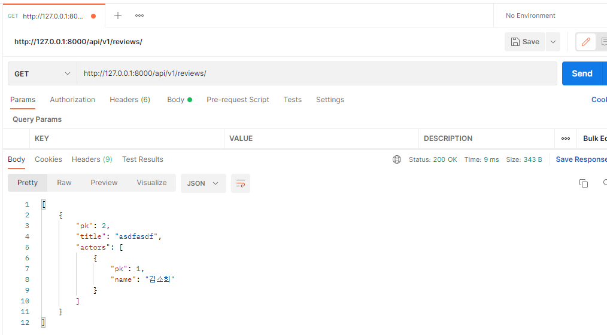
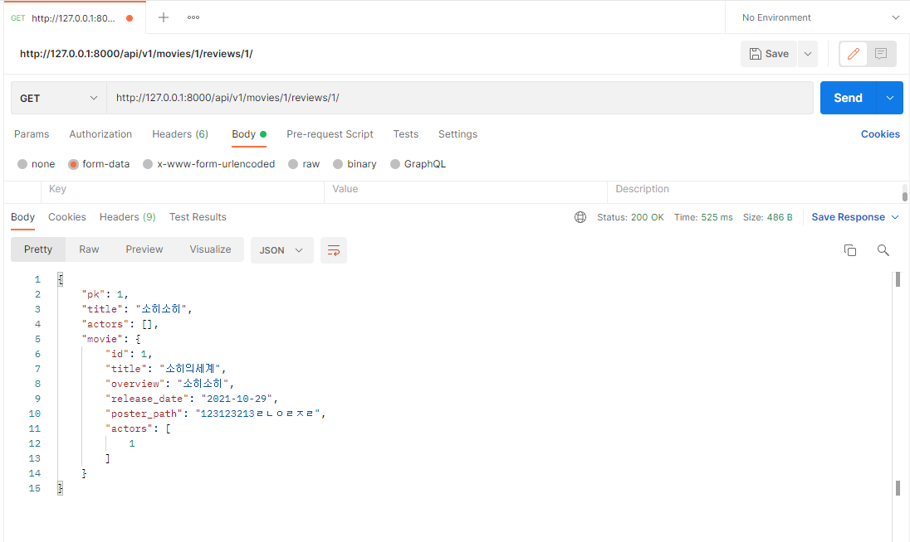
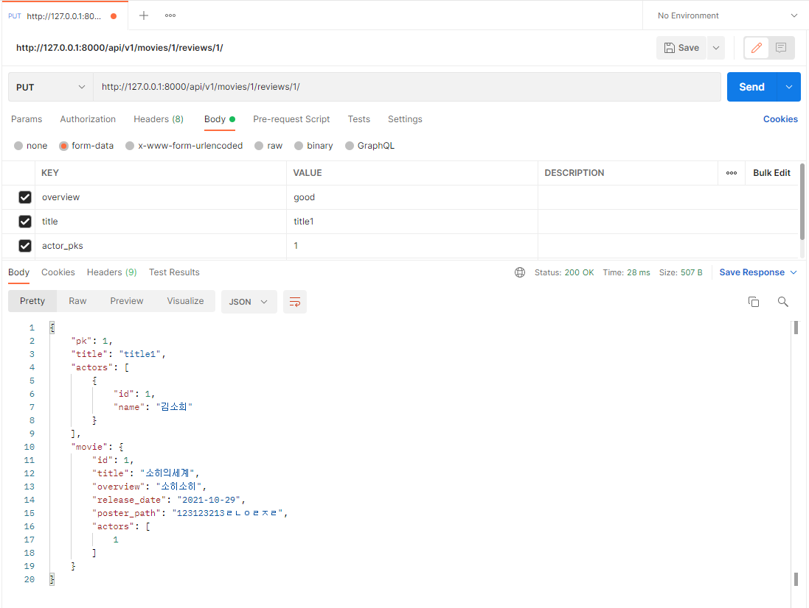
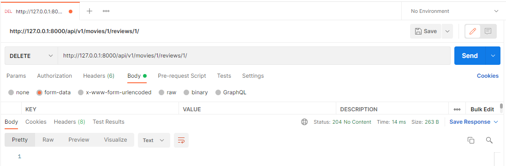

## 관통프로젝트_PJT08 (데이터베이스 설계를 통한 REST API 설계)

### 요구사항

* 커뮤니티 서비스의 상세 기능 개발을 위한 단계
* 모델간의 관계 설정 후 데이터의 생성, 조회, 수정, 삭제할 수 있는 기능을 완성

### Model ERD

### 구현과정

1. pjt08 프로젝트 생성
2. movies 앱 생성, 프로젝트 구조 만들기
3. Actor, Model, Review 모델 만들기
4. url 작성
5. admin에 Actor, Model, Review 모두 추가
6. Serializer - actor, model, review 각각 따로 작성
7. View 작성
8. 관리자 페이지에서 데이터 생성 후 API 테스트 진행

### 기능

* Actor
  * 전체 배우 목록 조회

    `http://127.0.0.1:8000/api/v1/actors/`

    

  * 단일 배우 정보 조회

    `http://127.0.0.1:8000/api/v1/actors/1/`

    

* Movie

  * 전체 영화 목록 조회

    `http://127.0.0.1:8000/api/v1/movies`

    

  * 단일 영화 정보 조회

    `http://127.0.0.1:8000/api/v1/movies/1/`

    

  

* Review

  * 리뷰 생성 - 관리자 페이지

    

  * 전체 리뷰 정보 조회

    `http://127.0.0.1:8000/api/v1/reviews/`

    

  * 단일 리뷰 정보(영화 정보 포함) 조회

    `http://127.0.0.1:8000/api/v1/movies/1/reviews/1/`

    

  * 리뷰 수정

    `http://127.0.0.1:8000/api/v1/movies/1/reviews/1/`

    

  * 리뷰 삭제

    `http://127.0.0.1:8000/api/v1/movies/1/reviews/1/`

    

### Pair programming

* 김지원 - 주요 코드 작성 및 데이터 설계
* 김소희 - 수정, 보완코드 작성 및 검토, API 실행

#### 어려웠던 점 및 소감

* 김지원
  * 어려웠던 점 :
    * 사실 오류를 해결하는거말고 별로 없었다. 저번주에 이어 너무 좋은 팀원을만나 서로 네비게이터 역할을 충실하게 바꿔가며 혼자선 찾을 수 없는 오류를 해결해 나갔다.
    * 중간중간 테스트를 해나가며 api주소를 들어갈때마다 한번에 되기도하고 오류가 나기도 했지만 같이 금방 오류를 찾아나갈 수 있었다.
  * 소감
    * 좋은팀원을 만나는것의 중요함을 다시 또 2주째 알게 되었습니다.
    * 인생에도 운이 필요하지만 프로그램을 개발하는데 있어도 운이 이렇게나 중요하구나라는 깨달음을 얻게 되었읍니다.
    * 프로젝트가 끝날때가지 계속 이어나가고 싶습니다.
    * 충실하게 관통프로젝트를 또한번 마쳐 실력상승과 프로젝트 및 문제해결능력이 비약적으로 상승되게 된것같아 매우 행복합니다.

* 김소희

  * 어려웠던 점
    * serializers는 배울수록 어려운거 같다. 점점 신경쓸 것들이 많이 생겨서 까다로웠다.
    * 오류들이 정말 많이 생겼는데 models에서 actors를 적지 않아 한참을 헤맸었다. 그리고 fields에 actors나 reviews를 적지 않았어서 오류가 생겼었다. 에러 메시지를 보고 하나씩 고쳐나가니 결국 완성했다.
    * postman은 거의 처음 사용해보았는데, 어떤 방식으로 전송할지 결정해서 테스트를 하니 너무 좋았다. 
    * 리뷰 전체 조회페이지를 까먹고 작성하지 않았는데, url부터 수정해서 결국 작성완료했다.
    
  * 소감
    * 협업을 하는게 이제는 혼자하는거 보다 좋은 것 같다. 서로 무슨 오류가 어떻게 해결할지 고민하며 하나하나씩 고쳐나가서 너무 좋았다.
    * 이제는 오류메시지를 보고 어떤게 오류났는지 알고 하나씩 고칠 수 있게 되었다.
    * postman에서 링크를 하나씩 바꿔가며 찬찬히 하나씩 실행했는데,  마지막에 다 완성되고 오류가 없어서 너무 뿌듯했다.
