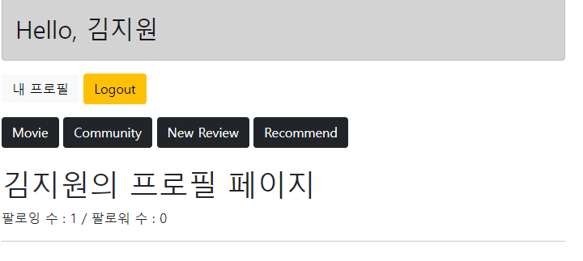
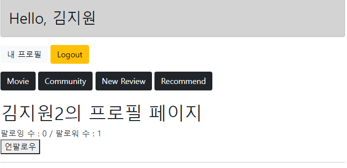
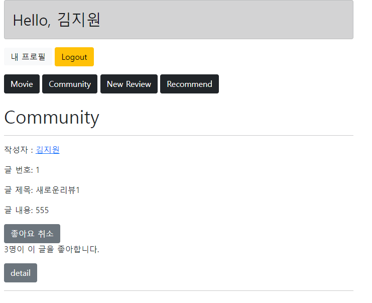
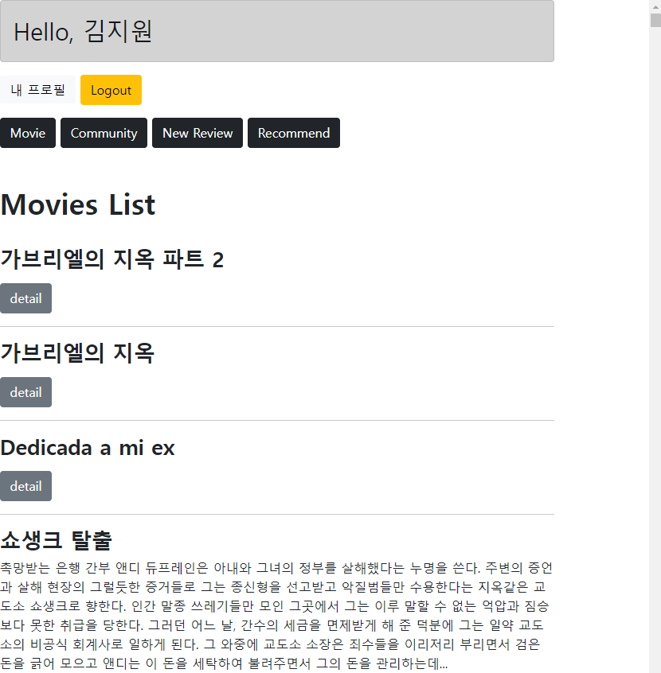
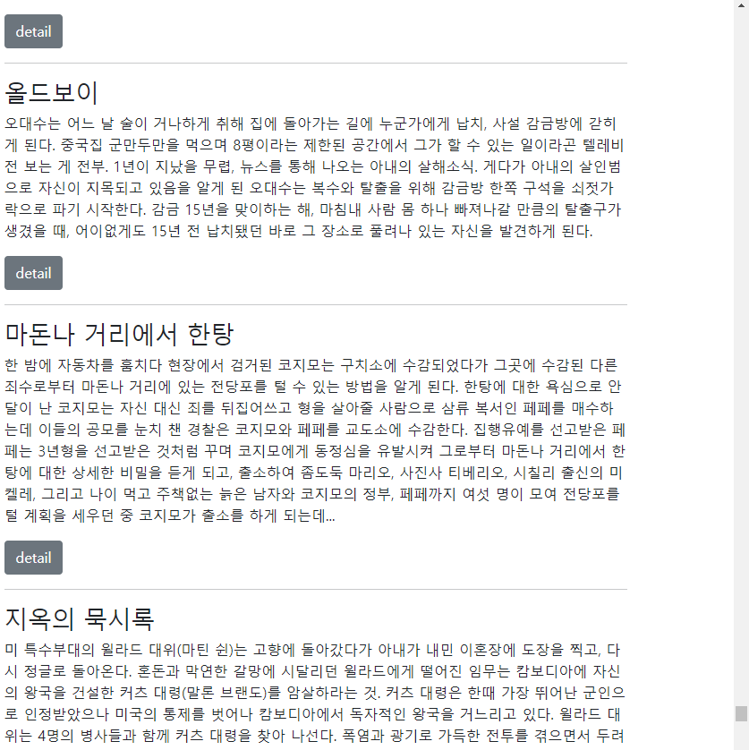
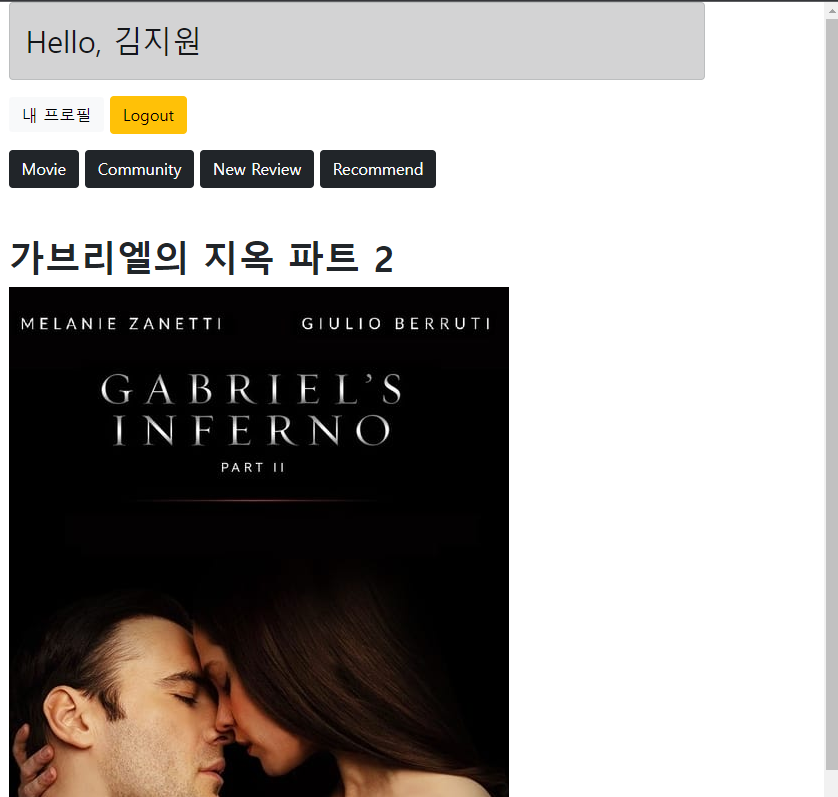
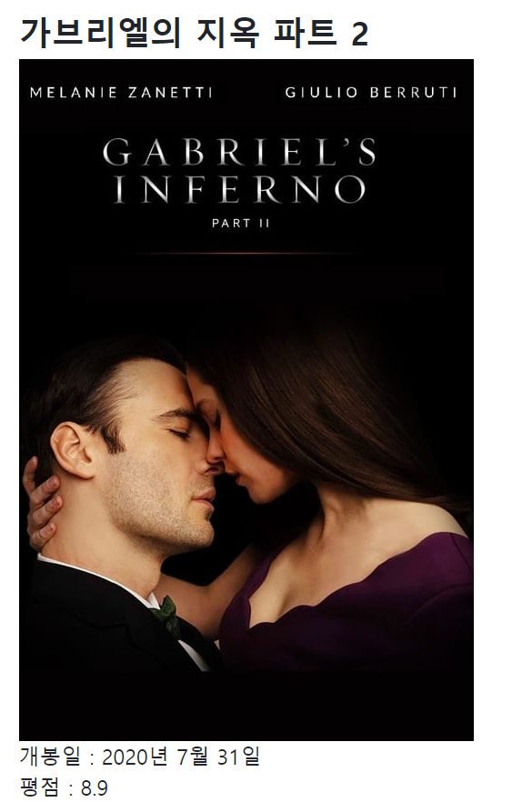
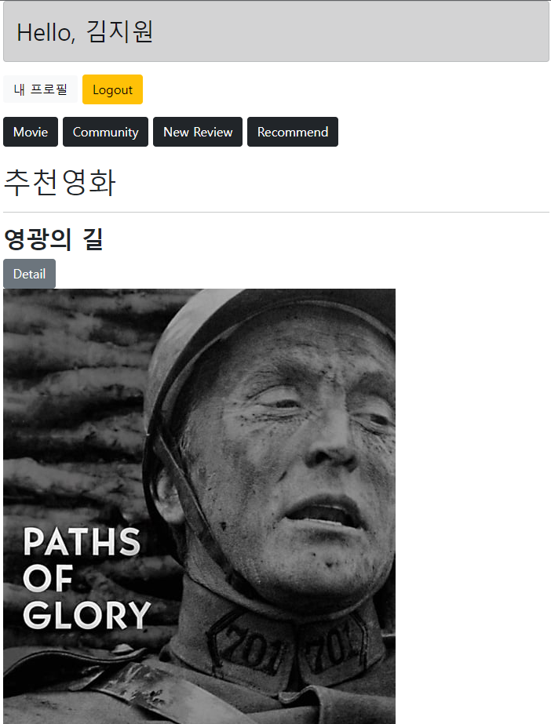

## 관통프로젝트_PJT09 (알고리즘을 적용한 서버구성)

### 주요 기능 구현

* 유저 팔로우 기능

  * 로그인 된 유저가 자기 자신이 아닌 다른 사람의 프로필을 들어갔을 때 팔로우 할 수 있는 버튼을 만들었다. 

  * 팔로우를 누르면 페이지 전체가 아니라 그 부분만 새로고침될 수 있도록 AJAX통신을 이용하여 화면을 구성했다.

    

    

* 리뷰 좋아요 기능

  * 전체 리뷰 목록 조회 페이지에 좋아요 버튼을 만들고, 좋아요 개수를 출력하였다. 

  * 좋아요를 누르면 버튼만 새로고침 되도록 하였고, 좋아요를 누르면 좋아요 취소 버튼이 나타나게 했다.

    

* movies app

  * 전체 영화 목록

    * 무한 스크롤를 활용하여 아래로 스크롤을 내릴수록 영화목록이 더 뜨게 만들었다. 

    

    

  * 단일 영화 상세 조회

    * detail페이지로 접속하여 단일 영화 상세 조회를 할 수 있다. 

    * 영화의 제목과 포스터, 개봉일, 평점, 줄거리, 장르를 나타내게 하였다.

    * 줄거리가 없는 영화의 경우 나타나지 않게 조건문을 활용하였다.

    * 장르가 여러개인 영화도 있어 리스트를 반복문을 통해 출력하게 했다.
    
      

* 영화 추천 기능

  * 영화를 랜덤하게 10개를 뽑아서 제목과 상세 조회 페이지로 갈 수 있는 버튼, 포스터를 출력했다.
  * random 함수를 사용해서 100까지의 정수 중 10개를 뽑아서, 숫자10개를 하나씩 반복문을 돌며, 또 모든 movie를 반복문으로 돌면서 movie.pk가 뽑은 숫자와 같으면 출력할 수 있게 조건문과 반복문을 활용했다.

  

* 추가적인 Styling

  * base.html에서 a태그 부분들의 스타일을 버튼으로 하여 보기 편하게 수정하였다. 
  * 처음에 user 이름이 뜨는 부분은 부트스트랩의 alert를 활용하였고, 나머지 버튼들은 button 기능을 활용하였다.
  * 좋아요 기능 구현에서도 좋아요 버튼과 좋아요 취소 버튼 색깔을 다르게 하였다.
  * 나머지 제목들에 bold 효과를 주는 등 여러 스타일을 수정했다.

### Pair programming

#### ★ 김지원

* 어려웠던 점
  * 여느때와 달리 이번프로젝트는 크게 어려웠던 점이 없습니다. 가장 역할분담이 제대로 이루어진 페어프로그래밍 이었습니다. Git사용도 철저히 해가며 각자 잘하는부분을 수정하고 서로 네비게이터역할을 충실이 이행하였습니다. 진정한 의미의 업무분담을 이번 프로젝트에서 제대로 처음 느낀것 같습니다. 어려웠던점은 알고리즘을 구현하는 부분에서 파이썬 함수를 사용했어야 했는데 잠깐의 어려움이 있었지만 둘이잘 해결했습니다.
  * 또한 팔로우기능 및 좋아요 기능구현시 기본틀에서 기존의 소스코드를 참고해 구현했는데 해당과정에서 변수나 작은 타이핑 오류로 구현되지않아 해당 오류를 찾는데 조금 시간을 소요했습니다. 

* 소감
  * 다시 생각해도 최고의 팀원을 만난거 같습니다. 재미와 즐거움 그리고 유익함까지 가득한 페어프로그래밍이라고 생각합니다. 서로 잘하는 부분이 조금씩달라 해당부분에서 서로 도움을받고 더빨리 제작하는데 많은 도움이 된다는 생각이 들었습니다. 제가 맡은 역할을 다 하구나서 페어 상대의 화면을 보면서 그저 감탄밖에 나오지 않았습니다. 휴.....

* 기능구현
  * 1)유저 팔로우 기능
    * 팔로워수와 팔로잉 수를 표시하게하고, 해당 기능을 AJAX통신을 이용해 JSON데이터를 받아와 구현했습니다.
  * 2)리뷰 좋아요 기능 
    * 조회 페이지에 좋아요 버튼과 좋아요 개수를 표시하고 마찬가지로 AJAX통신을이용해  JSON데이터를 받아와 구현했습니다.
  * 3)무비 앱
    1. fixtures에 들어간 json파일을이용해 장고의 serializers를 이용해 index.html에 영화목록을 표현하게 만들었습니다.
    2. 상세페이지 디테일 - 같이 찾아보면서 역할을하며 보조했습니다.

  * 4)영화 추천 기능 - 같이 알고리즘에 필요한 함수를찾고 보조역할을 맡았습니다.
  * 5)추가적인 스타일링 - 페어분께서 기가막히게 작업하셨습니다.

#### ★ 김소희

* 어려웠던 점

  * 새로운 기능들을 추가하다보니 오류가 많이 생겨서 고치는데 오래 걸렸습니다.
  * 아직 javascript 문법에 익숙하지 않아서 많이 헷갈렸지만 지원님이 많이 알려주셨습니다.
  * 영화 추천 기능을 구현할 때, 랜덤으로 10개의 숫자를 가져올 때 무슨 함수를 써야하는지 검색도 해보고 이것 저것 써보다가 예전에 random 함수를 썼던것이 기억나 결국 sample함수로 숫자 10개를 뽑는데 성공했습니다.  그러고 출력할때 어떻게 movies를 10개만 출력할지 어려움이 있었는데, 반복문과 조건문을 활용해서 출력을 정상적으로 했다.

* 소감

  * 지원님이랑 같이 프로젝트를 여러번 하다보니깐 서로 못하고 어려운 부분을 도와가며 수정하는게 점점 쉬워지고 있는 것 같습니다. 돌아가면서 코드 작성을 해서 혼자하는 것 보다는 훨씬 수월하게 작업할 수 있었다. 스타일링을 할때에도 어떤색으로 할지 같이 고민하면서 결정해서 굉장히 재밌게 프로젝트를 마무리했다.

  

