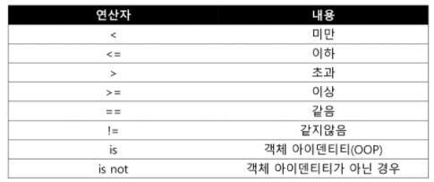
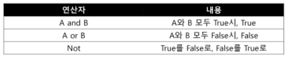
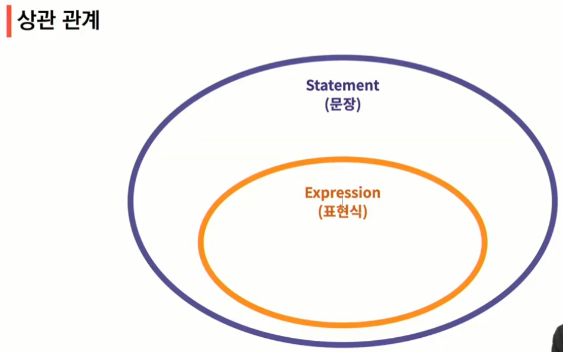
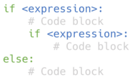
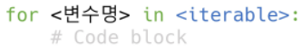

# [1] Python 기초

## 데이터 타입

* 숫자(Number) - int(정수), float(부동소수점, 실수), complex(복소수)

  * 0b : 2진수, 0o : 8진수, 0x : 16진수

* 문자열(String)
  * 이스케이프 시퀀스

    
  
  * 문자열을 변수를 활용하여 만드는 법	
  
    * %-formatting, str.format, f-strings


* 참/거짓(Boolean)

  * None : 0, 0.0, (), [], {}, '', None
* None


## 타입 변환

* 암시적 타입 변환 : 의도하지 않고, 내부적으로 타입 변환
* 명시적 타입 변환 : 특정 함수를 활용하여 의도적으로 타입 변환
  * int : str*, float => int
  * float : str*, int => float
  * str : int, float, list, tuple, dict => str

*형식에 맞는 문자열만 가능


## 연산자

#### 1. 산술 연산자


#### 2. 비교 연산자



#### 3. 논리 연산자



* 결과가 확실한 경우 두번째 값은 확인하지 않고 첫번째 값 반환
  * and 연산에서 첫번째 값이 False인 경우 무조건 False => 첫번째 값 반환
  * or  연산에서 첫번째 값이 True인 경우 무조건 True => 첫번째 값 반환

```python
print(3 and 5)		#5	
print(3 and 0)		#0
print(3 and 0)		#0
print(3 and 0)		#0
```

```python
print(5 or 3)		#5	
print(3 or 0)		#3
print(0 or 3)		#3
print(0 or 0)		#0
```

#### 4. 복합 연산자

|연산자|내용|
|----|---|
|a += b|a = a + b|
|a -= b|a = a - b|
|a \*= b|a = a \* b|
|a /= b|a = a / b|
|a //= b|a = a // b|
|a %= b|a = a % b|
|a \*\*= b|a = a ** b|

* 연산과 대입이 함께 일어남
  * += , -=, *=, %= 등등

#### 5. 기타 연산자

* Concatenation : + 

  > 자료형에서도 사용가능
  * `'hello, '+'ssafy!'`  > hello, ssafy!

* Containment Test : in
  * `'a' in apple` > True

* Identity : is 연산자를 통해 동일한 객체인지 확인 가능

  ```python
  # 파이썬에서 -5부터 256까지 숫자의 id는 동일
  c = 257
  d = 257
  print(c is d)		#False
  print(id(c), id(d))	#4646313136 4646312944
  ```

  ```python
  # 특정변수가 비어있는지 확인 : x is None
  x = 3
  x is None 			#False
  ```

  

#### 연산자 우선순위


## 표현식/문장

* 표현식(expression) : 표현식은 평가되고, 값으로 변경 
  *  하나의 값으로 환원될 수 있는 문장
  * 식별자, 값, 연산자로 구성
* 문장(statement) : 파이썬이 실행 가능한 최소한의 코드 단위
  * 모든 표현식은 문장




# [2] 컨테이너

> 여러 개의 값을 저장할 수 있는 것(객체)

* 시퀀스형 : 순서가 있는 데이터
  * 순서가 있다 != 정렬되어 있다
  * 리스트(list), 튜플(tuple), 레인지(range), 문자형(string), 바이너리(binary)
* 비 시퀀스형 : 순서가 없는 데이터
  * 세트(set), 딕셔너리(dictionary)


## 시퀀스형 컨테이너

#### 1. 리스트(list)

* 순서가 있는 시퀀스, 인덱스를 통해 접근

  * 대괄호([]) 혹은 list()를 통해 생성
  * 값에 대한 접근 : list[i]

* 인덱스는 0부터 시작

* 서로 다른 타입의 데이터를 저장할 수 있음

  ```python
  a[0]='1'` 
  print(a)			#['1', 2, 3]
  ```


#### 2. 튜플(tuple)

* 수정 불가능한(immutable) 시퀀스로 인덱스로 접근
  * 소괄호(()) 혹은 tuple()을 통해 생성  `x, y = (1, 2)`
  * 값에 대한 접근은  my_tuple(i)
* 튜플은 일반적으로 파이썬 내부에서 활용됨
* 하나의 항목으로 구성된 튜플은 생성시 값 뒤에 쉼표를 붙여야 함
  * `b = (1, )`


#### 3. 레인지(range)

* 기본형 : range(n) 	> 0부터 n-1까지 숫자의 시퀀스
* 범위 지정 : range(n, m)	> n부터 m-1까지의 숫자의 시퀀스
* 범위 및 스텝 지정 : range(n, m, s)	> n부터 m-1까지 s만큼 증가시키며 숫자의 시퀀스


### 시퀀스에서 활용하는 연산자/함수

* containment test

  * 시퀀즈 포함 여부 확인
  * in, not in

  ```python
  1 in [3, 2]			#False
  ```

* concatenation(+)

  * 시퀀스 간의 연결/연쇄
  * range는 TypeError 발생

  ```python
  [1, 2] + ['a']		#[1, 2, 'a']
  ```

* 시퀀스 반복(*)

  * range는 TypeError 발생

  ```python
  range(1) * 3		#TypeError

* 인덱싱(indexing)

  * 시퀀스의 특정 인덱스 값에 접근
  * 해당 인덱스가 없는 경우 IndexError

  ```python
  [1, 2, 3][2]		#3
  ```

* 슬라이싱(slicing)

  * 시퀀스를 특정 단위로 슬라이싱

  ```python
  [1, 2, 3, 5][1:4]		#[2, 3, 5]  #1-포함, 4-미포함
  ```

  * 시퀀스를 k간격으로 특정 단위로 슬라이싱

  ```python
  (1, 2, 3, 5)[0:4:2]		#(1, 3)
  ```

* 길이(len)

  ```python
  len([1, 2, 3])			#3
  ```

* 최소/최대(max/min)

  * 문자열은 ascii 코드에 따름
  * ord함수 활용하여 확인 가능

  ```python
  max('abcd1234%^!')		#'d'
  ```

* count

  * 시퀀스에서 특정 원소의 개수
    * 시퀀스에 등장하지 않는 경우 0 반환

  ```python
  [1, 2, 1, 2, 4].count(1)	#2
  ```

  

#### 실습문제

```python
([1, 2]*2 + ['apple', 'banana'])[4].count('a') in range(2, 5)
```

> `False`


## 비시퀀스형 컨테이너

#### 1. 세트(set)

* 순서가 없는 자료구조
  * 중괄호({}) 혹은 set()을 통해 생성 
    * 빈 세트를 만들기 위해서는 set()을 반드시 활용해야 함
  * 순서가 없어 별도의 값에 접근할 수 없음
* 수학에서의 집합과 동일한 구조를 가짐
  * 집합 연산이 가능, 중복된 값이 존재하지 않음

#### 세트 활용

* 세트를 활용하면 다른 컨테이너에서 중복된 값을 쉽게 제거할 수 있음(단, 이후 순서 무시됨)

  ```python
  my_list = {'서울', '서울', '대전', '서울', '광주', '부산', '부산'}
  len(set(my_list)) 			#4
  ```

  

#### 2. 딕셔너리(dictionary)

* key와 value가 쌍으로 이뤄진 자료구조
  * 중괄호({}) 혹은 dict()을 통해 생성
  * key를 통해 value에 접근
  * key는 변경 불가능한 데이터만 활용 가능 (string, integer, float, boolean, tuple, range)
  * value는 모든 값으로 설정 가능 (리스트, 딕셔너리 등)


## 컨테이너 특징

* 컨테이너 형변환


* 컨테이너 분류
  * 변경 불가능한 데이터(immutable)
    * 리터럴(literal) - 숫자, 문자열, 참/거짓
    * range, tuple
  * 변경 가능한 데이터(mutable)
    * list, set, dictionary


# [3] 제어문(Control Statement)

## 1. 조건문

* if문은 참/거짓을 판단할 수 있는 조건식과 함께 사용


 

* expression에는 참/거짓에 대한 조건식
* 조건이 참인 경우 이후 들여쓰기 되어있는 코드 블럭을 실행
* 이외의 경우 else 이후 들여쓰기 되어있는 코드 블럭을 실행

** 들여쓰기 주의할 것! - PEP8에서 권장하는 4space 사용


#### 복수 조건문

  

  * elif 를 활용하여 표현함


#### 중첩 조건문(Nested Conditional Statement)

  
  * 들여쓰기를 유의하여 작성할 것


#### 조건 표현식(Conditional Expression)

  

* 조건 표현식은 일반적으로 조건에 따라 값을 정할 때 활용
* 삼항 연산자(Ternary Operator)로 부르기도 함


## 2. 반복문(Loop Statement)

#### while 문

> 종료조건에 해당하는 코드를 통해 반복문을 종료 시켜야 함

  

* 조건식이 참인 경우 반복적으로 코드를 실행
  * 무한 루프를 하지 않도록 종료조건이 반드시 필요


#### for 문

> 반복 가능(iterable)한 객체를 모두 순회하면 종료 (별도의 종료조건이 필요 없음)

  


#### 리스트 순회하기 - enumerate

* (index, value) 형태의  tuple로 구성된 열거 객체를 반환
* `enumerate(members, start=1)` : 인덱스가 start 해당 값부터 순차적으로 증가


#### 반복 제어

* break - 반복문을 종료
* continue - continue 이후의 코드 블록은 수행하지 않고, 다음 반복을 수행
* for-else - 끝까지 반복문을 실행한 이후에 else문 실행 
  * break를 통해 중간에 종료되는 경우 else문은 실행되지 않음

* pass문 - 아무것도 하지 않음
  * 특별히 할 일이 없을 때 자리를 채우는 용도로 사용
  * 반복문이 아니어도 사용 가능


