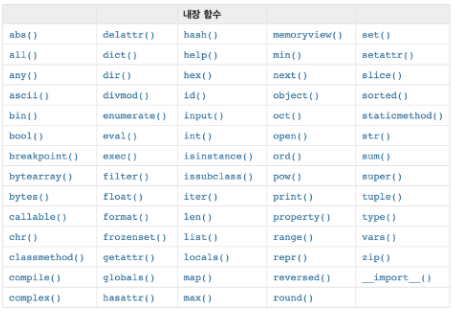
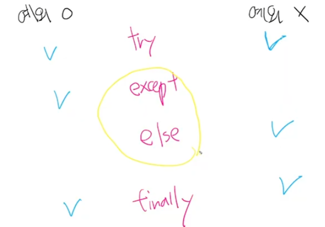
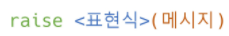

# [1] 함수

## 함수 기초

> 특정한 기능을 하는 코드의 조각(묶음)
>
> 가독성, 높은 재사용성, 유지보수 용이

* 기본 구조 : 
  * 함수의 이름
  *  매개변수(parameters)
  * 바디(body) - Docstring(선택적) 및 코드셋 
  * 반환값(return)

``` python
def pstdev(data, mu=None):					# [def]:keyword, [pstdev]:name, ():parameter
   	'```									# Docstring(Documentation String)
    '```
    var = pvariance(data, mu)				# function body
    try:
        return var.sqrt()
    except AttributoError:
        return math.sqrt(var)
```

* 내장함수



* 함수의 선언 

  * def 키워드를 활용

  * 들여쓰기를 통해 함수 body(실행될 코드 블록)

  * 매개변수(parameter)를 넘겨줄 수 도 있음

  * 동작 후에 return을 통해 결과값을 전달함 - 반드시 하나의 객체를 반환+

    

* 함수의 호출

  * 함수는 함수명()으로 호출 - 매개변수 있는경우, 함수명(값1, 값2, ...)로 호출

  

* 실습 문제 - 세제곱 함수

```python
def cube(x):
    return x**3

print(cube(2), cube(100))
```


## 함수 output

#### 함수의 리턴

* 함수는 항상 반환되는 값이 있으며, 어떠한 객체라고 상관 없음

* 오직 한개의 객체만 return 됨

  * 복수의 객체를 return 하는 경우 => 복수의 객체를 1개의 객체(튜플 `(3, -1)`)을 반환
  * 명시적인 return 값이 없는 경우 => 1개의 객체(None)을 반환

  ```python
  def greeting():
      print('hi')
  greeting()							# hi
  type(greeting())					# NoneType
```

* 주의 - return vs print
  * return은 함수 안에서만 사용되는 **키워드**
  * print는 출력을 위해 사용되는 **함수**


## 함수 input

* 위치 인자(Positional Arguments)
  * 기본적으로 함수 호출 시 인자는 위치에 따라 함수 내에 전달됨
  * `func(1, 2)` -> argument(인자, 인수) : 함수를 호출 할 때 함수에 전달하는 입력 값

  

* 기본 인자 값(Default Arguments Values)

  * 기본값을 지정하여 함수 호출 시 인자값을 설정하지 않도록 함
    * 정의된 것 보다 더 적은 개수의 인자들로 호출 될 수 있음

  ```python
  def add(x, y=0):
      return x + y
  add(2)						# x=2, return x+y
```

  

* 키워드 인자(Keyword Arguments)

  * 직접 변수의 이름으로 특정 인자를 전달할 수 있음
  * 키워드 인자 다음에 위치인자를 활용할 수 없음

  ```python
  def add(x, y):
      return x + y
  add(x=2, y=5)
  add(2, y=5)
  ```

  

*  정해지지 않은 여러 개의 인자 처리
  * `print(*objects, ~)`

* 가변 인자 리스트(Arbitrary Argument Lists)

  * 함수가 임의의 개수 인자로 호출될 수 있도록 지정
  * 인자들은 튜플로 묶여 처리되며, 매개변수에 *르르 붙여 표현

  ```python
  def add(*args):							#args이름은 바껴도 되는데 관례임. 안바꿔야함
      for arg in args:
          print(arg)
  add(2)									# 2
  add(2, 3, 4, 5)							# 2, 3, 4, 5
  ```


* 가변 키워드 인자(Arbitrary Keyword Arguments)

  * 함수가 임의의 개수 인자를 키워드 인자로 호출될 수 있도록 지정
  * 인자들은 딕셔너리로 묶여 처리되며, 매개변수에 **를 붙여 표현

  ```python
  def family(**kwargs):
      for key, value in kwargs:
          print(key, ':', value)
  family(father='John', mother='Jane', me='John Jr.')
  ```


* 함수 정의 주의 사항
  * 기본 인자 값을 가지는 인자 다음에 기본값이 없는 인자로 정의할 수 없음
  * `def greeting(name='john doe', age)`  => 불가

* 함수 호출 주의 사항
  * 키워드 인자 다음에 위치 인자를 활용할 수는 없음
  * `add(x=3, 5)`  => 불가
  * 가변 인자리스트가 위치 인자보다 앞쪽에 올 수 없음
  * `add(*args, x)` 
  * `add(1, 2, 3)`   => 불가
  * 가변 키워드 인자가 위치 인자보다 앞쪽에 올 수 없음
  * `my_info(**kargs, x)`  => 불가
  * `my_info(name='harry')`
    * `my_info(x, y, *args, **kwargs)`  => 올바른 순서


## 함수 Scope

> 함수는 코드 내부에 지역 스코프를 생성하며, 그 외의 공간인 전역 스코프로 구분

* 스코프
  * 전역 스코프(global scope) : 코드 어디에서든 참조할 수 있는 공간
  * 지역 스코프(local scope) : 함수가 만든 스코프, 함수 내부에서만 참조 가능
* 변수
  * 전역 변수(global variance) : 전역 스코프에 정의된 변수
  * 지역 변수(local variance) : 지역 스코프에 정의된 변수


* 변수 수명주기(lifecycle) - 변수는 각자의 수명주기가 존재
  * 빌트인 스코프(built-in scope) : 파이썬이 실행된 이후부터 영원히 유지
  * 전역 스코프(global scope) : 모듈이 호출된 시점 이후 혹은 인터프리터가 끝날 때까지 유지
  * 지역(함수) 스코프(local scope) : 함수가 호출될 때 생성되고, 함수가 종료될 때까지 유지


* #### 이름 검색 규칙(Name Resolution)

  * 파이썬에서 사용되는 이름(식별자)들은 이름공간(namespace)에 저장되어 있음
  * 아래와 같은 순서로 이름을 찾아나가며, LEGB Rule이라고 부름
    * Local scope : 함수
    * Enclosed scope : 특정 함수의 상위 함수
    * Global scope : 함수 밖의 변수, Import 모듈
    * Built-in scope : 파이썬 안에 내장되어 있는 함수 또는 속성
  * **즉, 함수 내에서는 바깥 스코프의 변수에 접근 가능하나 수정은 할 수 없음**

  ```python
  a = 0
  b = 1
  def enclosed():
      a = 10
      c = 3
      def local(c):
          print(a, b, c)
      local(300)
      print(a, b, c)
  enclosed()									# 10 1 300
  											# 10 1 3
  print(a, b)									# 0 1
  ```

  

* #### global 

  - 현재 코드 블록 전체에 적용되며, 나열된 식별자(이름)들이 전역 변수임을 나타냄
    - global에 나열된 이름은 같은 코드 블록에서 global 앞에 등장할 수 없음
    - global에 나열된 이름은 매개변수, for 루프 대상, 클래스/함수 정의 등으로 정의되지 않아야 함

  ```python
  a = 10
  def func1():								#func1(a) => 불가
      #print(a) => 불가
      global a
      a = 3
  print(a)									# 10
  func1()
  print(a)									# 3
  ```

  > Local scope에서 global 변수 값의 변경
  >
  > global 키워드를 사용하지 않으면, Local scope에 a 변수가 생성됨


* #### nonlocal

  * 전역을 제외하고 가장 가까운 (둘러 싸고 있는) 스코프의 변수를 연결하도록 함
    * nonlocal에 나열된 이름은 같은 코드 블록에서 nonlocal 앞에 등장할 수 없음
    * nonlocal에 나열된 이름은 매개변수, for 루프 대상, 클래스/함수 정의 등으로 정의되지 않아야 함
  * global과는 달리 이미 존재하는 이름과의 연결만 가능함

  ```python
  x = 0
  def func1():
      x = 1
      def func2():
          nonlocal x							# 선언된 적 없으면 안됌
          x = 2
      func2()
      print(x)
  func1()										# 2
  print(x)									# 0


* #### 주의

* 기본적으로 함수에서 선언된 변수는 Local Scope에 생성되며, 함수 종료 시 사라짐

* 해당 스코프에 변수가 없는 경우 LEGB rule에 의해 이름을 검색함

  * 변수에 접근은 가능, 수정은 불가능

  * 값을 할당하는 경우 해당 스코프의 이름공간에 새롭게 생성되기 때문

  * 단, 함수내에서 필요한 상위 스코프 변수는 인자로 넘겨서 활용할 것(클로저 제외)

    > 클로저란? 어떤 함수 내부에 중첩된 형태로써 외부 스코프 변수에 접근 가능한 함수

* 상위 스코프에 있는 변수를 수정하고 싶다면 global, nonlocal 키워드를 활용 가능

  * 단, 코드가 복잡해지면서 변수의 변경을 추적하기 어렵고, 예기치 못한 오류가 발생
  * 가급적 사용하지 않는 것을 권장하며, 함수로 값을 바꾸고자 한다면 항상 인자로 넘기고 리턴 값을 사용 하는 것을 추천 


## 재귀 함수(recursive function)

* 자기 자신을 호출하는 함수
* 무한한 호출을 목표로 하는 것이 아니며, 알고리즘 설계 및 구현에서 유용하게 활용
  * 알고리즘 중 재귀함수로 로직을 표현하기 쉬운 경우가 있음(예-점화식)
  * 변수의 사용이 줄어들며, 코드의 가독성이 높아짐
* 1개 이상의 base case(종료되는 상황)가 존재하고, 수렴하도록 작성
  * 같은 문제를 다른  Input 값을 통해서 해결하는 과정
    * 큰 문제를 해결하기 위해 작은 문제로 좁히고, 작은 문제의 해담을 이용하여 해결
  * 작은 문제는 base case에 도달하여 재귀 함수가 끝날 수 있도록 함


* #### 팩토리얼 - 재귀함수

* 반복문 

  * n이 1보다 큰경우 반복문 실행, n은 1씩 감소
  * 마지막에 n이 1이면 더 이상 반복문을 돌지 않음

* 재귀함수

  * 재귀 함수를 호출하며, n은 1씩 감소
  * 마지막에 n이 1이면 더 이상 추가 함수를 호출하지 않음 (base case)

  ``` python
  def factorial(n):
      if n == 1:
          return n
      else:
          return n * factorial(n-1)
  ```

  

* 피보나치 수열

  ```python
  def fib(n):
      if n<2:
          return(n)
      else: 
          return fib(n-1)+fib(n-2)
  ```

  ```python
  def fib(n):
      if n<2:
          return(n)
      a, b = 0, 1
      for i in range(n-1):
          a, b = b, a+b
      return b
  ```

  

* #### 재귀 함수 주의 사항

  * 재귀 함수는 base case에 도달할 때까지 함수를 호출함
  * 메모리 스택이 넘치게 되면(stack overflow) 프로그램이 동작하지 않게 됨
  * 파이썬에서는 최대 재귀 깊이(maximum recursion depth)가 1,000번으로, 호출 횟수가 이를 넘어가게 되면 Recursion Error 발생


# [2] 에러/예외 처리

> (Error/Exception Handling)

## 에러

* #### 문법 에러(Syntax Error)

  > 파일이름, 줄번호, ^ 문자를 통해 문제가 발생한 위치를 표현 

  > 에러가 감지된 가장 앞의 위치를 가르키는 캐럿(caret)기호(^)를 표시
  * invalid syntax
  * assign to literal
  * EOL (End of Line)
  * EOF (End of File)

  

## 예외

> 실행 도중 예상치 못한 상황을 맞이하면, 실행을 멈춤 
>
> 실행 중에 감지되는 에러 = 예외
>
> 여러 타입으로 나타남
>
> 모든 내장 예외는 Exception Class를 상속받아 이뤄짐
>
> 사용자 정의 예외를 만들어 관리할 수 있음

* ZeroDivision Error : `10/0`
* NameError : `print(name_error)` - namespace 상에 이름이 없는 경우
* TypeError 
  *  `1 + '1'` - 타입 불일치
  * `divmod()` - argument 누락
  * `divmod(1, 2, 3)` - argument 개수 초과
  * `import random; random.sample(1, 2)` - argument type 불일치
* ValueError : `int('3.5')` - 타입은 올바르나 값이 적절하지 않은 경우
* IndexError : `empty_list[2]` - 인덱스가 존재하지 않거나 범위를 벗어나는 경우
* KeyError : `song['B']` - 해당 키가 존재하지 않는 경우
* ModuleNotFoundError : 존재하지 않는 모듈을 import 하는 경우
* ImportError : 모듈은 있으나 존재하지 않는 클래스/함수를 가져오는 경우
* KeyboardInterrupt : 임의로 프로그램을 종료하였을 때
* IndentationError : Indentation이 적절하지 않은 경우(들여쓰기 이상할 때)


## 예외처리(handling exception)

* try 문(statement) / except 절(clause)을 이용
* try 아래의 코드 블록이 실행됨 - 예외 발생하면, except 절이 실행됨


* 복수의 예외 처리
  * 순차적으로 수행됨으로, 가장 작은 범주부터 예외 처리를 해야함


* #### 종합

* try : 코드를 실행함

* except : try 문에서 예외가 발생 시 실행함

* else : try 문에서 예외가 발생하지 않으면 실행함

* finally : 예외 발생 여부와 관계 없이 항상 실행함 




* 에러 메시지 처리

  * as 키워드를 활용하여 원본 에러 메시지를 사용할 수 있음

  ```python
  try:
      empty_list = {}
      print(empty_list[-1])
  except IndexError as err:
  	print(f'{err}, 오류가 발생했습니다.')			# list index out of range, 오류가 ~
  ```


## 예외 발생 시키기

* #### raise statement

* 예외를 강제로 발생
  * <표현식> : 예외 타입 지정(주어지지 않을 경우 현재 스코프에서 활성화된 마지막 예외를 다시 일으킴)



* #### assert statement

* 예외를 강제로 발생

* 상태를 검증하는데 사용되며, 무조건 AssertionError가 발생

* 일반적으로 디버깅 용도로 사용

  * <표현식> : False인 경우 AssertionError


