> 현재의 웹 표준 WHATWG

## [1] HTML 

(Hyper Text Markup Language)

> 웹 페이지를 작성하기 위한(구조를 잡기 위한) 언어
>
> **웹 컨텐츠의 의미와 구조를 정의**

### 1. HTML 기본 구조

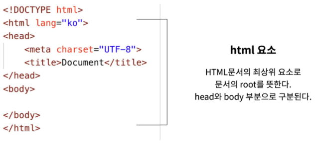

* DOM(Document Object Model) 트리

  > 문서의 구조화된 표현을 제공, 프로그래밍 언어가 DOM구조에 접근할 수 있는 방법을 제공하여 그들이 문서 구조, 스타일 내용 등을 변경 할 수 있게 도움
  >
  > 동일한 문서를 표현하고, 저장하고, 조작하는 방법을 제공

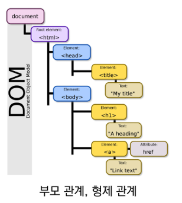

* 요소 (element)

  

  * 시작태그, 종료태그, 태그 사이에 위치한 내용으로 구성

  * 내용이 없는 태그들 : br, hr, img, input, link, meta

  * 요소는 중첩될 수 있음

    

* 중요한 태그들
  * div
  * p
  * a
  * h1~

* 속성 (attribute)

  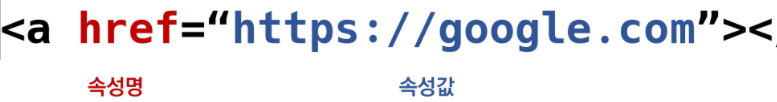

  * 공백없이, ""(쌍따옴표) 사용
  * 속성을 통해 태그의 부가적인 정보를 설정할 수 있음
  * 요소는 속성을 가질 수 있으며, 경로나 크기와 같은 추가적인 정보 제공
  * 시작태그에 작성하며 이름과 값이 하나의 쌍으로 존재
  * 태그와 상관없이 사용 가능한 속성도 있음(HTML Global Attribute)

  

* HTML Global Attribute 

  > 모든 HTML 요소가 공통으로 사용할 수 있는 속성(몇몇 요소에는 아무 효과 없을 수 있음)

  * id, class
  * hidden
  * lang
  * style
  * tabindex
  * title

  

* 시멘틱 태그

  > HTML5에서 의미론적 요소를 담은 태그의 등장 (div)

  * header : 문서 전체나 섹션의 헤더(머릿말 부분)

  * nav : 네비게이션

  * aside : 사이드에 위치한 공간, 메인 콘텐츠와 관련성이 적은 콘텐츠

  * section : 문서의 일반적인 구분, 컨텐츠의 그룹을 표현

  * article : 문서, 페이지, 사이트 안에서 독립적으로 구분되는 영역

  * footer : 문서 전체나 섹션의 푸터(마지막 부분)

    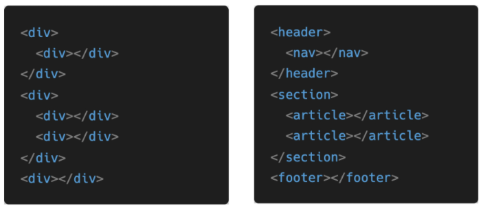

  * 개발자 및 사용자 뿐만 아니라 검색엔진 등에 의미있는 정보의 그룹을 태그로 표현

  * 단순히 구역을 나누는 것 뿐만 아니라 '의미'를 가지는 태그들을 활용하기 위한 노력

  * Non semantic 요소는 div, span 등이 있으며 h1, table 태그들도 시멘틱 태그로 볼 수 있음

  * 요소의 의미가 명확해지기 때문에 코드의 가독성을 높이고 유지보수를 쉽게 함

  * 검색엔진최적화(SEO)를 위해서 메타태그, 시멘틱 태그 등을 통한 마크업을 효과적으로 할 필요가 있다.

  

* 시멘틱 웹

  * 웹상에 존재하는 수많은 웹 페이지들에 메타데이터를 부여하여,
  * 기존의 단순한 데이터의 집합이었던 웹페이지를 '의미'와 '관련성'을 가지는 거대한 데이터베이스로 구축하고자 하는 발상

### 2. HTML 문서 구조화

* 그룹 컨텐츠

  ​		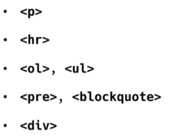

  * hr :  줄 그어짐

* 텍스트 관련 요소

  ​		

  * br : 한 줄 띄어줌(==enter)

* table

  ​		

* form

  ​		

* input

  ​		

* 마크업 해보기

  

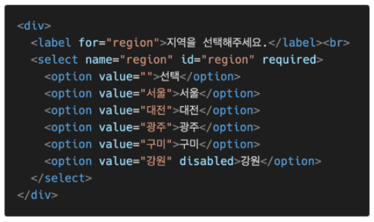

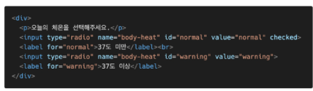

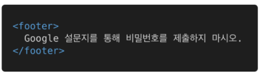

## [2] CSS

(Cascading Style Sheets)

> 스타일, 레이아웃 등을 통해 문서(HTML)를 표시하는 방법을 지정하는 언어

* 구문 

  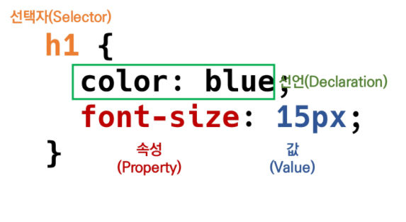

  * 선택자를 통해 스타일을 지정할 HTML 요소를 선택
  * 중괄호 안에서는 속성과 값, 하나의 쌍으로 이루어진 선언을 진행
  * 각 쌍은 선택한 요소의 속성, 속성에 부여할 값을 의미
    * 속성 (Property) : 어떤 스타일 기능을 변경할지 결정
    * 값 (Value) : 어떻게 스타일 기능을 변경할지 결정

* CSS 정의 방법

  1. 인라인(inline) : 해당 태그에 직접 `<style>` 속성을 활용

     

  2. 내부 참조(embedding) - `<style>` : head 태그 내에 `<style>`에 지정

     

  3. 외부 참조(link file) - 분리된 CSS 파일 

     

### 1. CSS Selectors

#### ■ 선택자

* 기본 선택자

  * 전체 선택자, 요소 선택자
  * 클래스 선택자, 아이디 선택자, 속성 선택자

* 결합자 (Combinators)

  * 자손 결합자, 자식 결합자 

    > 자식 결합자 : 바로 아래 자식만
    >
    > 자손 결합자 : 아래 있는 모든 자식들

  * 일반 형제 결합자, 인접 형제 결합자

* 의사 클래스/요소 (pseudo class)

  * 링크, 동적 의사 클래스
  * 구조적 의사 클래스

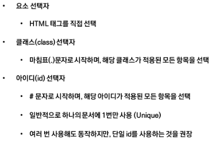

* CSS 적용 우선순위(cascading order)

  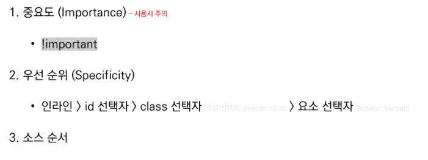

  > !important, id : 반드시 필요한 경우 아니면 사용하지 않음(선호 x) => class 주로 사용

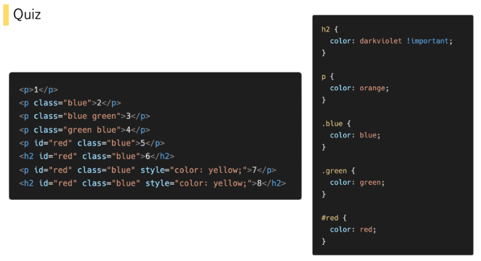

> 1 = orange 
>
> 2 = blue (클래스)
>
> 3, 4 = green (마지막순서부터)
>
> 5 = red (id)
>
> 6 = darkviolet (!important)
>
> 7 = yellow (인라인)
>
> 8 = darkviolet (!important => 가장 우선순위 높음)

* CSS 상속

  ​	

### 2. CSS 단위

#### ■ 크기 단위

* px (픽셀) : 모니터 해상도의 한 화소인 '픽셀'을 기준, 고정적인 단위(모니터 해상도마다 다름)

* % : 백분율 단위, 가변적인 레이아웃에서 자주 사용

* em : (바로 위, 부모 요소에 대한) 상속의 영향을 받음

  * 배수 단위, 요소에 지정된 사이즈에 상대적인 사이즈를 가짐 (변경될 여지가 많음)

    > 부모가 10px  =>  2em = 20px

* rem : (바로 위, 부모 요소에 대한) 상속의 영향을 받지 않음

  * 최상위 요소(html)의 사이즈를 기준으로 배수 단위를 가짐 (사용하기 간편)

* viewport 

  * 웹 페이지를 방문한 유저에게 바로 보이게 되는 웹 컨텐츠의 영역
  * 주로 스마트폰이나 테블릿 디바이스의 화면을 일컫는 용어로 사용됨
  * 글자 그대로 디바이스의 viewport를 기준으로 상대적인 사이즈가 결정됨
  * vw, vh, vmin, vmax

  

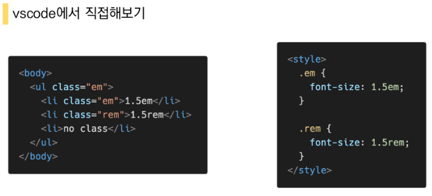

> 기본 html = 16px
>
> 1.5em = 36px (16 * 1.5 * 1.5)
>
> 1.5rem = 24px (16 * 1.5)
>
> no class = 24px (16 * 1.5)

#### ■ 색상 단위

1. 색상 키워드 

   * 대소문자를 구분하지 않음
   * red, blue, black과 같은 특정 색을 직접 글자로 나타냄

2. RGB 색상

   * 16진수 표기법 혹은 함수형 표기법을 사용해서 특정 색을 표현하는 방식
   * '#' + 16진수 표기법
   * rgb() 함수 표기법

3. HSL 색상

   * 색상, 채도, 명도를 통해 특정 색을 표현하는 방식
   * a는 alpha(투명도)가 추가된 것

   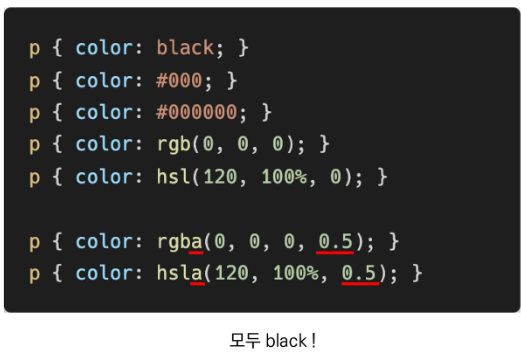

#### ■ CSS 문서 표현

​	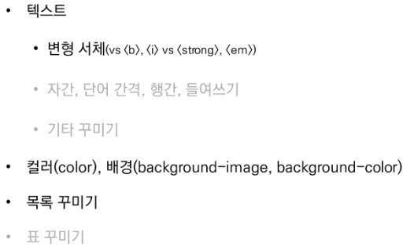

### 3. Selectors 심화

#### ■ 결합자

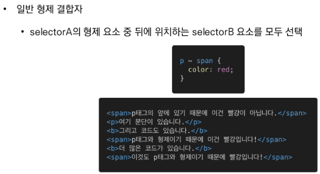

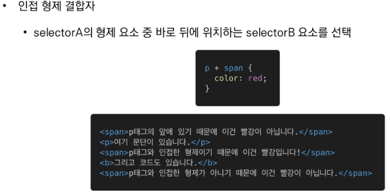

### 4. CSS Box model

#### ■ 네모 세상

* 모든 HTML 요소는 box 형태로 되어있음
* 하나의 박스는 네 부분(영역)으로 이루어짐
  * content, padding, border, margin

#### ■ Box model 구성

* margin

  

* padding

  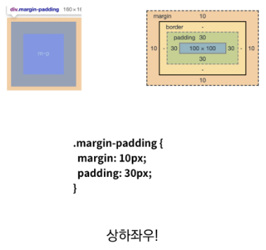

* border

  

* margin/padding shorthand

  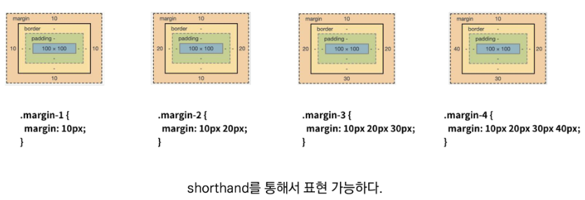

  > 상하좌우 // 상하.좌우 // 상.좌우.하 // 상.우.하.좌

* border shorthand

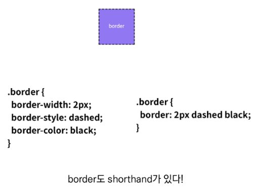

* box-slicing

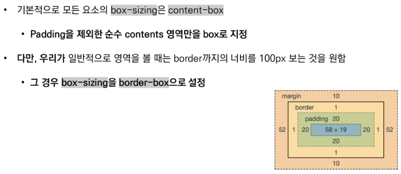

> `box-sizing: border-box;`

* #### **마진 상쇄** : block A의 top과 block B의 bottom에 적용된 각각의 margin이 둘 중에서 큰 마진 값으로 결합되는 현상

~ css Layout

### 5. CSS Display

**모든 요소는 네모(박스모델)이고, 어떻게 보여지는지(display)에 따라 문서에서의 배치가 달라질 수 있다.**

#### ■ display - block, inline

​	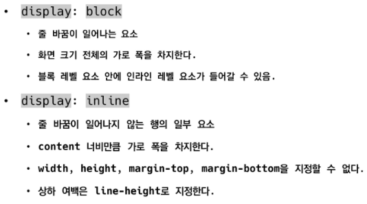

* 블록 레벨 요소와 인라인 레벨 요소

  ​	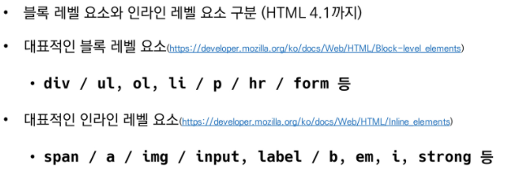

* block - 기본은 너비의 100%

  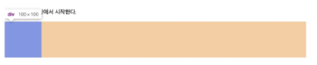

* inline - 컨텐츠 영역 만큼만

  

* 블록 / 인라인에 따른 수평 정렬

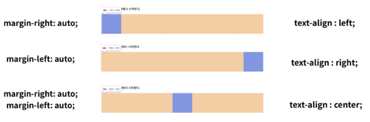

#### ■ display - inline-block, none

​	

### 6. CSS position

​	

​	

#### ■ static

> 원래 위치 = 좌측 상단

#### ■ relative

> 원래 static 위치에서 위에서(=아래로) 100, 왼쪽에서(=오른쪽으로) 100만큼 이동
>
> 과거 위치 존재함

#### ■ absolute

> (static 아닌) 부모(relative)를 먼저 만들어야 함 
>
> 부모를 기준으로 이동
>
> 집을 나감 (=원래 있던 과거 위치에 있던 공간은 존재 안함) -> 부모(relative)를 찾아서 이동

#### ■ fixed

> viewport 기준으로 항상 같은 위치에 있음. 스크롤 내려도 그대로.

-----

* #### 학습 가이드라인 

* MDN web docs - https://developer.mozilla.org/ko

  

* #### 마무리

  ​	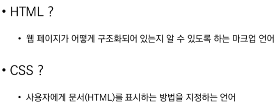
