# CSS Layout

display, position, float, flexbox, grid system, ..

## 1. Float

* 본래는 이미지 좌,우측 주변으로 텍스트를 둘러싸는 레이아웃을 위해 도입
* 더 나아가 이미지가 아닌 다른 요소들에도 적용해 웹사이트의 전체 레이아웃을 만드는데까지 발전
* 한 요소가 정상 흐름(natural flow)으로부터 빠져 **텍스트 및 인라인 요소**가 그 주위를 감싸 요소의 좌, 우측을 딱라 배치되어야 함을 지정

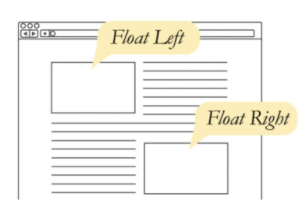

* Float 속성

  * none : 기본값
  * left : 요소를 왼쪽으로 띄움
  * right : 요소를 오른쪽으로 띄움

  

* Float clear  - 가상 요소

  * 선택한 요소의 맨 마지막 자식으로 가상 요소를 하나 생성
  * 보통 content 속성과 함께 짝지어, 요소에 장식용 콘텐츠를 추가할 때 사용
  * 기본값은 inline *(그래서  display: block 따로 해줌)*

  * 선행 floating 요소 다음일 수 있는지 또는 그 아래로 내려가(해제되어(cleared))야 하는지를 지정
  * clear 속성은 float 및 비 float 요소 모두에 적용됨


* Float 정리

  * flexbox 및 grid 레이아웃과 같은 기술이 나오기 이전에 열 레이아웃을 만드는데 사용됨
  * flexbox와 grid의 출현과 함께 결국 원래 텍스트 블록 내에서 float 이미지를 위한 역할로 돌아감
    * MDN에서는 더 새롭고 나은 기술이 나와있으므로 "legacy 레이아웃 기술"로 분류

  - 웹에서 여전히 사용 - naver nav bar


## 2. Flexbox


* 요소
  * Flex Container (부모 요소)
  * Flex Item (자식 요소)
* 축
  * main axis (메인축) (x축 아님)
  * cross axis (교차축)


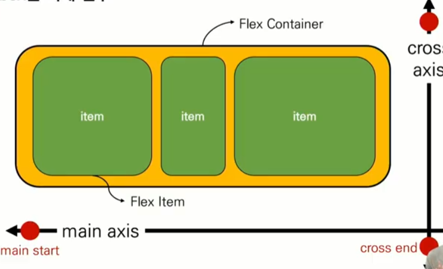

* Flex Container (부모 요소)
  * Flexbox 레이아웃을 형성하는 가장 기본적인 모델
  * Flex Item들이 놓여있는 영역
  * 생성하려면 display 속성을 flex 혹은 inline-flex로 지정
* Flex Item (자식 요소)
  * 컨테이너의 컨텐츠

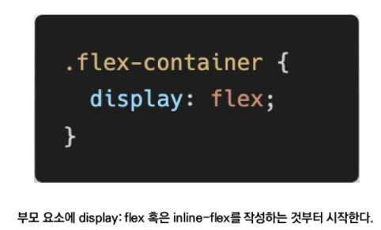

* Flex에 적용하는 속성

  * 배치 방향 설정 : flex-direction

  * 메인축 방향 정렬 : justify-content, ~~justify-self,items~~(->margin auto)

  * 교차축 방향 정렬 : align-items, align-self, align-content

  * 기타 : flex-wrap, flex-flow, flex-grow, order

    > order : 작을수록 앞으로 옴 (기본값 0)
    >
    > flex-grow : 남은 공간의 각 항목에 대한 배분 (기본값 0)


* flex-direction

  * main-axis 방향만 바뀐다. flexbox는 단방향 레이아웃이기 때문이다.

    

* justify & align

  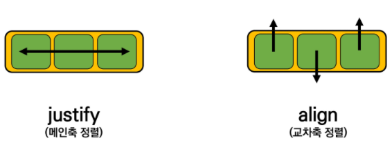

* content & items & self
  * content : 여러줄
  * items : 한줄
  * self : flex item 개별 요소

> 예시
>
> justify-content : 메인축 기준 여러 줄 정렬
>
> align-items : 교차축 기준 한 줄 정렬
>
> align-self : 교차축 기준 선택한 요소 하나 정렬
>
> ​	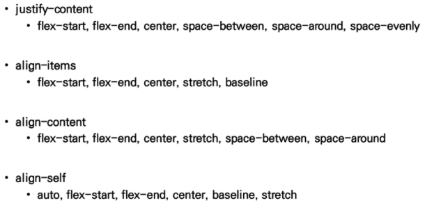


#### * 정리

​	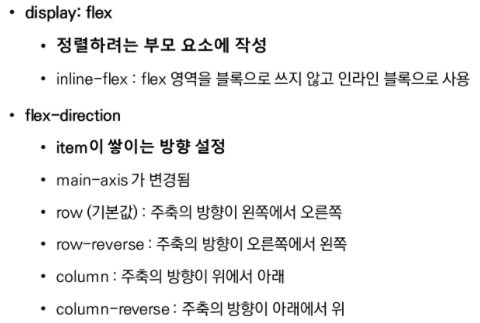

​	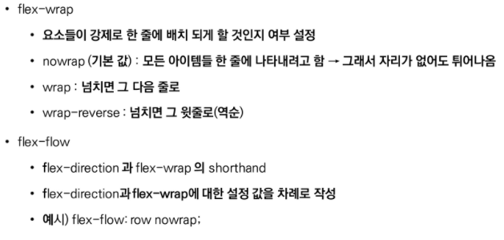

​	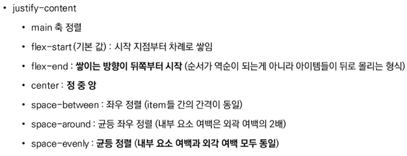

​	

​	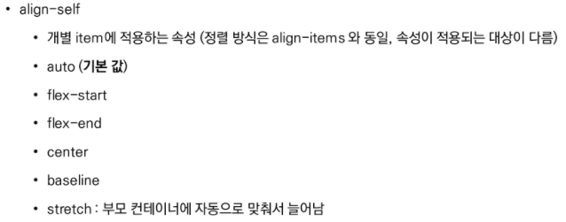

​	

​	


## 3. Bootstrap

​	

​	

```html
<link href="https://cdn.jsdelivr.net/npm/bootstrap@5.0.2/dist/css/bootstrap.min.css" rel="stylesheet" integrity="sha384-EVSTQN3/azprG1Anm3QDgpJLIm9Nao0Yz1ztcQTwFspd3yD65VohhpuuCOmLASjC" crossorigin="anonymous">

<script src="https://cdn.jsdelivr.net/npm/bootstrap@5.0.2/dist/js/bootstrap.bundle.min.js" integrity="sha384-MrcW6ZMFYlzcLA8Nl+NtUVF0sA7MsXsP1UyJoMp4YLEuNSfAP+JcXn/tWtIaxVXM" crossorigin="anonymous"></script>

```


* spacing 

  * .mt-1 (=margin top)

  ​	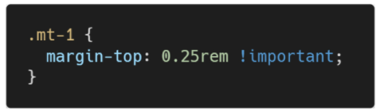
  * .mx-0  (=margin x축)

  * .mx-auto = 수평 중앙 정렬

    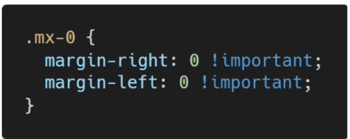


* color

  * bg-danger (=background danger색깔)

  


* Flexbox in Bootstrap
  * d-flex ~

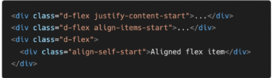


* Responsive Web Design

  * 다양한 화면 크기를 가진 디바이스들이 등장함에 따라 Responsive Web Design 개념 등장
  * 반응형 웹은 별도의 기술 이름이 아닌 웹 디자인에 대한 접근 방식, 반응형 레이아웃 작성에 도움이 되는 사례들의 모음 등을 기술하는데 사용되는 용어
  * 예시 : Media Queries, Flexbox, Bootstrap Grid System, The viewport meta tag

  


## 4. Bootstrap Grid System

* Bootstrap Grid System은 flexbox로 제작됨
* **container, rows, cloumn**으로 컨텐츠를 배치하고 정렬
  * **12개의 column**
  * **6개의 grid breakpoints**

> flex : container -> items
>
> grid system : container -> rows -> column 12개


* row : columns의 wrapper
* gutter : grid 시스템에서 반응적으로 공간을 확보하고 컨텐츠를 정렬하는 데 사용되는 cloumn사이의 padding
* col, col-* 
  * 12개 중 사용하려는 columns 수를 나타냄
  * 너비는 백분율로 설정되므로 항상 부모 요소를 기준으로 유동적으로 크기가 조정됨
  * grid layout에서 내용은 반드시 columns 안에 있어야 하며, 오직 columns만 row의 바로 하위 자식일 수 있음

* Grid breakpoints

  * 다양한 디바이스에서 적용하기 위해 특정 px(필셀) 조건에 대한 지점을 정해 두었는데 이를 breakpoints라고 함

  * bootstrap은 대부분 크기를 정의하기 위해 em 또는 rem을 사용하지만 px는 grid breakpoint에 사용

    * viewport 너비가 픽셀 단위이고 글꼴 크기에 따라 변하지 않기 때문

    > col-sm-1 : sm사이즈에서는 한칸을 차지함(576px 넘어가면 바뀜)
    >
    > col-md-1 ... => 6개 사이즈 다 설정(xs sm md lg xl xxl)

* offset : 지정한 만큼의 column 공간을 무시하고 다음 공간부터 컨텐츠를 적용
* nesting (중첩) : row > col-* > row > col-* 의 방식으로 중첩 사용 가능


## 마무리


