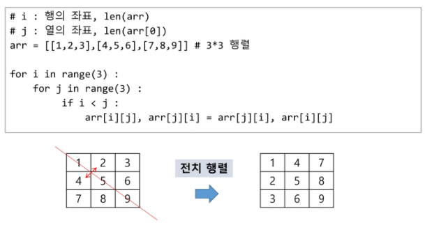
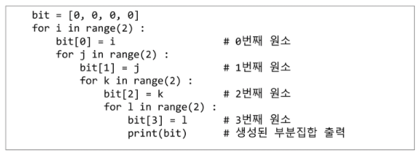
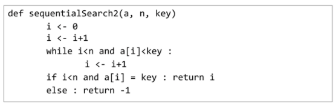
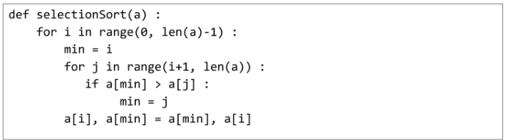
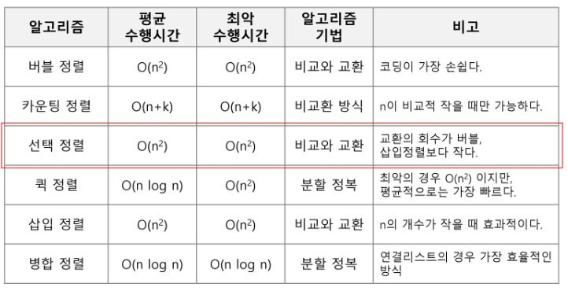

# [2] 배열2 (Array 2)

## 2차원 배열

> 1차원 List를 묶어놓은 List
>
> 선언 : 세로길이(행의 개수), 가로길이(열의 개수)를 필요로 함
>
> ```python
> N, M = map(int, input().split())
> arr = [list(map(int, input().split())) for _ in range(N)]
> 
> arr2 = [[0] * M for _ in range(N)]
> # arr2 = [[0]*M]*N 	#사용 불가 - 전부 같은 주소가 복사됨
> ```

* 배열 순회 : n X m 배열의 n*m개의 모든 원소를 빠짐없이 조사하는 방법

* 행 우선 순회

  

* 열 우선 순회

  

* 지그재그 순회

  

* 델타를 이용한 2차 배열 탐색

  * 2차 배열의 한 좌표에서 4방향의 인접 배열 요소를 탐색하는 방법

  

  ```python
  #(i,j) 오른-아래-왼-위쪽 순서 (i:세로, j:가로)
  di = [0, 1, 0, -1]
  dj = [1, 0, -1, 0]
  
  for i in range(N):
      for j in range(M):
          for k in range(4):
              ni = i + dk
              nj = j + dj[k]
              if 0 <= ni < N and 0 <= nj < M:
                  arr[ni][nj]
                  
  for i in range(N):
      for j in range(M):  
          for dr, dc in [[0, 1], [1, 0], [0, -1], [-1, 0]]:
              ni = i + dr
              nj = j + dc
              if 0 <= ni < N and 0 <= nj < M:
                  arr[ni][nj]
  ```

* 전치 행렬

  ****

> 대각선 : i == j
>
> 대각선 위 부분 : i < j
>
> 대각선 아래 부분 : i > j


## 부분집합 생성

* 부분집합의 수 : 집합의 원소가 n개일 때, 공집합을 포함한 부분집합의 수는 2^n개이다.

  

* 비트 연산자

  ​	

* **<< 연산자** : 1<<n : 2^n 즉, 원소가 n개일 경우의 모든 부분집합의 수를 의미한다.
* **& 연산자** : i & (1<<j) : i의 j번째 비트가 1인지 아닌지를 리턴한다.

* 보다 간결하게 부분집합 생성

  
  
  > 공집합 제외 : for i in range(1, 1<<n)


## 검색 (Search)

> 저장되어 있는 자료 중에서 원하는 항목을 찾는 작업
>
> 목적하는 탐색 키를 가진 항목을 찾는 것 (탐색 키:자료를 구별하여 인식할 수 있는 키)
>
> 종류 : 순차 검색(sequential search), 이진 검색(binary search), 해쉬(hash)

### 1. 순차 검색

* 일렬로 되어있는 자료를 순서대로 검색하는 방법
  * 가장 간단하고 직관적인 검색 방법
  * 배열, 연결리스트 등 순차구조로 구현된 자료구조에서 원하는 항목을 찾을 때 유용함
  * 구현 쉽지만 검색 대상의 수가 많은 경우에는 수행시간이 급격히 증가하여 비효율적임
* 2가지 경우 : 정렬되어 있지 않는 경우, 정렬되어 있는 경우


#### 정렬되어 있지 않은 경우

> 첫 번째 원소부터 순서대로 검색 대상과 키 값이 같은 원소가 있는지 비교하며 찾는다. 
>
> 키 값이 동일한 원소를 찾으면 그 원소의 인덱스를 반환한다.
>
> 자료구조의 마지막에 이를 때까지 검색 대상을 찾지 못하면 검색 실패

* 찾고자 하는 원소의 순서에 따라 비교회수가 결정됨

  * 평균 비교 회수 = (1/n)*(1+2+3+...+n) = (n+1)/2
  * 시간 복잡도 : O(n)

  

#### 정렬되어 있는 경우

> 자료가 오름차순으로 정렬된 상태 가정
>
> 순차적으로 검색하면서 키 값을 비교하여, 원소의 키 값이 검색대상의 키 값보다 크면 찾는 원소가 없다는 것이므로 검색을 종료한다.

* 찾고자 하는 원소의 순서에 따라 비교회수가 결정됨

  * 정렬되어 있으므로, 검색 실패를 반환하는 경우 평균 비교 회수가 반으로 줄어든다.

  * 시간 복잡도 : O(n)

    


### 2. 이진 검색

* 자료의 가운데에 있는 항목의 키 값과 비료하여 다음 검색의 위치를 결정하고 검색을 계속 진행하는 방법
  * 목적 키를 찾을 때까지 이진 검색을 순환적으로 반복 수행함으로써 검색범위를 반으로 줄여가면서 보다 빠르게 검색을 수행함
* 이진 검색을 하기 위해서는 자료가 정렬된 상태여야 한다.
* 검색 과정
  * 자료의 중앙에 있는 원소를 고른다.
  * 중앙 원소의 값과 찾고자 하는 목표 값을 비교한다.
  * 목표 값이 중앙 원소의 값보다 작으면 자료의 왼쪽 반에 대해서 새로 검색을 수행하고, 크다면 자료의 오른쪽 반에 대해서 새로 검색을 수행한다.
  * 찾고자 하는 값을 찾을 때까지 과정을 반복한다.

* 구현

  * 검색 범위의 시작점과 종료점을 이용하여 검색을 반복 수행한다.

  * 이진 검색의 경우, 자료에 삽입이나 삭제가 발생했을 때 배열의 상태를 항상 정렬 상태로 유지하는 추가 작업이 필요하다.

    

* 재귀 함수 이용

  


## 선택 정렬 (Selection sort)

* 주어진 자료들 중 가장 작은 값의 원소부터 차례대로 선택하여 위치를 교환하는 방식

* 정렬 과정

  * 주어진 리스트 중에서 최소값을 찾는다.
  * 그 값을 리스트의 맨 앞에 위치한 값과 교환한다.
  * 맨 처음 위치를 제외한 나머지 리스트를 대상으로 위의 과정을 반복한다.

* 시간 복잡도 : O(n^2)

  


### 셀렉션 알고리즘 (Selection Algorithm)

* 저장되어 있는 자료로부터 k번째로 큰 혹은 작은 원소를 찾는 방법
  * 최소값, 최대값 혹은 중간값을 찾는 알고리즘을 의미
* 선택과정
  * 정렬 알고리즘을 이용하여 자료 정렬하기
  * 원하는 순서에 있는 원소 가져오기

* k번째로 작은 원소를 찾는 알고리즘

  * 1번부터 k번째까지 작은 원소들을 찾아 배열의 앞쪽으로 이동시키고, 배열의 k번째를 반환한다.

  * k가 비교적 작을 때 유용하며 O(kn)의 수행시간을 필요로 한다.

    


#### 정렬 알고리즘 비교




#### 비트 연산

* OR : 특정비트를 1로 만드는 연산에 활용
  * ​	0 1 0 1
  * **|**  1 1 0 1 
  * =   0 1 1 1

* AND : 특정비트를 0으로 만들 때
  * ​	 0 1 0 1
  * **&**  1 1 1 0

  * =   0 1 0 0

`1 << j` = j번 비트가 1인 값 (1<<n = 2^n)

i의 j번 비트를 검사 : `i & (1<<j)`

`if i & (1<<j): ~`


