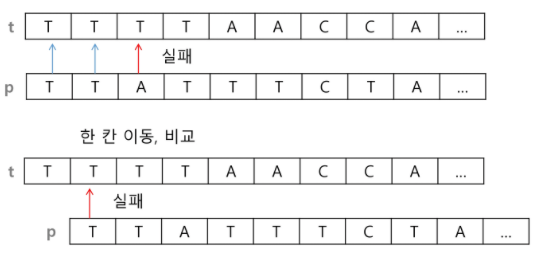
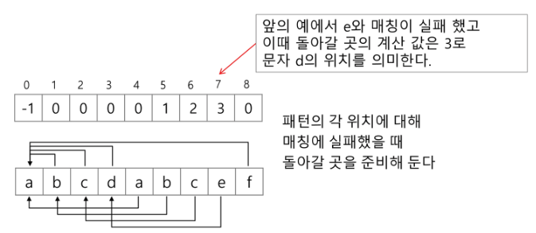
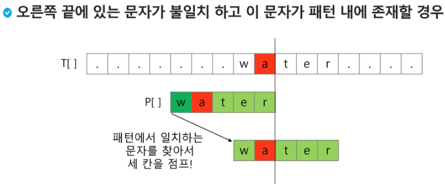
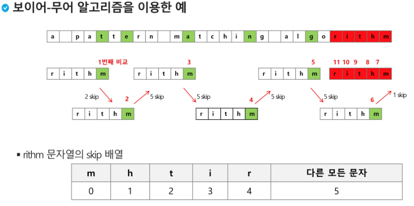
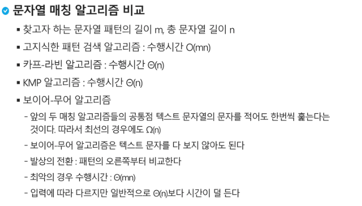

# [3] 문자열 (string)

* 아스키 문자 (32~126)

  

* C언어에서의 문자열 처리
  * 문자들의 배열 형태로 구현된 응용 자료형
  * 문자배열에 문자열을 저장할 때는 항상 마지막에 끝을 표시하는 널문자('\0')를 넣어줘야 한다.
  * 문자열 처리에 필요한 연산을 함수 형태로 제공한다.
    * `strlen(), strcpy(), strcmp()`

* Java(객체지향 언어)에서의 문자열 처리
  * a문자열 데이터를 저장, 처리해주는 클래스를 제공한다.
  * String클래스를 사용한다. `String str="abc"; //또는 String str = new String("abc")`
  * 문자열 처리에 필요한 연산을 연산자, 메소드 형태로 제공한다.
    * `+, length(), replace(), split(), substring()`

* Python에서의 문자열 처리

  * char타입 없음. 텍스트 데이터의 취급방법이 통일되어 있음
  * '', "", ''', """
  * +연결 : 문자열 + 문자열
  * *반복 : 문자열 * 수
  * 요소값을 변결 할 수 없음(immutable)

  ```python
  .replace()
  .split()
  .isalpha()
  .find()
  ```

  

* C와 Java의 String 처리의 기본적인 차이점

  * c는 아스키 코드로 저장한다.

  * java는 유니코드(UTF16, 2byte)로 저장한다.

  * 파이썬은 유니코드(UTG8)로 저장

    

* 문자열 뒤집기

  ```python
  s = list(input())
  n = len(s) #글자수
  for i in range(n//2):
      s[i], s[n-1-i] = s[n-1-i], s[i] 	# s[i] <-> s[n-1-i]
  print(s)
  ```

  

* 문자열 비교
  * c strcmp() 함수를 제공한다.
  * Java에서는 equals() 메소드를 제공한다.
    * 문자열 비교에서 == 연산은 메모리 참조가 같은지를 묻는 것
  * 파이썬에서는 ==연산자와 is연산자를 제공한다.
    * ==연산자는 내부적으로 특수 메서드 `__eq__()`를 호출


* 문자열 숫자를 정수로 변환하기, 문자변환
  * c언어 : `atoi()` , 역함수-`itoa()`
  * 파이썬 : `int("123"), float("3.14"), str(123), repr(123)`


## 패턴 매칭

* 패턴 매칭에 사용되는 알고리즘
  * 고지식한 패턴 검색 알고리즘
  * 카프-라빈 알고리즘
  * KMP 알고리즘
  * 보이어-무어 알고리즘


### 고지식한 알고리즘(Brute Force)

* 본문 문자열을 처음부터 끝까지 차례대로 순회하면서 패턴 내의 문자들을 일일이 비교하는 방식으로 동작
* 시간 복잡도 : O(MN)




```python
for i in range(N-M):
    for j in range(M-1):
        if p[j] != t[i+j]:
            break
        if j = M-1:
            return i
return -1
```


### KMP 알고리즘

* 불일치가 발생한 텍스트 스트링의 앞 부분에 어떤 문자가 있는지를 미리 알고 있으므로, 불일치가 발생한 앞부분에 대하여 다시 비교하지 않고 매칭을 수행

* 패턴을 전처리하여 배열 next[M]을 구해서 잘못된 시작을 취소함

  *  next[M] : 불일치가 발생했을 경우 이동할 다음 위치

* 시간 복잡도 : O(M+N)

* 아이디어 설명

  

* 매칭이 실패했을 때 돌아갈 곳을 계산한다.

  

```python
cnt = 0			#일치한 개수
next = [0]*M
i = 1
while i < M:
    if p[i] == p[cnt]:
        cnt += 1
        next[i] = cnt
        i += 1
    else:
        if cnt != 0:
            cnt = next[cnt-1]
        else:
            next[i] == 0
            i += 1
```


### 보이어-무어 알고리즘

* 오른쪽에서 왼쪽으로 비교
* 대부분의 상용 소프트웨어에서 채택하고 있는 알고리즘
* 보이어-무어 알고리즘은 패턴에 오른쪽 끝에 있는 문자가 불일치 하고 이 문자가 패턴 내에 존재하지 않는 경우, 이동 거리는 무려 패턴의 길이 만큼이 된다.






#### * 비교




