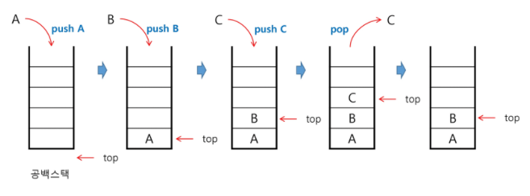
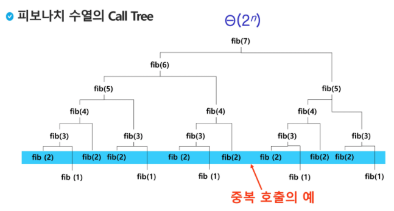
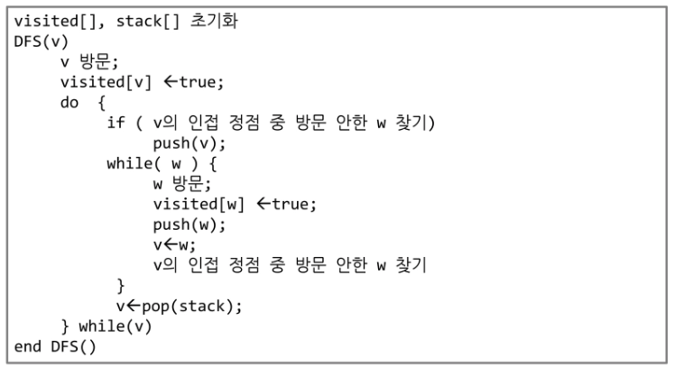
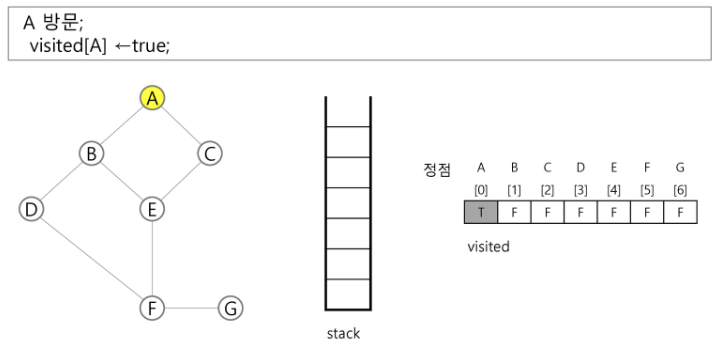

# [4] 스택 1 (Stack 1)

* 스택의 특성
  * 자료를 쌓아 올린 형태의 자료구조
  * 선형구조 : 자료 간의 관계가 1대1의 관계 (<-> 비선형구조:1대N-트리)
  * 스택에 자료를 삽입하거나 자료를 꺼낼 수 있다.
  * 마지막에 삽입한 자료를 가장 먼저 꺼낸다. 후입선출(LIFO, Last-In-First-Out)


## 스택의 구현

* 스택을 프로그램에서 구현하기 위해서 필요한 자료구조와 연산

  * 자료구조 : 자료를 선형으로 저장할 저장소

    * 저장소 자체를 스택이라 부르기도 한다.
    * 스택에서 마지막 삽입된 원소의 위치를 top이라 부른다.

  * 연산

    * 삽입 : 저장소에 자료를 저장한다. push
    * 삭제 : 저장소에서 자료를 삽입한 자료의 역순으로 꺼낸다. pop

    * 스택이 공백인지 아닌지 확인 : isEmpty
    * 스택의 top에 있는 item(원소)을 반환 : peek

    

* 스택의 삽입/삭제 과정

  * 빈 스택에 원소 A, B, C를 차례로 삽입 후 한번 삭제하는 연산과정

  

* 스택의 push 알고리즘 : append 메소드를 통해 리스트의 마지막에 데이터 삽입

  ```python
  def push(item):
      s.append(item)
  ```

* 스택의 pop 알고리즘 

  ```python
  def pop():
      if len(s) == 0:
          # underflow
          return
     	else:
          return s.pop(-1)
  ```

  

* 고려사항 : 1차원 배열을 사용하여 구현할 경우 용이하지만 스택의 크기를 변경하기 어렵다. 
  * 저장소를 동적으로 할당하여 스택을 구현하는 방법, 동적 연결리스트를 이용 -> 동적구현


## 재귀호출

> 자기 자신을 호출하여 순환 수행되는 것
>
> 함수에서 실행해야 하는 작업의 특성에 따라 일반적인 호출방식보다 재귀호출방식을 사용하여 함수를 만들면 프로그램의 크기를 줄이고 간단하게 작성

* 피보나치 수를 구하는 재귀함수

  ```python
  def fibo(n):
      if n < 2:
          return n
      else:
          return fibo(n-1) + fibo(n-2)
  ```

* 배열을 출력하는 함수

  ```python
  def f(i, k):
      if i == k:		# 배열을 벗어나면(모든 원소에 대한 작업이 끝나면)
          return
      else:
          print(A[i])
          f(i+1, k)	# 다음 원소로 이동
          return
  N = 3
  A = [10, 20, 30]
  r = f(0, N)				# 배열을 출력하는 함수
  print(r) # None
  ```


## Memoization (메모이제이션)

> 컴퓨터 프로그램을 실행할 때 이전에 계산한 값을 메모리에 저장해서 매번 다시 계산하지 않도록 하여 전체적인 실행속도를 빠르게 하는 기술. 동적계획법의 핵심이 되는 기술

* 재귀함수의 문제점 : 엄청난 중복 호출이 존재한다.

  ​	

* Memoization 방법을 적용한 알고리즘

  ```python
  memo를 위한 배열을 할당하고, 모두 0으로 초기화 한다;
  momo[0]을 0으로 memo[1]는 1로 초기화 한다;
  
  def fibo1(n):
      global memo
      if n >= 2 and len(memo) <= n:
          memo.append(fibo1(n-1) + fibo2(n-2))
      return memo[n]
  
  memo = [0, 1]
  ```

  ```python
  def fibo2(n):
      global cnt
      cnt += 1
      if n >= 2 and memo2[n] == 0:	# 아직 계산되지 않은 값이면
          memo2[n] = fibo2(n-1) + fibo2(n-2)
      return memo2[n]
  
  n = 20
  memo2 = [0] * (n+1)
  memo2[0] = 0
  memo2[1] = 1
  cnt = 0
  print(fibo2(n), cnt)
  ```

  

## DP (Dynamic Programming)

> 동적 계획 알고리즘은 그리디 알고리즘과 같이 최적화 문제를 해결하는 알고리즘이다.
>
> 먼저 입력 크기가 작은 부분 문제들을 모두 해결한 후에 그 해들을 이용하여 보다 큰 크기의 부분 문제들을 해결하여, 최종적으로 원래 주어진 입력의 문제를 해결하는 알고리즘이다.

* 피보나치 수 DP 적용

  * 부분 문제로 분할한다. F(n)함수는 F(n-1)과 F(n-2)의 합 ...

  * 가장 작은 부분 문제부터 해를 구한다.

  * 결과를 테이블에 저장하고, 테이블에 저장된 부분 문제의 해를 이용하여 상위 문제의 해를 구한다.

    

  * 적용 알고리즘

    ```python
    def fibo2(n):
        f = [0, 1]
        for i in range(2, n+1):
            f.append(f[i-1]+f[i-2])
        return f[n]
    ```

* DP의 구현 방식

  * recursive 방식 : fib1()
  * iterative 방식 : fib2()
  * memoization을 재귀적 구조에 사용하는 것보다 반복적 구조로 DP를 구현한 것이 성능면에서 보다 효율적이다.
  * 재귀적 구조는 내부에 시스템 호출 스택을 사용하는 오버헤드가 발생하기 때문이다.


## DFS (깊이우선탐색)

> 비선형구조인 그래프 구조는 그래프로 표현된 모든 자료를 빠짐없이 검색하는 것이 중요함
>
> * 두 가지 방법 : 깊이 우선 탐색(DFS), 너비 우선 탐색(BFS)
>
> 시작 정점의 한 방향으로 갈 수 있는 경로가 있는 곳까지 깊이 탐색해 가다가 더 이상 갈 곳이 없게 되면, 가장 마지막에 만났던 갈림길 간선이 있는 정점으로 되돌아와서 다른 방향의 정점으로 탐색을 계속 반복하여 결국 모든 정점을 방문하는 순회방법
>
> 가장 마지막에 만났던 갈림길의 정점으로 되돌아가서 다시 깊이 우선 탐색을 반복해야 하므로 후입선출 구조의 스택 사용

* DFS 알고리즘
  1. 시작 정점 v를 결정하여 방문한다.
  2. 정점 v에 인접한 정점 중에서 
     * 방문하지 않은 정점 w가 있으면, 정점 v를 스택에 push하고 정점 w를 방문한다. 그리고 w를 v로 하여 다시 2.를 반복한다.
     * 방문하지 않은 정점이 없으면, 탐색의 방향을 바꾸기 위해서 스택을 pop하여 받은 가장 마지막 방문 정점을 v로 하여 다시 2.를 반복한다.
  3. 스택이 공백이 될 때까지 2.를 반복한다.




​	

```python
V, E = map(int, input().split())
ad = [[0]*(V+1) for _ in range(V+1)]
for _ in range(E):
    n1, n2 = map(int, input().split())
    ad[n1][n2] = 1
    ad[n2][n1] = 1
```

```python
def dfs(s, V):
    visited = [0]*(V+1)
    stack = []
    i = s #현재 방문한 정점 i
    visited[i] = 1
    print(node[i])
    while i!=0:	# True:
        for w in range(1, V+1):
            if adj[i][w] == 1 and visited[w]==0:
                #print(node[w])
                stack.append(i)		# 방문 경로 저장
                i = w				# 새 방문지 이동
                visited[w] = 1
                print(node[i])	# 이동 후
                break
        else:
            if stack:
                i = stack.pop()
            else:
                i = 0
                # break
```


* DFS 예

  * 정점 A를 시작으로 깊이 우선 탐색을 시작 -> B, D, F, E, C

    

  * 정점 C에서 방문하지 않은 인접정점이 없으므로, 마지막 정점으로 돌아가기 위해 스택을 pop하여 받은 정점 E에 대해서 방문하지 않은 인접 정점이 있는지 확인 -> F

    

  * 정점 F에 방문하지 않은 정점 G가 있으므로 F를 스택에 push하고, 인접정점 G를 선택하여 탐색을 계속한다.

  * 방문하지 않은 인접정점 없으므로, pop -> F, D, B, A


​	


