# [6] 큐 (Queue)

> 삽입과 삭제의 위치가 제한적인 자료구조 
>
> 선입선출구조(FIFO) : 가장 먼저 삽입된 원소는 가장 먼저 삭제된다.

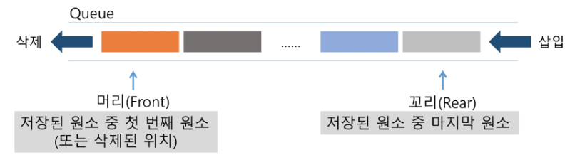

* 기본 연산 - 삽입: enQueue, 삭제:deQueue.

* 주요 연산:

  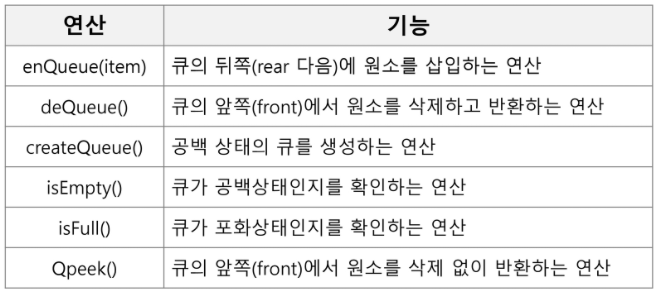

1)공백 큐 생성 : createQueue();           (front = rear = -1)

2,3) 원소 A, B 삽입 : enQueue(A); enQeueu(B);      (front = -1, rear=0, 1)

 

## 1. 선형큐

* 1차원 배열을 이용한 큐
  * 큐의 크기 = 배열의 크기
  * front : 저장된 첫 번째 원소의 인덱스
  * rear : 저장된 마지막 원소의 인덱스
* 상태 표현
  * 초기 상태 : front = rear = -1
  * 공백 상태 : front = rear
  * 포화 상태 : rear = n-1 (n:배열의 크기, n-1:배열의 마지막 인덱스)
* 초기 공백 큐 생성
  * 크기 n인 1차원 배열 생성
  * front와 rear를 -1로 초기화

### 선형큐의 구현

* 삽입 : enQueue(item) - 마지막 원소 뒤에 새로운 원소를 삽입하기 위해

  * rear값을 하나 증가시켜 새로운 원소를 삽입할 자련을 마련

  * 그 인덱스에 해당하는 배열원소 Q[rear]에 item을 저장

    

* 삭제 : deQueue() - 가장 앞에 있는 원소를 삭제하기 위해

  * front 값을 하나 증가시켜 큐에 남아있게 될 첫 번째 원소 이동

  * 새로운 첫 번째 원소를 리턴 함으로써 삭제와 동일한 기능함

    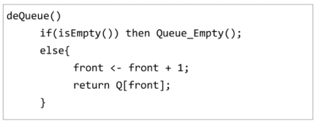

* 공백상태 및 포화상태 검사 : isEmpty(), isFull()

  * 공백상태 : front = rear

  * 포화상태 : rear = n-1 (n: 배열의 크기, n-1:배열의 마지막 인덱스)

    

* 검색 : Qpeek()

  * 가장 앞에 있는 원소를 검색하여 반환하는 연산

  * 현재 front의 한자리 뒤(front+1)에 있는 원소, 즉 큐의 첫 번째에 있는 원소를 반환

    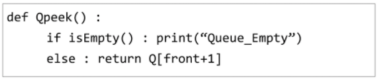

* 잘못된 포화상태의 인식
  * 삽입, 삭제를 계속할 경우 공간이 있음에도 불구하고 rear=n-1인 상태, 즉 포화상태로 인식하여 더 이상의 삽입 x
  * 해결 1) 매 연산이 이루어질 때마다 저장된 원소들을 배열의 앞부분으로 모두 이동시킴
    *  -> 이동에 많은시간 소요되어 큐의 효율성이 급격히 떨어짐
  * 해결 2) 논리적으로는 배열의 처음과 끝이 연결되어 원형의 큐를 이룬다고 가정하고 사용

## 2. 원형큐

* 초기 공백 상태 - front = rear = 0
* Index의 순환 
  * front와 rear의 위치가 배열의 마지막 인덱스인 n-1을 가리킨 후, 그 다음에는 처음 인덱스인 0으로 이동해야함
  * 이를 위해 나머지 연산자 mod를 사용함
* front 변수 - 공백, 포화상태 구분을 쉽게하기 위해  front가 있는 자리는 항상 빈자리로 둠
* 삽입위치 및 삭제위치
  *  

### 원형 큐의 연산 과정

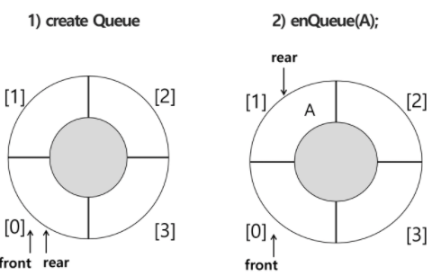

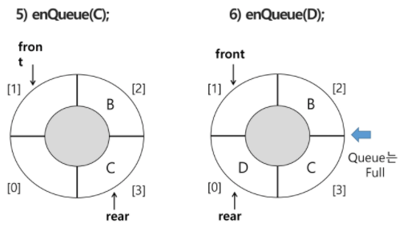

### 원형 큐의 구현

* 초기 공백 큐 생성
  * 크기 n인 1차원 배열 생성
  * front 와 rear를 0으로 초기화

 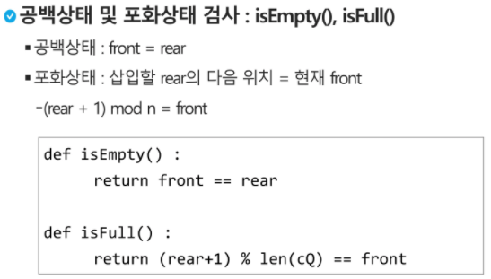

 

 

 				  

## 3. 연결큐

* 단순 연결 리스트(Linked List)를 이용한 큐
  * 큐의 원소 : 단순 연결 리스트의 노드
  * 큐의 원소 순서 : 노드의 연결 순서, 링크로 연결되어 있음
  * front : 첫 번째 노드를 가리키는 링크
  * rear : 마지막 노드를 가리키는 링크
* 상태 표현 - 초기, 공백 상태 : front =rear = null

### 연결 큐의 연산 과정

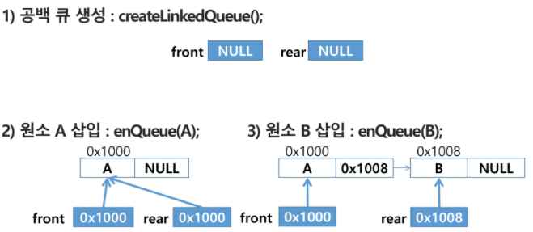

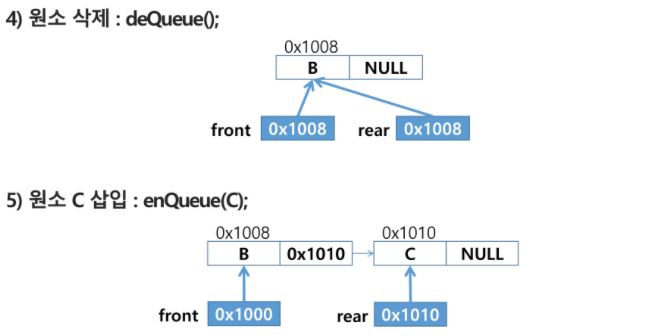

### 연결 큐의 구현

 

 

 

 

* 구현 예) python 코드

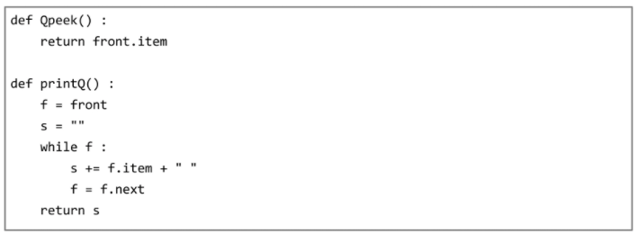

## 4. 우선순위 큐

> 우선순위를 가진 항목들을 저장하는 큐
>
> FIFO 순서가 아니라 우선순위가 높은 순서대로 먼저 나가게 되낟.
>
> 적용 분야 : 시물레이션 시스템, 네트워크 트래픽 제어, 운영체제의 테스트 스케줄링

* 구현 
  * 배열을 이용한 우선순위 큐
  * 리스트를 이용한 우선순위 큐
* 기본 연산
  * 삽입 : enQueue
  * 삭제 : deQueue

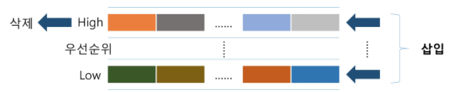

* 배열을 이용하여 우선순위 큐 구현
  * 배열을 이요하여 자료 저장
  * 원소를 삽입하는 과정에서 우선순위를 비교하여 적절한 위치에 삽입하는 구조
  * 가장 앞에 최고 우선순위의 원소가 위치하게 됨
  * 문제점 : 배열을 사용하므로, 삽입,삭제 연산이 일어날 때 원소의 재배치가 발생함
    * 이에 소요되는 시간이나 메모리 낭비가 큼

## 5. 큐의 활용 : 버퍼

* 버퍼 : 데이터를 한 곳에서 다른 한 곳으로 전송하는 동안 일시적으로 그 데이터를 보관하는 메모리의 영역
  * 버퍼링 : 버퍼를 활용하는 방식 또는 버퍼를 채우는 동작을 의미한다.
  * 자료구조 : 버퍼는 일반적으로 입출력 및 네트워크와 관련된 기능에서 이용된다.
    * 순서대로 입력/출력/전달되어야 하므로 FIFO 방식의 자료구조인 큐가 활용된다. 

## 6. BFS (Breadth First Search)

> 너비우선탐색은 탐색 시작점의 인접한 정점들을 먼저 모두 차례로 방문한 후에, 방문했던 정점을 시작점으로 하여 다시 인접한 정점들을 차례로 방문하는 형식 -> 큐를 활용

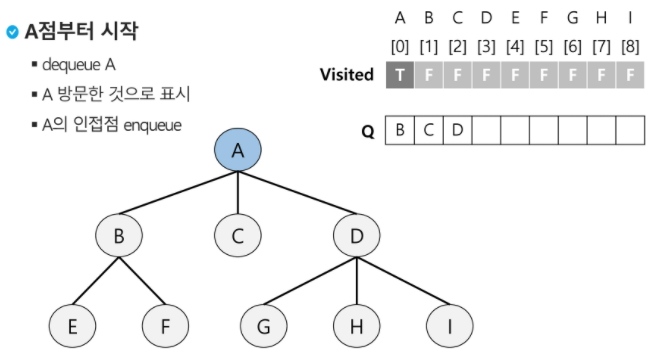

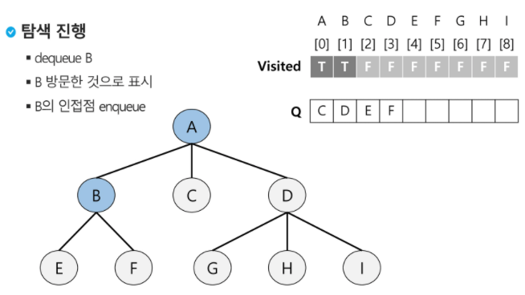

>  +dequeue C

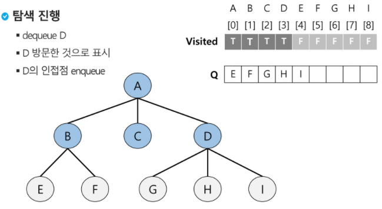

> +dequeue E, F, G, H, I

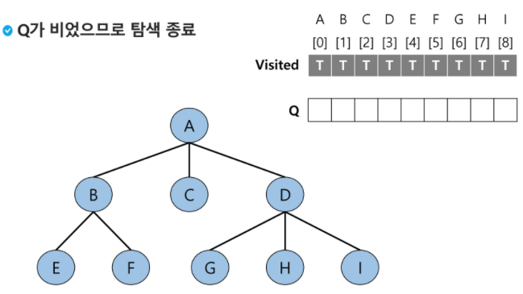

* 예제

   

   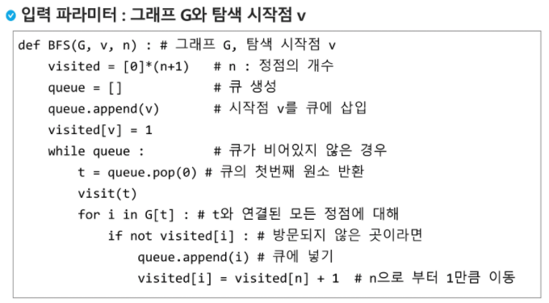

