# [8] 트리 (Tree)

> 비선형 구조
>
> 원소들 간에 1:n 관계를 가지는 자료구조
>
> 원소들 간에 계층관계를 가지는 계층형 자료구조
>
> 상위 원소에서 하위 원소로 내려가면서 확장되는 트리(나무)모양의 구조

* 정의 : 한 개 이상의 노드로 이루어진 유한집합. 
  * 최상위 노드 = 루트
  * 나머지 노드들은 n(>=0)개의 분리 집합 T1,...,TN으로 분리될 수 있다.

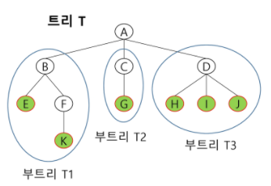

### 트리 - 용어 정리

* 노트 - 트리의 원소 (A,B,C,D,E,F,G,H,I,J,K,)
* 간선 - 노드를 연결하는 선 (부모-자식)
* 루트 노드 - 트리의 시작 노드 (A)
* 형제 노드(sibling node) - 같은 부노 노드의 자식 노드들 (B,C,D)
* 조상 노드 - 간선을 따라 루트 노드까지 이르는 경로에 있는 모든 노드들 (K-F,B,A)
* 서브 트리(subtree) - 부모 노드와 연결된 간선을 끊었을 때 생성되는 트리
* 자손 노드 - 서브 트리에 있는 하위 레벨의 노드들 (B-E,F,K)
* 차수(degree) 
  * 노드의 차수 : 노드에 연결된 자식 노드의 수 (B-2, C-1)
  * 트리의 차수 : 트리에 있는 노드의 차수 중에서 가장 큰 값 (T-3)
  * 단말 노드(리프 노드) : 차수가 0인 노드. 자식노드가 없는 노드
* 높이
  * 노드의 높이 : 루트에서 노드에 이르는 간선의 수. 노드의 레벨 (B-1, F-2)
  * 트리의 높이 : 트리에 있는 노드의 높이 중에서 가장 큰 값. 최대 레벨 (0,1,2,3)(T-3)

## 이진 트리

> 모든 노드들이 2개의 서브트리를 갖는 특별한 형태의 트리
>
> 각 노드가 자식 노드를 최대한 2개까지만 가질 수 있는 트리

* 특성
  * 레벨 i에서의 노드의 최대 개수는 2개
  * 높이가 h인 이진 트리가 가질 수 있는 노드의 최소 개수는 (h+1)개가 되며, 최대 개수는 (2^(h+1)-1)개가 된다.

### 이진트리 - 종류

* 포화 이진 트리(Full Binary Tree)
  * 모든 레벨에 노드가 포화상태로 차있음
  * 높이가 h일 때, 최대 노드 개수인 (2^(h+1)-1)개의 노드를 가진 이진트리
  * 루트를 1번으로 하여 2^(h+1)-1까지 정해진 위치에 대한 노드 번호를 가짐

* 완전 이진 트리(Complete Binary Tree)

  * 높이가 h이고 노드 수가 n개일 때 (단, h+1 <= n <= 2^(h+1)-1), 포화 이진 트리의 노드번호 1번부터 n번까지 빈 자리가 없는 이진 트리

  * 예) 노드가 10개인 완전 이진트리

    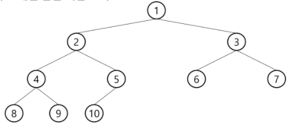

* 편향 이진 트리(SKewed Binary Tree)

  * 높이 h에 대한 최소 개수의 노드를 가지면서 한쪽 방향의 자식 노드만을 가진 이진트리

  * ​                         왼쪽 편향 이진트리                  |              오른쪽 편향 이진트리

    

### 이진트리 - 순회(traversal)

> 순회란 트리의 각 노드를 중복되지 않게 전부 방문하는 것을 말하는데 트리는 비선형 구조이기 떄문에 선형구조에서와 같이 선 후 연결관계를 알 수 없다.

* 순회 : 트리의 노드들을 체계적으로 방문하는 것

  

* 3가지 순회 방법

  * 전위순회(preorder traversal) : VLR
    * 부모노드 방문 후, 자식노드를 좌, 우 순서로 방문한다.
  * 중위순회(inorder traversal) : LVR
    * 왼쪽 자식노드, 부모노드, 오른쪽 자식노드 순으로 방문한다.
  * 후위순회(postorder traversal) : LRV
    * 자식노드를 좌우 순서로 방문한 후, 부모노드로 방문한다.

#### ■ 전위 순회(preorder traversal)

1. 현재 노드 n을 방문하여 처리한다 -> V
2. 현재 노드 n의 왼쪽 서브트리로 이동한다. -> L
3. 현재 노드 n의 오른쪽 서브트리로 이동한다. -> R

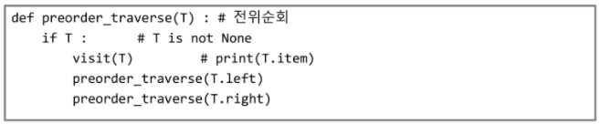

[예] 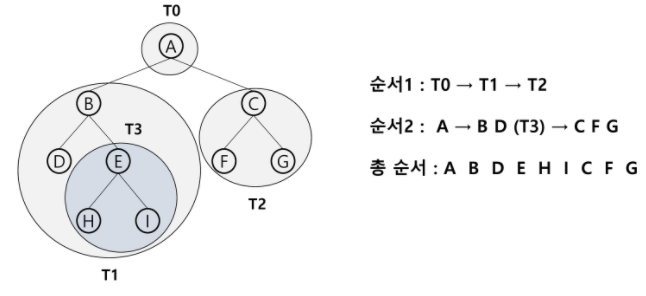

#### ■ 중위 순회(inorder traversal)

1. 현재 노드 n의 왼쪽 서브트리로 이동한다. -> L
2. 현재 노드 n을 방문하여 처리한다 -> V
3. 현재 노드 n의 오른쪽 서브트리로 이동한다. -> R

[예] 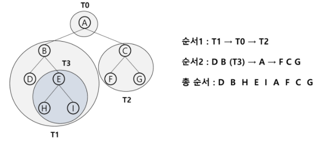

#### ■ 후위 순회(postorder traversal) 

1. 현재 노드 n의 왼쪽 서브트리로 이동한다. -> L
2. 현재 노드 n의 오른쪽 서브트리로 이동한다. -> R
3. 현재 노드 n을 방문하여 처리한다 -> V

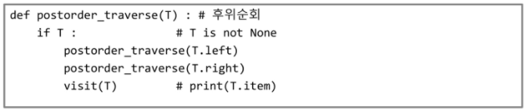

[예] 

### 이진트리의 표현 

#### ■ 배열

* 레벨 n에 있는 노드에 대하여 2^n ~ 2^(n+1)-1 까지 번호를 차례로 부여

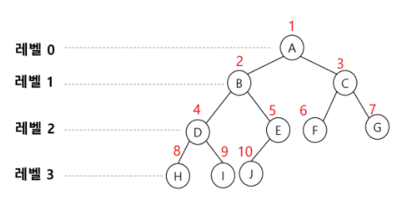

	

​	

* 단점
  * 편향 이진 트리의 경우에 사용하지 않는 배열 원소에 대한 메모리 공간 낭비 발생
  * 트리의 중간에 새로운 노드를 삽입하거나 기존의 노드를 삭제할 경우 배열의 크기 변경 어려워 비효율적

#### ■ 연결리스트

* 연결 자료구조를 이용한 이진트리의 표현

  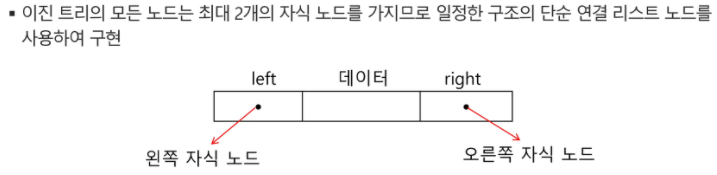

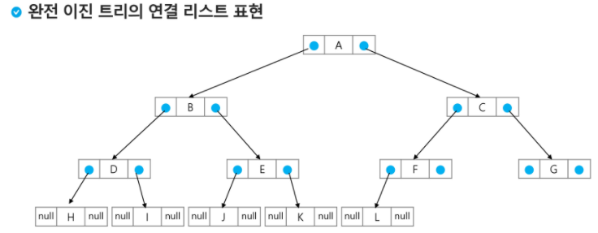

## 이진탐색 트리

> 탐색작업을 효율적으로 하기 위한 자료구조
>
> 모든 원소는 서로 다른 유일한 키를 갖는다.
>
> key(왼쪽 서브트리) < key(루트 노드) < key(오른쪽 서브트리)
>
> 왼쪽 서브트리와 오른쪽 서브트리도 이진 탐색 트리다.
>
> 중위 순회하면 오름차순으로 정렬된 값을 얻을 수 있다.

### 탐색 연산

* 루트에서 시작한다.
* 탐색할 키 값 x를 루트 노드의 키 값과 비교한다.
  * x = 루트노드의 키 값 : 원하는 원소 찾음, 탐색연산 성공 
  * x < 루트노드의 키 값 : 루트노드의 왼쪽 서브트리에 대해서 탐색연산 수행
  * x > 루트노드의 키 값 : 루트노드의 오른쪽 서브트리에 대해서 탐색연산 수행
* 서브트리에 대해서 순환적으로 탐색연산을 반복한다.

#### - 삽입 연산

1. 먼저 탐색 연산을 수행
   * 삽입할 원소와 같은 원소가 트리에 있으면 삽입할 수 없으므로, 같은 원소가 트리에 있는지 탐색하여 확인
   * 탐색해서 탐색 실패가 결정되는 위치가 삽입 위치가 된다.
2. 탐색 실패한 위치에 원소를 삽입한다.

### 성능

* 탐색, 삽입, 삭제 시간은 트리의 높이만큼 시간이 걸린다.
  * O(h), h : BST의 깊이
* 평균의 경우
  * 이진 트리가 균형적으로 생성되어 있는 경우
  * O(log n)
* 최악의 경우
  * 한쪽으로 치우친 경사 이진트리의 경우
  * O(n)
  * 순차탐색과 시간복잡도가 같다.

* 검색 알고리즘의 비교
  * 배열에서의 순차 검색 : O(N)
  * 정렬된 배열에서의 순차 검색 : O(N)
  * 정렬된 배열에서의 이진탐색 : O(logN)
    * 고정 배열 크기와 삽입, 삭제시 추가 연산 필요
  * 이진 탐색트리에서의 평균 : O(logN)
    * 최악의 경우 : O(N)
    * 완전 이진트리 또는 균형트리로 바꿀 수 있다면 최악의 경우를 없앨 수 있다.
      * 새로운 원소를 삽입할 때 삽입시간을 줄인다.
      * 평균과 최악의 시간이 같다. O(logN)
  * 해쉬 검색 : O(1)
    * 추가 저장 공간이 필요

## 힙 (heap)

* 완전 이진 트리에 있는 노드 중에서 키값이 가장 큰 노드나 키값이 가장 작은 노드를 찾기 위해서 만든 자료구조
* 최대 힙(max heap)
  * 키값이 가장 큰 노드를 찾기 위한 **완전 이진 트리**
  * (부모노드의 키값 > 자식노드의 키값)
  * 루트 노드 : 키값이 가장 큰 노드
* 최소 힙(min heap)
  * 키값이 가장 작은 노드를 찾기 위한 **완전 이진 트리**
  * (부모노드의 키값 < 자식노드의 키값)
  * 루트 노드 : 키값이 가장 작은 노드

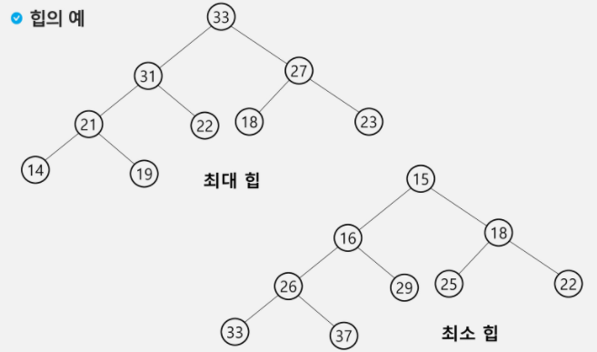

> 완전 이진트리여야 함 (왼쪽부터 순서대로)
>
> 키가 중복되면 안됨
>
> 최대, 최소 구분되야함

* #### 힙 연산 - 삽입

  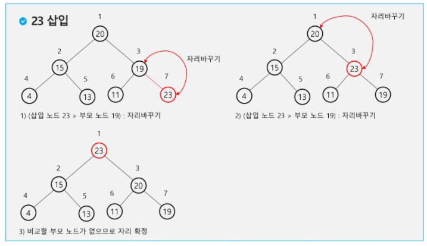

* #### 힙 연산 - 삭제

  * 힙에서는 루트 노드의 원소만을 삭제할 수 있다.
  * 루트 노드의 원소를 삭제하여 반환한다.
  * 힙의 종류에 따라 최대값 또는 최소값을 구할 수 있다.

  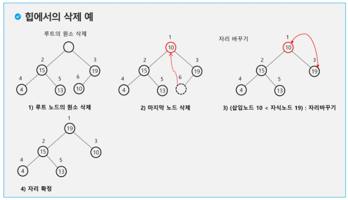

* 힙을 이용한 우선순위 큐

  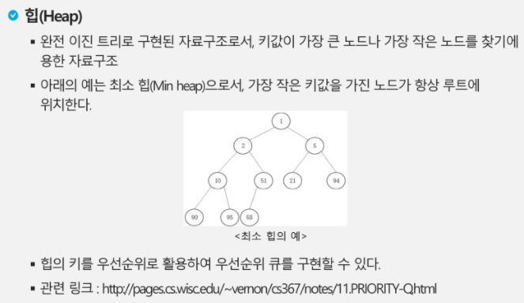

