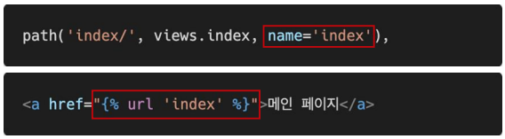
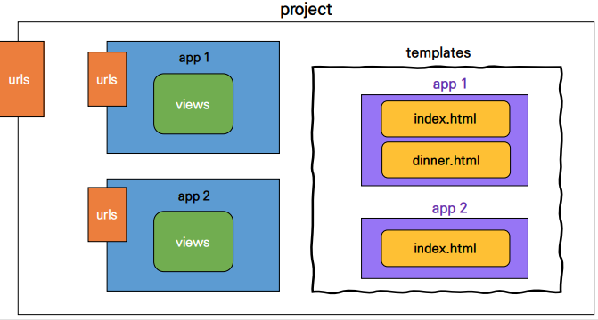

# Django 01 - The Web Framework

## Web Framework

* Static web page (정적 웹 페이지) 
  * 서버에 미리 저장된 파일이 사용자에게 그대로 전달되는 웹 페이지
  * 서버가 정적 웹 페이지에 대한 요청을 받은 경우 서버는 추가적인 처리 과정 없이 클라이언트에게 응답을 보냄
  * 모든 상황에서 모든 사용자에게 동일한 정보를 표시
  * 일반적으로 HTML, CSS, JavaScript 로 작성됨
  * flat page 라고도 함 (변화가 없다.)

* Dynamic web page (동적 웹 페이지)
  * 웹 페이지에 대한 요청을 받은 경우 서버는 추가적인 처리 과정 이후 클라이언트에게 응답을 보냄 (구글 )
  * 동적 페이지는 방문자와 상호작용하기 때문에 페이지 내용은 그때그때 다름
  * 서버 사이드 프로그래밍 언어(python, java, c++ 등)가 사용되며 파일을 처리하고 데이터베이스와의 상호작용이 이루어짐

* Framework
  * 프로그래밍에서 특정 운영 체제를 위한 응용 프로그램 표준 구조를 구현하는 클래스와 라이브러리 모임
  * 재사용할 수 있는 수많은 코드를 프레임워크로 통합함으로써 개발자가 새로운 애플리케이션을 위한 표준 코드를 다시 작성하지 않아도 같이 사용할 수 있도록 도움
  * Application Framework 라고도 함
* Web Framework
  * **웹 페이지를 개발하는 과정에서 겪는 어려움을 줄이는 것이 주 목적**으로 데이터베이스 연동, 템플릿 형태의 표준, 세션 관리, 코드 재사용 등의 기능을 포함
  * 동적인 웹 페이지나, 웹 애플리케이션, 웹 서비스 개발 보조용으로 만들어지는 Application Framework의 일종


* Django 를 사용해야 하는 이유
  * 검증된 Python 언어 기반 Web framework
  * 대규모 서비스에도 안정적이며 오랫동안 세계적인 기업들에 의해 사용됨
  * Spotify, Instragram, Dropbox, Delivery Hero

* Framework Architecture
  * MVC Design Pattern (model–view–controller)
  * 소프트웨어 공학에서 사용되는 디자인 패턴 중 하나
  * 사용자 인터페이스로부터 프로그램 로직을 분리하여 애플리케이션의 시각적 요소나 이면에서 실행되는 부분을 서로 영향 없이 쉽게 고칠 수 있는 애플리케이션을 만들 수 있음
  * Django는 MTV Pattern이라고 함

* MTV Pattern

  * Model - 응용프로그램의 데이터 구조를 정의하고 데이터베이스의 기록을 관리(추가, 수정, 삭제)

  * Template - 파일의 구조나 레이아웃을 정의, 실제 내용을 보여주는 데 사용(presentation)

  * View - HTTP 요청을 수신하고 HTTP 응답을 반환, Model을 통해 요청을 충족시키는데 필요한 데이터에 접근, template에게 응답의 서식 설정을 맡김

    > MVC Pattern (Model, View, Controller)


## Django Intro

* Project
  * Project(이하 프로젝트)는 Application(이하 앱)의 집합 (collection of apps)
  * 프로젝트에는 여러 앱이 포함될 수 있음
  * 앱은 여러 프로젝트에 있을 수 있음
  * 구조 : `python manage.py <command> [options]`

* Application
  * 앱은 실제 요청을 처리하고 페이지를 보여주고 하는 등의 역할을 담당
  * 하나의 프로젝트는 여러 앱을 가짐
  * 일반적으로 앱은 하나의 역할 및 기능 단위로 작성함
  * 생성 : `python manage.py startapp articles` (# settings.py)
    * 앱이름 : articles


* INSTALLD_APPS : Django installation에 활성화 된 모든 앱을 지정하는 문자열 목록

  * 프로젝트에서 앱을 사용하기 위해서는 반드시 INSTALLED_APPS 리스트에 추가해야 함
  * **반드시 앱 생성 후 등록!**

  

  

## 요청과 응답

* URLS `(# urls.py)`
  * HTTP 요청(request)을 알맞은 view로 전달
  * `from articles import views`
  * `urlpatterns = [(추가) path('index/', views.index)]`

* View` (# views.py)`

  * HTTP 요청을 수신하고 HTTP 응답을 반환하는 함수 작성 

  * Model을 통해 요청에 맞는 필요 데이터에 접근

  * Template에게 HTTP 응답 서식을 맡김

  * `def index(request):`

     `    return render(request, 'index.html')`

    * `'index.html'` : 템플릿

* Templates `(# articles/templates/index.html)`
  * 실제 내용을 보여주는데 사용되는 파일
  * 파일의 구조나 레이아웃을 정의 (ex. HTML)
  * Template 파일 경로의 기본 값은 app 폴더 안의 templates 폴더로 지정되어 있음

>  실행 - `$ python manage.py runserver`
>
> index 확인 사이트 주소 : http://127.0.0.1:8000/index/


* 추가 설정 `(# settings.py)`
  * LANGUAGE_CODE = 'ko-kr'
  * TIME_ZONE = 'Asia/Seoul'


## Template

* Django Template Language (DTL)
  * django template에서사용하는 built-in template system
  * 조건, 반복, 변수 치환, 필터 등의 기능을 제공
  * 단순히 Python이 HTML에 포함 된 것이 아니며, 프로그래밍적 로직이 아니라 프레젠테이션을 표현하기 위한 것
  * Python처럼 일부 프로그래밍 구조(if, for 등)를 사용할 수 있지만, 이것은 해당 Python 코드로 실행되는 것이 아님

### DTL Syntax

* 작성 순서

  * `urls.py` => `path('greeting/', views.greeting),`
  * `views.py` => `def greeting(request):`

  ​                               ` return render(request, 'greeting.html', {'name': 'Alice'})`

  * `templates/greeting.html` => `<p>안녕하세요 저는 {{ name }} 입니다.</p>`


1. Variable 	=	`{{ variable }}`

   * render()를 사용하여 views.py에서 정의한 변수를 template 파일로 넘겨 사용하는 것

   * 변수명은 영어, 숫자와 밑줄(_)의 조합으로 구성될 수 있으나 밑줄로는 시작 할 수 없음

   * 공백이나 구두점 문자 또한 사용할 수 없음

   * dot(.)를 사용하여 변수 속성에 접근할 수 있음

   *  render()의 세번째 인자로 {'key': value} 와 같이 딕셔너리 형태로 넘겨주며, 여기서 정의한 key에 해당하는 문자열이 template에서 사용 가능한 변수명이 됨 

     > context로 {'key': value} 정의
     
     
   
2. Filters 	=	`{{ variable|filter }}`

   * 표시할 변수를 수정할 때 사용 

     > `{{ name|lower }}` : name변수를 모두 소문자로 출력

   * 60개의 built-in template filters를 제공

   * chained가 가능하며 일부 필터는 인자를 받기도 함 

     > `{{ variable|truncatewords:30 }}` : 30자까지만 출력

   

3. Tags 	=	`{}`

   * 출력 텍스트를 만들거나, 반복 또는 논리를 수행하여 제어 흐름을 만드는 등 변수보다 복잡한 일들을 수행
   * 일부 태그는 시작과 종료 태그가 필요 ``
   * 약 24개의 built-in template tags를 제공

   

4. Comments 	=	`{# #}`

   * django template에서라인의 주석을 표현하기 위해 사용
   * 아래처럼 유효하지 않은 템플릿 코드가 포함될 수 있음
     * `{#  text  #}`
   * {# text #}
   * 한 줄 주석에만 사용할 수 있음 (줄 바꿈이 허용되지 않음)
   * 여러 줄 주석은 와  사이에 입력


### Template inheritance (템플릿 상속)

* 템플릿 상속은 기본적으로 코드의 재사용성에 초점을 맞춤
* 템플릿 상속을 사용하면 사이트의 모든 공통 요소를 포함하고, 하위 템플릿이 재정의(override) 할 수 있는 블록을 정의하는 기본 “skeleton” 템플릿을 만들 수 있음

##### "tags"  

* ``
  * 자식(하위)템플릿이 부모 템플릿을 확장한다는 것을 알림
  * 반드시 템플릿 최상단에 작성 되어야 함

* ``
  * 하위 템플릿에서 재지정(overriden)할 수 있는 블록을 정의
  * 즉, 하위 템플릿이 채울 수 있는 공간
  * block 입력 후 tab 누르면 `` 자동생성

[실습]

* 경로 설정  `(# settings.py) `
  * `'DIRS': [BASE_DIR / 'firstproject' / 'templates'],`

* `'firstproject' / 'templates' `에 `base.html` 만듬

* `index.html` 변경 

   ```html
    
    
      <h1>만나서 반가워요!</h1>
      <a href="/greeting/">greeting</a>
      <a href="/dinner/">dinner</a>
    
   ```
   
    


## HTML Form

* HTML “form” element
  * 웹에서 사용자 정보를 입력하는 여러 방식(text, button, checkbox, file, hidden, image, password, radio, reset, submit)을 제공하고, 사용자로부터 할당된 데이터를 서버로 전송하는 역할을 담당
  * 핵심 속성(attribute)
    * action : 입력 데이터가 전송될 URL 지정
    * method : 입력 데이터 전달 방식 지정

* HTML “input” element
  * 사용자로부터 데이터를 입력 받기 위해 사용 
  * type 속성에 따라 동작 방식이 달라짐
  * 핵심 속성(attribute) 
    * name 
    * 중복 가능, 양식을 제출했을 때 name이라는 이름에 설정된 값을 넘겨서 값을 가져올 수 있음 
    * 주요 용도는 GET/POST 방식으로 서버에 전달하는 파라미터(name은 key , value는 value)로 ?key=value&key=value 형태로 전달됨

* HTML “label” element
  * 사용자 인터페이스 항목에 대한 설명(caption)을 나타냄
  * label을 input 요소와 연결하기 
    * input에 id 속성 부여 
    * label에는 input의 id와 동일한 값의 for 속성이 필요
  * label과 input 요소 연결의 주요 이점
    * 시각적인 기능 뿐만 아니라 화면 리더기에서 label을 읽어서 사용자가 입력해야 하는 텍스트가 무엇인지 더 쉽게 이해할 수 있도록 돕는 프로그래밍적 이점도 있음
    * label을 클릭해서 input에 초점(focus)를 맞추거나 활성화(activate) 시킬 수 있음

* HTML “for” attribute
  * for 속성의 값과 일치하는 id를 가진 문서의 첫 번째 요소를 제어 
    * 연결 된 요소가 labelable elements인 경우 이 요소에 대한 labeled control이 됨
  * “labelable elements” 
    * label 요소와 연결할 수 있는 요소 
    * button, input(not hidden type), select, textarea …
* HTML “id” attribute
  * 전체 문서에서 고유(must unique)해야 하는 식별자를 정의
  * 사용 목적 - linking, scripting, styling 시 요소를 식별


* HTTP
  * HyperText Transfer Protocol 
  * 웹에서 이루어지는 모든 데이터 교환의 기초 
  * 주어진 리소스가 수행 할 원하는 작업을 나타내는 request methods를 정의
  * HTTP request method 종류 - GET, POST, PUT, DELETE …

* HTTP request method – “GET”
  * 서버로부터 정보를 조회하는 데 사용
  * 데이터를 가져올 때만 사용해야 함 
  * 데이터를 서버로 전송할 때 body가 아닌 Query String Parameters를 통해 전송
  * 우리는 서버에 요청을 하면 HTML 문서 파일 한 장을 받는데, 이때 사용하는 요청의 방식이 GET

> `<input type="text" id="message" name="message">` name값이 넘어감 -> request
>
> `def catch(request):`
>
>    ` message = request.GET.get('message')`


## URL

* Django URLs
  * Dispatcher(발송자, 운항 관리자)로서의 URL
  * 웹 애플리케이션은 URL을 통한 클라이언트의 요청에서부터 시작 됨

* Variable Routing
  * URL 주소를 변수로 사용하는 것
  * URL의 일부를 변수로 지정하여 view 함수의 인자로 넘길 수 있음
  * 즉, 변수 값에 따라 하나의 path()에 여러 페이지를 연결 시킬 수 있음
  * 예시 : `path(‘/accounts/user/<int:user_pk>/’, …) `
    * accounts/user/1 → (1번 user 관련 페이지) 
    * accounts/user/2 → (2번 user 관련 페이지)

* URL Path converters

  * str : `path(‘hello/<str:name>/’, views.hello) `
    * `/` 를 제외하고 비어 있지 않은 모든 문자열과 매치 
    * 작성하지 않을 경우 기본 값

  * int : 0 또는 양의 정수와 매치
  * slug : ASCII 문자 또는 숫자, 하이픈 및 밑줄 문자로 구성된 모든 슬러그 문자열과 매치
    * ex) ‘building-your-1st-django-site’


* App URL mapping
  * app의 view 함수가 많아지면서 사용하는 path() 또한 많아지고, app 또한 더 많이 작성되기 때문에 프로젝트의 urls.py에서 모두 관리하는 것은 프로젝트 유지보수에 좋지 않음

  * 이제는 각 app에 urls.py를 작성하게 됨

    > 앱 생성 후 안에 urls.py 생성 -> 각 앱의 urls.py 파일로 URL 매핑을 위탁
    >
    > urlpattern은 언제든지 다른 URLconf 모듈을 포함(include)할 수 있음
    >
    > - `path('articles/', include('articles.urls')),`


* Naming URL patterns

  * 이제는 링크에 url을 직접 작성하는 것이 아니라 path() 함수의 name 인자를 정의해서 사용

  * Django Template Tag 중 하나인 url 태그를 사용해서 path() 함수에 작성한 name을 사용할 수 있음

  * url 설정에 정의된 특정한 경로들의 의존성을 제거할 수 있음

    

* url template tag   ``

  * 주어진 URL 패턴 이름 및 선택적 매개 변수와 일치하는 절대 경로 주소를 반환
  * 템플릿에 URL을 하드 코딩하지 않고도 DRY 원칙을 위반하지 않으면서 링크를 출력하는 방법
  * `path('index/', views.index, name='index'),`    `(#urls.py)`

  * `<a href="">메인페이지</a>`     `(#index.html)`
    * "/index/" 대신 사용
  * `<a>, <form action:>` 등에서 사용


## Namespace

> 이름공간 또는 네임스페이스(Namespace)는객체를 구분할 수 있는 범위를 나타내는 말로 일반적으로 하나의 이름 공간에서는 하나의 이름이 단 하나의 객체만을 가리키게 된다. [위키백과]
>
> 프로그래밍을 하다 보면 모든 변수명과 함수명 등 이들 모두를 겹치지 않게 정의 하는 것은 매우 어려운 일 
>
> 그래서 django에서는 
>
> 1. 서로 다른 app의 같은 이름을 가진 url name은 이름공간을 설정해서 구분
> 2. templates, static 등 django는 정해진 경로 하나로 모아서 보기 때문에 중간에 폴더를 임의로 만들어 줌으로써 이름공간을 설정


> pages/views, index.html 생성

* 2가지 문제 발생
  * articles 앱의 index 페이지에서 두번째 앱 pages의 index로 이동하는 하이퍼 링크를 클릭 시 현재 페이지로 이동됨
    * URL namespace
  * pages 앱 index url로 이동해도 articles 앱의 index 페이지가 출력됨
    * Template namespace

* URL namespace
  * URL namespace를 사용하면 서로 다른 앱에서 동일한 URL 이름을 사용하는 경우에도 이름이 지정된 URL을 고유하게 사용 할 수 있음
  * urls.py에 **“ app_name”** attribute 값 작성
  * `app_name = 'articles'`     `(#articles/url.py)`


* Template namespace

  * Django는 기본적으로 app_name/templates/ 경로에 있는 templates 파일들만 찾을 수 있으며, INSTALLED_APPS에 작성한 app 순서로 tamplate을 검색 후 렌더링 함

  * 그래서 임의로 templates의 폴더 구조를 app_name/templates/app_name 형태로 변경해 임의로 이름 공간을 생성 후 변경된 추가 경로로 수정

    

> templates 아래 articles/pages 폴더 만들어 html파일 옮김





