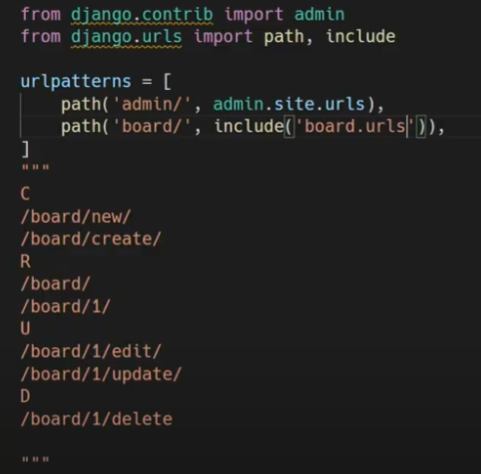

### 가상환경 만들기

* mkdir my_app
* cd my_app/
* python -m venv venv
* 활성화 : source venv/Scripts/activate

* pip install django django_extensions
* touch README.md .gitignore
* code .

> (rm -rf my_app/ manage.py -> 처음으로)
>
> pip freeze > requirements.txt


* gitignore
  * https://www.toptal.com/developers/gitignore
    개발할때 쓰는거 다 입력
  * windows venv Python Django
    gitignore안에 붙여넣기


### 장고 프로젝트 시작

* $ django-admin stratproject my_app .
* $ python manage.py runserver

* $ python manage.py startapp board 

  * settings.py > INSTALLED_APPS에 `'board', 'django_extensions',` 추가


* #### models.py

  

  + `def __str__(self): return self.title` 추가 

* $ python manage.py makemigrations 

* $ python manage.py migrate

* -> 모델이 바뀔 때 마다 해줌


* #### admin.py

  * `admin.site.register(Question)`

* $ python manage.py createsuperuser


* #### url

* my_app/urls.py

  

* board/urls.py

  `from . import views`
  
  


* #### views.py

* ```python
  from django.shortcuts import render, redirect
  from .models import Question
  
  ## Read
  def index(request): 		# 전체 질문 목록 조회 
      questions = Question.objects.all()
      context = {
          'questions': questions,
      }
  	return render(request, 'board/index.html', context)
  
  def detail(request, question_pk):	# 단일 질문 상세 조회
      question = Question.objects.get(pk=question_pk)
      context = {
          'question': question,
      }
  	return render(request, 'board/detail.html', context)
  
  
  ## Create
  def new(request):		# 사용자가 데이터를 제출할 빈 html 제공
      return render(request, 'board/new.html', context)
  
  def create(request):		# 사용자가 데이터를 제출한 데이터를 새로운 question에 저장
      # request.POST['title']		# 딕셔너리 : 에러o
      # request.POST.get('title')	# 에러x > None
      question = Question()
      question.title = request.POST.get('title')
      question.category = request.POST.get('category')
      question.content = request.POST.get('content')
      question.save()
      return redirect('board:detail', question.pk)	#새로고침, 작성한 글로 돌려버림
  
  
  ## Update
  def edit(request, question_pk):		# 데이터를 제출할 기준 내용이 있는 html 제공
      question = Question.objects.get(pk=question_pk)
      context = {
          'question': question,
      }
  	return render(request, 'board/edit.html', context)
  
  def update(request, question_pk):	# 사용자가 제출한 데이터를 '기존 question'에 저장
      question = Question.objects.get(pk=question_pk)
      question.title = request.POST.get('title')
      question.category = request.POST.get('category')
      question.content = request.POST.get('content')
      question.save()
      return redirect('board:detail', question.pk)
  
  
  ## Delete - 기존 question을 삭제
  def delete(request, question_pk):
      question = Question.objects.get(pk=question_pk)
      if request.method == "POST":
      	question.delete()
          return redirect('board:index')
      else:
          return redirect('board:detail', question_pk)
  
  ```
  


* git - templates 만들기
  ```
  $ cd board/
  $ mkdir -p templates/board
  $ cd templates/board
  
  $ touch new.html edit.html detail.html index.html
  ```


* #### base.html

  ```
  $ mkdir templates
  $ touch templates/base.html
  ```

  ```django
  <body>
    <nav>
      <ul>
        <li><a href="" >Home</a></li>
        <li><a href="" >New</a></li>
      </ul>
    </nav>
    <div class='container'>
      
    </div>  
  </body>
  ```

  

* settings.py > TEMPLATES = {  }
  * 'DIRS': [BASE_DIR / 'templates'],
  * 'DIRS': [BASE_DIR , 'templates'],
  * 'DIRS': ['templates'],
    * 모두 가능


* #### index.html

  ```django
  
  
    <h1>index</h1>
    <ul>
      
      <li>
        <a href=''>{{ question.title }}</a>
      </li>
      
    </ul>
  
  
  ```
  
  > href='' => NoReverseMatch 오류 => url 잘못씀.
  
  

* #### detail.html

  ```django
  
  
  <h1>{{ question.title }}</h1>
  <p>{{ question.created_at }}</p>
  <p>{{ question.updated_at }}</p>
  <h2>{{ question.category }}</h2>
  <p>
      {{ question.content }}
  </p>
  
  <hr>
  # 수정
  <div>
    <a href="">
      <button>수정</button>
    </a>
  </div>
  
  # 삭제
  <form action="" method="POST">
    
    <button>삭제</button>
  </form>
  
  
  ```

  

  

  

* #### new.html

  ```django
  
  
  <h1>New question</h1>
  <form action="" method="POST">
    
    <div>
      <label for='title'>제목: </label>
      <input id='title' type'text' name='title'> 
    </div>
    <div>
      <label for='category'>카테고리: </label>
      <input id='category' type'text' name='category'> 
    </div>
    <div>
      <label for='content'>내용: </label>
      <textarea name='content' id='content' cols="30" rows="10"></textarea> 
    </div>
    <div>
      <button>얍!</button>
    </div>
  </form>
  
  ```

  

* #### edit.html
  ```django
  
  
  <h1>Edit question</h1>
  <form action="" method="POST">
    
    <div>
      <label for='title'>제목: </label>
      <input id='title' type'text' name='title' value='{{ question.title }}'> 
    </div>
    <div>
      <label for='category'>카테고리: </label>
      <input id='category' type'text' name='category' value='{{ question.category }}'> 
    </div>
    <div>
      <label for='content'>내용: </label>
      <textarea name='content' id='content' cols="30" rows="10">{{ question.content }}</textarea>  	# enter하면 inline요소라 이상해짐
    </div>
    <div>
      <button>얍!</button>
    </div>
  </form>
  
  ```


* script.py =>get일때 삭제

```
$ touch script.py
```

```python
import request
for i in range(1, 10):
    request.post(f'http://127.0.0.a:8000/board/{i}/delete/')
```


