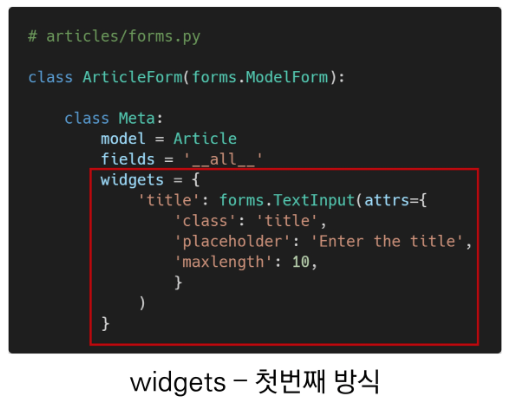
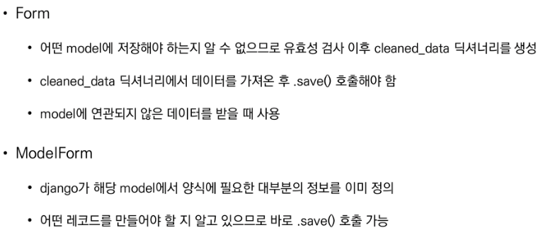
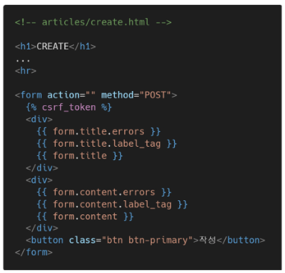
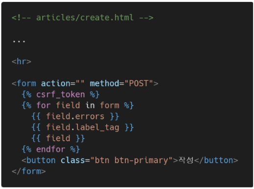

# Django 03 - Django Form

## 1. Form Class

> #### Django's Forms
>
> Form - 프로젝트 주요 유효성 검사 도구들 중 하나, 공격 및 우연한 데이터 손상에 대한 중요한 방어수단
>
> Django가 처리하는 부분 - 1.렌더링을 위한 데이터 준비 및 재구성, 2. 데이터에 대한 HTML forms 생성, 3. 클라이언트로부터 받은 데이터 수신 및 처리

### The Django 'Form Class'

* Django Form 관리 시스템의 핵심
* form 내 field, field 배치, 디스플레이  widget, label, 초기값, 유효하지 않는 field에 관련된 에러 메세지를 결정
* Django는 사용자의 데이터를 받을 때 해야할 과중한 작업(데이터 유효성 검증, 필요시 입력된 데이터 검증 결과 재출력, 유효한 데이터에 대해 요구되는 동작 수행 등)과 반복코드를 줄여줌


* Form 선언하기

  * Model 선언과 유사, 같은 필드타입을 사용

  * ```python
    from django import forms
    
    class ArticleForm(forms.Form):
        title = forms.CharField(max_length=10)
        content = forms.CharField() #TextField없음
    ```

* Form 사용하기

  ```python
  # articles/views.py
  def new(request):
      form = ArticleForm()
      context = {
          'form': form
      }
      return render(request, 'articles/new.html', context)
  ```

  ```django
  # new.html
  
  
  
    <h1>NEW</h1>
    <form action="" method="POST">
      
      {{ form.as_p }}
      <input type="submit">
    </form>
    <hr>
    <a href="">[back]</a>
  
  ```

  

* Form rendering options - `<label> & <input>` 쌍에 대한 3가지 출력 옵션

1. as_p() - 각 필드가 단락(p태그)으로 감싸져서 렌더링 됨
2. as_ul() -  각 필드가 목록 항목(li태그)으로 감싸져서 렌더링 됨 / ul태그는 직접 작성해야 함
3. as_table() - 각 필드가 테이블(tr태그)행으로 감싸져서 렌더링 됨 / table태그는 직접 작성해야 함


#### Django의 HTML input 요소 표현 방법 2가지

1. Form fields : input에 대한 유효성 검사 로직을 처리하여 템플릿에서 직접 사용 됨

2. Widgets : 웹페이지의 HTML input요소 렌더링, GET/POST 딕셔너리에서 데이터 추출

   * 하지만 widgets는 반드시 form fields에 할당 됨

   * Form Fields와 혼동되어서는 안됨

   * Form Fields는 input 유효성 검사를 처리

   * Widgets은 웹페이지에서 input element의 단순 raw한 렌더링 처리

     ```python
     # forms.py
     from django import forms
     
     class ArticleForm(forms.Form):
         REGION_A = 'sl'
         REGION_B = 'dj'
         REGION_C = 'gj'
         REGION_D = 'gm'
         REGION_E = 'bs'
         REGION_CHOICES = [
             (REGION_A, '서울'),
             (REGION_B, '대전'),
             (REGION_C, '광주'),
             (REGION_D, '구미'),
             (REGION_E, '부산'),
         ]
         title = forms.CharField(max_length=10)
         content = forms.CharField(widget=forms.Textarea)
         region = forms.ChoiceField(choices=REGION_CHOICES, widget=forms.Select())
     ```

> https://docs.djangoproject.com/en/3.2/ref/forms/widgets/


## 2. ModelForm

* ModelForm Class

  * Model을 통해 Form Class를 만들 수 있는 Helper
  * 일반 Form Class와 완전히 같은 방식(객체 생성)으로 view에서 사용 가능

  

* ### ModelForm 선언하기

  ```python
  # forms.py
  class ArticleForm(forms.ModelForm):
      class Meta:
          model = Article
          fields = '__all__'
          # fields = ('title', 'content',)
          # exclude = ('title',)	# 생략 가능
  ```

  * forms 라이브러리에서 파생된 ModelForm 클래스를 상속받음
  * 정의한 클래스 안에 Meta 클래스를 선언하고, 어떤 모델을 기반으로 form을 작성할 것인지에 대한 정보를 Meta클래스에 지정

* Meta class 
  * Model의 정보를 작성하는 곳
  * ModelForm을 사용할 경우 사용할 모델이 있어야 하는데 Meta class가 이를 구성함
  * [참고] Inner class(Nested class) : 클래스 내에 선언된 다른 클래스, 가독성 및 프로그램 유지관리를 지원
  * [참고] Meta 데이터 : 데이터에 대한 데이터


* ###  CREATE view 수정

  ```python
  def create(request):
      # title = request.POST.get('title')
      form = ArticleForm(request.POST)
      if form.is_valid():
          article = form.save()
          return redirect('articles:detail', article.pk)
      return redirect('articles:new')
  ```

* is_valid() method
  * 유효성 검사를 실행하고, 데이터가 유효한지 여부를  boolean으로 반환
  * 데이터 유효성 검사를 보장하기 위한 많은 테스트에 대해 django는 is_valid() 제공

> [참고] 유효성 검사 : 요청한 데이터가 특정 조건에 충족하는지 확인. 데이터베이스 각 필드 조건에 올바르지않는 데이터가 서버로 전공되거나, 저장되지 않도록 하는 것 

* The save() method

  * form에 바인딩 된 데이터에서 데이터베이스 객체를 만들고 저장
  * ModelForm의 하위클래스는 기존 모델 인스턴스를 키워드 인자 instance로 받아 들일 수 있음
    * 이것이 제공되면 save()는 해당 인스턴스를 업데이트 (UPDATE)
    * 제공되지 않은 경구 save()는 지정된 모델의 새 인스턴스를 만듦 (CREATE)
  * form의 유효성이 확인되지 않은 경우 save()를 호출하면 form.errors를 확인하여 에러 확인 가능

  

```python
# views.py (new -> create)
def create(request):
    if request.method == 'POST':
        form = ArticleForm(request.POST)
        if form.is_valid():
            article = form.save()
            return redirect('articles:detail', article.pk)
    else:
        form = ArticleForm()
    context = {
        'form': form,
    }
    return render(request, 'articles/create.html', context)
```

> new view 함수, url path 삭제
>
> 이제는 action 값이 없어도 동작

* ### Widgets 적용하기

  *  
  * 두번째 방식 - 권장

  ```python
  # forms.py
  class ArticleForm(forms.ModelForm):
      title = forms.CharField(
          label='제목',
          widget=forms.TextInput(
              attrs={
                  'class': 'my-title',
                  'placeholder': 'Enter the title',
                  'maxlength': 10
              }
          )
      )
      content = forms.CharField(
          label='내용',
          widget=forms.TextInput(
              attrs={
                  'class': 'my-content',
                  'placeholder': 'Enter the content',
                  'rows': 5,
                  'cols': 50,
              }
          )
      )
      class Meta:
          model = Article
          fields = '__all__'
  ```


* ### UPDATE views 수정

  ```python
  # views.py (edit -> update)
  def update(request, pk):
      article = Article.objects.get(pk=pk)
      # update
      if request.method == 'POST':
          form = ArticleForm(request.POST, instance=article)	
          if form.is_valid():
              form.save()
              return redirect('articles:detail', article.pk)
      # edit
      else:
          form = ArticleForm(instance=article)
      context = {
          'form': form,
          'article': article,
      }
      return redirect('articles:detail', article.pk)
  ```

  > edit view 함수, url path 삭제
  >
  > instance=article 사용 안하면 수정이 아니라 create함


### Form & ModelForm




## 3. Rendering fields manually

### 수동으로 Form 작성하기

1. Rendering fields manually

   

2. Looping over the form's fields ()

   


### Bootstrap과 함께 사용하기


## 4. Handling HTTP requests

> Django에서 HTTP 요청을 처리하는 방법
>
> 1. Django shortcut functions
> 2. View decorators

### 1) Django shortcut functions

* django.shortcuts 패키지는 개발에 도움 될 수 있는 여러 함수와 클래스를 제공
* 종류
  * render()
  * redirect()
  * get_object_or_404()
  * get_list_or_404()

* get_object_or_404()

  ```python
  def detail(request, pk):
      # article = Article.objects.get(pk=pk)
      article = get_object_or_404(Article, pk=pk)
  
  def delete(request,pk)
  def update(request, pk)
  ```

  * 모델 manager objects에서 get()을 호출하지만, 해당 객체가 없을 경우 DoesNotExist 예외 대신 Http 404를 raise
  * get() 메서드에 경우 조건에 맞는 데이터가 없을 경우에 에러를 발생시킴 
    * 코드 실행 단계에서 발생한 에러에 대해서 브라우저는 http status code 500으로 인식함
  * 상황에 따라 적절한 예외처리를 하고 클라이언트에게 올바른 에러를 전달하는 것 또한 개발의 중요한 요소 중 하나


### 2) View decorators

* Django는 다양한 HTTP 기능을 지원하기 위해 뷰에 적용할 수 있는 여러 데코레이터를 제공

> [참고] Decorator (데코레이터)
>
> - 어떤 함수에 기능을 추가하고 싶을 때, 해당 함수를 수정하지 않고 기능을 연장해주는 함수


- Allowed HTTP methods

  - 요청 메서드에 따라 view함수에 대한 액세스를 제한
  - 요청이 조건을 충족시키지 못하면 HttpResponseNotAllowed을 return (405 Method Not Allowed)
  - require_http_methods()
    - view 함수가 특정한 method 요청에 대해서만 허용하도록 하는 데코레이터
  - require_POST()
    - view 함수가 POST method 요청만 승인하도록 하는 데코레이터 (#delete에서 사용)
  - require_safe()

  ```python
  from django.views.decorators.http import require_http_methods, require_POST
  @require_http_methods(['GET', 'POST'])
  def create(request):
  	pass
  @require_http_methods(['GET', 'POST'])
  def update(request, pk):
      pass
  
  @require_POST
  def delete(request, pk):
      pass
  
  from django.views.decorators.http import require_safe
  @require_safe	# 조회만 함
  def index(request):
  	pass
  @require_safe
  def detail(request, pk):
      pass
  ```

  

