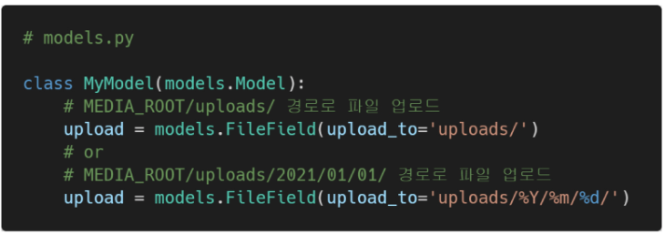
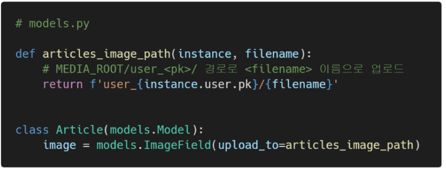
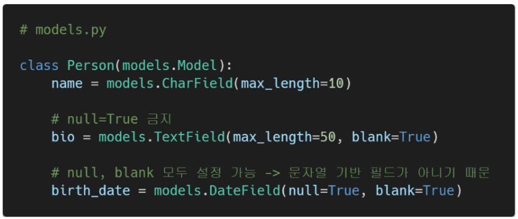
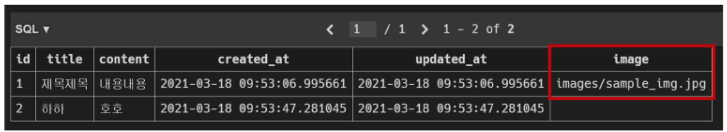

# Django 04 - Managing Static Files

## 1. Static files (정적 파일)

> 응답할 때 별도의 처이 없이 파일 내용을 그대로 보여주면 되는 파일 (즉, 요청한 것을 그대로 보여주는 파일)
>
> 이미지, 자바 스크립트 혹은 CSS와 같은 미리 준비된 추가파일(움직이지 않는) 제공

* 구성

  * django.contrib.staticfiles가 INSTALLED_APPS에 포함되어 있는지

  * settings.py에서 STATIC_URL을 정의

  * 템플릿에서 static 템플릿 태그를 사용하여 지정된 상대경로에 대한 URL을 빌드

    ```django
    
    
    ```

  * 앱의 static 폴더에 정적 파일을 저장

    * my_app/static/my_app/example.jpg


### Django template tag

* load 

  * 사용자 정의 템플릿 태그 세트를 로드
  * 로드하는 라이브러리, 패키지에 등록된 모든 태그와 필터를 로드

* static

  * STATIC_ROOT에 저장된 정적 파일에 연결

    ```django
    
    
    ```

    

### The staticfiles app

* STATIC_ROOT

  * collectstatic이 배포를 위해 정적 파일을 수집하는 디렉토리의 절대 경로

  * django 프로젝트에서 사용하는 모든 정적파일을 한곳에 모아 넣는 경로

  * 개발 과정에서 setting.py의 DEBUG 값이 True로 설정되어 있으면 해당 값은 작용되지 않음

    * 직접 작성하지 않으면 setting.py에 작성되어있지 않음

  * 실 서비스 환경(배포 환경)에서 django의 모든 정적 파일을 다른 웹 서버가 직접 제공하기 위함

    ```
    # 정적 파일 수집  # settings.py
    STATIC_ROOT = BASE_DIR / 'staticfiles'
    ```

    ```
    $ python manage.py collectstatic
    ```


* #### STATIC_URL

  * STATIC_ROOT에 있는 **정적 파일을 참조 할 때 사용할 URL**

    * [참고] 개발 단계에서는 실제 정적 파일들이 저장되어 있는 각 앱의 static/ 폴더 및 STATICFILES_DIR에 정의된 추가 경로들을 탐색함

  * 실제 파일이나 디렉토리가 아니며, **URL로만 존재**

  * 비어있지 않은 값으로 설정한다면 **반드시 slash(/)로 끝나야 함**

    ```python
    # settings.py
    STATIC_URL = '/static/'
    ```

    이미지 경로 : articles / static / articles / img2.png

    ```django
    # detail.html
    
    ...
     ...
    ```

    

* #### STATICFILES_DIRS

  * App내 static 디렉토리 경로를 사용하는 것(기본 경로) 외에 **추가적인 정적 파일 경로 목록을 정의하는 리스트**

    ```python
    # settings.py
    STATICFILES_DIRS = [
    	BASE_DIR / 'static',
    ]
    ```

    이미지 경로 : static / images / img3.png

    ```django
    # base.html
    
    ...
     ...
    ```


## 2. 이미지 업로드 (기본 설정)

* Media file
  * 미디어 파일 
  * 사용자가 웹에서 업로드하는 정적 파일 (user-uploaded)
  * 유저가 업로드 한 모든 정적 파일

* Model field
  * ImageField
    * 이미지 업로드에 사용하는 모델 필드

    * FileField를 상속받는 서브 클래스이기 때문에 FileField의 모든 속성 및 메서드를 사용 가능하며 더해서 사용자에 의해 업로드 된 객체가 유효한 이미지인지 검사함

    * ImageField 인스턴스는 최대 길이가 100자인 문자열로 DB에 생성되며, `max_length` 인자를 사용하여 최대 길이를 변경할 수 있음

    * [주의] 사용하려면 반드시 Pillow 라이브러리가 필요

      ```
      $ pip install Pillow
      ```

      

### Model field

* FileField
  * 파일 업로드에 사용하는 모델 필드
  * 2개의 선택 인자 - 1) upload_to   _2)storage_

* `upload_to` argument

  > 업로드 디렉토리와 파일 이름을 설정하는 2가지 방법 제공

  1. 문자열 값이나 경로 지정 

  * 파이썬의 strftime() 형식이 포함될 수 있으며, 이는 파일 업로드 날짜/시간으로 대체 됨

  * `image = models.ImageField(upload_to='%Y/%m/%d', blank=True)`

  * `media/2021/09/08` 파일에 업로드 이미지 저장

    

  

  2. 함수 호출 (반드시 2개의 인자 사용)

  * instance - FileField가 정의된 모델의 인스턴스, 대부분 아직 저장되지 않았으므로 PK값 없을 수 있음
  
  * filename - 기존 파일에 제공된 파일 이름
  
  ```python
  def articles_image_path(instance, filename):
      return f'user_{instance.user.pk}/{filename}'
  
  image = models.ImageField(upload_to=articles_image_path, blank=True)
  ```
  
  * 처음 업로드할 때 : `media/user_None/` 파일에 업로드 이미지 저장 => 처음엔 pk가 없으므로
  * 수정할 때 : `media/user_9/`에 저장 => pk 값이 9
  
  


### Media files

* ImageField (or FileField)를 사용하기 위한 몇가지 단계

  

  

* #### MEDIA_ROOT

  * 사용자가 업로드 한 파일(미디어 파일)들을 보관할 디렉토리의 절대 경로

  * 성능을 위해 업로드 파일 데이터베이스에 저장하지 않음, **파일의 경로 저장**

  * [주의] MEDIA_ROOT는 STATIC_ROOT와 반드시 다른 경로로 지정

    ```python
    # settings.py
    MEDIA_ROOT = BASE_DIR / 'media'
    ```

* #### MEDIA_URL

  * MEDIA_ROOT에서 제공되는 미디어를 처리하는 URL
  * 업로드 된 파일의 주소를 만들어주는 역할
    * 웹 서버 사용자가 사용하는 public URL
  * 비어있지 않은 값으로 설정한다면 반드시 /로 끝나야 함
  * [주의] MEDIA_URL은 STATIC_URL과 반드시 다른 경로로 지정

    ```python
    # settings.py
    MEDIA_URL = '/media/'
    ```

  

* 개발 단계에서 사용자가 업로드 한 파일 제공하기

  ```python
  # crud/urls.py
  from django.contrib import admin
  from django.urls import path, include
  from django.conf import settings
  from django.conf.urls.static import static
  
  urlpatterns = [
      path('admin/', admin.site.urls),
      path('articles/', include('articles.urls')),
  ] + static(settings.MEDIA_URL, document_root=settings.MEDIA_ROOT)
  ```

  > 사용자가 업로드 한 파일이 우리 프로젝트에 업로드 되지만, 실제로 사용자에게 제공하기 위해서는 업로드 된 파일의 URL이 필요함


* STATIC_URL과 MEDIA_URL
  * static, media 결국 모두 서버에 요청해서 조회하는 것
  * 서버에 요청하기 위한 url을 urls.py가 아닌 settings에 먼저 작성 후 urlpatterns에 추가하는 방식


## 3. 이미지 업로드 (CREATE)

### ImageField 작성

* `upload_to='images'` : 실제 이미지가 저장되는 경로를 지정
* `blank=True` : 이미지 필드에 빈 값이 허용되도록 설정 (이미지 선택적으로 업로드 할 수 있도록)

```python
# articles/models.py
class Article(models.Model):
    ...
    image = models.ImageField(blank=True, upload_to='images/')
```

* Model field option

  * "blank"

    * 기본 값 : False
    * True인 경우 필드를 비워둘 수 있음 (DB에는 ''(빈 문자열)이 저장됨)
    * 유효성 검사에서 사용 됨(is_valid)
      * 필드에 blank=True가 있으면 form 유효성 검사에서 빈 값을 입력할 수 있음

  * "null"

    * 기본 값 : False
    * True면 django는 빈 값을 DB에 NULL로 저장
    * 주의사항 - 문자열 기반 필드에는 사용하는 것을 피해야 함 (CharField, TextField)
      * 문자열 기반 필드에 True로 설정 시 '데이터 없음'에 "빈 문자열(1)"과 "NULL(2)"의 2가지 가능한 값이 있음을 의미하게 됨
      * 대부분의 경우 "데이터 없음"에 대해 두개의 가능한 값을 갖는 것은 중복되며, Django는 NULL이 아닌 빈 문자열을 사용하는 것이 규칙

  * blank & null 비교

    * blank : Validation-related

    * null : Database-related

    * 문자열 기반 및 비문자열 기반 필드 모두에 대해 null option은 DB에만 영향을 미치므로, form에서 빈 값을 허용하려면 **blank=True**를 설정해야 함

      

* 마이그레이션 실행 - ImageField를 사용하기 위해서는 Pillow 라이브러리 설치 필요

  ```
  $ python manage.py makemigrations
  
  $ pip install Pillow
  $ python manage.py makemigrations
  $ python manage.py migrate
  
  $ pip freeze > requirements.txt
  ```


### form enctype 

```django
# create.html
<form action="" method="POST" enctype="multipart/form-data">
  
  {{ form.as_p }}
  <input type="submit" value="작성" accept="image/*">
</form>
```

* form 요소 - enctype(인코딩) 속성
  * multipart/form-data
    * 파일 업로드 시에 반드시 사용해야 함 (전송되는 데이터의 형식을 가짐)
    * `<input type='file'>`을 사용할 경우에 사용

* input 요소 - accept 속성

  * 입력 허용할 파일 유형을 나타내는 문자열

  * 쉼표로 구분된 "고유 파일 지정자"

  * 파일 검증을 하는 것은 아님 (이미지만 accept해도 비디오나 오디오파일 제출 가능)

  * 고유 파일 유형 지정자

    * `<input type='file'>`에서 선택할 수 있는 파일의 종류를 설명하는 문자열
    * 파일 업로드 시 허용할 파일 형식에 대해 자동으로 필터링
    * `image/*` : "모든 이미지 파일"을 의미
      * `audio/*` , `video/* `도 있음
      * `accept="image/*,.pdf"` => 표준 이미지 형식 + PDF 파일도 받을 수 있음

    
  
  > https://developer.mozilla.org/ko/docs/Web/HTML/Element/Input/file


### Views.py 수정

* 업로드 한 파일은 request.FILES 객체로 전달됨

  

* 실제 파일 위치 : MEDIA_ROOT/images/  `(media/images/sample.png)`

* DB에 저장되는 것은 **파일의 경로**

  

> 이미지 이름이 같은것을 또 올리면 이름 뒤에 난수값을 붙여줌 
>
> => 파일이 달라짐. 이름을 덮어씌우지 않고 다른 파일로 생성


## 4. 이미지 업로드 (READ)

* 이미지 경로 불러오기

  * `article.image.url` == 업로드 파일의 경로
  * `article.image` == 업로드 파일의 파일 이름

  ```django
  # detail.html
  
  ```


## 5. 이미지 업로드 (UPDATE)

* 이미지 수정하기
  * 이미지는 바이너리 데이터(하나의 덩어리)이기 때문에 텍스트처럼 일부만 수정하는 것을 불가능
  * 때문에 새로운 사진으로 덮어 씌우는 방식을 사용
  
  ```django
  # articles/update.html
  <form action="" method="POST" enctype="multipart/form-data">
  ```
  
  ```python
  # views.py
  @require_http_methods(['GET', 'POST'])
  def update(request, pk):
      article = get_object_or_404(Article, pk=pk)
      if request.method == 'POST':
          form = ArticleForm(request.POST, request.FILES, instance=article)
          if form.is_valid():
              form.save()
              return redirect('articles:detail', article.pk)
      else:
          form = ArticleForm(instance=article)
      context = {
          'article': article,
          'form': form,
      }
      return render(request, 'articles/update.html', context)
  ```
  
  > `form = ArticleForm(request.POST, request.FILES, instance=article)`
  >
  > BaseForm 클래스 인자 순서 : data='request.POST', files='request.FILES', instance=article'
  
  ```django
  # detail.html
  
    
  
  ```
  
  > detail 페이지를 출력하지 못하는 문제 해결 : image가 없는 게시글의 경우 출력할 이미지 없기 때문


## 6. 이미지 Resizing

* 이미지 크기 변경하기
  * 실제 원본 이미지를 서버에 그대로 업로드 하는 것은 서버의 부담이 큰 작업
  * img태그에서 직접 사이즈를 조정할 수도 있지만 (width, height), 업로드 될 때 이미지 자체를 resizing 하는 것을 사용해 볼 것
  * django-imagekit 라이브러리 활용

  > https://github.com/matthewwithanm/django-imagekit
  
* 1. django-imagekit 설치

     ```
     $ pip install django-imagekit
     $ pip freeze > requirements.txt
     ```

  2. INSTALLED_APPS에 추가

     ```python
     # settings.py
     INSTALLED_APPS = [
         'articles',
         'imagekit',
         ...
     ]
     ```

* ### 원본 이미지를 재가공하여 저장 (원본x, 썸네일o)

  ```python
  # models.py
  from django.db import models
  from imagekit.models import ProcessedImageField
  from imagekit.processors import Thumbnail
  
  # Create your models here.
  class Article(models.Model):
      title = models.CharField(max_length=10)
      content = models.TextField()
      image = ProcessedImageField(
          blank=True,
          processors=[Thumbnail(200,300)],
          format='JPEG',
          options={'quality': 90},
      )
      created_at = models.DateTimeField(auto_now_add=True)
      updated_at = models.DateTimeField(auto_now=True)
      def __str__(self):
          return self.title
  ```
  
  ```
    $ pip manage.py makemigrations
    $ pip manage.py migrate
  ```

> ProcessedImageField()의 parameter로 작성된 값들은 변경이 되더라도 다시 makemigrations를 해줄 필요 없이 즉시 반영됨


* ### 원본을 유지하는 방식, 썸네일 따로 저장

  ```python
  # models.py
  from django.db import models
  from imagekit.models import ProcessedImageField
  from imagekit.processors import ResizeToFill
  class Article(models.Model):
    title = models.CharField(max_length=10)
    content = models.TextField()
    image = models.ImageField(upload_to='origins', blank=True)
      image_thumbnail = ProcessedImageField(
          blank=True,
          processors=[ResizeToFill(100,50)],
          format='JPEG',
          options={'quality': 90},
      )
    created_at = models.DateTimeField(auto_now_add=True)
      updated_at = models.DateTimeField(auto_now=True)
      def __str__(self):
          return self.title
  ```

  ```django
  # detail.html
  
  ```

> 원본은 따로 저장, 조회 할 때만 썸네일 생성
>
> 조회 시 `media/CACHE/images...` 에 썸네일 파일 생성됨

