# DB 02 - Model Relationship Ⅰ

## Foreign Key 외래키

> 키를 사용하여 부모 테이블의 유일한 값을 참조(참조 무결성)
>
> 외래키의 값이 반드시 부모 테이블의 기본키 일 필요는 없지만 유일한 값이어야 함

* ForeignKey field

     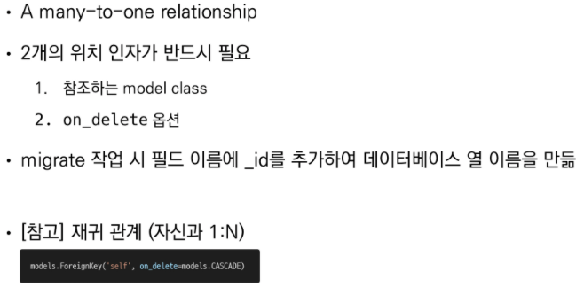

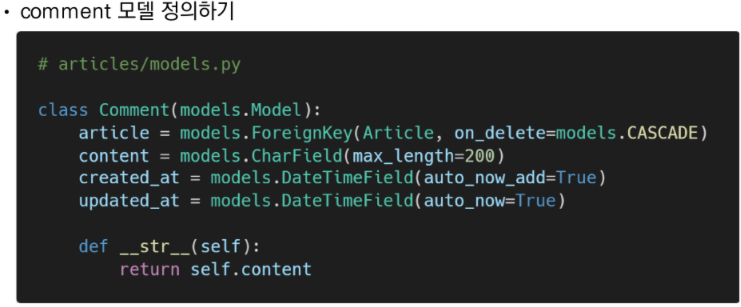

* ForeignKey arguments - 'on_delete'

    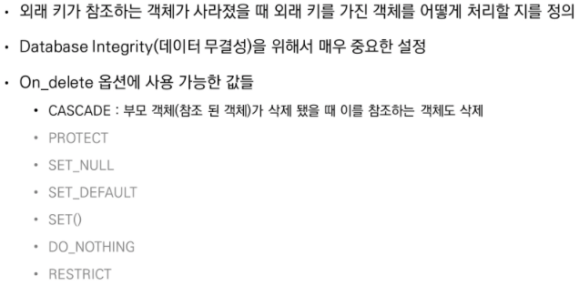

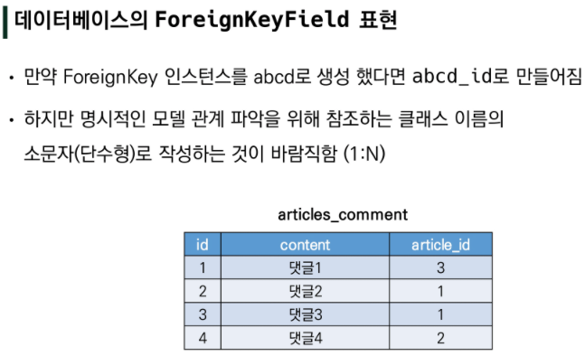

* 댓글 생성 연습하기 - `$ python manage.py shell_plus`

  ```shell
  comment = Comment()
  comment.content = 'first comment'
  comment.save()
  ```

  * 에러 확인 : `IntegrityError: NOT NULL constraint failed: articles_comment.article_id`
  * 게시글 생성 후 댓글 생성 재시도

  ```shell
  article = Article.objects.create(title='title',content='content')
  comment.article = article		# 객체를 할당
  comment.save()
  ```

  ``` shell
  comment = Comment(content='second comment', article=article)
  comment.save()
  ```


 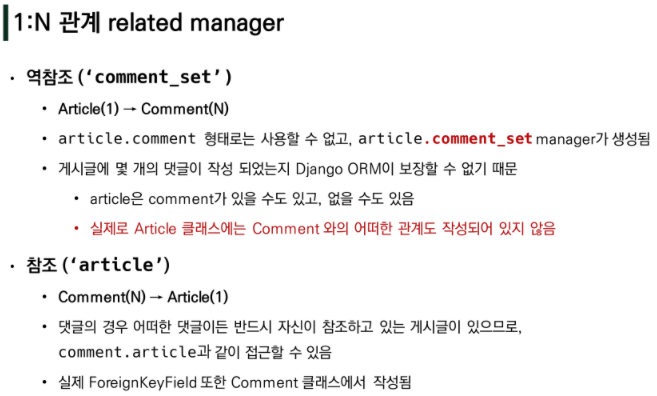

```shell
article.comment_set.all()

for comment in comments:
	print(comment.content)
	
comment = Comment.objects.get(pk=1)
comment.article.content
comment.article_id
```


 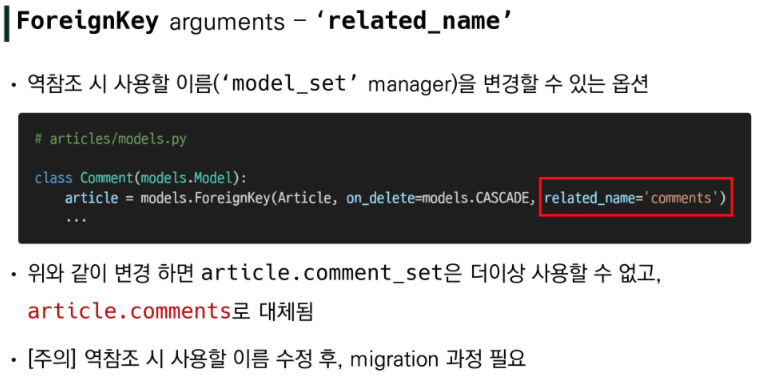


### 1. Comment CREATE

* CommentForm 작성  (forms.py)

    ```python
    class CommentForm(forms.ModelForm):

        class Meta:
            model = Comment
            fields = '__all__'
    ```

* detail에서 출력

    ```python
    @require_safe
    def detail(request, pk):
        article = get_object_or_404(Article, pk=pk)
        comment_form = CommentForm()
        context = {
            'article': article,
            'comment_form': comment_form,
        }
        return render(request, 'articles/detail.html', context)
    ```

    ``` django
      <form action="" method="POST">
        
        {{ comment_form }}
        <input type="submit">
      </form>
    ```

* article 제외 (forms.py) -> 댓글의 내용만 받음

    ```python
    class CommentForm(forms.ModelForm):
    
        class Meta:
            model = Comment
            exclude = ('article',)
    ```


* 댓글 작성 로직

  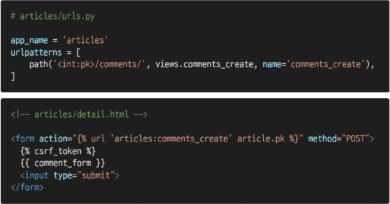

  ```python
  # views.py
  @require_POST
  def comments_create(request, pk):
      article = get_object_or_404(Article, pk=pk)
      comments_form = CommentForm(request.POST)
      if comments_form.is_valid():
          comment = comments_form.save(commit=False)
          comment.article = article
          comment.save()
      return redirect('articles:detail', article.pk)
  ```

* The 'save()' method - `save(commit=False)`

  * 아직 데이터베이스에 저장되지 않은 인스턴스를 반환

  * 저장하기 전에 객체에 대한 사용자 지정 처리를 수행할 때 유용하게 사용

    

### 2. Comment READ

* 댓글 출력

  ```python
  @require_safe
  def detail(request, pk):
      article = get_object_or_404(Article, pk=pk)
      comment_form = CommentForm()
      comments = article.comment_set.all()
      context = {
          'article': article,
          'comment_form': comment_form,
          'comments': comments,
      }
      return render(request, 'articles/detail.html', context)
  ```

  ``` html
  <hr>
  <h4>댓글 목록</h4>
  <ul>
      
      	<li>{{ comment.content }}</li>
      
  </ul>
  <hr>
  ```

  

### 3. Comment DELETE

``` python
# urls.py
	path('<int:article_pk>/comments/<int:comment_pk>/delete/', 
			views.comments_delete, name='comments_delete')
    
# views.py
@require_POST
def comments_delete(request, article_pk, comment_pk):
    comment = get_object_or_404(CommentForm, pk=comment_pk)
    comment.delete()
    return redirect('articles:detail', article_pk)
```

```html
<h4>댓글 목록</h4>
  <ul>
    
      <li>
        {{ comment.content }}
        <form action=""
              method = "POST" class='d-inline'>
          
          <input type="submit" value='DELETE'>      
        </form>      
      </li>
    
  </ul>
  <hr>
```


* 인증된 사용자의 경우만 댓글 작성 및 삭제

  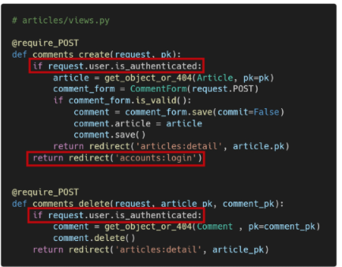


### 4. Comment 추가사항

* 댓글 개수 출력하기

  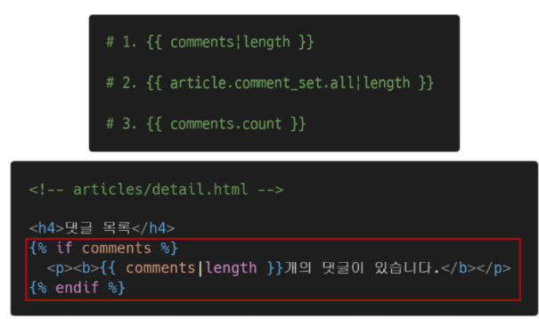

* 댓글이 없는 경우 대체 컨텐츠 출력 (DTL의 for-empty 태그 활용)

  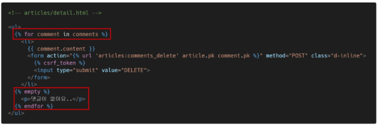


## Customizing authentication in Django

### 1. Substituting a custom User model

* User 모델 대체하기

   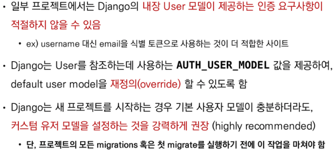

 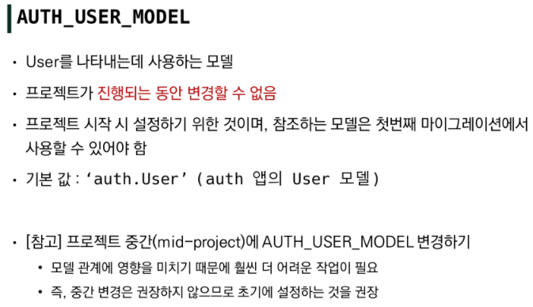

* Custom User 모델 정의하기

  * 관리자 권한과 함께 완전한 기능을 갖춘 User 모델을 구현하는 기본 클래스인 AbstractUser를 상속받아 새로운 User 모델 작성

      ```python
      # accounts/models.py
      from django.contrib.auth.models import AbstractUser

      class User(AbstractUser):
          pass
      ```

  * 기존에 django가 사용하는 User모델이었던 auth앱의 User모델을 accounts앱의  User모델을 사용하도록 변경

    ```python
    # settings.py
    AUTH_USER_MODEL = 'accounts.User'
    ```

  * admin site에 Custom User 모델 등록
  
      ```python
      from django.contrib import admin
      from django.contrib.auth.admin import UserAdmin
      from .models import User
      
      admin.site.register(User, UserAdmin)
      ```
  
  * 마이그레이션 진행
    * 초기화 방법 : db.sqlite3 파일 삭제, migrations 파일 모두 삭제


### 2. Custom user & Built-in auth forms

* 회원가입 시도 후 에러 발생 
  * UserCreationForm과 UserChangeForm은 기존 내장 User모델을 사용한 ModelForm이기 때문에 커스텀 User 모델로 대체해야 함


* Custom Built-in Auth Forms - form을 확장

  ```python
  # accounts/forms.py
  from django.contrib.auth.forms import UserChangeForm, UserCreationForm
  class CustomUserChangeForm(UserCreationForm):
  
      class Meta:
          model = get_user_model()
          fields = UserCreationForm.Meta.fields + ('email',)
  ```

* 수정 후 회원가입 재시도

  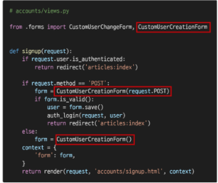

 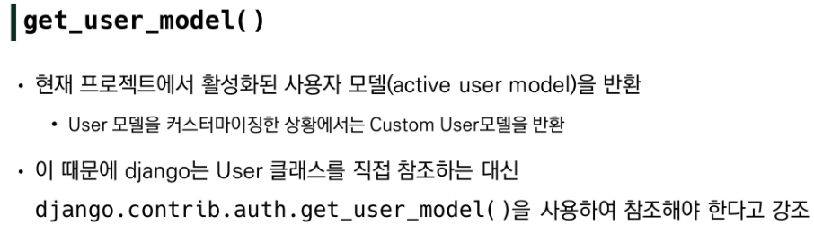


# Model Relationship Ⅱ

## 1:N 관계 설정

### 1. User - Article (1:N)

 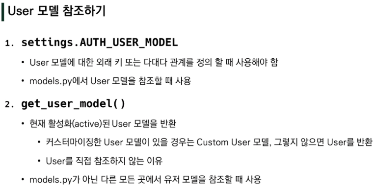

* User와 Article간 모델 관계 정의 후 migration

    ```python
    # models.py
    from django.conf import settings

    class Article(models.Model):
        user = models.ForeignKey(settings.AUTH_USER_MODEL, on_delete=models.CASCADE)
    ```

* 게시글 출력 필드 수정

  ```python
  class ArticleForm(forms.ModelForm):
  
      class Meta:
          model = Article
          fields = ('title', 'content',)
  ```

  * 게시글 작성 시 작성자 정보(article.user)가 누락 -> error -> 작성자 정보 추가 후 게시글 작성 재시도
  
  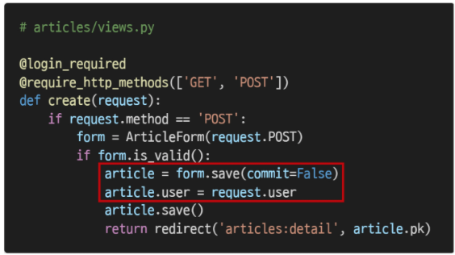


* #### DELETE 

  * 자신이 작성한 게시글만 삭제 가능하도록 설정

  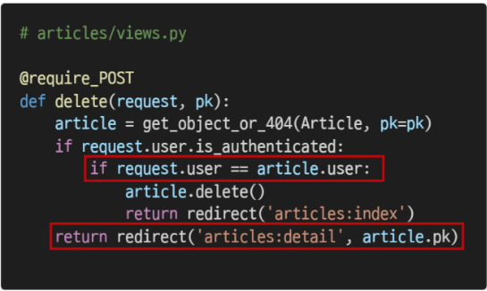

  ```python
  @require_POST
  def delete(request, pk):
      article = get_object_or_404(Article, pk=pk)
      if request.user.is_authenticated:
          if request.user == article.user:    
              article.delete()
              return redirect('articles:index')
      return redirect('articles:detail', article.pk)
  ```

  

* #### UPDATE

  * 자신이 작성한 글만 수정 가능하도록 설정

  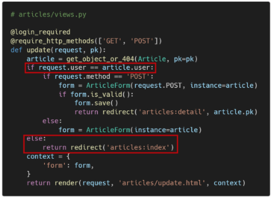


* #### READ

  * 게시글 작성 user가 누구인지 index.html에서 출력하기

  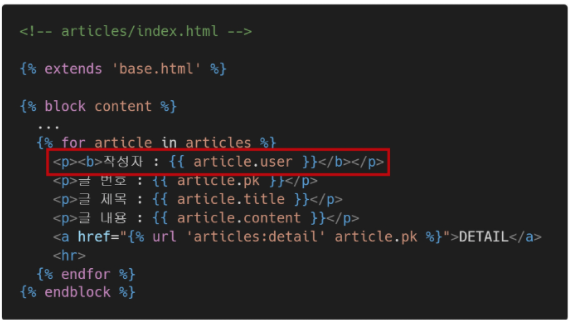

  * 작성자가 아니라면, 수정/삭제 버튼을 출력하지 않도록 처리

    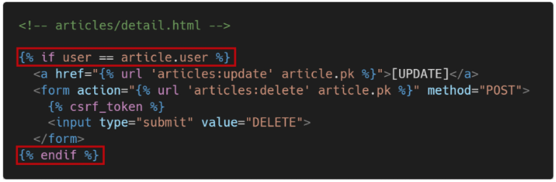


### 2. User - Comment (1:N)

* User와 Comment간 모델 관계 정의 후 migration

  ```python
  # models.py
  class Comment(models.Model):
      user = models.ForeignKey(settings.AUTH_USER_MODEL, on_delete=models.CASCADE)
  ```

* 댓글 출력 필드 수정

  ```python
  # forms.py
  class CommentForm(forms.ModelForm):
  
      class Meta:
          model = Comment
          exclude = ('article','user',)
  ```


* #### CREATE

  * 댓글 작성 시 작성자 정보(request.user) 추가 후 댓글 작성 재시도

    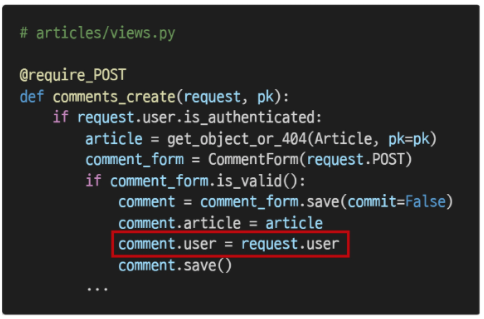

* #### READ

  * 비로그인 유저에게는 댓글 form 숨기기

    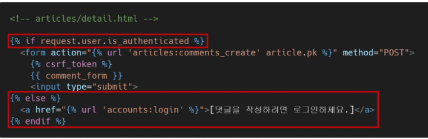

  * 댓글 작성자 출력하기

    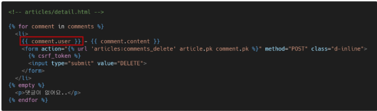


* #### DELETE

  * 자신이 작성한 댓글만 삭제 버튼을 볼 수 있도록, 삭제 할 수 있도록 수정

    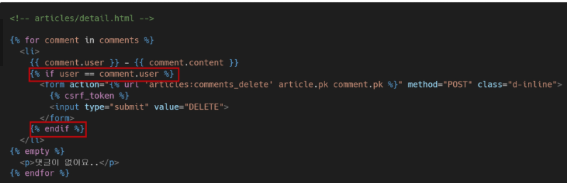

  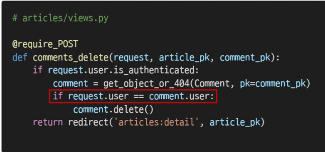
