# DB 03 - Model Relationship Ⅱ

## Infro : 병원 진료 기록 시스템

### 1. 1 : N의 한계

* 새로운 예약 생성 불가. 새로운 객체를 생성해야 함

* 여러 의사에게 진료받은 기록을 환자 한명에 저장할 수 없음 - 외래키에 '1,2' 형식의 데이터 사용할수 없음

  

### 2. 중개모델

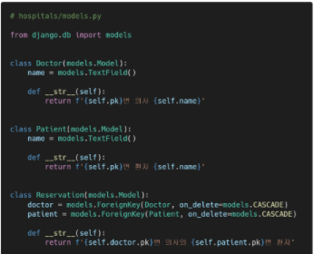

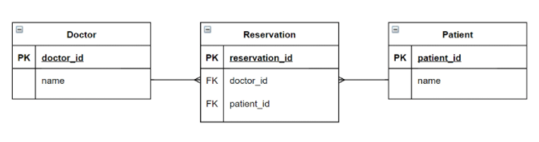


### 3. ManyToManyField

* 다대다 관계 설정 시 사용하는 모델 필드
* 하나의 필수 위치인자(M:N 관계로 설정할 모델 클래스)가 필요

* 모델 작성

  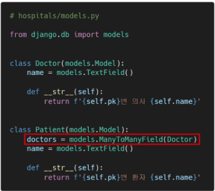

* 중개 테이블 : hospitals_patient_doctors -> 컬럼=id, patient_id, doctor_id

* 예약 생성 (역참조 patient_set ) :

  ```
  patient1.doctors.add(doctor1)
  doctor1.patient_set.all() 		# doctor1에게 예약된 환자 목록 확인
  ```

  ```
  doctor1.patient_set.add(patient2)	# doctor1이 patient2를 예약
  ```

* 예약 삭제 (역참조) :

  ```
  doctor1.patient_set.remove(patient1)	# doctor1이 patient1 진료 예약 취소
  patient2.doctors.remove(doctor1)		# patient2가 doctor1 진료 예약 취소
  ```

  > 역참조시 : Patient에서는 doctors사용, Doctor에서는 patient_set 사용


### 4. related_name

* target model(관계필드x 모델)이 souce model(관계필드o 모델)을 참조할때 사용할 manager의 이름

* 즉, 역참조 시에 사용하는 manager의 이름을 설정

  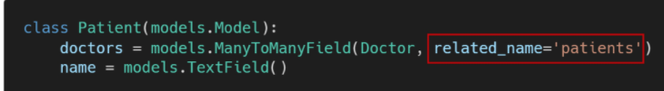

* related_name 설정 후 기존의 _set manager는 더 이상 사용할 수 없음


## ManyToManyField

* Arguments
  * related_name - 역참조 시 사용할 manager의 이름
  * through 
    * 중개 테이블을 직접 작성-> through 옵션을 사용하여 중개 테이블을 나타내는 Django 모델을 지정할 수 있음
    * 일반적으로 중개 테이블에 추가 데이터를 사용하는 다대다 관계와 연결하려는 경우
  * symmetrical
    * ManyToManyField가 동일한 모델을 가리키는 정의에서만 사용
    * symmetrical=True(기본값)일 경우 django는 person_set  매니저를 추가하지 않음
    * source 모델의 인스턴스가 target 모델의 인스턴스를 참조하면,  target 모델 인스턴스도  source 모델 인스턴스를 자동으로 참조하도록 함 (즉, 내가 당신의 친구라면 당신도 내 친구)


* Related Manager
  * 1:N 또는 M:N 관련 컨텍스트에서 사용되는 매니저
  * 같은 이름의 메서드여도 각 관계에 따라 다르게 사용 및 동작
    * 1:N 에서는 target 모델 인스턴스만 사용 가능
    * M:N 관계에서는 관련된 두 객체에서 모두 사용 가능
  * 종류 : add(), remove(), create(), clear(), set() 등
  * add() : `doctor1.patient_set.add(patient1)`
  * remove() : `doctor1.patient_set.remove(patient1)`


* through

  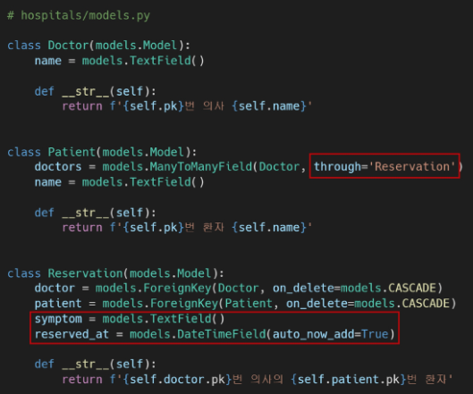

  * 예약 생성 - through_defaults를 사용, add(), create() 또는 set()을 사용

    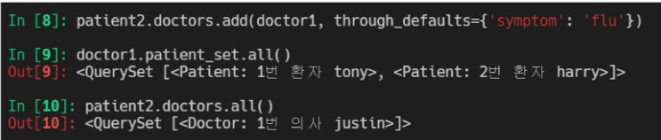


* #### 데이터베이스에서의 표현

  * django는 다대다 관계를 나타내는 중개테이블을 만듦
  * 테이블 이름은 다대다 필드의 이름과 이를 포함하는 모델의 테이블 이름을 조합하여 생성됨

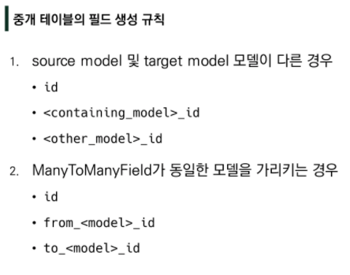


### 1. LIKE

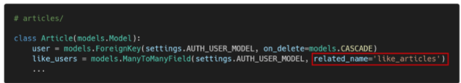

* 생성된 중개 테이블

  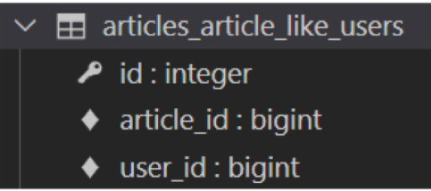

* 현재 User - Article간 사용 가능한 DB API

   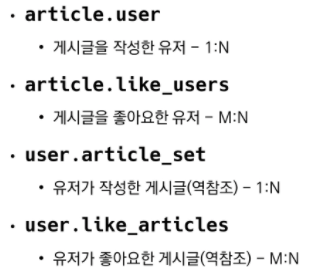

  > 참조 : Article -> User
  >
  > 역참조 : User -> Article

```python
# ursl.py
path('<int:article_pk>/likes/', views.likes, name='likes'),

# views.py
@require_POST
def likes(request, article_pk):
    article = get_object_or_404(Article, pk=article_pk)
    if article.user.is_authenticated:
        # 현재 좋아요를 요청하는 회원(request.user)이
        # 해당 게시글의 좋아요를 누른 회원 목록에 이미 있다면,
        if article.like_users.filter(pk=request.user.pk).exists():
            article.like_users.remove(request.user) # 좋아요 취소
        else:   # 없다면 좋아요 하기
            article.like_users.add(request.user)
        return redirect('articles:index')
    return redirect('articles:login')

```


* QuerySet API - `exists()`
  * QuerySet에 결과가 포함되어 있으면 True를 반환하고 그렇지 않으면 False를 반환
  * 특히 규모가 큰 QuerySet의 컨텍스트에서 특정 개체 존재 여부와 관련된 검색에 유용
  * 고유한 필드가 있는 모델이 QuerySet의 구성원인지 여부를 찾는 가장 효율적인 방법

```django
# index.html
	<div>
      <form action="" method="POST">
        
        
          <input type="submit" value='좋아요 취소'>
        
          <input type="submit" value='좋아요'>
        
      </form>
    </div>
```


### 2. Profile Page

```python
# accounts/urls.py
path('<username>/', views.profile, name='profile'),

# accounts/views.py
def profile(request, username):
    person = get_object_or_404(get_user_model(), username=username)
    context = {
        'person': person,
    }
    return render(request, 'accounts/profile.html', context)
```

```html
# accounts/profile.html



  <h1>{{ person.username }}님의 프로필</h1>
  <hr>

  <h2>{{ person.username }}'s 게시글</h2>
  
    <div>{{ article.title }}</div>
  
  
  <h2>{{ person.username }}'s 댓글</h2>
  
    <div>{{ comment.content }}</div>
  

  <h2>{{ person.username }}'s 좋아요한 게시글</h2>
  
    <div>{{ article.title }}</div>
  

  <hr>
  <a href="">[back]</a>

```

```html
# base.html
<a href="">내 프로필</a>

# articles/index.html
<p>작성자 : <a href="">{{ article.user }}</a></p>
```


### 3. Follow

```python
# accounts/models.py
class User(AbstractUser):
    followings = models.ManyToManyField('self', symmetrical=False, related_name='followers')
```

* 생성된 중개 테이블

  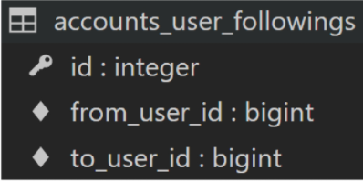

```python
# accounts/urls.py
path('<int:user_pk>/follow/', views.follow, name='follow'),

# accounts/views.py
@require_POST
def follow(request, user_pk):
    if request.user.is_authenticated:
        person = get_object_or_404(get_user_model(), pk=user_pk)
        if person != request.user:
            if person.followers.filter(pk=request.user.pk).exists():
                person.followers.remove(request.user)
            else:
                person.followers.add(request.user)
        return redirect('accounts:profile', person.username)
    return redirect('accounts:login')
```

```html
# profile.html
<div>
  <div>
    팔로잉: {{ person.followings.all|length }} / 팔로워: {{ person.followers.all|length }}
  </div>
  
    <div>
      <form action="" method="POST">
        
        
          <input type="submit" value="Unfollow">
        
          <input type="submit" value="Follow">
        
      </form>
    </div>
  
</div>
```

> 팔로잉 수 / 팔로워 수 출력
>
> 자기 자신을 팔로우 할 수 없음

