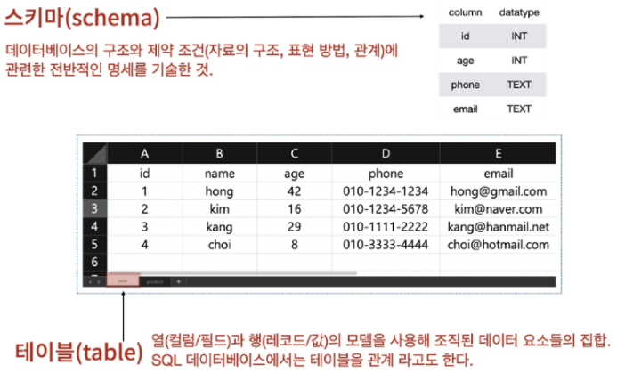
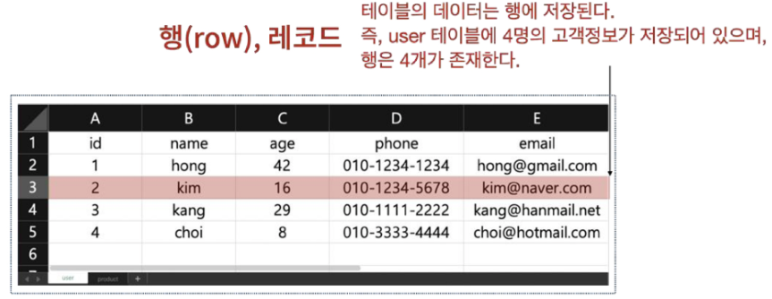
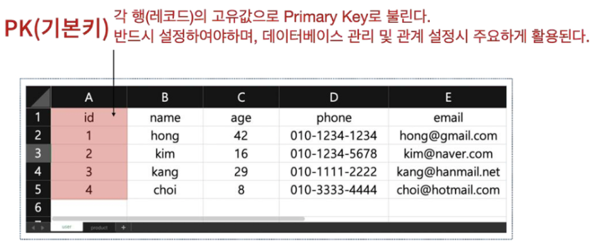
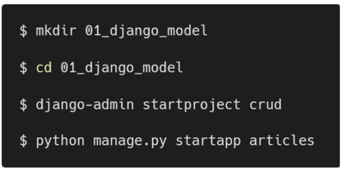
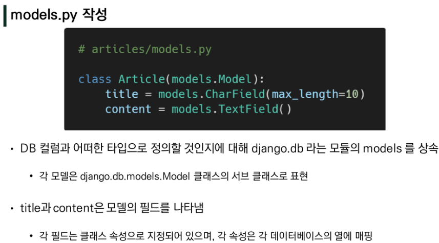
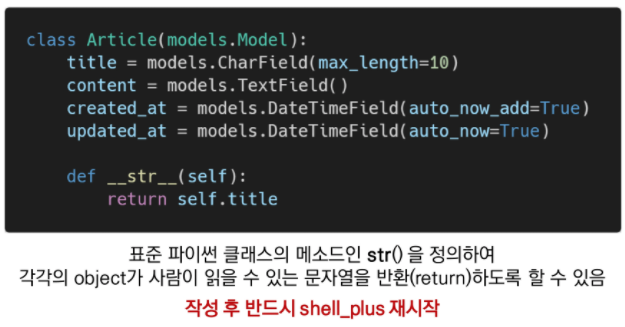
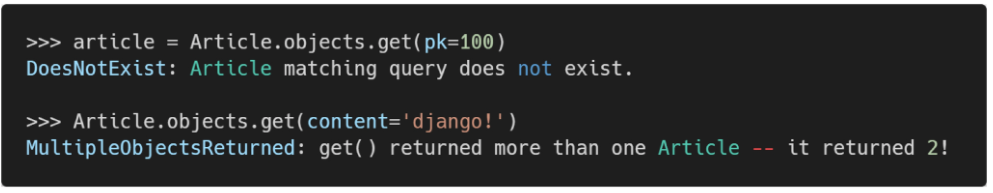
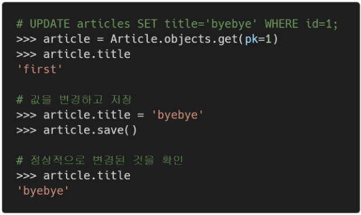
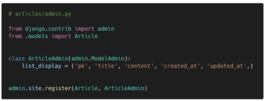

# Django 02 - Model

## Model

> 단일한 데이터에 대한 정보를 가짐 - 사용자가 저장하는 데이터들의 필수적인 필드들과 동작들을 포함
>
> 저장된 데이터베이스의 구조(layout)
>
> django는 model을 통해 데이터에 접속하고 관리
>
> 일반적으로 각각의 model은 하나의 데이터베이스 테이블에 매핑

### Database

* 데이터베이스(DB) : 체계화된 데이터의 모임

* 쿼리(Qeury) : 데이터를 조회하기 위한 명령어, 조건에 맞는 데이터를 추출하거나 조작하는 명령어

#### 기본 구조

* 스키마(Schema) : 데이터베이스에서 자료의 구조, 표현방법, 관계등을 정의한 구조

* 테이블(Table) : 필드/컬럼/속성, 레코드/행/튜플

* Model : 웹 애플리케이션의 데이터를 구조화하고 조작하기 위한 도구

## ORM

> Object-Relational-Mapping
>
> 객체지향 프로그래밍 언어를 사용하여 호환되지 않는 유형의 시스템 간에(Django-SQL) 데이터를 변환하는 프로그래밍 기술
>
> OOP 프로그래밍에서 RDBMS을 연동할 때, 데이터베이스와 객체 지향 프로그래밍 언어간의 호환되지 않는 데이터를 변환하는 프로그래밍 기법
>
> 내장 Django ORM 사용

* 장점
  * SQL을 잘 알지 못해도 DB조작이 가능
  * SQL의 절차적 접근이 아닌 객체 지향적 접근으로 인한 높은 생산성
* 단점
  * ORM 만으로 완전한 서비스를 구현하기 어려운 경우가 있음
* 현대 웹 프레임워크의 요점은 웹 개발의 속도를 높이는 것. (**생산성**)
* "우리는 DB를 객체로 조작하기 위해 ORM을 사용한다."

* 프로젝트 및 앱 생성 후 등록

* CharField(max_length=None, **options)
  * 길이의 제한이 있는 문자열을 넣을 때 사용
  * CharField 의 max_length는 필수 인자
  * 필드의 최대 길이(문자), 데이터베이스 레벨과 Django의 유효성 검사(값을 검증하는 것)에서 활용
* TextField(**options)
  * 글자의 수가 많을 때 사용
  * max_length 옵션 작성시 자동 양식 필드인 textarea 위젯에 반영은 되지만 모델과 데이터베이스 수준에는 적용되지 않음 (CharField를 사용)

## Migrations

> "django가 model에 생긴 변화(필드를 추가, 모델을 삭제했다던가 등)를 반영하는 방법"
>
> Migration 실행 및 DB 스키마를 다루기 위한 몇가지 명령어
>
> makemigrations, migrate, sqlmigrate, showmigrations

### Commands

* makemigrations
  * model을 변경한 것에 기반한 새로운 마이그레이션 (like 설계도)을 만들 때 사용
* migrate
  * 마이그레이션을 DB에 반영하기 위해 사용
  * 설계도를 실제 DB에 반영하는 과정
  * 모델에서의 변경 사항들과 DB의 스키마가 동기화를 이룸
* sqlmigrate
  * 마이그레이션에 대한 SQL 구문을 보기 위해 사용
  * 마이그레이션이 SQL 문으로 어떻게 해석되어서 동작할지 미리 확인할 수 있음
* showmigrations
  * 프로젝트 전체의 마이그레이션 상태를 확인하기 위해 사용
  * 마이그레이션 파일들이 migrate 됐는지 안됐는지 여부를 확인 할 수 있음

-추가 모델 필드 작성 후 makemigrations 진행

-`$ python manage.py makemigrations` -> 'migrations/0001_initail.py' 생성 확인

-`$ python manage.py migrate` -> 0001_initail.py 설계도를 실제 DB에 반영

-`$ python manage.py sqlmigrate articles 0001` -> 해당 migrations 설계도가 SQL문으로 어떻게 해석되어서 동작할 지 미리 확인할 수 있음

-`$ python manage.py showmigrations` -> migrations 설계도들이 migrate 됐는지 안됐는지 여부를 확인할 수 있음

* DateTimeField's options
  * auto_now_add : 최초 생성 일자
    * django ORM이 최초 insert(테이블에 입력)시에만 현재 날짜와 시간으로 갱신
  * auto_now : 최종 수정 일자
    * django ORM이 save를 할 때마다 현재 날짜와 시간으로 갱신

### 반드시 기억해야 할 migration 3단계

​	

## Database API

> "DB를 조작하기 위한 도구"
>
> django가 기본적으로 ORM을 제공함에 따른 것으로 DB를 편하게 조작할 수 있도록 도움
>
> Model을 만들면 django는 객체들을 만들고 읽고 수정하고 지울 수 있는 database-abstract API를 자동으로 만듬
>
> database-abstract API 혹은 database-access API 라고도 함

* 구문 - Making Queries

  

* Manager
  * django 모델에 데이터베이스 query 작업이 제공되는 인터페이스
  * 기본적으로 모든 django 모델 클래스에 objects라는 Manager를 추가
* QuerySet
  * 데이터베이스로부터 전달받은 객체 목록
  * queryset 안의 객체는 0, 1, 혹은 여러개일 수 있음
  * 데이터베이스로부터 조회, 필터, 정렬 등을 수행 할 수 있음

* Django Shell
  * 일반 파이썬 쉘을 통해서는 장고 프로젝트 환경에 접근할 수 없음
  * 그래서 장고 프로젝트 설정이 로드된 파이썬 쉘(+shell_plus)을 활용해 DB API 구문 테스트
  * 기본 Django shell 보다 더 많은 기능을 제공하는 shell_plus 설치 후 진행
  * `$ pip install ipython`
  * `$ pip install django-extensions`
  * 앱 등록 : settings.py의 INSTALLED_APPS에 `'django_extensions',` 추가
  * `$ python manage.py shell_plus`

## CRUD

> 대부분의 컴퓨터 소프트웨어가 가지는 기본적인 데이터 처리 기능인
>
> Create(생성), Read(읽기), Update(갱신), Delete(삭제)를 묶어서 일컫는 말

* 조회 : `Article.objects.all()`  - 전체 article 객체 조회

### 1. CREATE

- create 1 : `article.title = 'first'` `article.content = 'django!'`

  ​					=> `article.save()`해줘야 함

- create 2 : `article = Article(title='second', content='django!!')`

  ​					=> `article.save()`해줘야 함

- create 3 : `Article.objects.create(title='third', content='django!!!')` 

  ​					=> save 자동

* save() method
  * saving objects
  * 객체를 데이터베이스에 저장
  * 데이터 생성시 save()를 호출하기 전에는 객체의 ID값이 무엇인지 알 수 없음
* str method

​	`$ python manage.py shell_plus`

### 2. READ

* QuerySet API method를 사용한 다양한 조회를 하는 것이 중요
* 2가지로 분류
  1. Methods that return new querysets
  2. Methods that do not return querysets

* **all()** - `Article.objects.all()`

* **get()** - `Article.objects.get(pk=100)`

  > pk 조회할때 사용

  * 주어진 lookup 매개변수와 일치하는 객체를 반환
  * 객체를 찾을 수 없으면 DoesNotExist 예외를 발생시키고, 둘 이상의 객체를 찾으면 MultipleObjectReturned 예외를 발생시킴
  * 위와같은 특징 때문에 primary key와 같이 고유(unique)성을 보장하는 조회에서 사용해야 함

  

* **filter()** - `Article.objects.filter(title='aaa')`

  * 주어진 lookup매개변수와 일치하는 객체를 포함하는 새 QuerySet을 반환

  

### 3. UPDATE

* article 인스턴스 객체의 인스턴스 변수의 값을 변경
  * `article = Article.objects.get(pk=1)`
  * `article.title = 'byebye'`

>  먼저 조회(get) 후 저장해야 수정할 수 있음 
>
> updated_at 값도 갱신됨 -> 최종 수정 시간

### 4. DELETE

* article 인스턴스 생성 후 .delete() 호출
  * `article = Article.objects.get(pk=1)`
  * `article.delete()`
* QuerySet의 모든 행에 대해 SQL 삭제 쿼리를 수행하고, 삭제된 객체 수와 객체 유형당 삭제 수가 포함된 딕셔너리를 반환

> 1번 삭제 후 새로운 인스턴스 추가시, 4번으로 추가됨
>
> django에서는 삭제된 것을 재사용하지 않음

> `exit` 치면 shell에서 나옴

> `<form action="" method="GET">`
>
> /articles/`GET` - 게시글 목록 좀 줘
>
> /articles/`POST` - 게시글 좀 작성해줘

### Database API

* Field lookups
  * SQL WHERE 절을 지정하는 방법
  * 조회 시 특정 조건을 적용시키기 위해 사용
  * QuerySet 메서드 filter(), exclude() 및 get()에 대한 키워드 인수로 지정
  * ex)
    * Article.objects.filter(pk__gt=2)
    * Article.objects.filter(content__contains='ja')
* QuerySet API
  * 데이터베이스 조작을 위한 다양한 QuerySet API method들은 해당 공식문서 참고
  * https://docs.djangoproject.com/en/3.2/ref/models/querysets/#queryset-api-reference

## CRUD with Views

* 게시글 정렬 순서 변경

  

* #### HTTP method
  * GET (조회할때만 사용, 입력 x)
    * 특정 리소스를 가져오도록 요청할 때 사용
    * 반드시 데이터를 가져올 때만 사용해야 함
    * DB에 변화를 주지 않음
    * CRUD에서 R 역할을 담당
  * POST (주로 사용-입력할때)
    * 서버로 데이터를 전송할 때 사용
    * 리소스를 생성/변경하기 위해 데이터를 HTTP body에 담아 전송
    * 서버에 변경사항을 만듦
    * CRUD에서 C/U/D 역할을 담당

* 사이트 간 요청 위조 (Cross-site request forgery) = CSRF
  * 웹 애플리케이션 취약점 중 하나, 사용자가 자신의 의지와 무관하게 공격자가 의도한 행동을 하여 특정 웹페이지를 보안에 취약하게 한다거나 수정, 삭제등의 작업을 하게 만드는 공격방법
  * django는 CSRF에 대항하여 middleware와 template tag를 제공

* CSRF 공격 방어
  * Security Token 사용 방식 (CSRF Token)
    * 사용자의 데이터에 임의의 난수값을 부여해, 매 요청마다 난수 값을 포함시켜 전송시키도록 함
    * 이후 서버에서 요청을 받을 때마다 전달된 token 값이 유효한지 검증
  * 일반적으로 데이터 변경이 가능한 POST, PATCH, DELETE Method등에 적용 (GET 제외)
  * django는 csrf token 템플릿 태그를 제공
* `` - CSRF 보호에 사용
  * input type이 hidden으로 작성되며 value는 django에서 생성한 hash 값으로 설정됨
  * 해당 태그 없이 요청을 보낸다면 Django 서버는 403 forbidden을 응답

* CsrfViewMiddleware

  * csrf 공격 관련 보안 설정은 settings.py 에서 MIDDLEWARE에 작성되어있음
  * 실제로 요청 과정에서 urls.py 이전에 Middleware의 설정 사항들을 순차적으로 거치며 응답은 반대로 하단에서 상단으로 미들웨어를 적용시킴

* Django shortcut functions - `redirect()`

  * 새 URL로 되돌림

  * 인자에 따라 HttpResponseRedirect를 반환

  * 브라우저는 현재 경로에 따라 전체 URL 자체를 재구성(reconstruct)

  * 사용 가능한 인자

    * model
    * view name : viewname can be URL pattern name of callable view object
    * absolute or relative URL

## Admin Site

* Automatic admin interface

  * 사용자가 아닌 서버의 관리자가 활용하기 위한 페이지
  * Model class를 admin.py에 등록하고 관리
  * django.contrib.auth 모듈에서 제공됨
  * record 생성 여부 확인에 매우 유용하며, 직접 record를 삽입할 수도 있음

* admin 생성

  * `$ python manage.py createsuperuser`
  * 관리자 계정 생성 후 서버를 실행한 다음 '/admin' 으로 가서 관리자 페이지 로그인
  * 내가 만든 record를 보기 위해서는 admin.py에 작성하여 Django 서버에 등록
  * [주의] auth에 관련된 기본 테이블이 생성되지 않으면 관리자 계정을 생성할 수 없음 (auth_user)

* admin 등록

  

  * admin.py는 관리자 사이트에 Article 객체가 관리자 인터페이스를 가지고 있다는 것을 알려주는 것
  * models.py에 정의한 `__str__`의 형태로 객체가 표현됨

* ModelAdmin options

  

  * list_display
    * models.py 정의한 각각의 속성들의 값을 admin 페이지에 출력하도록 설정

  * list_filter, list_display_links 등 다양한 ModelAdmin options 참고

