# Django 05 - Authentication System

## [1] Authentication System 1

### 1. The Django Authentication System

>Django 인증 시스템은 django.contrib.auth에 Django contrib module로 제공
>
>필수 구성은 settings.py/INSTALLED_APPS -> `django.contrib.auth`, `django.contrib.contenttypes`

* django.contrib.auth - 인증 프레임워크의 핵심과 기본 모델을 포함
* django.contrib.contenttypes - 사용자가 생성한 모델과 권한을 연결할 수 있음

> Django 인증시스템은 인증과 권환부여를 함께 제공(처리)하며, 이러한 기능이 어느정도 결합되어 일반적으로 인증시스템이라고 함

* Authentication(인증) - 신원 확인. 사용자가 자신이 누구인지 확인하는 것
* Authorization(권한, 허가) - 권한 부여. 인증된 사용자가 수행할 수 있는 작업을 결정

* 두번째 앱 생성하기 - accounts (이름 권장)


### 2. 쿠키와 세션

#### ◆ HTTP - Hyper Text Transfer Protocol

* HTML 문서와 같은 리소스들을 가져올 수 있도록 해주는 프로토콜(규칙, 규약)
* 웹에서 이루어지는 모든 데이터 교환의 기초
* 클라이언트 - 서버 프로토콜이기도 함
* 특징
  * 비연결지향(connectionless) - 서버는 요청에 대한 응답을 보낸 후 연결을 끊음
  * 무상태(stateless) - 연결을 끊는 순간 클라이언트와 서버간의 통신이 끝나며 상태정보가 유지되지 않음
    * 클라이언트와 서버가 주고 받는 메시지들은 서로 완전히 독립적임

* #### 클라이언트와 서버의 지속적인 관계를 유지하기 위해 쿠키와 세션이 존재


#### ◆ 쿠키(Cookie)

* 서버가 사용자의 웹 브라우저에 전송하는 작은 데이터 조각
* 사용자가 웹사이트를 방문할 경우 해당 웹사이트의 서버를 통해 사용자의 컴퓨터에 설치되는 작은 기록 파일
  * 브라우저는 쿠키를 로컬에 KEY-VALUE의 데이터 형식으로 저장 -> 동일한 서버에 재요청 시 저장된 쿠키를 함께 전송
* [참고] 소프트웨어가 아니기 때문에 프로그램처럼 실행 될 수 없으며 악성코드를 설치 할 수 없지만, 사용자의 행동을 추적하거나 쿠키를 훔쳐서 해당 사용자의 계정 접근권한을 획득 할 수도 있음

* HTTP 쿠키는 상태가 있는 세션을 만들어 줌

* 쿠키는 두 요청이 동일한 브라우저에서 들어왔는지 아닌지를 판단할 때 주로 사용

  * 이를 이용해 사용자의 로그인 상태를 유지할 수 있음
  * 상태가 없는 HTTP 프로토콜에서 상태 정보를 기억 시켜주기 때문

* #### 웹 페이지에 접속하면 요청한 웹 페이지를 받으며 쿠키를 저장하고, 클라이언트가 같은 서버에 재요청 시 요청과 함께 쿠키도 함께 전송

* 요청과 응답

  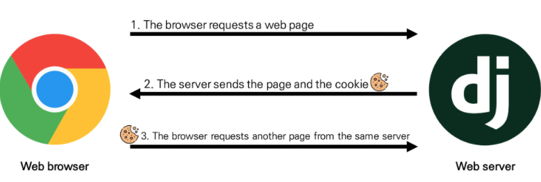

* 쿠키의 사용 목적
  1. 세션 관리 (Session management)
     - 로그인, 아이디 자동 완성, 공지 하루 안보기, 팝업 체크, 장바구니 등의 정보 관리
  2. 개인화 (Personalization)
     - 사용자 선호, 테마 등의 설정
  3. 트래킹 (Tracking)
     - 사용자 행동을 기록 및 분석

* 쿠키를 이용한 장바구니 예시

  * 쿠팡 => 장바구니 넣고, 개발자도구 - Network 탭 - cartView.pang 확인
  * 서버는 응답과 함께 Set-Cookie 응답 헤더를 브라우저에게 전송
  * 이 헤더는 클라이언트에게 쿠키를 저장하라고 전달
  * 장바구니 비우기 => 개발자도구 - Application 탭 - Cookies - 마우스 우측버튼 - Clear 후 새로고침

  

#### ◆ 세션 (Session)

* 사이트와 특정 브라우저 사이의 "상태"를 유지시키는 것 (쿠키들 중에 상태 유지시키는데 사용되는 것들)
* 클라이언트가 서버에 접속하면 서버가 특정 **session id**를 발급하고, 클라이언트는 발급받은 session id를 쿠키에 저장
  * 클라이언트가 다시 서버에 접속하면 요청과 함께 쿠키를 서버에 전달
  * 쿠키는 요청 때마다 서버에 함께 전송되므로 서버에서 session id를 확인해 알맞은 로직을 처리
* ID는 세션을 구별하기 위해 필요하며, 쿠키에는 ID만 저장함


* 쿠키 Lifetime (수명)

1. Session cookies	
   - 현재 세션이 종료되면 삭제됨
   - 브라우저가 "현재 세션"이 종료되는 시기를 정의
     - [참고] 일부 브라우저는 다시 시작할 때 세션 복원을 사용해 세션 쿠키가 오래 지속 될 수 있도록 함
2. Persistent cookies (or Permanent cookies)
   - Expires 속성에 지정된 날짜 혹은 Max-Age 속성에 지정된 기간이 지나면 삭제


* Session in Django
  * Django의 세션은 미들웨어를 통해 구현됨
  * Django는 database-backed sessions 저장 방식을 기본 값으로 사용
    * (참고) 설정을 통해 cached, file-based, cookie-based 방식으로 변경 가능
  * Django는 특정 session id를 포함하는 쿠키를 사용해서 각각의 브라우저와 사이트가 연결된 세션을 알아냄
    * 세션 정보는 Django DB의 django_session 테이블에 저장됨
  * 모든 것을 세션으로 사용하려고 하면 사용자가 많을 때 서버에 부하가 걸릴 수 있음


#### ◆  Authentication System in MIDDLEWARE

* SessionMiddleware - 요청 전반에 걸쳐 세션을 관리
* AuthenticationMiddleware - 세션을 사용하여 사용자를 요청과 연결
* [참고] MIDDLEWARE : http요청과 응답 처리 중간에서 작동하는 시스템
  * django는 http요청이 들어오면 미들웨어를 거쳐 해당 URL에 등록되어 있는 view로 연결해주고, http 응답 역시 미들웨어를 거쳐서 내보냄
  * 주로 데이터 관리, 애플리케이션 서비스, 메시지, 인증 및 API 관리를 담당


### 3. 로그인

> Session을 Create하는 로직과 같음
>
> Django는 우리가 session의 메커니즘에 생각하지 않게끔 도움을 줌
>
> 이를 위해 인증에 관한 built-in forms를 제공

* AuthenticationForm
  * 사용자 로그인을 위한 form
  * request를 첫번째 인자로 취함

* login 함수 - `login(request, user, backend=None)`
  * 현재 세션에 연결하려는 인증된 사용자가 있는 경우 login()함수가 필요
  * 사용자를 로그인하며 view함수에서 사용됨
  * HttpRequest 객체와 User 객체가 필요
  * django의 session framework를 사용하여 세션에 user의 ID를 저장 (==로그인)

```python
# urls.py
from django.urls import path
from . import views

app_name = 'accounts'
urlpatterns = [
    path('login/', views.login, name='login'),
]

# account/views.py
from django.shortcuts import render, redirect
from django.contrib.auth import login as auth_login
from django.contrib.auth.forms import AuthenticationForm
from django.views.decorators.http import require_http_methods

# Create your views here.
@require_http_methods(['GET', 'POST'])
def login(request):
    if request.method == 'POST':
        form = AuthenticationForm(request, request.POST)
        if form.is_valid():
            # 로그인!
            auth_login(request, form.get_user())
            return redirect('articles:index')
    else:
        form = AuthenticationForm()
    context = {
        'form': form,
    }
    return render(request, 'accounts/login.html', context)
```

```django
# login.html



  <h1>Login</h1>
  <form action="" method="POST">
    
    {{ form.as_p }}
    <input type="submit">
  </form>


# base.html
...
<a href="">Login</a>
```

* get_user()

  * AuthenticatonForm의 인스턴스 메서드
  * user_cache는 인스턴스 생성 시에 None으로 할당되며, 유효서어 검사를 통과했을 경우 로그인 한 사용자 객체로 할당 됨
  * 인스턴스의 유효성을 먼저 확인하고, 인스턴스가 유효할 때만 user를 제공하려는 구조

  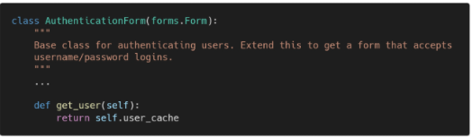

> 로그인 후 브라우저와 django DB에서 django로부터 발급받은 sessionid 확인
>
> 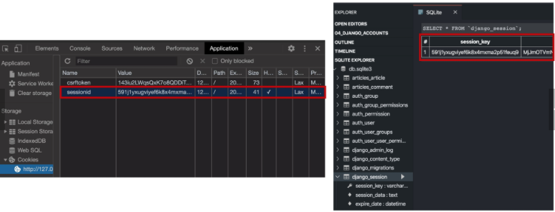


### 4. Authentication data in templates

```django
# base.html
<h3>Hello, {{ user }}</h3>
```

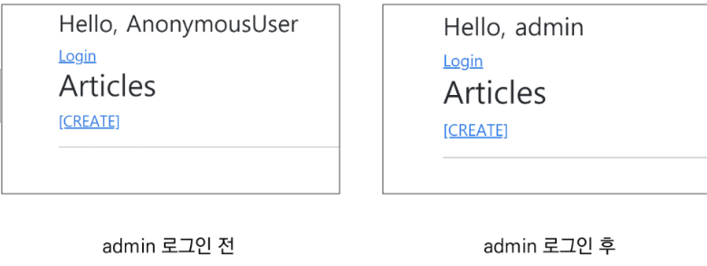

* context processors

  * 템플릿이 렌더링 될 때 자동으로 호출가능한 컨텍스트 데이터 목록 (context설정 안해도됨)
  * 작성된 RequestContext에서 사용 가능한 변수로 포함된

  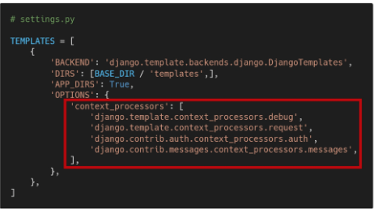

* Users
  * 템플릿 RequestContext를 렌더링할 때, 현재 로그인한 사용자를 나타내는 auth.User 인스턴스 (로그인안했을 때 AnonymousUser 인스턴스)는 템플릿 변수 **{{ user }}** 에 저장됨
  * `django.contrib.auth.context_processors.auth` (3번째 라인)


### 5. 로그아웃

> 로그아웃은 Session을 Delete하는 로직과 같음

* logout 함수 - `logout(request)`
  * HttpRequest 객체를 인자로 받고 반환값이 없음
  * 사용자가 로그인하지 않은 경우 오류를 발생시키지 않음
  * 현재 요청에 대한 session data를 DB에서 완전히 삭제하고, 클라이언트의 쿠키에서도 sessionid가 삭제됨
  * 이는 다른 사람이 동일한 웹 브라우저를 사용하여 로그인하고, **이전 사용자의 세션 데이터에 엑세스하는 것을 방지하기 위함**

```python
# urls.py
path('logout/', views.logout, name='logout'),

# account/views.py
from django.contrib.auth import logout as auth_logout

@require_POST
def logout(request):
    auth_logout(request)
    return redirect('articles:index')
```

```django
# base.html
<form action="" method="POST">
  
  <input type="submit" value="Logout">
</form>
```


### 6. 로그인 사용자에 대한 접근 제한

> 로그인 사용자에 대한 엑세스 제한 2가지 방법 : 
>
> 1. The raw way - **is_authenticated** attribute
> 2. The  **login_required** decorator

#### 1) is_authenticated 속성

- User model의 속성 중 하나
- 모든 User 인스턴스에 대해 항상 True인 읽기 전용 속성 (AnonymousUser - 항상 False)
- 사용자가 인증 되었는지 여부를 알 수 있는 방법
- 일반적으로 request.user에서 이 속성을 사용하여, 미들웨어의 `django.contrib.auth.middleware.AuthenticatonMiddleware`를 통과했는지 확인
- 단, 권한(permission)과는 관련이 없으며, 사용자가 활성화 상태(active)이거나 유효한(valid) 세션을 가지고 있는지도 확인하지 않음

```django
# base.html

  <h3>Hello, {{ user }}</h3>
  <form action="" method="POST">
    
    <input type="submit" value="Logout">
  </form>

  <a href="">Login</a>

```

> 로그인과 비로그인 상태에서 출력되는 링크를 다르게 설정

```python
# account/views.py
@require_http_methods(['GET', 'POST'])
def login(request):
    if request.user.is_authenticated:
        return redirect('articles:index')

@require_POST
def logout(request):
    if request.user.is_authenticated:
        auth_logout(request)
    return redirect('articles:index')
```

> 인증된 사용자(로그인 상태)라면 로그인 로직을 수행할 수 없도록 처리
>
> 인증된 사용자(로그인 상태)만 로그아웃 로직을 수행할 수 있도록 처리

```django
# articles/index.html



  <h1>Articles</h1>
  
    <a href="">[CREATE]</a>
  
    <a href="">새 글을 작성하려면 로그인하세요</a>
  
  <hr>
  
    <p>글 번호 : {{ article.pk }}</p>
    <p>글 제목 : {{ article.title }}</p>
    <p>글 내용 : {{ article.content }}</p>
    <a href="">[DETAIL]</a>
    <hr>
  

```

> 인증된 사용자(로그인 상태)만 게시글 작성 링크를 볼 수 있도록 처리


#### 2) login_required decorator

- 사용자가 로그인되어 있지 않으면, settings.LOGIN_URL에 설정된 문자열 기반 절대 경로로 redirect 함
  - LOGIN_URL의 기본값은 '/accounts/login/' (두번째 앱이름 accounts로 한 이유중 하나)
- 사용자가 로그인되어 있으면 정상적으로 view 함수를 실행
- 인증 성공 시 사용자가 redirect 되어야 하는 경로는 "next"라는 쿼리 문자열 매개변수에 저장됨
  - 예시) /accounts/login/?next=/articles/create/

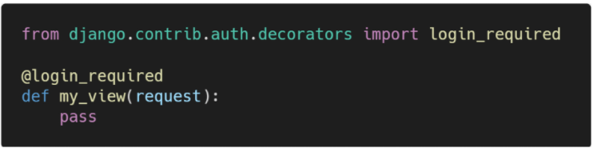

```python
# articles/views.py
from django.contrib.auth.decorators import login_required

@login_required
def create(request):
def update(request, pk):
def delete(request, pk):
```

> 1. view 함수에 login_required 데코레이터 작성
> 2. 비로그인 상태에서 /accounts/create/ 경로로 요청 보내기
> 3. URL에 next 문자열 매개변수 확인


* "next" query string parameter

  * 로그임이 정상적으로 진행되면 기존에 요청했던 주소로 redirect 하기 위해 마치 주소를 keep 해주는 것
  * 단, 별도로 처리해주지 않으면 우리가 view에 설정한 redirect 경로로 이동하게 됨

  ```python
  # account/views.py
  @require_http_methods(['GET', 'POST'])
  def login(request):
      if request.user.is_authenticated:
          return redirect('articles:index')
  
      if request.method == 'POST':
          form = AuthenticationForm(request, request.POST)
          if form.is_valid():
              # 로그인!
              auth_login(request, form.get_user())
              return redirect(request.GET.get('next') or 'articles:index')
      else:
          form = AuthenticationForm()
      context = {
          'form': form,
      }
      return render(request, 'accounts/login.html', context)
  ```

  ```django
  # login.html
  
  
  
    <h1>Login</h1>
    <form action="" method="POST">
      
      {{ form.as_p }}
      <input type="submit">
    </form>
  
  ```

  > 현재 URL로 (next parameter가 있는) 요청을 보내기 위해 action 값 비우기


* 두 데코레이터로 인해 발생하는 구조적 문제와 해결
  * 비로그인 상태에서 게시글 삭제 시도 > 로그인 > 405 status code 확인
  * @required_POST 작성된 함수에 @login_required를 함께 사용하는 경우 에러 발생
  * 로그인 이후 "next" 매개변수를 따라 해당 함수로 다시 redirect 되는데, 이 때 @require_POST 때문에 405 에러 발생
  * 두가지 문제 발생
    * redirect 과정에서 POST 데이터의 손실
    * redirect 요청은 POST 방식이 불가능하기 때문에 GET 방식으로 요청됨

  

  ```python
  # articles/views.py
  @require_POST
  def delete(request, pk):
      if request.user.is_authenticated:
          article = get_object_or_404(Article, pk=pk)
          article.delete()
      return redirect('articles:index')
  ```

  > login_required는 GET method request를 처리할 수 있는 view 함수에서만 사용해야 함


--------

## [2] Authentication System 2

### 1. 회원가입

* #### UserCreationForm

  * 주어진 username과 password로 권한이 없는 새 user를 생성하는 ModelForm
  * 3개의 필드 : username(from the user model), password1, password2

  


```python
# urls.py
path('signup/', views.signup, name='signup'),

# account/views.py
from django.contrib.auth.forms import AuthenticationForm, UserCreationForm
def signup(request):
    if request.method == 'POST':
        form = UserCreationForm(request.POST)
        if form.is_valid():
            form.save()
            return redirect('articles:index')
    else:
        form = UserCreationForm()
    context = {
        'form': form,
    }
    return render(request, 'accounts/signup.html', context)
```

```django
# accounts/signup.html



  <h1>회원가입</h1>
  <form action="" method="POST">
    
    {{ form.as_p }}
    <input type="submit">
  </form>

```

> 회원가입 진행 후 admin 페이지에서 새로운 계정이 생겼는지 확인

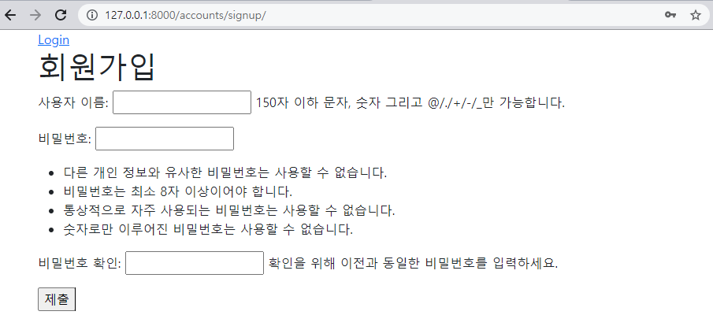


* 회원가입 후 자동으로 로그인 진행하기

  ```python
  user = form.save()
  auth_login(request, user)
  ```

   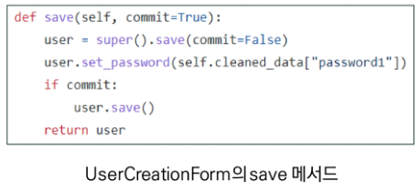

* 회원가입 링크 작성

  ```django
  # base.html
  
    <a href="">Login</a>
    <a href="">Signup</a>
  
  ```

  


### 2. 회원탈퇴

> 회원탈퇴는 DB에서 사용자를 삭제하는 것과 같음

```python
# urls.py
path('delete/', views.delete, name='delete'),

# accounts/views.py
@require_POST
def delete(request):
    if request.user.is_authenticated:
        request.user.delete()
    return redirect('articles:index')
```

```django
# base.html

  <h3>Hello, {{ user }}</h3>
  <form action="" method="POST">
    
    <input type="submit" value="Logout">
  </form>
  <form action="" method="POST">
    
    <input type="submit" value="회원탈퇴">
  </form>
```

> 회원탈퇴 진행 후 sqlite 확장프로그램이나 admin 페이지에서 유저가 삭제 되었는지 확인

* 탈퇴하면서 해당 유저의 세션 데이터도 함께 지울 경우 (단, 반드시 탈퇴 후 로그아웃 순으로 처리해야 함)

  ```python
  # accounts/views.py
  @require_POST
  def delete(request):
      if request.user.is_authenticated:
          request.user.delete()
          auth_logout(request)
      return redirect('articles:index')
  ```

  


### 3. 회원정보 수정

* #### UserChangeForm

  - 사용자의 정보 및 권한을 변경하기 위해 admin 인터페이스에서 사용되는 ModelForm

  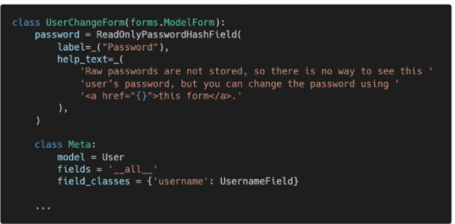

```python
# urls.py
path('update/', views.delete, name='update'),

# account/views.py
from django.contrib.auth.forms import AuthenticationForm, UserCreationForm, UserChangeForm
@require_http_methods(['GET', 'POST'])
def update(request):
    if request.method == 'POST':
        pass
    else:
        form = UserChangeForm(instance=request.user)
    context = {
        'form': form,
    }
    return render(request, 'accounts/update.html', context)

```

```django
# accounts/update.html



  <h1>회원정보 수정</h1>
  <form action="" method="POST">
    
    {{ form.as_p }}
    <input type="submit">
  </form>

```

* 회원정보 수정 페이지 링크 작성

  ```django
  # base.html
  
    <h3>Hello, {{ user }}</h3>
    <a href="">회원정보 수정</a>
  ```

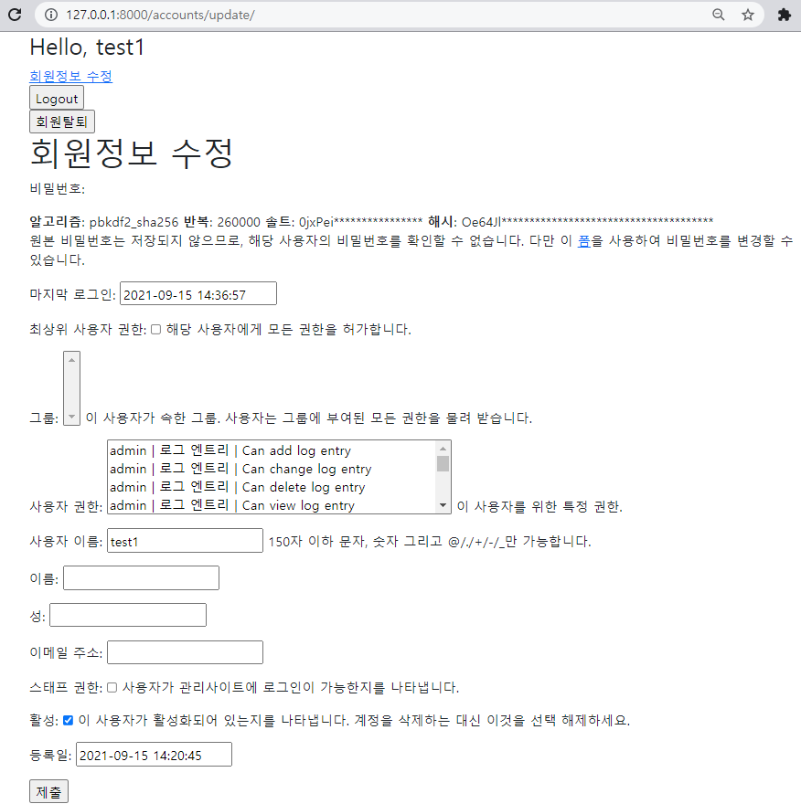

* UserChangeForm 사용 시 문제점
  * 일반 사용자가 접근해서는 안될 정보들까지 모두 수정이 가능해짐
  * 따라서 UserChangeForm을 상속받아 CustomUserChangeForm이라는 서브클래스를 작성해 접근 가능한 필드를 조정해야함


* #### CustomUserChangeForm 작성

1. get_user_model()

2. User 모델의 fields

   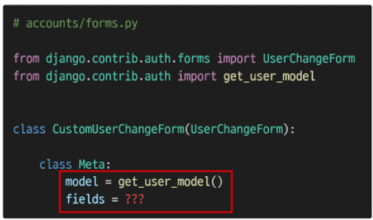

* get_user_model()

  * 현재 프로젝트에서 활성화된 사용자 모델(active user model)을 반환
  * django는 User클래스를 직접 참조하는 대신 `django.contrib.auth.get_user_model()`을 사용하여 참조해야 한다고 강조

* User 클래스 상속 구조 살펴보기

   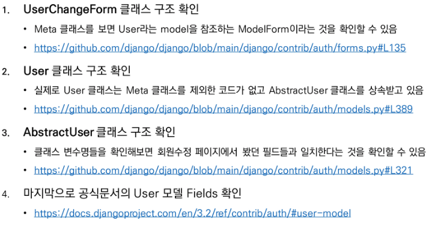

```python
# accounts/forms.py
from django.contrib.auth.forms import UserChangeForm
from django.contrib.auth import get_user_model

class CustomUserChangeForm(UserChangeForm):

    class Meta:
        model = get_user_model()
        fields = ('email', 'first_name', 'last_name')
```

> 수정 시 필요한 필드만 선택해서 작성

```python
# accounts/views.py
from django.contrib.auth.decorators import login_required
from .forms import CustomUserChangeForm

@login_required
@require_http_methods(['GET', 'POST'])
def update(request):
    if request.method == 'POST':
        form = CustomUserChangeForm(request.POST, instance=request.user)
        if form.is_valid():
            form.save()
            return redirect('articles:index')
    else:
        form = CustomUserChangeForm(instance=request.user)
    context = {
        'form': form,
    }
    return render(request, 'accounts/update.html', context)
```

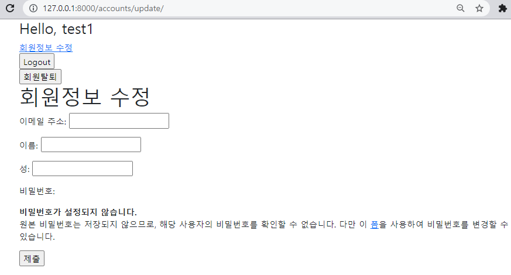


### 4. 비밀번호 변경

* #### PasswordChangeForm

  * 사용자가 비밀번호를 변경할 수 있도록 하는 Form

  * 이전 비밀번호를 입력하여 비밀번호를 변경할 수 있도록 함

  * 이전 비밀번호를 입력하지 않고 비밀번호를 설정할 수 있는 SetPasswordForm을 상속받는 서브 클래스

  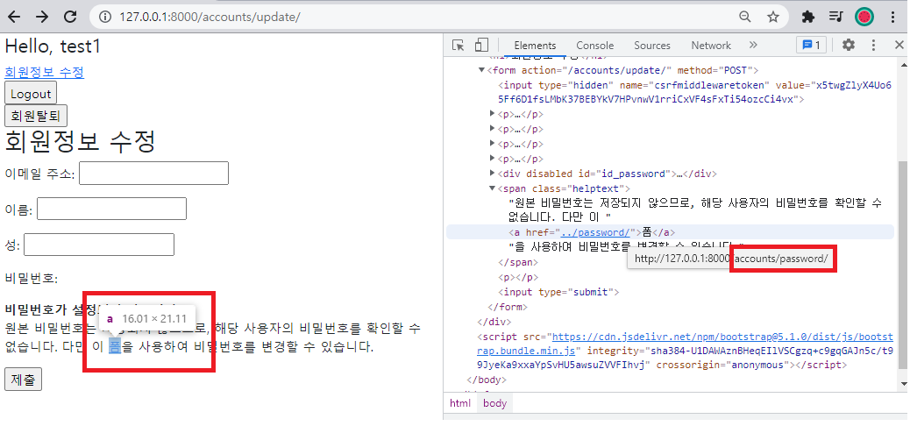
  
  > 회원정보 수정 페이지에 작성된 비밀번호 변경 form 주소 확인

```python
# urls.py
path('password/', views.change_password, name='change_password'),

# account/views.py
from django.contrib.auth.forms import (
    AuthenticationForm, UserCreationForm, PasswordChangeForm
    )
    
@login_required
@require_http_methods(['GET', 'POST'])
def change_password(request):
    if request.method == 'POST':
        form = PasswordChangeForm(request.user, request.POST)
        if form.is_valid():
            form.save()
            return redirect('articles:index')
    else:
        form = PasswordChangeForm(request.user)
    context = {
        'form': form,
    }
    return render(request, 'accounts/change_password.html', context)
```

```django
# change_password.html



  <h1>비밀번호 변경</h1>
  <form action="" method="POST">
    
    {{ form.as_p }}
    <input type="submit">
  </form>

```

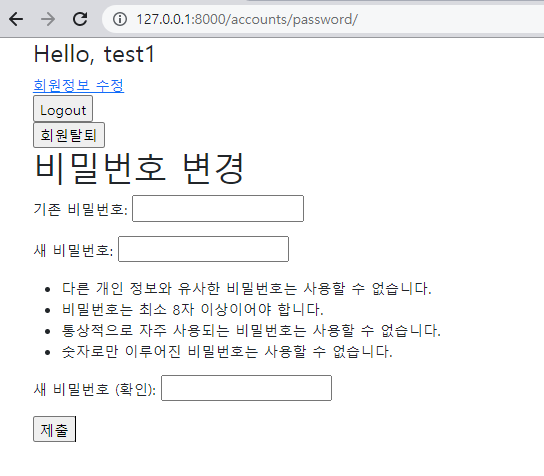

* SetPasswordForm
  * PasswordChangeForm의 첫번째 인자가 user인 이유

  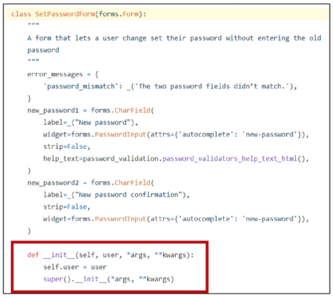

* 암호 변경 시 세션 무효화 방지

  * update_session_auth_hash(request, user)
    * 현재 요청과 새 session hash가 파생 될 업데이트 된 사용자 객체를 가져오고, session hash를 적절하게 업데이트
    * 비밀번호가 변경되면 기존 세션과의 회원 인증 정보가 일치하지 않게 되어 로그인 상태를 유지할 수 없기 때문
    * 암호가 변경되어도 로그아웃되지 않도록 새로운 password hash로 session을 업데이트 함

  ```python
  # account/views.py
  from django.contrib.auth import update_session_auth_hash
  
  @login_required
  @require_http_methods(['GET', 'POST'])
  def change_password(request):
      if request.method == 'POST':
          form = PasswordChangeForm(request.user, request.POST)
          if form.is_valid():
              form.save()
              update_session_auth_hash(request, form.user)
              return redirect('articles:index')
      else:
          form = PasswordChangeForm(request.user)
      context = {
          'form': form,
      }
      return render(request, 'accounts/change_password.html', context)
  ```

