# Django 06 - REST API

## [1] HTTP

 

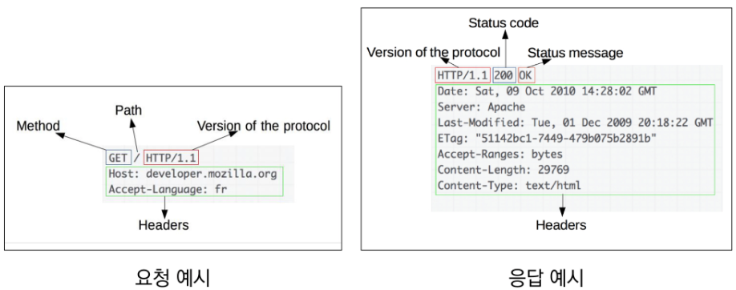


* HTTP request methods
  * 자원에 대한 행위(수행하고자 하는 동작)을 정의
  * 주어진 리소스에 수행하길 원하는 행동을 나타냄
  * GET, POST, PUT, DELETE
* HTTP response status code
  * 요청이 성공적으로 완료되었는지 여부
  * Infomational (1xx), Successful (2xx), Redirection (3xx), Client error (4xx), Server error (5xx) responses

* 웹에서의 리소스 식별
  * HTTP 요청의 대상 = 리소스 (자원) : 문서, 사진, 어떤 것이든 될 수 있음
  * 리소스 식별을 위해 URI로 식별됨

 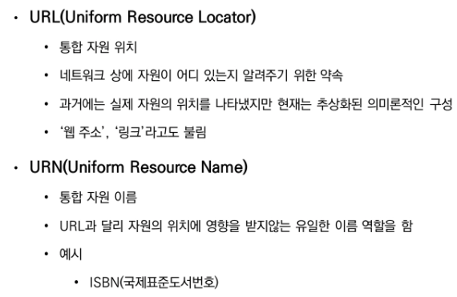

### URI

 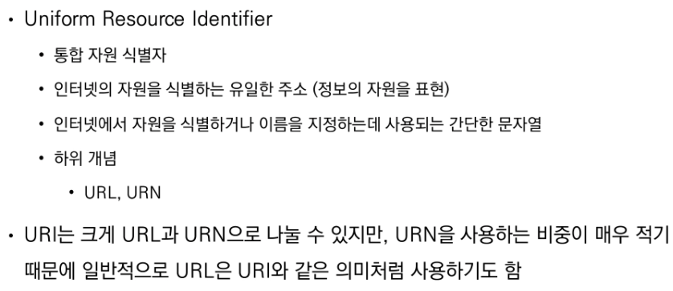

* 구조

  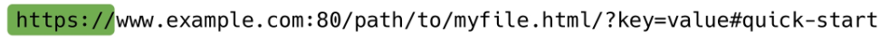

  * Scheme (protocol) : 브라우저가 사용해야 하는 프로토콜
    * http(s), data, file, ftp, malito
  * Host (Domain name) : 요청을 받는 웹 서버의 이름, IP주소 직접 사용할 수 있음(자주x)
  * Port : 웹 서버 상의 리소스에 접근하는데 사용되는 기술적인 '문(gate)' 
    * HTTP 프로토콜의 표준 포트 : HTTP 80, HTTP 443
  * Path : 웹 서버 상의 리소스 경로, 초기-물리적위치, 오늘날-추상화 형태의 구조
  * Query (Identifier) : 웹 서버에 제공되는 추가적인 매개변수, &로 구분되는 key-value 목록
  * Fragment : 자원 안에서의 북마크의 한 종류. 브라우저에게 해당 문서의 특정 부분을 보여주기 위한 방법
    * 브라우저에게 알려주는 요소 - fragment identifier(부분 식별자)라고 부르며, #뒤의 부분은 요청이 서버에 보내지지 않음


## [2] RESTful API

* API

   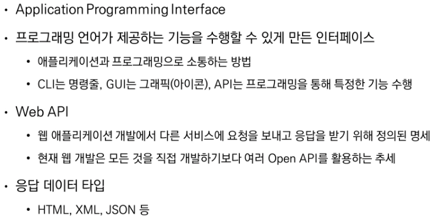

  

* REST

   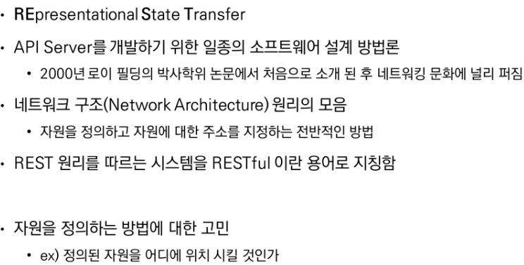

   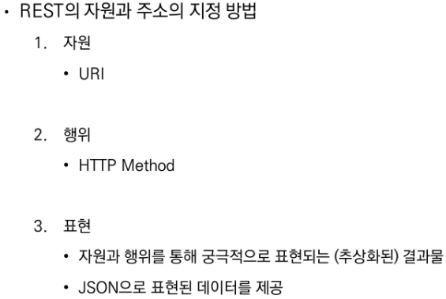

   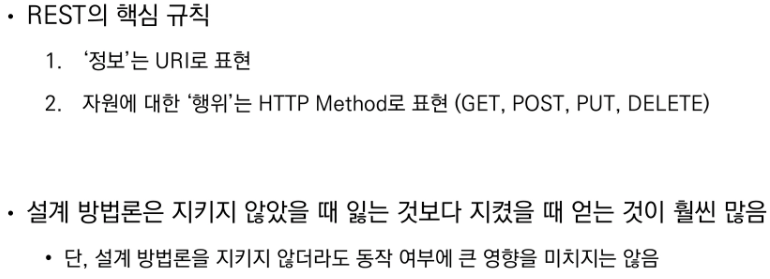


* JSON

   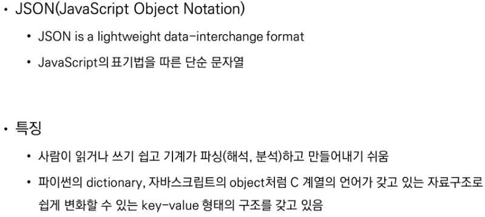


* RESTful API
  * REST 원리를 따라 설계한 API
  * RESTful services, 혹은 simply REST services 라고도 부름
  * 프로그래밍을 통해 클라이언트의 요청에 JSON을 응답하는 서버를 구성
    * 지금까지 사용자의 입장에서 썼던 API를 제공자의 입장이 되어 개발해보기


## [3] Response

* Create Dummy Data

  * django-seed 라이브러리를 사용해 모델 구조에 맞는 데이터 생성

    ```bash
    $ python manage.py seed articles --number=20
    ```

* Response - JsonResponse 

  * JSON-encoded response를 만드는 HttpResponse의 서브 클래스

  * 'safe' parameter : True (기본값)

    * dict 이외의 객체를 직렬화 하려면 False로 설정해야 함

    ```python
    response = JsonResponse({'foo':'bar'})
    response = JsonResponse([1, 2, 3], safe=False)
    ```

  > 직렬화 Serialization : 데이터 구조나 객체 상태를 동일하거나 다른 컴퓨터 환경에 저장하고, 나중에 재구성할 수 있는 포맷으로 변환하는 과정

* Response - Django Serializer

  * HttpResponse를 활용한 JSON 응답 객체

  * 주어진 모델 정보를 활용하기 때문에 이전과 달리 필드를 개별적으로 직접 만들어 줄 필요가 없음

    

* Response - Django REST Framework

  * Django REST framework(DRF) 라이브러리를 사용한 JSON 응답

    ```bash
    $ pip install djangorestframework	# INSTALLED_APPS에 추가
    ```

  * Model - Article 모델에 맞춰 자동으로 필드를 생성해 serialize 해주는 ModelSerializer 확인

    

  * Response()를 활용

    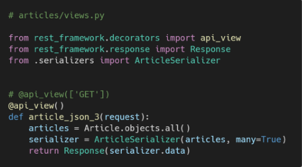


*  Django REST Framework (DRF)

  * Web API 구축을 위한 강력한 Toolkit을 제공하는 라이브러리
  * DRF의 Serializer는 Django의 Form 및 ModelForm 클래스와 매우 유사하게 구성되고 작동함

  > Web API : 웹 애플리케이션 개발에서 다른 서비스에 요청을 보내고 응답을 받기 위해 정의된 명세

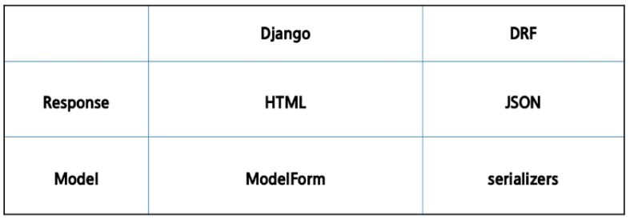


## [4] Single Model

* DRF with Single Model
  * 단일 모델의 data를 직렬화하여 JSON으로 변환하는 방법에 대한 학습
  * 단일 모델을 두고 CRUD 로직을 수행 가능하도록 설계
  * API 개발을 위한 핵심 기능을 제공하는 도구 활용
    * DRF built-in form, Postman
* ModelSerializer
  * 모델 필드에 해당하는 필드가 있는 Serializer 클래스를 자동으로 만들 수 있는 shortcut
    * 모델 정보에 맞춰 자동으로 필드 생성
    * serializer에 대한 유효성 검사기를 자동으로 생성
    * .create() & .update()의 간단한 기본 구현이 포함됨

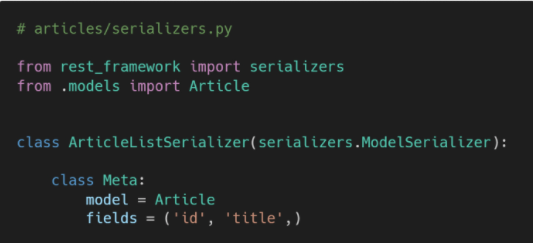

* 'many' argument

   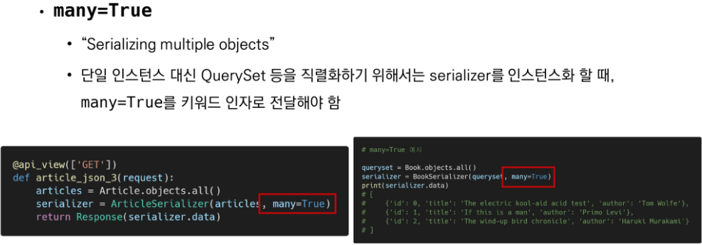


* Build RESTful API

  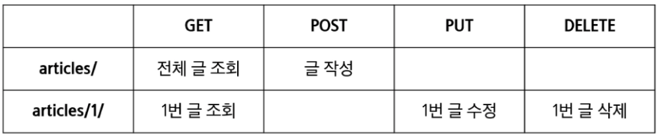

  

#### 1. GET - Article List

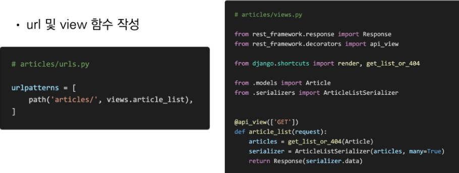

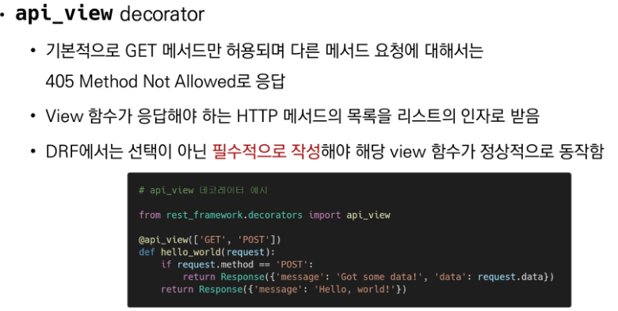

#### 2. GET - Article Detail

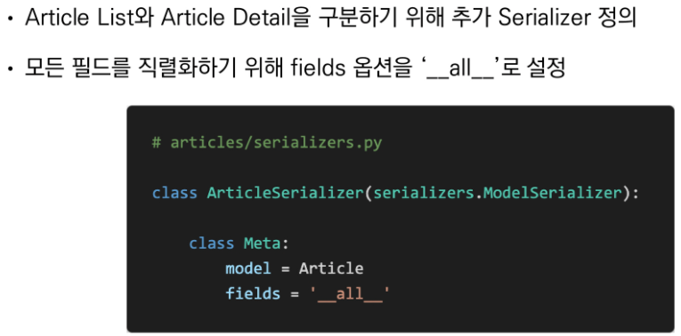

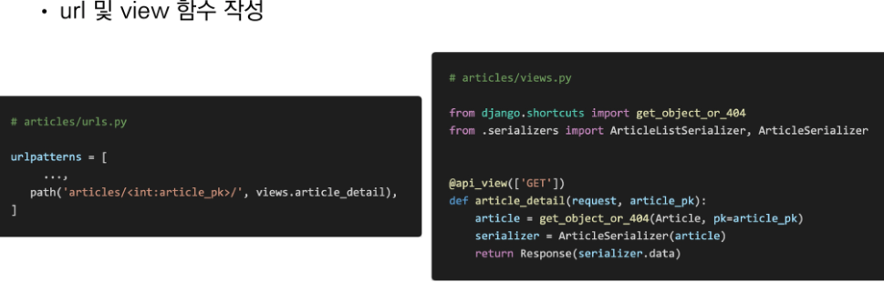

#### 3. POST - Create Article

 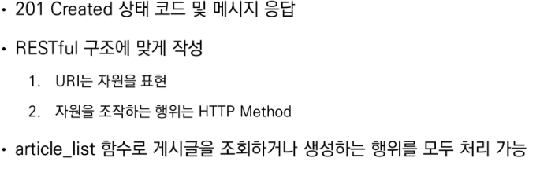

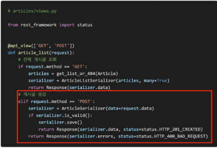

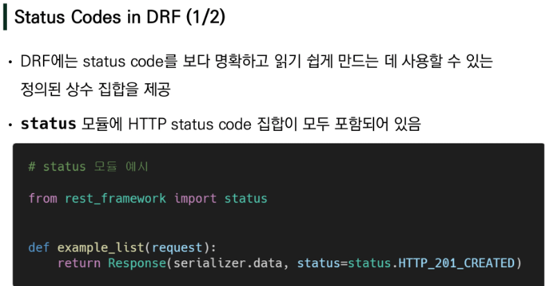

> http://127.0.0.1:8000/api/v1/articles/


 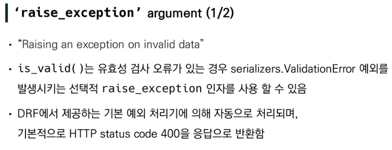

​    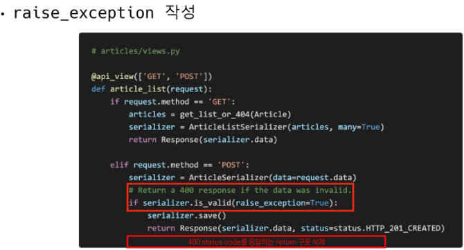


#### 4. DELETE - Delete Article

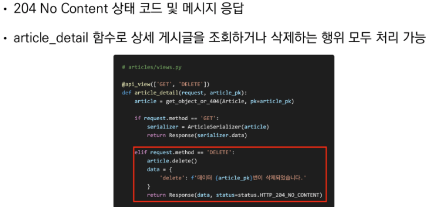

> http://127.0.0.1:8000/api/v1/articles/1/


#### 5. PUT - Update Article

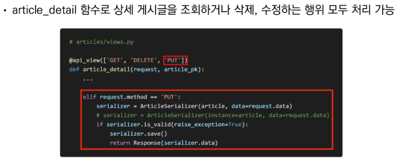

* HTTP body에 form-data로 title과 content 수정 데이터 작성
* http://127.0.0.1:8000/api/v1/articles/1/


## [5] 1:N Relation

* DRF with 1:N Relation
  * 1:N 관계에서의 모델 data를 직렬화하여 JSON으로 변환하는 방법에 대한 학습
  * 2개 이상의 1:N 관계를 맺는 모델을 두고 CRUD 로직을 수행 가능하도록 설계하기

* Comment 모델 작성

  ```python
  class Comment(models.Model):
      article = models.ForeignKey(Article, on_delete=models.CASCADE)
      content = models.TextField()
      created_at = models.DateTimeField(auto_now_add=True)
      updated_at = models.DateTimeField(auto_now=True)
  ```

  * migration 작업 후 data seed 진행

  ```bash
  $ python manage.py seed articles --number=20
  ```


#### 1. GET - Comment List

```python
# articles/serializers.py
class CommentSerializer(serializers.ModelSerializer):

    class Meta:
        model = Comment
        fields = '__all__'
 
# views.py
@api_view(['GET'])
def comment_list(request):
    comments = get_list_or_404(Comment)
    serializer = CommentSerializer(comments, many=True)
    return Response(serializer.data)
```

* http://127.0.0.1:8000/api/v1/comments/로 GET 요청


#### 2. GET - Comment Detail

```python
# views.py
@api_view(['GET'])
def comment_detail(request, comment_pk):
    comments = get_object_or_404(Comment, pk=comment_pk)
    serializer = CommentSerializer(comments)
    return Response(serializer.data)
```

* http://127.0.0.1:8000/api/v1/comments/1/로 GET 요청


#### 3. POST - Create Comment

```python
# views.py
@api_view(['POST'])
def comment_create(request, article_pk):
    article = get_object_or_404(Article, pk=article_pk)
    serializer = CommentSerializer(data=request.data)
    if serializer.is_valid(raise_exception=True):
        serializer.save(article=article)
        return Response(serializer.data, status=status.HTTP_201_CREATED)
```

* Passing Additional attributes to `.save()`

  * 특정 Serializer 인스턴스를 저장하는 과정에서 추가적인 데이터를 받을 수 있음

* http://127.0.0.1:8000/api/v1/articles/1/comments/로 POST 요청 재시도

* Read Only Field 읽기 전용 필드

  ```python
  class CommentSerializer(serializers.ModelSerializer):
  
      class Meta:
          model = Comment
          fields = '__all__'
          read_only_fields = ('article',)
  ```

  * 어떤 게시글에 작성하는 댓글인지에 대한 정보를 form-data로 넘겨주지 않았기 때문에 직렬화하는 과정에서 article 필드가 유효성검사를 통과하지 못함
  * 이때는 읽기 전용 필드 설정을 통해 직렬화하지 않고 반환값에만 해당 필드가 포함될 수 있도록 설정할 수 있음


#### 4. DELETE&PUT - delete, update Comment

```python
# views.py
@api_view(['GET', 'DELETE', 'PUT'])
def comment_detail(request, comment_pk):
    comment = get_object_or_404(Comment, pk=comment_pk)
    
    if request.method == 'GET':
        serializer = ArticleSerializer(comment)
        return Response(serializer.data)

    elif request.method == 'DELETE':
        comment.delete()
        data = {
            'delete': f'댓글 {comment_pk}번이 삭제되었습니다.'
        }
        return Response(data, status=status.HTTP_204_NO_CONTENT)

    elif request.method == 'PUT':
        serializer = CommentSerializer(comment, data=request.data)
        if serializer.is_valid(raise_exception=True):
            serializer.save()
            return Response(serializer.data)
```

* http://127.0.0.1:8000/api/v1/comments/2/로 DELETE 요청 후 응답 확인
* http://127.0.0.1:8000/api/v1/comments/3/로 PUT 요청 후 응답 확인


### 1:N Serializer

#### 1. 특정 게시글에 작성된 댓글 목록 출력하기

* Seializer는 기존 필드를 override하거나 추가 필드를 구성할 수 있음

* (1) PrimaryKeyRelatedField

  ```python
  # serializers.py
  class ArticleSerializer(serializers.ModelSerializer):
      comments = serializers.PrimaryKeyRelatedField(many=True, read_only=True)
  
      class Meta:
          model = Article
          fields = '__all__'
          
  # models.py
  article = models.ForeignKey(...related_name='comments'),
  ```

  > 필드가 to many relationships(N)를 나타내는데 사용되는 경우 many=True 필요

  * http://127.0.0.1:8000/api/v1/articles/1/로 GET 요청

* (2) Nested relationships

  ```python
  # serializers.py
  class ArticleSerializer(serializers.ModelSerializer):
      comment_set = CommentSerializer(many=True, read_only=True)
      
      class Meta:
          model = Article
          fields = '__all__'
  ```

  * http://127.0.0.1:8000/api/v1/articles/1/로 GET 요청


#### 2. 특정 게시글에 작성된 댓글의 개수 구하기

```python
# serializers.py
class ArticleSerializer(serializers.ModelSerializer):
    comment_set = CommentSerializer(many=True, read_only=True)
    comment_count = serializers.IntegerField(source='comment_set.count', read_only=True)

    class Meta:
        model = Article
        fields = '__all__'
```

* 'source' arguments
  * 필드를 채우는데 사용 할 속성의 이름
  * 점 표기법을 사용하여 속성을 탐색할 수 있음
  * comment_set이라는 필드에 . 을 통해 전체 댓글의 개수 확인 가능
  * .count()는 built-in Queryset API 중 하나

* http://127.0.0.1:8000/api/v1/articles/1/로 GET 요청


* #### 주의사항 'read_only_fields' shortcut issue

  * 특정 필드를 override 혹은 추가한 경우 read_only_fields shortcut으로 사용할 수 없음

  

  
