# JavaScript 01 - 기초 

## 1. Intro

* 브라우저 : 웹 서버에서 이동하며 클라이언트와 서버 간 양방향으로 통신하고, HTML 문서나 파일을 출력하는 GUI 기반의 소프트웨어. 인터넷의 컨텐츠를 검색 및 열람하도록 함. 웹 브라우저.
* JavaScript 의 필요성 : 브라우저 화면을 동적으로 만들기 위함. 브라우저를 조작할 수 있는 유일한 언어


## 2. DOM

* 브라우저에서 할 수 있는 일
  * DOM 조작 - 문서 조작
  * BOM 조작 - navigator, screen, locaton, frames, history, Iteration
  * JavaScript core (ECMAScript) - Data Structure, Conditional Expression, Iteration

* DOM 이란?

  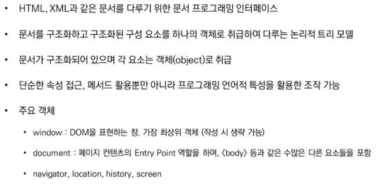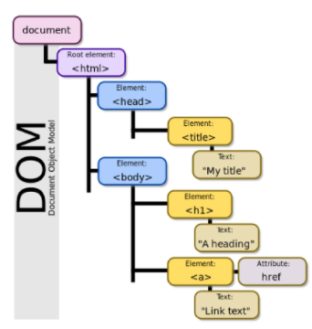

* DOM - 해석
  * 파싱 (Parsing) - 구문 분석, 해석. 브라우저가 문자열을 해석하여 DOM Tree로 만드는 과정

* DOM - 조작
  * 개발자 도구 - Console - document, document.title ...


* BOM 이란?
  * Browser Object Model. 자바스크립트가 브라우저와 소통하기 위한 모델
  * 브라우저의 창이나 프레임을 추상화해서 프로그래밍적으로 제어할 수 있도록 제공하는 수단
    * 버튼, URL 입력창, 타이틀 바 등 브라우저 윈도우 및 웹 페이지 일부분을 제어 가능\
  * window 객체는 모든 브라우저로부터 지원받으며 브라우저의 창을 지칭

* BOM - 조작
  * 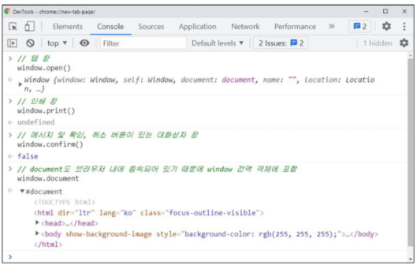


* JavaScript Core - 프로그래밍 언어
  * 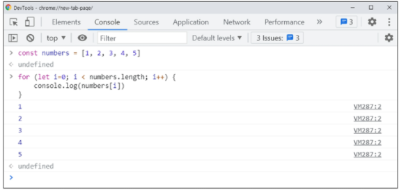


### DOM 조작

> Document는 문서 한 장(HTML)에 해당하고 이를 조작
>
> 순서 : 선택 , 변경

* DOM 관력 객체의 상속 구조
  * EventTarget - Event Listener를 가질 수 있는 객체가 구현하는 DOM 인터페이스
* Node - 여러가지 DOM 타입들이 상속하는 인터페이스

 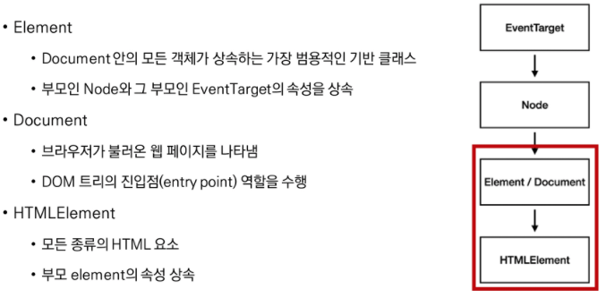


#### ◆ DOM 선택 

* 선택 관련 메서드

   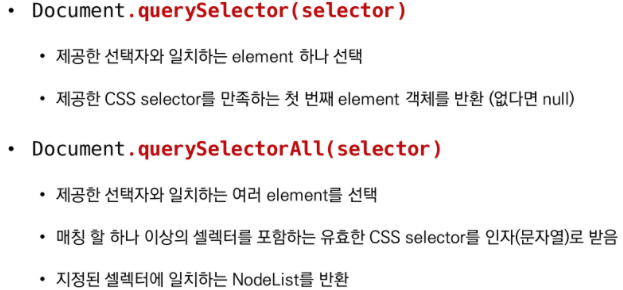

   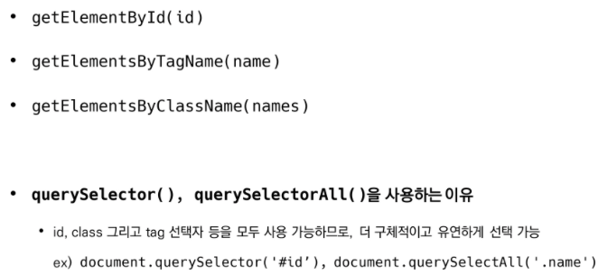

* 선택 메서드별 반환 타입
  * 단일 element - **querySelector()**, getElementById()
  * HTMLCollection - getElementsByTagName(), getElementsByClassName(), 
  * NodeList - **querySelectorAll()**

* HTMLCollection & NodeList

  

* Collection

  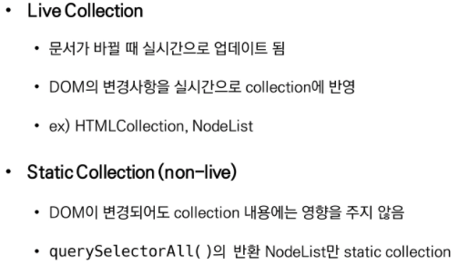

```html
<h1>Hello SSAFY</h1>
<h2 id="location-header">Location</h2>
<div>
  <ul>
    <li class="ssafy-location">서울</li>
    <li class="ssafy-location">대전</li>
    <li class="ssafy-location">광주</li>
    <li class="ssafy-location">구미</li>
    <li class="ssafy-location">부울경</li>
  </ul>
</div>
```

```javascript
// 1. Selection
// 1-1. window & document
console.log(window)
console.log(document)
console.log(window.document)

// 1-2. querySelector
const h1 = document.querySelector('h1')
const h2 = document.querySelector('h2')
const secondH2 = document.querySelector('#location-header')
const selectUlTag = document.querySelector('div > ul')

// 1-3. querySelectorAll
const liTags = document.querySelectorAll('li')
const secondLiTags = document.querySelectorAll('.ssafy-location')
```


#### ◆ DOM 변경

* 변경 관련 메서드 (Creation)

   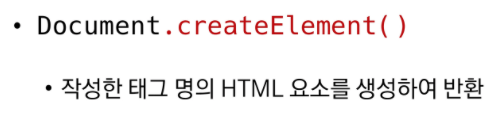

   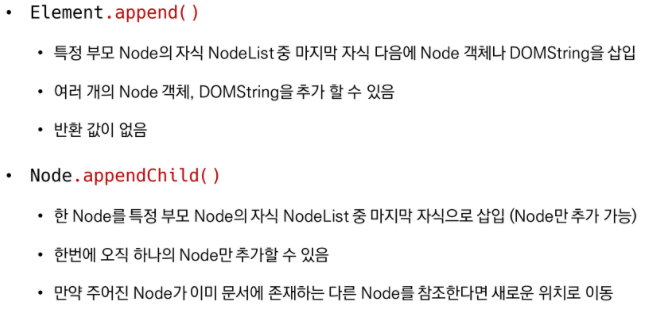

  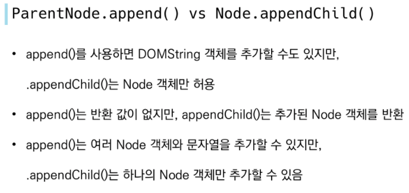

* 변경 관련 속성 (property)

   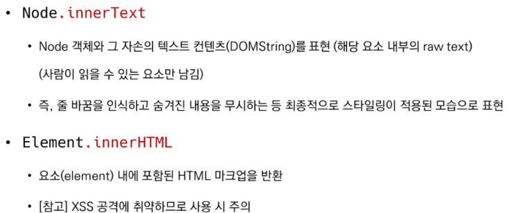

  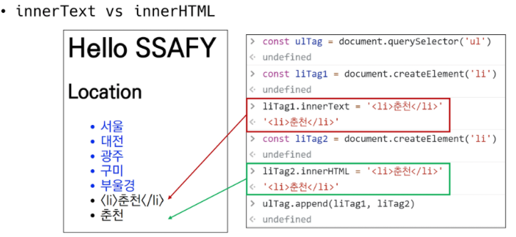

  

```javascript
// 2. Creation & Append
// 2-1. createElement
const ulTag = document.querySelector('ul')
const newLiTag = document.createElement('li')

// 2-2. append
const ulTag = document.querySelector('ul')
const newLiTag = document.createElement('li')
newLiTag.innerText = '새로운 리스트 태그'
ulTag.append(newLiTag)
ulTag.append('문자열도 추가 가능')

const new1 = document.createElement('li')
new1.innerText = '리스트 1'
const new2 = document.createElement('li')
new2.innerText = '리스트 2'
const new3 = document.createElement('li')
new3.innerText = '리스트 3'
ulTag.append(new1, new2, new3)

// 2-3. appendChild
const ulTag = document.querySelector('ul')
const newLiTag = document.createElement('li')
newLiTag.innerText = '새로운 리스트 태그'
ulTag.appendChild(newLiTag)
ulTag.appendChild('문자열은 추가 불가')

const new1 = document.createElement('li')
new1.innerText = '리스트 1'
const new2 = document.createElement('li')
new2.innerText = '리스트 2'
ulTag.appendChild(new1, new2)

// 2-2. innerText & innerHTML
const ulTag = document.querySelector('ul')
const liTag1 = document.createElement('li')
liTag1.innerText = '<li>춘천</li>'
const liTag2 = document.createElement('li')
liTag2.innerHTML = '<li>춘천</li>'
ulTag.append(liTag1, liTag2)

const ulTag = document.querySelector('ul')
ulTag.innerHTML = '<li><a href="javascript:alert(\'당신의 개인정보 유출\')">춘천</a></li>'
```


#### ◆ XSS (Cross-site Scripting)

* 공격자가 웹 사이트 클라이언트 측 코드에 악성 스크립트를 삽입해 공격하는 방법

* 피해자의 브라우저가 악성 스크립트를 실행하며 공격자가 엑세스 제어를 우회하고 사용자를 가장할 수 있도록 함 (CSRF 공격과 유사)

  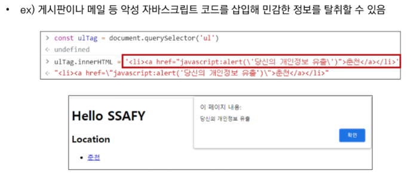


#### ◆ DOM 삭제

* 삭제 관련 메서드

   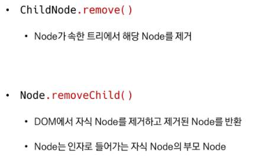

```javascript
// 3. Delete
// 3-1. remove
const header = document.querySelector('#location-header')
header.remove()

// 3-2. removeChild
const parent = document.querySelector('ul')
const child = document.querySelector('ul > li')
const removedChild = parent.removeChild(child)
console.log(removedChild)
```


#### ◆ DOM 속성

* 속성 관련 메서드

   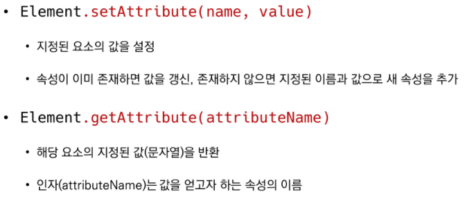

```javascript
// 4. 속성
// 4-1. setAttribute
const header = document.querySelector('#location-header')
header.setAttribute('class', 'ssafy-location')

// 4-2. getAttribute
const getAttr = document.querySelector('.ssafy-location')
getAttr.getAttribute('class')
getAttr.getAttribute('style')
```


#### ◆ DOM 조작 - 정리

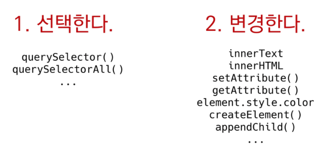


## 3. Event

* 네트워크 활동이나 사용자와의 상호작용 같은 사건의 발생을 알리기 위한 객체
* 이벤트 발생 - 마우스클릭, 키보드 누르기 등 사용자 행동으로 발생할 수 도 있음. 
  * 특정한 메서드를 호출(Element.Click())하여 프로그래밍적으로도 만들어 낼 수 있음


* Event 기반 인터페이스
  * AnimationEvent, ClipboardEvent, DragEvent 등
  * UIEvent
    * 간단한 사용자 인터페이스 이번트
    * Event의 상속을 받음
    * MouseEvent, KeyboardEvent, InputEvent, FocusEvent 등의 부모 객체 역할을 함

* Event 역할 : 특정 이벤트가 발생**하면** 할 일을 등록**한다**.


### ◆ Event handler - addEventLister()

 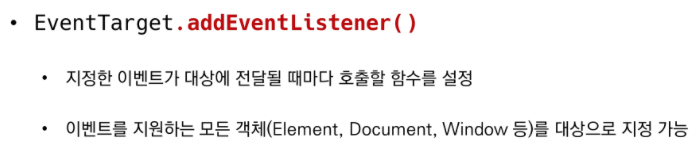

 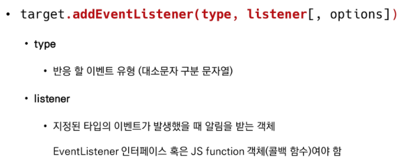

* DOM 상속 구조 
  * EventTarget (EventLister를 가질 수 있는 객체가 구현하는 DOM 인터페이스) 
  * → Node → Element/Document → HTMLElement

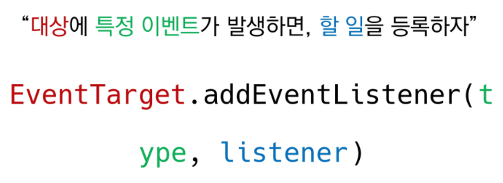

```javascript
// 1
const alertMessage = function () {
    alert('메롱!!!')
}

// 2-1
const myButton = document.querySelector('#my-button')
myButton.addEventListener('click',alertMessage)

// 2-2
const myTextInput = document.querySelector('#my-text-input')
myTextInpu.addEventListener('input', function (event) {
    // console.log(event)
    const myPtag = document.querySelector('#my-paragraph')
    myPtag.innerText = event.target.value
})

// 2-3
const colorInput = document.querySelector('#change-color-input')
const changeColor = function (event) {
    const h2Tag = document.querySelector('h2')
    h2Tag.style.color = event.target.value
}
colorInput.addEventListener('input', changeColor)
```


### ◆ Event 취소

 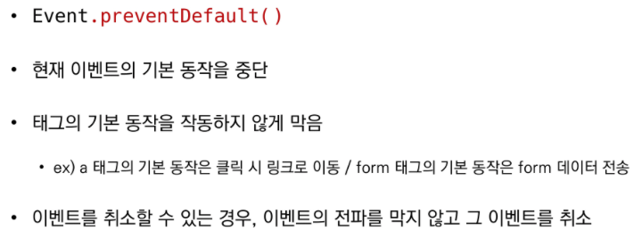

* 취소할 수 없는 이벤트도 존재
  * `event.cancelable: false` 로 확인

```javascript
// 1
const checkBox = document.querySelector('#my-checkbox')

checkBox.addEventListener('click', function (event) {
    event.preventDefault()
    console.log(event)
})

// 2
const formTag = document.querySelector('#my-form')

formTag.addEventListener('submit', function (event) {
    console.log(event)
    event.preventDefault()
    event.target.reset()
})

// 3
const aTag = document.querySelector('#my-link')

aTag.addEventListener('click', function (event) {
    console.log(event)
    event.preventDefault()
})

// 4
document.addEventListener('scroll', function (event) {
    console.log(event)
    event.preventDefault()
})
```


### ◆ Event 실습

```html
<form action="#">
    <input type="text">
    <button>Add</button>
</form>
<ul>
</ul>

<script>
    function addTodo(todo) {
        // input 선택 및 value 값 선택
        const input = document.querySelector('input')
        const content = input.value

        if (content.trim()) {
            // <li> tag 만들기
            const liTag = document.createElement('li')
            liTag.innerText = content

            // <ul> 안에 <li> 넣기
            const ulTag = document.querySelector('ul')
            ulTag.appendChild(liTag)
        } else {
            alert('할 일을 입력해주세요.')
        }
        event.target.reset()
    }

    const form = document.querySelector('form')
    form.addEventListener('submit', addTodo)
</script>
```


