# JavaScript 02 - JS 심화

## 1. AJAX

* AJAX 란?

  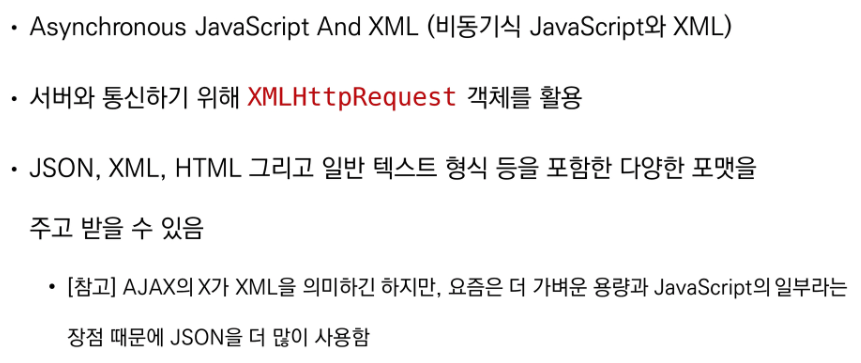

* AJAX 특징

  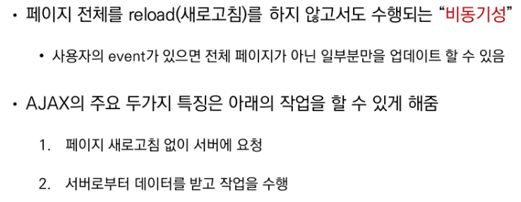

* XMLHttpRequest 객체

  * 서버와 상호작용하기 위해 사용되며 전체 페이지의 새로고침 없이 데이터를 받아올 수 있음

  * 사용자의 작업을 방해하지 않으면서 페이지 일부를 업데이트 할 수 있음

  * 주로 AJAX 프로그래밍에 사용

  * 이름과 달리 XML뿐만 아니라 모든 종류의 데이터를 받아올 수 있음

  * 생성자 : XMLHttpReqeust()

  * 예시

    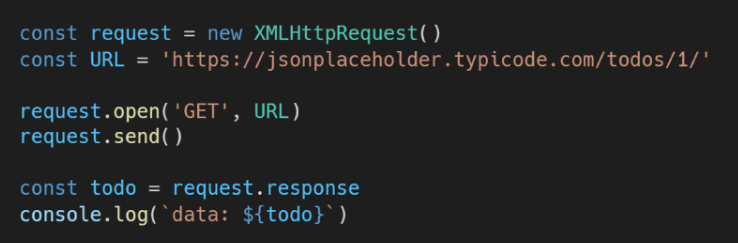

    * console에 todo 데이터가 출력되지 않음
    * 데이터 응답을 기다리지 않고 console.log()를 먼저 실행했기 때문

## 2. Asynchronous JavaScript

​				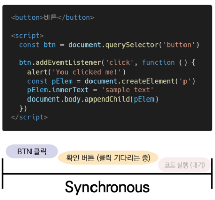

* #### 동기식

  * 순차적, 직렬적 Task 수행

  * 요청을 보낸 후 응답을 받아야만 다음 동작이 이루어짐 (blocking)

  * 버튼 클릭 후 alert 메시지의 확인 버튼을 누를 때 까지 문장이 만들어지지 않음

  * 즉, alert 이후의 코드는 alert의 처리가 끝날때 까지 실행되지 않음

* #### 비동기식

  * 병렬적 Task 수행
  * 요청을 보낸 후 응답을 기다리지 않고 다음 동작이 이루어짐 (non-blocking)
  * 요청을 보내고 응답을 기다리지 않고 다음 코드가 실행됨
  * 결과적으로 변수  todo에는 응답데이터가 할당되지 않고 빈 문자열이 출력
  * JavaScript는 single threaded
  * 왜 비동기를 사용하는가?
    * 데이터를 불러오는 동안 지속적으로 응답하는 화면을 보여줌으로써 더운 쾌적한 사용자 경험을 제공

> Threads : 프로그램이 작업을 완료하기 위해 사용할 수 있는 단일 프로세스. 각 스레드는 한번에 하나의 작업만 수행할 수 있음

 

* Concurrency model

  * Event loop을 기반으로 하는 동시성 모델 	(한개씩만 처리할 수 있는데 여러개 하는거 처럼 보이게)

  1. Call Stack : 요청이 들어올때 마다 해당 요청을 순차적으로 처리하는 Stack(LIFO) 형태의 자료구조
  2. WebAPI (BrowserAPI) : setTimeout(), Dom events 그리고 AJAX로 데이터를 가져오는 시간이 소요되는 일들을 처리
  3. Task Queue (Event Queue, Message Queue) : 비동기 처리된 callback 함수가 대기하는 Queue(FIFO)형태의 자료구조. main thread가 끝난 후 실행되어 후속 JavaScript 코드가 차단되는 것을 방지
  4. Event Loop : Call Stack이 비어있는지 확인. 비어있는 경우 Task Queue에서 실행 대기중인 callback 함수가 있는지 확인. 있다면 가장 앞에 있는 callback 함수를 Call Stack으로 push

* Zero delays

  

   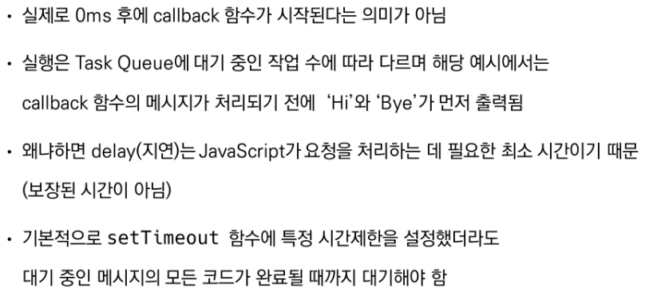

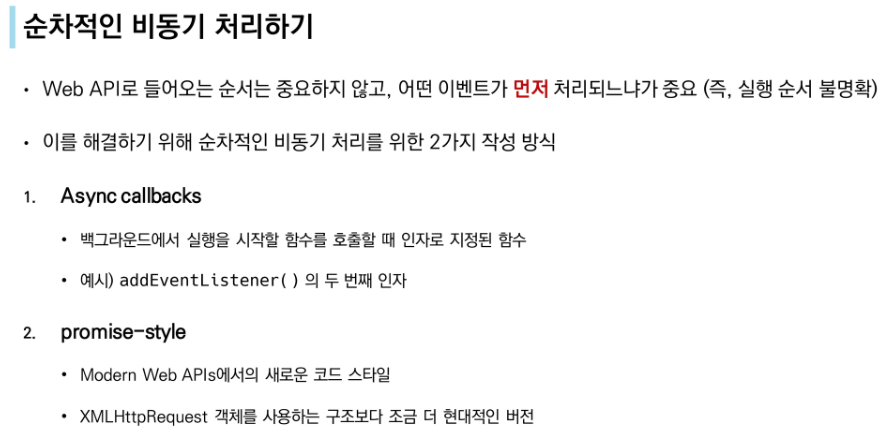

### ◆ callback Function

* 다른 함수에 인자로 전달된 함수
* 외부 함수 내에서 호출되어 일종의 루틴 또는 작업을 완료함
* 동기식, 비동기식 모두 사용됨
* 비동기 작업이 완료된 후 코드 실행을 계속하는 데 사용되는 경우를 비동기 콜백이라고 함

 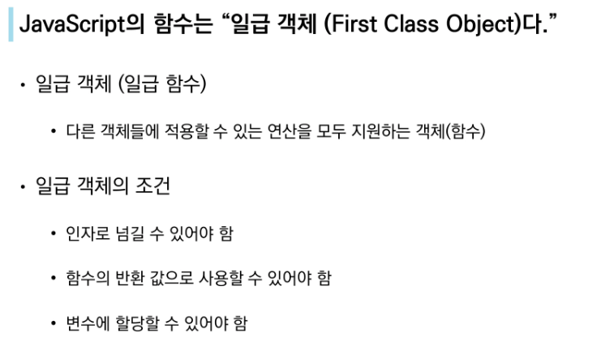

 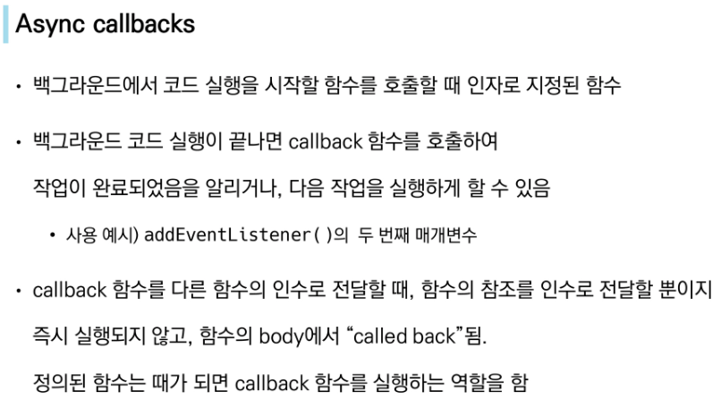

* Why use callback?

  * callback 함수는 명시적인 호출이 아닌 특정 루틴 혹은 action에 의해 호출되는 함수
  * Django의 경우 "요청이 들어오면", event의 경우 "특정 이벤트가 발생하면"이라는 조건으로 함수를 호출할 수 있었던 건 'Callback function'개념 때문에 가능

  * 비동기 로직을 수행할 때 callback 함수는 필수

* callback Hell

  * 순차적인 연쇄 비동기 작업을 처리하기 위해 "callback 함수 호출, 그 다음 호출,..."의 패턴이 지속적으로 반복됨
  * 즉, 여러개의 연쇄 비동기 작업을 할 때 마주하는 상황
  * 이를 **callback Hell(콜백 지옥)** 혹은 pyramid of doom(파멸의 피라미드)이라 함
  * 위와같은 상황이 벌어질 경우 디버깅, 코드 가독성 들을 통제하기 어려움

  * 해결하기
    1. Keep your code shallow
    2. Modularize
    3. Handle every single error 
    4. Promise callbacks (Promise 콜백 방식 사용)

### ◆ Promise

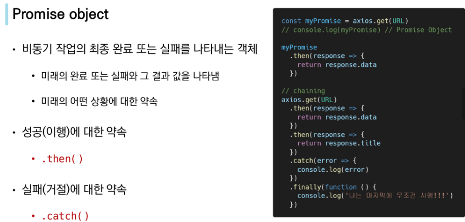

* Promise methods

   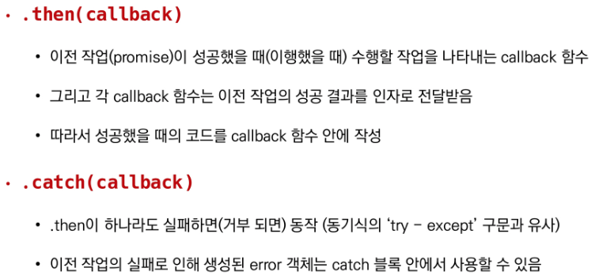

  

   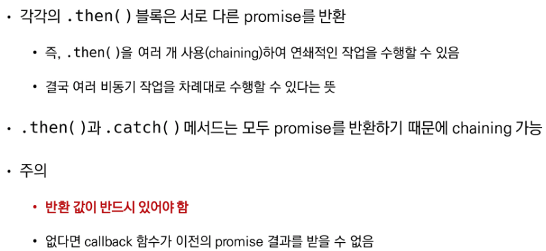

  

   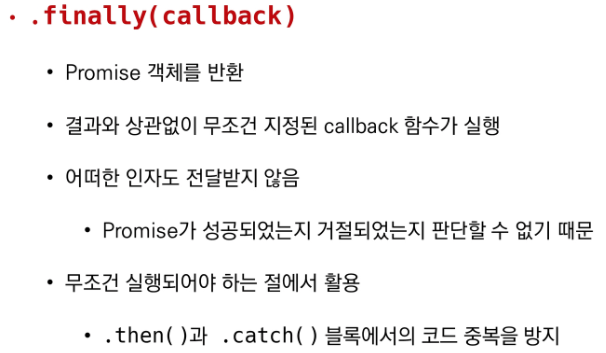

  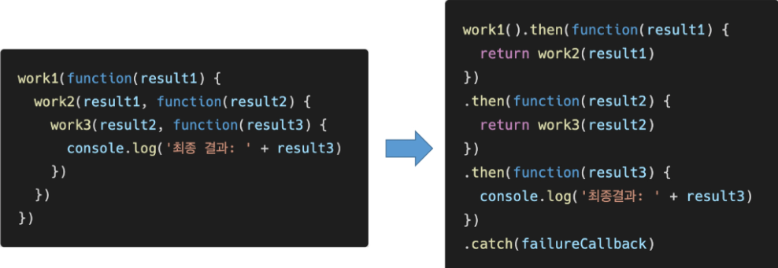

 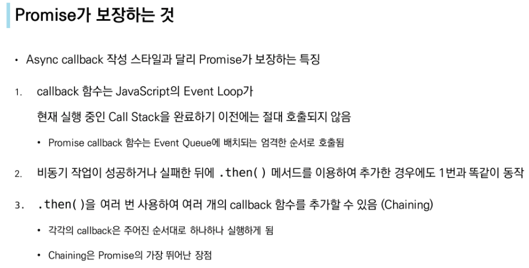

### ◆ Axios

 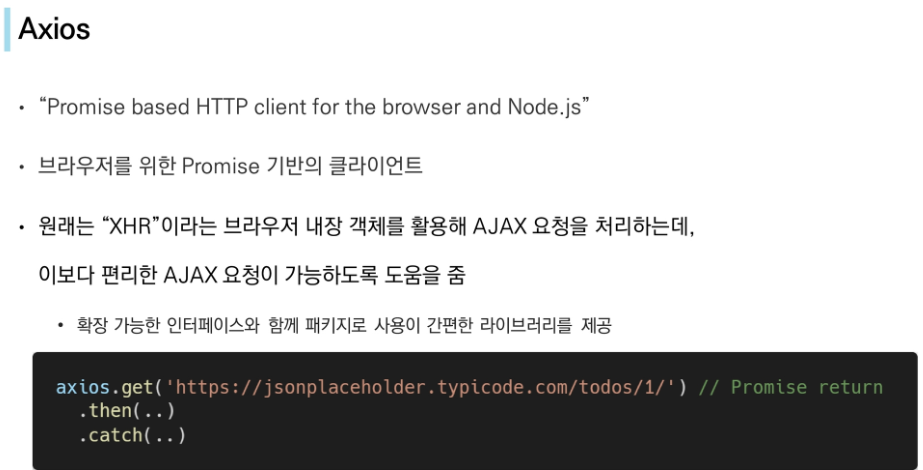

 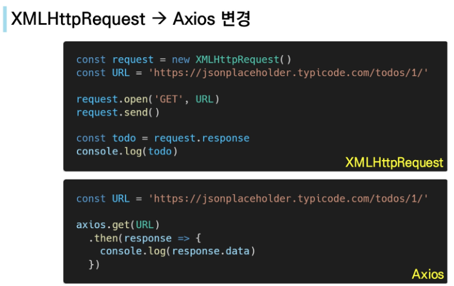

 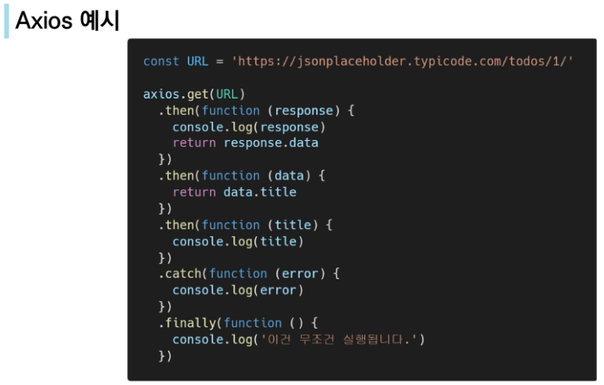

> 부록
>
> 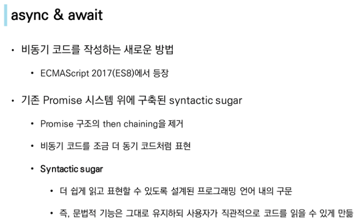

