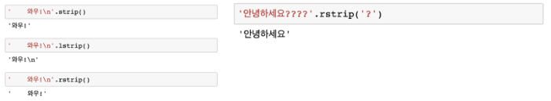
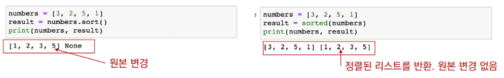
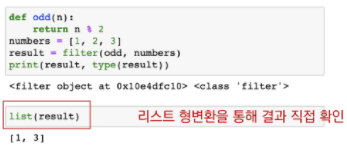
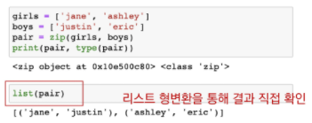
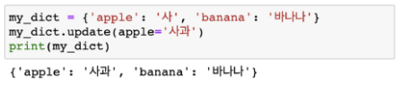
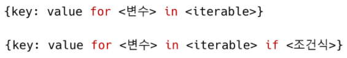

# [1] 데이터구조

> 데이터에 편리하게 접근하고, 변경하기 위해 데이터를 저장하거나 조작하는 법
>
> '자료구조' 라고도 함

* 순서가 있는 데이터 구조 : 문자열(String), 리스트(List)
* 순서가 없는 데이터 구조 : 세트(Set), 딕셔너리(Dictionary)
* 

## 1. 문자열

> 변경할 수 없고(Immutable), 순서가 있고(ordered), 순회 가능한(iterable)


### 문자열 조회/탐색

* `.find(x)` : x의 첫 번째 위치를 반환. 없으면 -1 반환

* `.index(x)` : x의 첫 번째 위치를 반환. 없으면 오류 발생


### 문자열 변경

* `.replace(old, new[,count])` : 바꿀 대상 글자를 새로운 글자로 바꿔서 반환. count를 지정하면, 해당 개수만큼만 시행

  

* `.strip([chars])` : 특정한 문자들을 지정하면,

  * 양쪽을 제거(strip), 왼쪽을 제거(lstrip), 오른쪽을 제거(rstrip)
  * 문자열을 지정하지 않으면 공백을 제거함

  

* `.split([chars])` : 문자열을 특정한 단위로 나눠 리스트로 반환

  

* `'seperator'.join([iterable])` : 반복가능한(iterable) 컨테이너 요소들을 seperator(구분자)로 합쳐 문자열 반환

  

* `capitalize()` : 앞글자를 대문자로
* `title()` : ' 나 공백 이후를 대문자로
* `upper()` : 모두 대문자로
* `lower()` : 모두 소문자로
* `swapcase()` : 대<->소문자로 변경하여


### 문자열 관련 검증 메소드

* `.isalpha()` : 알파벳 문자 여부(한국어도 포함)

* `.isupper()` : 대문자 여부

* `.islower()` : 소문자 여부

* `.istitle()` : 타이틀 형식 여부

* `.isdecimal()` ⊆ `.isdigit()` ⊆ `.isnumeric()`
| isdecimal() | isdigit() | isnumeric() |            Example             |
| :---------: | :-------: | :---------: | :----------------------------: |
|    True     |   True    |    True     |     "038", "੦੩੮", "０３８"     |
|    False    |   True    |    True     |      "⁰³⁸", "🄀⒊⒏", "⓪③⑧"       |
|    False    |   False   |    True     | "↉⅛⅘", "ⅠⅢⅧ", "⑩⑬㊿", "壹貳參" |
|    False    |   False   |    False    |      "abc", "38.0", "-38"      |


## 2. 리스트

>  변경 가능하고(mutable), 순서가 있고(ordered), 순회 가능한(iterable)


### 값 추가 및 삭제

* `.append(x)` : 값 추가

* `.extend(iterable)` : iterable의 항목을 추가함

  

* `.insert(i,x)` : 정해진 위치 i에 값을 추가함

  * 리스트 길이보다 큰 경우 맨 뒤

* `.remove(x)` : 리스트에서 값이 x인 첫번째 항목 삭제

  * 없는 경우 ValueError

* `.pop(i)` : 정해진 위치 i에 있는 값을 삭제하고, 그 항목을 반환함

  * i 가 지정되지 않으면, 마지막 항목을 삭제하고 반환함

* `.clear()` : 모든 항목을 삭제함


### 탐색 및 정렬

* `.index(x)` : x값을 찾아 해당 index 값을 반환

  * 없는 경우 ValueError

* `.count(x)` : 원하는 값 x의 개수를 반환함

* `.sort()` : 원본 리스트를 정렬. None 반환. / sorted 함수와 비교할 것

  

* `.reverse()` : 순서를 반대로 뒤집음(정렬 x)


### 리스트 복사

> 리스트 복사는 같은 리스트의 주소를 참조 
>
> => 해당 주소의 일부 값을 변경하는 경우 이를 참조하는 모든 변수에 영향

* 얕은 복사(shallow copy) 1 : Slice 연산자 활용 (다른 주소) 

   

* 얕은 복사(shallow copy) 2 : list() 활용 (다른 주소)

   

* 얕은 복사 주의사항 : 복사하는 리스트의 원소가 주소를 참조하는 경우

   


* 깊은 복사(deep copy)

  


### List comprehension

> 표현식과 제어문을 통해 특정한 값을 가진 리스트를 생성하는 법


* 실습

```python
[number**3 for number in range(1, 4)]   		#[1, 8, 27]
[x for x in range(1, 4) if x % 2 == 0]			#[2]
[(boy,girl) for boy in boys for girl in girls]	#[(justin,jane),(),,]
```


### Built-in Function

* `map(function, iterable)` : 순회가능한 데이터구조의 모든 요소에 함수를 적용, 결과를 map object로 반환

  

  * 활용사례 : input 값들을 숫자로 바로 활용하고 싶을 때

    ```python
    n, m = map(int, input().split())
    ```

* `filter(function, iterable)` : 순회가능한 데이터구조의 모든 요소에 함수를 적용, 그 결과가 True인 것들을 filter object로 반환

  

* `zip(*iterables)` : 복수의 iterable을 모아 튜플을 원소로 하는 zip object를 반환

  


## 3. 세트

> 변경 가능하고(mutable), 순서가 없고(unordered), 순회 가능한(iterable)

* `.add(elem)` : 값을 추가
* `.update(*others)` : 여러 값을 추가
* `.remove(elem)` : 세트에서 삭제하고, 없으면 KeyError
* `.discard(elem)` : 세트에서 삭제하고 없어도 에러가 발생하지 않음
* `.pop()` : 임의의 원소를 제거해 반환


## 4. 딕셔너리

> 변경 가능하고(mutable), 순서가 없고(unordered), 순회 가능한(iterable)


### 조회

* `.get(key[,default])` : key를 통해 value를 가져옴

  * KeyError가 발생하지 않으며, default 값을 설정할 수 있음(기본 : None)

    

### 추가 및 삭제

* `.pop(key[,default])` : key가 딕셔너리에 있으면 제거하고 해당 값을 반환

  * 그렇지 않으면 default 반환, default값이 없으면 KeyError

    

* `.update()` : 값을 제공하는 key, value로 덮어씀

  


### 딕셔너리 순회

> 딕셔너리는 기본적으로 key를 순회하며, key를 통해 값을 활용
>
> 추가 메서드를 활용하여 순회할 수 있음

* keys() : Key로 구성된 결과
* values() : Value로 구성된 결과
* items() : (Key, Value)의 튜플로 구성된 결과


### Dictionary Comprehension



* 실습

  ```python
  dusts = {'서울':72, '대전':82, '구미':29, '광주45}
  {key: value for key, value in dusts.items() if value > 70}
           										# {'서울':72, '대전':82}
  ```


* comprehension 실습

```python
numbers = [1, 2, 3]
"""
변수 numbers를 '123'으로 만드시오.
"""

#list comprehension
a = ''.join([str(num) for num in numbers])		# '123'

#map function
b = ''.join(map(str,numbers))					# '123'

```

>  comprehension에서 if else 사용시 앞쪽으로 이동


