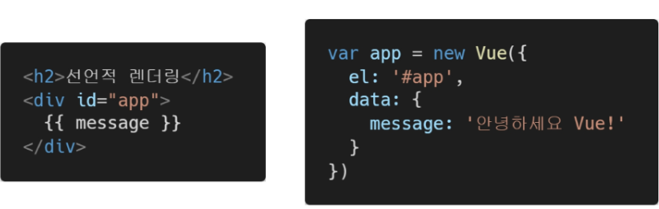
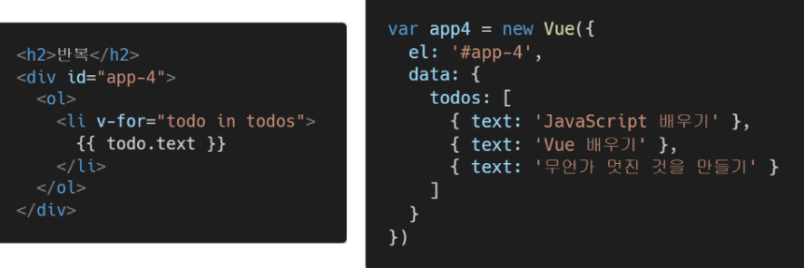
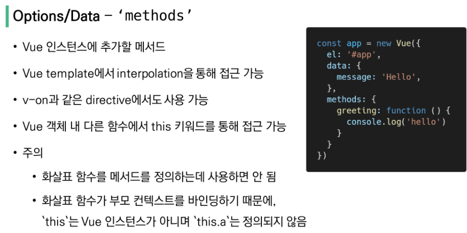
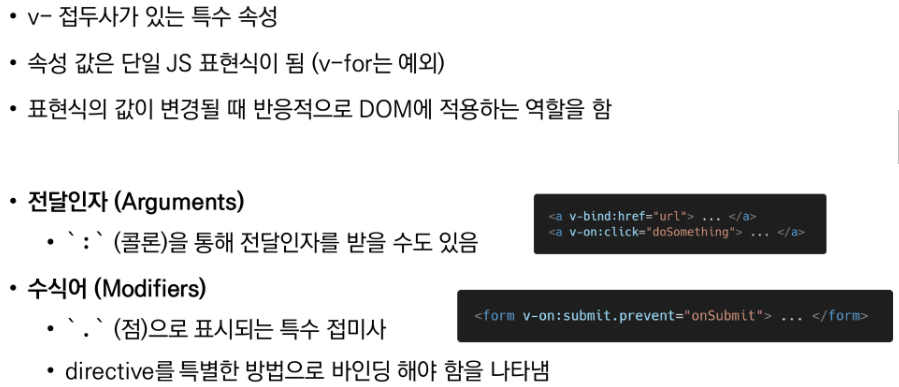
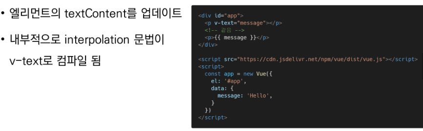
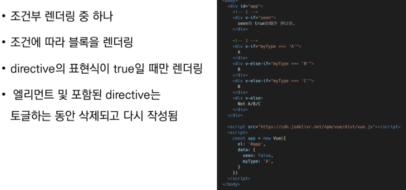
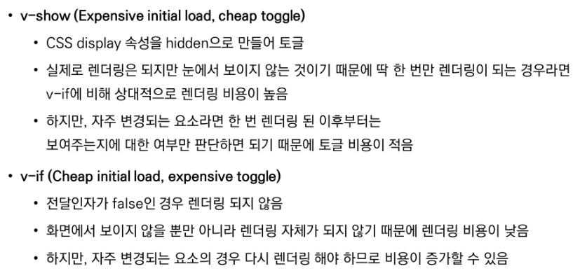
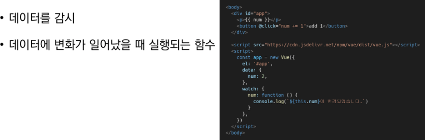

# Vue 01 - CDN을 활용한 기초

## Intro

* Front-End Development
  * HTML, CSS, JavaScript를 활용해서 데이터를 볼 수 있게 만들어 줌
  * 대표적인 프론트엔드 프레임워크 : Vue.js, React, Angular
* Vue.js
  * 사용자 인터페이스를 만들기 위한 진보적인 자바스크립트 프레임워크
  * 현대적인 tool과 다양한 라이브러리를 통해 SPA(Single Page Application)를 완벽하게 재현
* SPA : (Single Page Application) 단일 페이지 애플리케이션
  * 현재 페이지를 동적으로 렌더링함으로써 사용자와 소통하는 웹 애플리케이션
  * 단일페이지로 구성되며 서버로부터 최초에만 페이지를 다운로드하고, 이후에는 동적으로 DOM을 구성 - 필요한 부분만 동적으로 다시 작성함
  * 연속되는 페이지간의 사용자 경험(UX)을 향상
  * 동작 원리의 일부가 CSR의 구조를 따음
  * 등장 배경 : 모바일 최적화의 필요성이 대두됨
* CSR : Client Side Rendering
  * 서버에서 화면을 구성하는 SSR방식과 달리 클라이언트에서 화면을 구성
  * 최초 요청 시 HTML, CSS, JS 등 데이터를 제외한 각종 리소스를 응답받고 이후 클라이언트에서는 필요한 데이터만 요청에 JS로 DOM을 렌더링하는 방식
  * 즉, 처음엔 뼈대만 받고 브라우저에서 동적으로 DOM을 그림
  * SPA가 사용하는 렌더링 방식
  * 장점
    * 서버와 클라이언트 간 트래픽 감소 - 필요한 모든 정적 리소스 최초한번만 다운로드후 갱신
    * 사용자 경험 (UX) 향상 - 전체 다시 렌더링하지 않고 변경부분만 갱신하기 때문
  * 단점
    * SSR에 비해 전체 페이지 렌더링 시점이 느림
    * SEO(검색 엔진 최적화)에 어려움이 있음 (최초 문서에 데이터가 없기 때문)
* SSR : Server Side Rendering
  * 서버에서 클라이언트에게 보여줄 페이지를 모두 구성하여 전달하는 방식
  * JS 웹 프레임워크 이전에 사용되던 전통적인 렌더링 방식
  * 장점
    * 초기 구동 속도고 빠름
    * SEO(검색 엔진 최적화)에 적합 - DOM에 이미 모든 데이터가 작성되어있기 때문
  * 단점
    * 모든 요청마다 새로운 페이지를 구성하여 전달
      * 반복되는 전체 새로고침으로 인해 사용자 경험이 떨어짐
      * 트래픽이 많아 서버 부담 클 수 있음

* SSR & CSR

   

   

> 


## Why Vue.js?

* 현대 웹 페이지는 페이지 규모가 계속해서 커지고 있으며, 그만큼 사용하는 데이터도 늘어나고 사용자와의 상호작용도 많이 이루어짐

* 결국  Vanilla JS 만으로는 관리하기가 어려움

* 비교 

   


## Concepts of Vue.js

* MVVM Pattern
  * 애플리케이션 로직을 UI로부터 분리하기 위해 설계된 디자인 패턴
  * 구성 요소 : Model, View, View Model


## Quick Start


> 공식문서 - https://kr.vuejs.org/v2/guide/

* CDN 작성

  ```html
  <!-- 1. Vue CDN -->
  <script src="https://cdn.jsdelivr.net/npm/vue/dist/vue.js"></script>
  ```

* 선언적 렌더링

  

* Element 속성 바인딩

  

* 조건문

  

* 반복문

  

* 사용자 입력 핸들링

  


## Basic Syntax





## Template Syntax

> 렌더링 된 DOM을 기본 Vue 인스턴스의 데이터에 선언적으로 바인딩할 수 있는 HTML 기반 템플릿 구문을 사용

### 1. Interpolation (보간법)

​		

### 2. Directive (디렉티브)

​		


#### ◆ v-text



#### ◆ v-html


#### ◆ v-show


#### ◆ v-if, v-else-if, v-else



#### ◆ v-show 와 v-if



#### ◆ v-for


#### ◆ v-bind


#### ◆ v-model


### Options/Data

#### - `computed`


* computed & method

  * computed 속성 대신 methods에 함수를 저의할 수도 있음 - 접근방식은 서로 동일

  * 차이점은 computed 속성은 종속 대상을 따라 저장(캐싱)됨

  * 즉, computed는 종속된 대상이 변경되지 않는 한 computed에 작성된 함수를 여러번 호출해도 계산을 다시 하지 않고 계산되어 있던 결과를 반환

  * 이에 비해 methods를 호출하면 렌더링을 다시 할 때마다 항상 함수를 실행

  * > computed 사용할땐 () 사용 안함 - 값을 사용하기 때문 `{{ reverseMessageComputed }}`
    >
    > method는 함수 호출이기 때문에 () 사용`{{ reverseMessageMethod() }}`


### -`watch`



* computed & watch

  * computed

    * 특정 데이터를 직접적으로 사용/가공하여 다른 값으로 만들 때 사용
    * 속성은 계산해야 하는 목표 데이터를 정의하는 방식으로 소프트웨어 공학에서 이야기하는 '선언형 프로그래밍' 방식
    * **'특정값이 변동하면 해당 값을 다시 계산해서 보여준다.'**
    *  반환값이 필수

    ```javascript
    // <p>Computed: a의 제곱은 {{ square }} 입니다.</p>
    computed: {
        square: function () {
            console.log('Computed !')
            return this.a**2
        }
    },
    ```

  * watch

    * 특정 데이터의 변화 상황에 맞춰 **다른 data등이 바뀌어야 할 때 주로 사용**
    * 감시할 데이터를 지정하고 그 데이터가 바뀌면 특정 함수를 실행하는 방식
    * 소프트웨어 공학에서 이야기하는 '명령형 프로그래밍' 방식
    * **'특정 값이 변동하면 다른 작업을 한다.'**
    * 특정 대상이 변경되었을 때 콜백 함수를 실행시키기 위한 트리거

    ```javascript
    // <p>Watch: a는 {{ increase }} 만큼 증가했습니다.</p>
    watch: {
        a: function (newValue, oldValue) {
            console.log('Watch !')
            this.increase = newValue - oldValue
        }
    }
    ```

    > a가 변경되면 변경된 값을 콜백함수의 첫번째 인자로 전달하고 이전 값을 두번째 인자로 전달

> 선언형 프로그래밍 : 계산해야 하는 목표 데이터를 정의 (computed)
>
> 명령형 프로그래밍 : 데이터가 바뀌면 특정 함수를 실행해! (watch)


### Options/Assets

#### - `filter`


## Lifecycle Hooks

 


* created hook : Vue 인스턴스가 생성된 후에 호출됨


## lodash library

 


