# Vue 02 - Vue CLI와 Vue router

## 1. SFC (Single File Component)

* Component (컴포넌트)
  * 기본 HTML 엘리먼트를 확장하여 재사용 가능한 코드를 캡슐화 하는데 도움을 줌
  * CS에서는 다시 사용할 수 있는 범용성을 위해 개발된 소프트웨어 구성 요소를 의미
  * 즉, 컴포넌트는 유지보수를 쉽게 만들어 줄 뿐만 아니라, 재사용성의 측면에서도 매우 강력한 기능을 제공
  * Vue 컴포넌트 === Vue 인스턴스

* SFC (Single File Component)
  * Vue의 컴포넌트 기반 개발의 핵심 특징
  * 하나의 컴포넌트는 .vue 확장자를 가진 하나의 파일 안에서 작성되는 코드의 결과물
  * 화면의 특정 영역에 대한 HTML, CSS, JavaScript 코드를 하나의 파일(.vue)에서 관리
  * 즉, .vue 확장자를 가진 싱글 파일 컴포넌트를 통해 개발하는 방식
  * Vue 컴포넌트 === Vue 인스턴스 === .vue 파일

* Component 예시
  * 단일 파일 관리 : 처음 쉽게 개발 가능. 코드 양이 많아지면 변수 관리가 힘들고 유지보수 많은 비용 발생
  * 한 화면을 구성하는 여러 컴포넌트 - 각 기능 별로 파일 나눠서 개발 
    * 처음 개발 준비하는 단계에서 시간 소요 증가.
    * 이후 변수 관리 용이, 기능별로 유지보수 비용 감소

* Vue Component 구조 예시
  * 한 화면 안에서도 기능별로 다른 컴포넌트가 존재
    * 하나의 컴포넌트는 여러개의 하위 컴포넌트를 가질 수 있음
    * Vue는 컴포넌트 기반의 개발 환경 제공
  * Vue 컴포넌트는 `const app = new Vue({...})`의 app을 의미하며 이는 Vue 인스턴스
    * 컴포넌트 기반의 파일이 반드시 파일 단위로 구분되어야 하는 것은 아님
    * 단일 .html파일 안에서도 여러개의 컴포넌트를 만들어 개발 가능


## 2. Vue CLI

> Vue.js 개발을 위한 표준 도구
>
> 프로젝트의 구성을 도와주는 역할을 하며 Vue 개발 생태계에서 표준 tool 기준을 목표로 함
>
> 확장 플러그인, GUI, ES2015 구성요소 제공 등 다야한 tool 제공

* Node.js
  * 자바스크립트를 브라우저가 아닌 환경에서도 구동할 수 있도록 하는 자바스크립트 런타임 환경
  * 단순히 브라우저만 조작할 수 있던 자바스크립트를 SSR 아키텍처에서도 사용할 수 있도록 함

* NPM (Node Package Manage)
  * 자바스크립트 언어를 위한 패키지 관리자 (Python의 pip)
  * Node.js의 기본 패키지 관리자. 함께 설치됨


* Vue CLI Quick Start
  * 설치 `$ npm install -g @vue/cli`
  * 버전 확인 `$ vue --version`
  * 프로젝트 생성 `$ vue create my-first-app` (Vue2 선택)
  * 프로젝트 디렉토리 이동 `$ cd my-first-app`
  * 서버 실행 `$ npm run serve`


### Babel & Webpack

* Babel : 'JavaScript compiler'
  * 자바스크립트의 ECMAScript 2015+ 코드를 이전 버전으로 번역/변환해주는 도구
  * 원시코드(최신버전)를 목적코드(구 버전)로 옮기는 번역기가 등장하면서 개발자는 더이상 내 코드가 특정 브라우저에서 동작하지 않는 상황에 대해 크게 고민하지 않을 수 있게 됨
* Webpack : 'static module bundler'
  * 모듈간의 의존성 문제를 해결하기 위한 도구
  * 프로젝트에 필요한 모든 모듈을 매핑하고 내부적으로 종속성 그래프를 빌드함

* Static **Module** Bundler
  * 모듈은 단지 파일 하나를 의미 (ex. 스크립트 하나 === 모듈 하나)
  * 과거 모듈 시스템 - AMD, CommonJS, UMD
  * 모듈시스템이 2015년 표준으로 등재되었으며, 현재는 대부분의 브라우저와 Node.js가 모듈시스템 지원
* Module 의존성 문제
  * 모듈의 수가 많아지고 라이브러리 혹은 모듈간의 의존성(연결성)이 깊어지면서 특정한 곳에서 발생한 문제가 어떤 모듈간의 문제인지 파악하기 어려워짐
  * 즉, Webpack은 이 모듈 간의 의존성 문제를 해결하기 위해 등장

* Static Module **Bundler**
  * 모듈 의존성 문제를 해결해 주는 작업을 Bundling이라 함
  * 여러 모듈을 하나로 묶어주고 묶인 파일은 하나(혹은 여러개)로 합쳐짐
  * Bundling된 결과물은 더이상 순서에 영향을 받지 않고 동작하게 됨
  * Vue CLI는 이러한 Babel, Webpack에 대한 초기 설정이 자동으로 되어있음


* Vue  프로젝트 구조

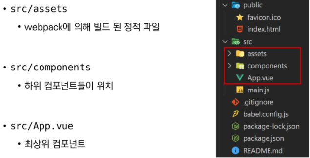

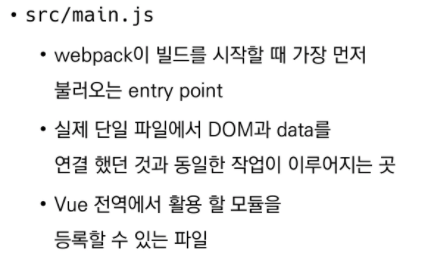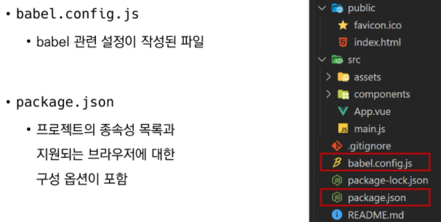

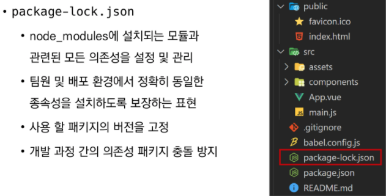


## 3. Pass props & Emit event

* 컴포넌트 작성

  * Vue app은 자연스럽게 중첩된 컴포넌트 트리로 구성됨
  * 컴포넌트간 부모-자식 관계가 구성되며 이들 사이에 필연적으로 의사 소통이 필요함

  * 부모는 자식에게 데이터를 전달(Pass props)하며, 
    자식은 자신에게 일어난 일을 부모에게 알림(Emit event)
  * "props는 아래로, events는 위로"

* 컴포넌트 구조

  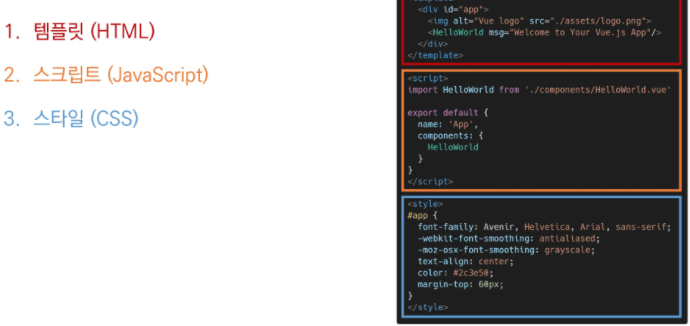

  * 템플릿 (HTML) : HTML의 body부분. 각 컴포넌트를 작성
  * 스크립트 : JavaScript가 작성되는 곳. 
                      컴포넌트 정보, 데이터, 메서드 등 vue 인스턴스를 구성하는 대부분이 작성됨
  * 스타일 : CSS가 작성되며 컴포넌트의 스타일을 담당

* 컴포넌트 등록 3단계

  1. 불러오기

  2. 등록하기

  3. 보여주기

     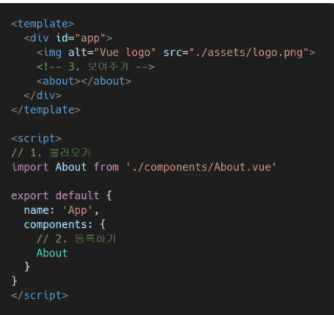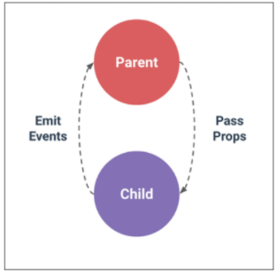

     > Child : `About`

* Props
  * props는 부모(상위) 컴포넌트의 정보를 전달하기 위한 사용자 지정 특성
  * 자식(하위) 컴포넌트는 props 옵션을 사용하여 수신하는 props를 명시적으로 선언해야 함
  * 즉, 데이터는 props 옵션을 사용하여 자식 컴포넌트로 전달됨
  * 주의 : 자식 컴포넌트의 템플릿에서 상위 데이터를 직접 참조할 수 없음

* Static Props 작성

  * 자식 컴포넌트(About.vue)에 보낼 prop 데이터 선언

  * 작성법 : `prop-data-name="value"`

  * 수신 할 prop 데이터를 명시적으로 선언 후 사용

    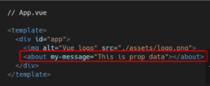

* Dynamic Props 작성

  * v-bind directive를 사용해 부모의 데이터의 props를 동적으로 바인딩

  * 부모에서 데이터가 업데이트 될 때마다 자식 데이터로도 전달 됨

  * 마찬가지로 수신 할 prop 데이터를 명시적으로 선언 후 사용

    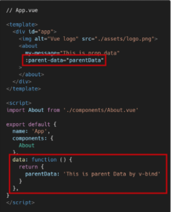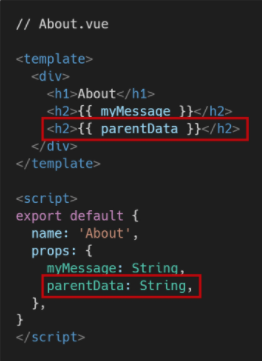

* Props 이름 컨벤션
  * during declaration 선언시 : camelCase
  * in template (HTML) : kebab-case

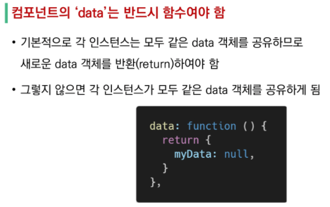

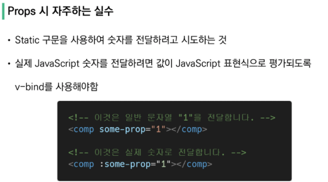

* 단방향 데이터 흐름
  * 모든 props는 하위 속성과 상위 속성 사이의 단방향 바인딩을 형성
  * 부모의 속성이 변경되면 자식의 속성에게 전달되지만, 반대방향으로는 안됨
  * 부모 컴포넌트가 업데이트될 때마다 자식 요소의 모든 prop들이 최신값으로 업데이트됨


* Emit event

  * "Listening to Child Components Events"
  * `$emit(eventName)`
    * 현재 인스턴스에서 이벤트를 트리거
    * 추가 인자는 리스너의 콜백 함수로 전달
  * 부모 컴포넌트는 자식 컴포넌트가 사용되는 템플릿에서 v-on을 사용하여 자식 컴포넌트가 보낸 이벤트를 청취 (v-on을 이용한 사용자 지정 이벤트)

* Emit event 작성

  * 현재 인스턴스에서 $emit 인스턴스 메서드를 사용해 child-input-change 이벤트를 트리거

  * 부모 컴포넌트(App.vue)는 자식 컴포넌트(About.vue)가 사용되는 템플릿에서 v-on directive를 사용하여 자식 컴포넌트가 보낸 이벤트를 청취

    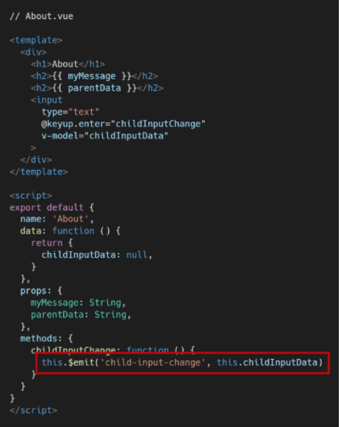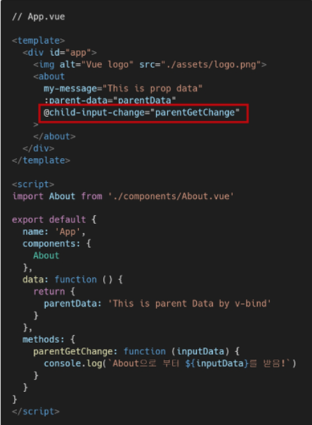

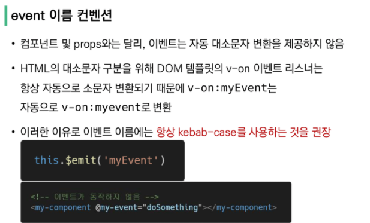


## 4. Vue Router

* Vue Router

  * "Vue.js 공식 라우터"
  * 라우트(route)에 컴포넌트를 매핑한 후, 어떤 주소에서 렌더링할 지 알려줌
  * SPA 상에서 라우팅을 쉽게 개발할 수 있는 기능을 제공

* Vue Router 시작하기

  1. 프로젝트 생성 및 이동 (git에서 받았을 때, `$ npm i`입력)

  2. Vue Router plugin 설치 (Vue CLI 환경) `$ vue add router`

     > [주의] 기존 프로젝트 도중에 추가할 경우 App.vue 덮어쓰므로, 프로젝트 내에서 다음 명령을 실행하기 전에 필요한 경우 파일을 백업(커밋)해야 함

  3. commit 여부 (Yes)

  4. History mode 사용 여부 (Yes)

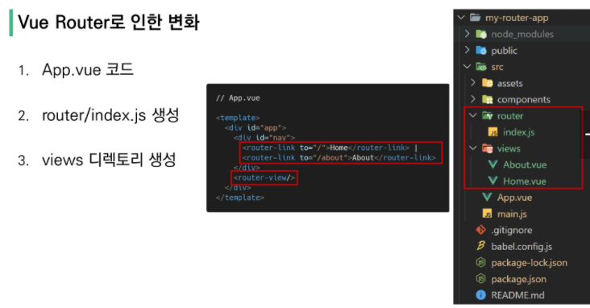

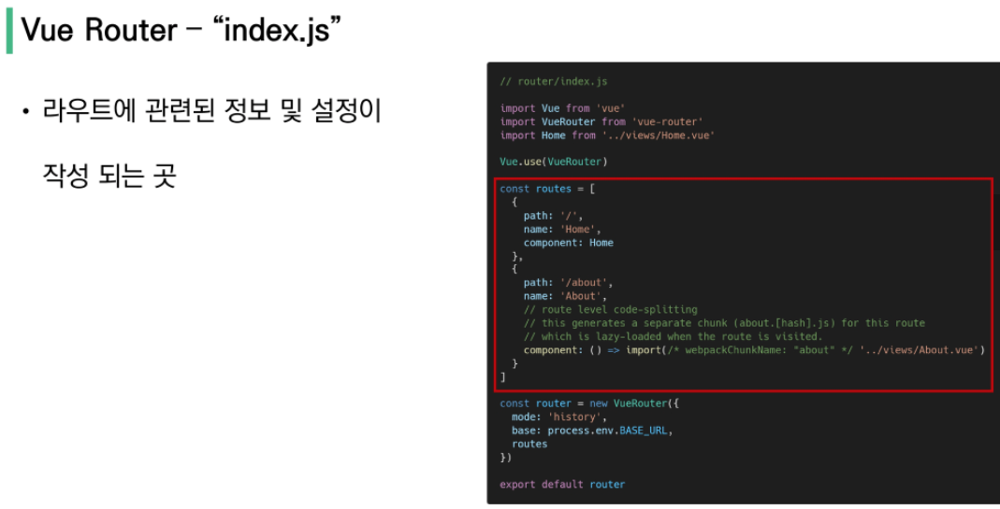


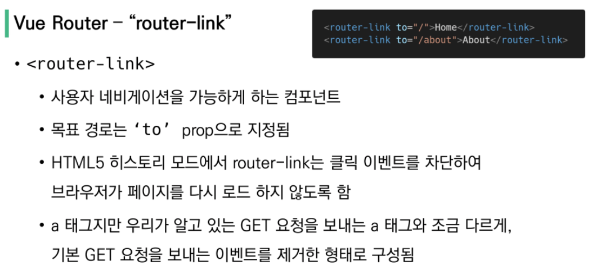

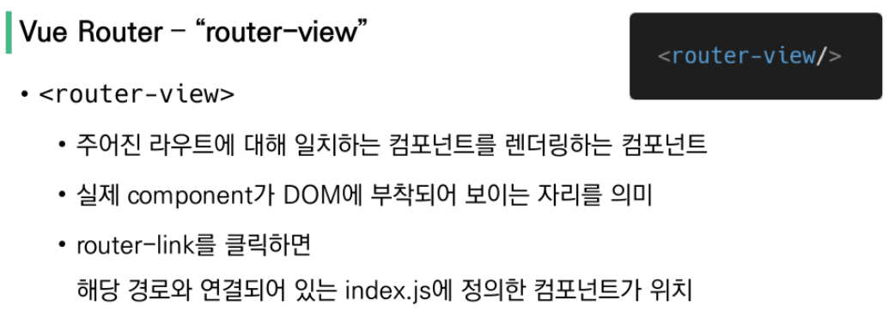

```vue
// App.vue
<template>
  <div id="app">
    <div id="nav">
      <router-link to="/">Home</router-link> |
      <router-link to="/about">About</router-link>
    </div>
    <router-view/>
  </div>
</template>
```

> router-link 로 index.js에 있는 링크 불러온 후, `<router-view/>` 자리에 위치


* History mode
  * HTML History API를 사용하여 router를 구현한 것
  * 브라우저의 히스토리는 남기지만 실제 페이지는 이동하지 않는 기능을 지원
  * 즉, 페이지를 다시 로드하지 않고 URL을 탐색할 수 있음
  * [참고] Histroy API : DOM의 Window 객체는 history 객체를 통해 브라우저의 세션 기록에 접근할 수 있는 방법을 제공


#### 1. Named Routes

   * 이름을 가지는 라우트

   ```vue
   <router-link :to="{ name: 'Home'}">Home</router-link> |
   <router-link :to="{ name: 'About' }">About</router-link>
   ```


#### 2.프로그래밍 방식 네비게이션

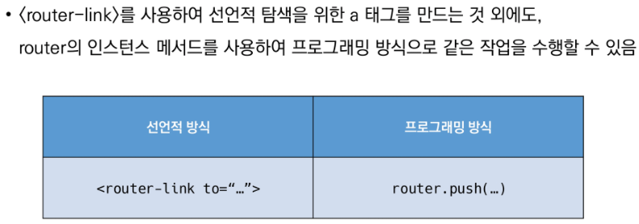

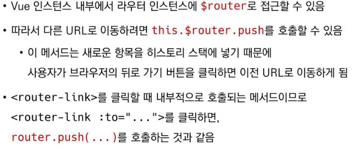

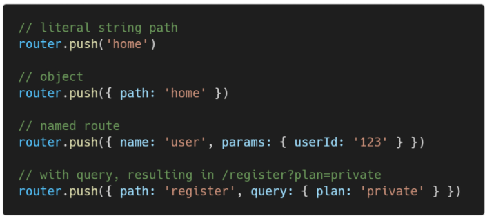

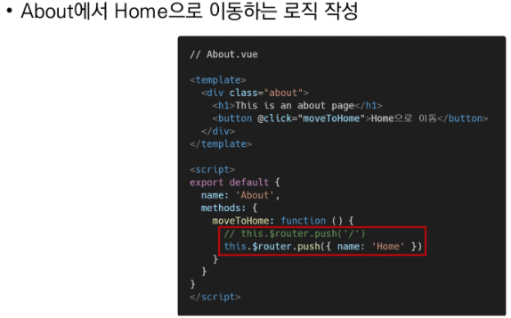


#### 3. Dynamic Route Matching

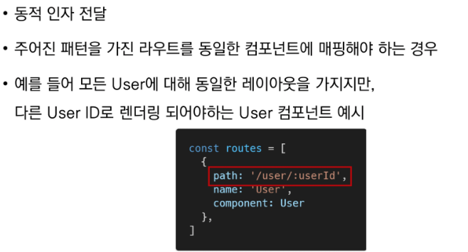

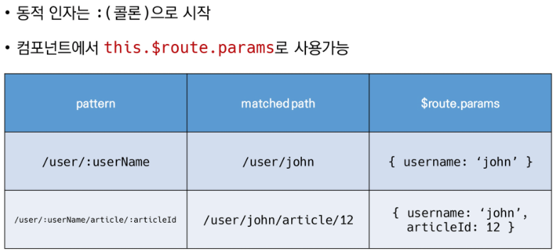

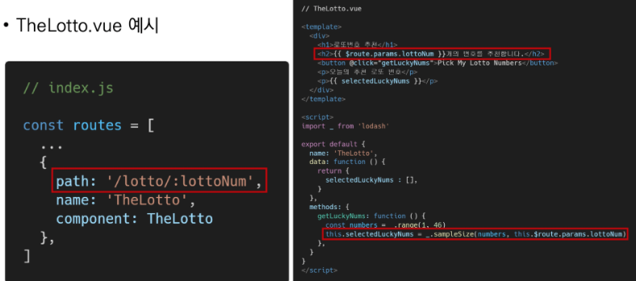


 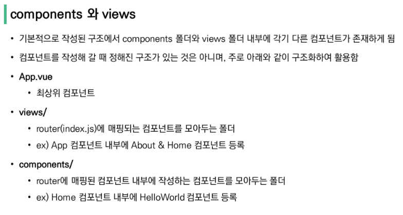

 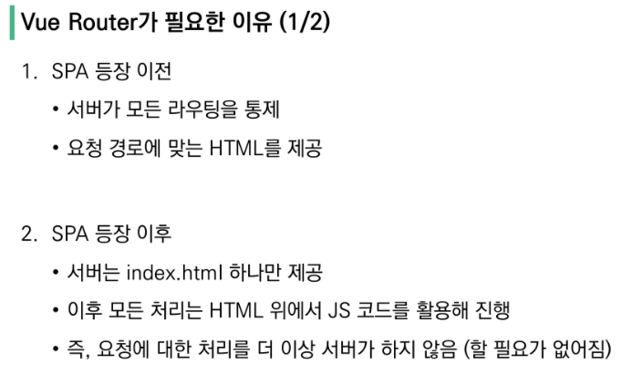

​    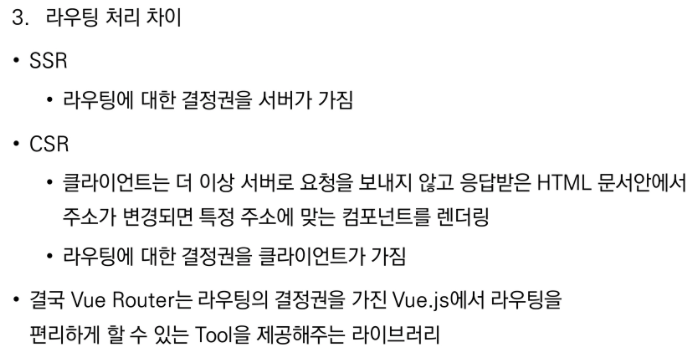


## 5. Youtube Project 

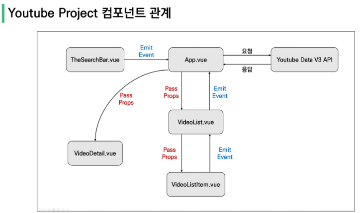

> 유튜브 데이터 요청하는 방법 : https://developers.google.com/youtube/v3/docs/search/list
>
> iframe : https://developers.google.com/youtube/player_parameters?hl=ko


