# Vue 04 - Vue + API 서버 활용

## Server & Client

* Server : 클라이언트에게 정보, 서비스를 제공하는 컴퓨터 시스템
* Client : 서버에게 서비스를 요청하고, 서비스 요청을 위해 필요한 인자가 서버가 요구하는 방식에 맞게 제공하며, 서버로부터 반환되는 응답을 사용자에게 적절한 방식으로 표현하는 기능을 가진 시스템

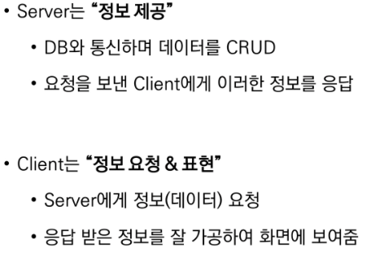

## CORS

* Same-origin policy (SOP) : 동일 출처 정책

* Cross-Origin Resource Sharing (CORS)

   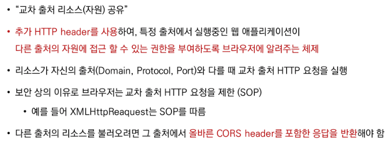

* Cross-Origin Resource Sharing Policy (CORS Policy) <=> SOP

  * 교차 출처 리소스 공유 정책
  * 다른 출처에서 온 리소스를 공유하는 것에 대한 정책

  * 교차 출처 접근 허용하기 - CORS는 HTTP의 일부로, 어떤 호스트에서 자신의 컨텐츠를 불러갈 수 있는지 서버에 지정할 수 있는 방법

* Why CORS?

   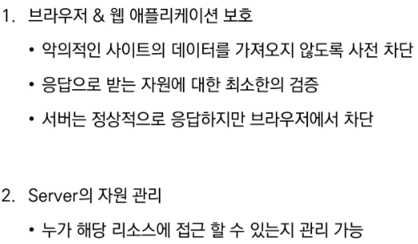

* How CORS?

   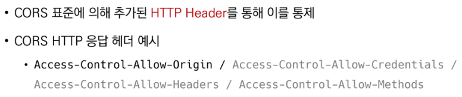

   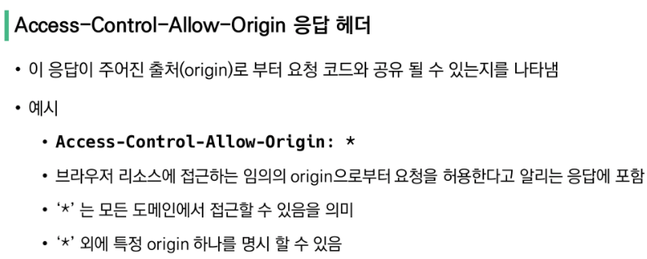

* CORS 시나리오 예시

   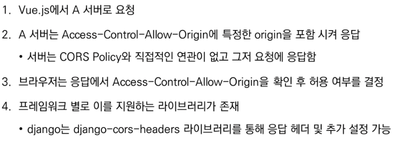

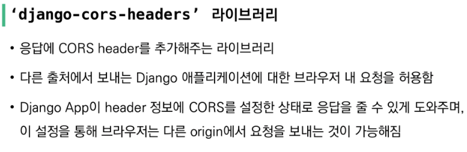

* 실습

## Authentication & Authorization

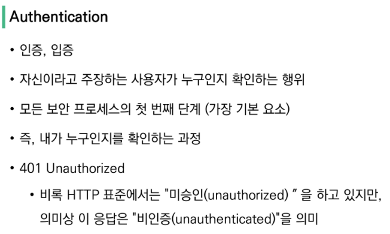

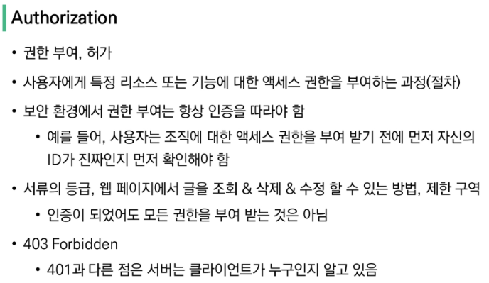

* Authentication vs Authorization

 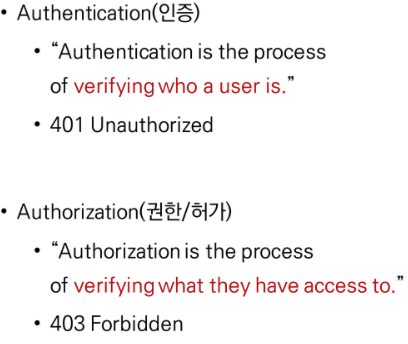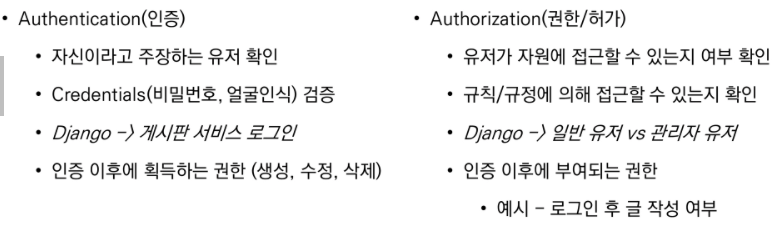

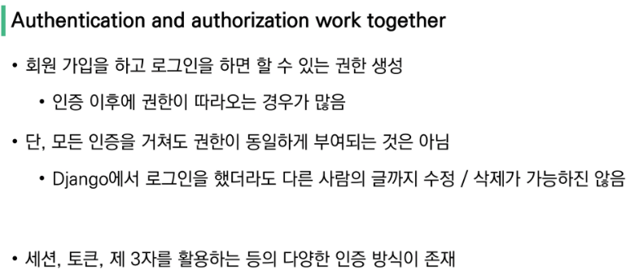

## JWT

* 다양한 인증 방식

  * Session Based

    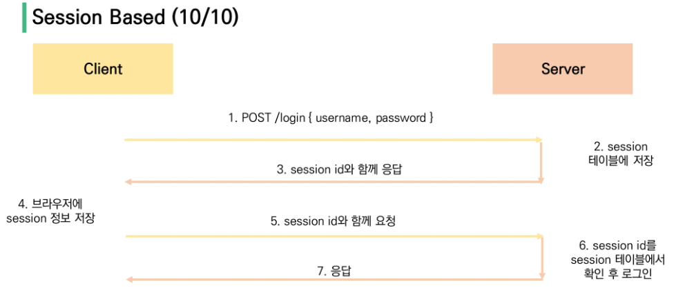

  * Token Based - JWT

  * Authenticated platform - Auth0 ...

### JWT 

 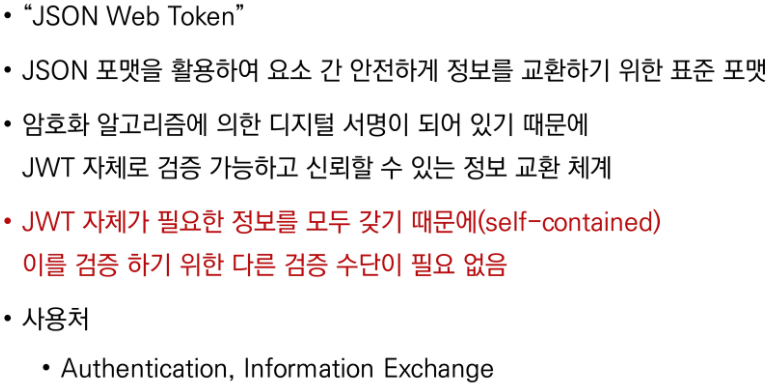

* 특징 

   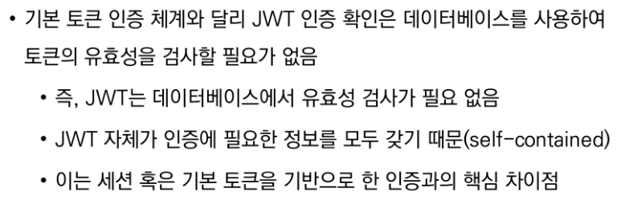

* 활용 이유

   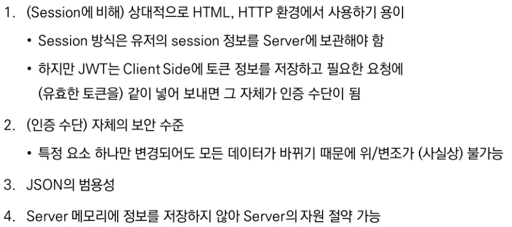

* JWT 구조

  

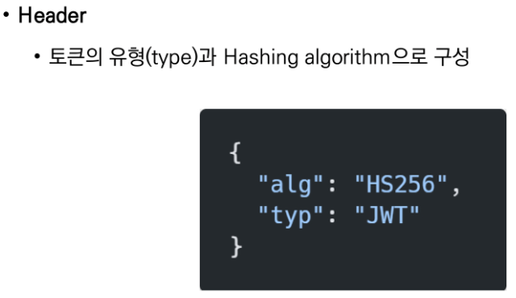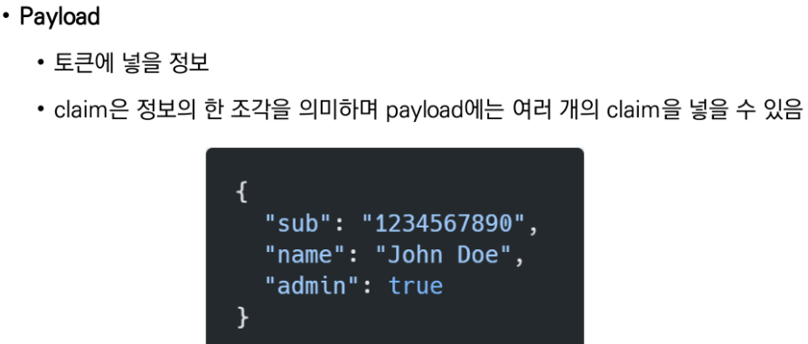

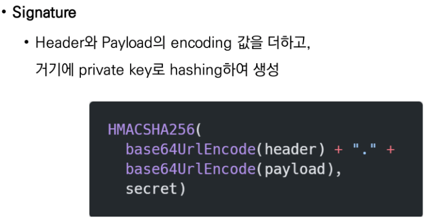

* 예시

  * 로그인 요청

  * 서버에서 로그인 정보를 바탕으로 비밀번호 암호화 및 JWT 발급

  * 발급한 JWT를 클라이언트에게 응답

  * 클라이언트는 서버로부터 받은 JWT를 저장

  * 인증이 필요한 요청 때마다 저장해 두었던 JWT를 함께 보냄

  * 받은 JWT를 Decoding하여 유저 정보 추출

  * JWT 자체가 self-contained하기 때문에 이 값 자체가 인증 정보가 됨

    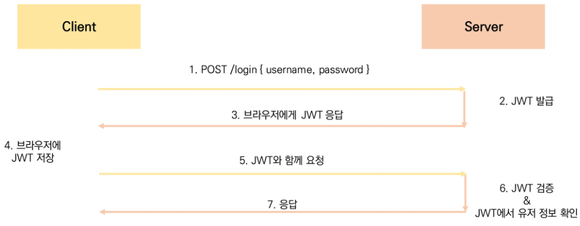

* 정리

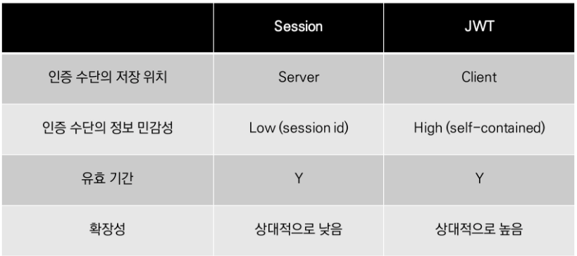

