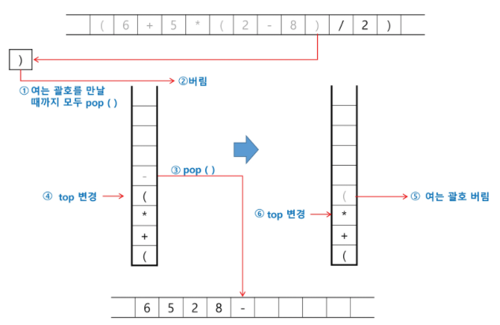
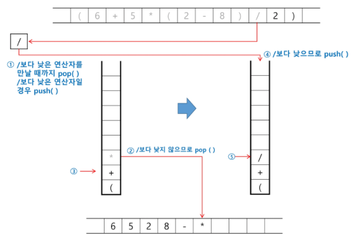
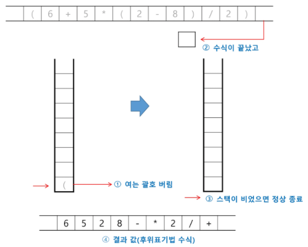
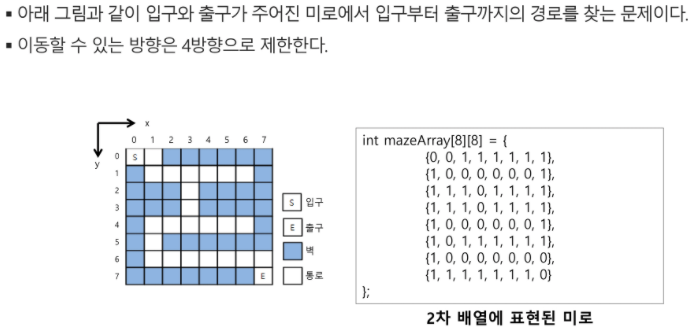
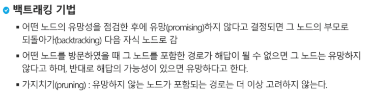
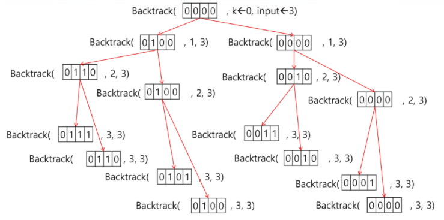
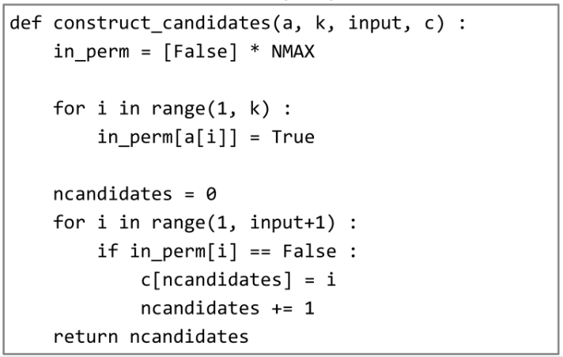

# [5] 스택 2 (Stack 2)

## 1. 계산기

* 문자열 수식 계산의 일반적 방법
  * step1. 중위 표기법의 수식을 후위 표기법으로 변경한다. (스택 이용)
  * step2. 후위 표기법의 수식을 스택을 이용하여 계산한다.


### step1. 중위->후위 표기법으로의 변환 알고리즘 (스택 이용)

1. 입력 받은 중위 표기식에서 토큰을 읽는다.
2. 토큰이 피연산자이면(숫자) 토큰을 출력한다.
3. 토큰이 연산자(괄호 포함)일 때, 이 토큰이 스택의 top에 저장되어 있는 연산자보다 우선순위가 높으면 스택에 push하고, 그렇지 않다면 스택의 top의 연산자의 우선순위가 토큰의 우선순위보다 작을 때까지 스택에서 pop한 후 토큰의 연산자를 push한다. 만약 top에 연산자가 없으면 push한다.
4. 토큰이 오른쪽 괄호 ')'이면 스택 top에 왼쪽 괄호 '('가 올 때까지 스택에 pop연산을 수행하고 pop한 연산자를 출력한다. 왼쪽 괄호를 만나면 pop만 하고 출력하지는 않는다.
5. 중위 표기식에 더 읽을 것이 없다면 중지하고, 더 읽을 것이 있다면 1부터 다시 반복한다.
6. 스택에 남아있는 연산자를 모두 pop하여 출력한다.
   * 스택 밖의 왼쪽 괄호는 우선순위가 가장 높으며, 스택 안의 왼쪽 괄호는 우선순위가 가장 낮다.


* 중위 표기법에서 후위 표기법으로의 변환 예
  * (6+5*(2-8)/2)


> 우선순위 높은 순서대로 : ***, /**  =>  **+, -**  =>  **(**  [가장 낮음]


> top보다 우선순위가 높으면 push



> 닫는 괄호가 나오면 여는 괄호 나올때까지 pop



> top보다 우선순위가 더 높지 않으면 더 낮은 연산자를 만날 때까지 pop
>
> 더 낮은 연산자일 경우 push




### step2. 후위 표기법의 수식을 스택을 이용하여 계산

1. 피연산자를 만나면 스택에 push한다.
2. 연산자를 만나면 필요한 만큼의 피연산자를 스택에서 pop하여 연산하고, 연산결과를 다시 스택에 push 한다.
3. 수식이 끝나면, 마지막으로 스택을 pop하여 출력한다.


> 피연산자 스택에 push


> 연산자이면 두 번 pop하여 연산, 계산결과 스택에 push


## 2. 백트래킹

> 백트래킹 (Backtracking) 기법은 해를 찾는 도중에 막히면(해가 아니면) 되돌아가서 다시 해를 찾아 가는 기법이다.
>
> 백트래킹 기법은 최적화 (optimization) 문제와 결정 문제를 해결할 수 있다.
>
> 결정 문제 : 문제의 조건을 만족하는 해가 존재하는지의 여부를 'yes' 또는 'no'가 답하는 문제
>
> - 미로찾기, n-Queen 문제, Map coloring, 부분 집합의 합(Subset Sum) 문제 등 


* 미로 찾기

  


* 백트래킹과 깊이우선탐색과의 차이
  * 어떤 노드에서 출발하는 경로가 해결책으로 이어질 것 같지 않으면 더 이상 그 경로를 따라가지 않음으로써 시도의 횟수를 줄임 (가지치기 prunning)
  * 불필요한 경로를 조기에 차단
  * 깊이우선탐색 - 경우의 수가 너무 많음. N! 가지의 경우의 수 -> 불가능
  * 백트래킹 - 경우의 수가 줄어들지만 최악의 경우에는 여전히 지수함수 시간을 요하므로 처리 불가능




* 백트래킹 알고리즘 절차
  1. 상태 공간 트리의 깊이 우선 검색을 실시한다.
  2. 각 노드가 유망한지를 점검한다.
  3. 만일 그 노드가 유망하지 않으면, 그 노드의 부모 노드로 돌아가서 검색을 계속한다.

* 일반 백트레킹 알고리즘

  


### 부분집합 구하기

> 어떤 집합의 공집합과 자기자신을 포함한 모든 부분집합을 powerset이라고 하며 구하고자 하는 어떤 집합의 원소 개수가 n개일 경우 부분집합의 개수는 2^n이 나온다.

* 백트래킹 기법으로 powerset을 구하기

  ​	
  
  ​	
  
  ​						  
  
  


### 순열 구하기

* 백트래킹을 이용하여 순열 구하기





```python
# 순열 생성 과정
def f(i, N):
    if i == N:      # 순열 완성
        print(P)
    else:           # i번 원소값 결정
        for j in range(i, N):     # 자신부터 오른쪽 원소와 교환
            P[i], P[j] = P[j], P[i]
            f(i+1, N)
            P[i], P[j] = P[j], P[i]
P = [1, 2, 3]
f(0, len(P))
```


## 3. 분할정복


