#  [2] 완전검색 / 그리디

## 반복과 재귀

 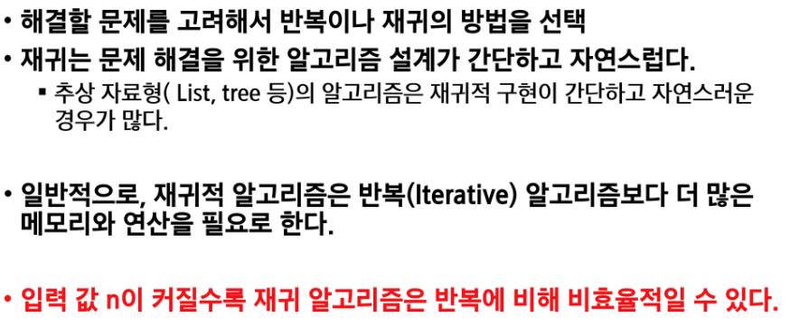

## 완전검색기법

* 많은 종류의 문제들이 특정 조건을 만족하는 경우나 요소를 찾는 것이다.
* 또한, 이들은 전형적으로 순열, 조합, 그리고 부분집합과 같은 조합적 문제들과 연관된다.
* 완전 검색은 조합적 문제에 대한 brute-force 방법이다.
* 검정등에서 주어진 문제를 풀 때, 우선 완전 검색으로 접근하여 해답을 도출한 후, 성능 개선을 위해 다른 알고리즘을 사용하고 해답을 확인하는 것이 바람직하다.

 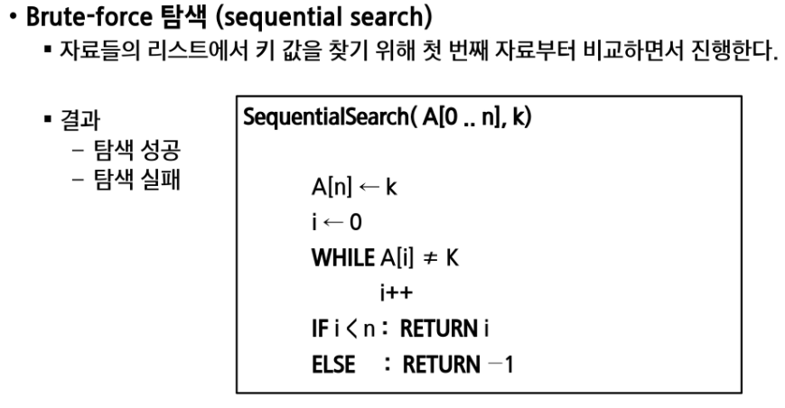

## 조합적 문제

### 1. 순열

 

* 단순하게 순열을 생성하는 방법

  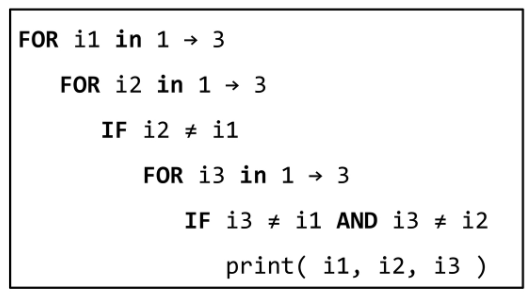

* 사전적 순서
* 최소 변경을 통한 방법

* 재귀 호출을 통한 순열 생성

  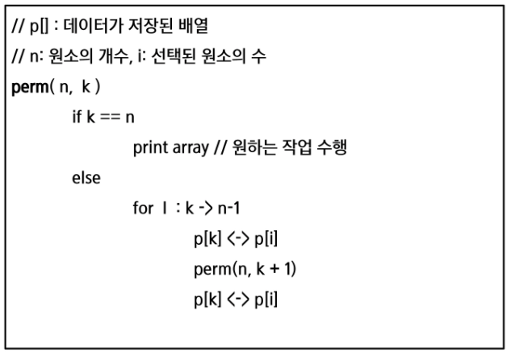

* 사용여부에 따른 순열

  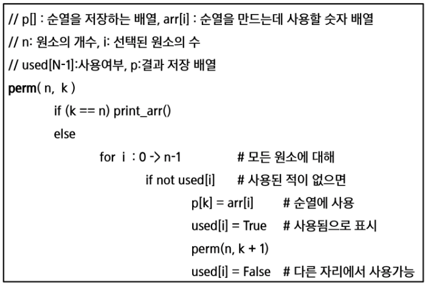

### 2. 부분집합

* 집합에 포함된 원소들을 선택하는 것이다.
* N개의 원소를 포함한 집합
  * 자기 자신과 공집합 포함한 모든 부분집합(power set)의 개수는 2^n개
  * 원소의 수가 증가하면 부분집합의 개수는 지수적으로 증가

* 단순하게 모든 부분집합 생성하는 방법

  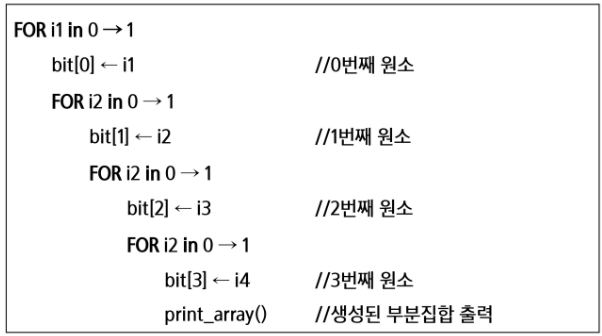

* 바이너리 카운팅을 통한 사전적 순서

  * 가장 자연스러운 방법

    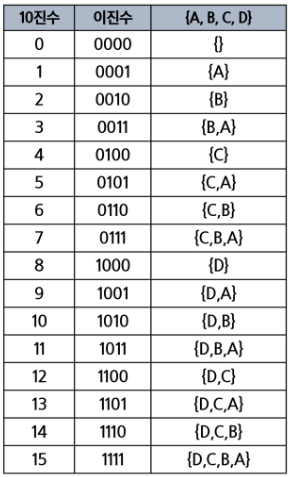 바이너리 카운팅 : 원소 수에 해당하는 N개의 비트열을 이용한다. 

    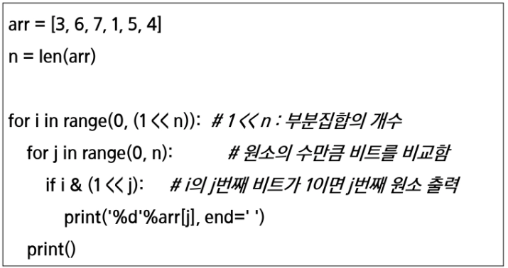

    

### 3. 조합

* 서로 다른 n개의 원소 중 r개를 순서 없이 골라낸 것을 조합이라고 부른다.

  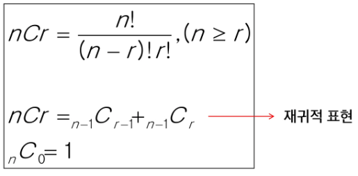

* 재귀 호출을 이용한 조합 생성 알고리즘

  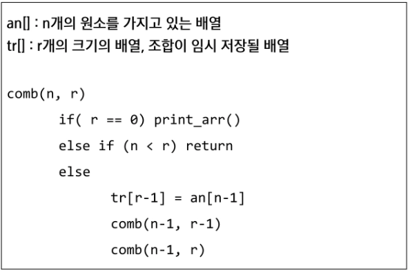

  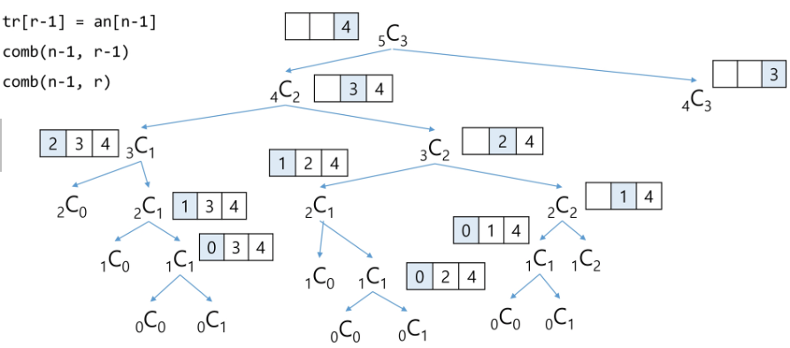

 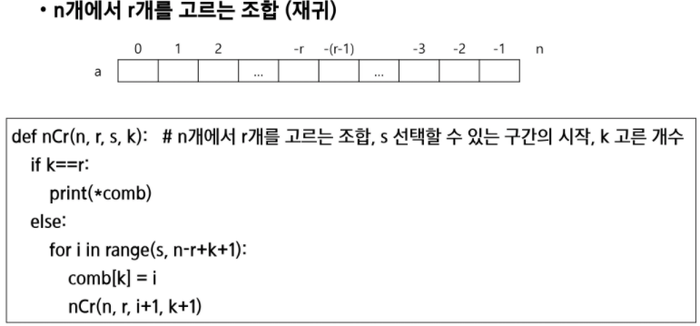

## 탐욕 알고리즘

* 최적해를 구하는데 사용되는 근시안적인 방법
* 일반적으로, 머리속에 떠오르는 생각을 검증없이 바로 구현하면 Greedy 접근이 된다.
* 여러 경우 중 하나를 선택할때 마다 그 순간에 최적이라고 생각되는 것을 선택해 나가는 방식으로 진행
* 각 선택시점에서 이루어지는 결정은 지역적으로는 최적이지만, 그선택들을 계속 수집하여 최종적인 해답을 만들었다고 하여, 그것이 최적이라는 보장은 없다.
* 한번 선택된 것은 번복하지 않는다. => 단순함. 제한적인 문제들에 적용
* 최적화 문제란 가능한 해들 중에서 가장 좋은 해를 찾는 문제

#### 동작 과정

> 거스름돈 줄이기

1. 해 선택 : 현재 상태에서 부분 문제의 최적 해를 구한 뒤, 이를 부분집합에 추가한다.

      > 현재 고를 수 있는 가장 단위가 큰 동전을 하나 골라 거스름돈에 추가한다.

2. 실행 가능성 검사 : 새로운 부분 해 집합이 실행가능한지 확인. 문제의 제약 조건을 위반하지 않는지를 검사

      > 거스름돈이 손님에게 내드려야 할 액수를 초과하는지 확인.
      >
      > 초과 - 마지막에 추가한 동전을 거스름돈에서 빼고 1로 돌아가서 한단계 작은 단위의 동전 추가

3. 해 검사 : 새로운 부분 해 집합이 문제의 해가 되는지를 확인. 아직 전체 문제의 해가 완성되지 않았다면 1의 해 선택부터 다시 시작한다.

      > 거스름돈을 확인해서 액수에서 모자라면 다시 1로 돌아가서 거스름돈에 추가할 동전을 고른다.

> 최적해를 반드시 구한다는 보장이 없다.

#### 활동 선택 문제

 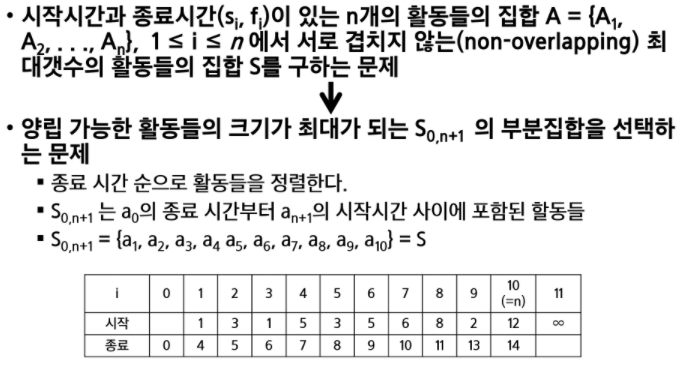

 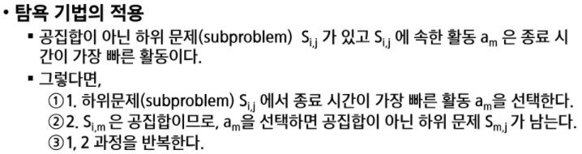

 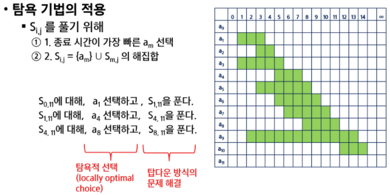

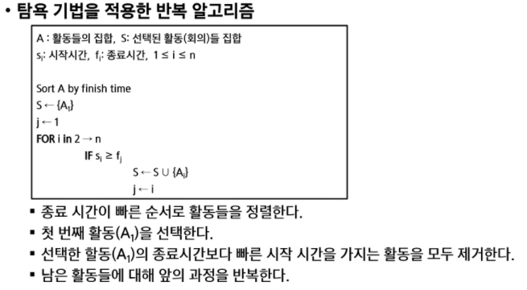

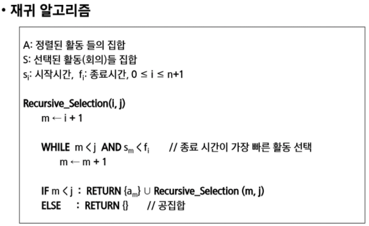

#### 탐욕 알고리즘의 필수 요소

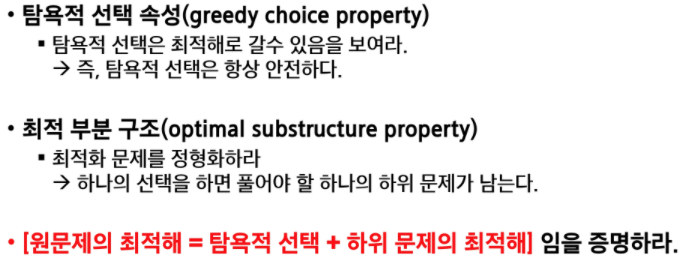

#### 탐욕 기법을 통한 Baby-gin 문제 해결

 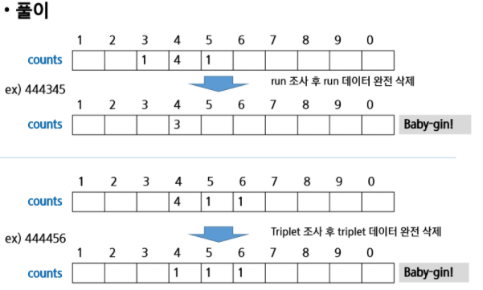

> 카운트 함수 - 0~9, 10, 11까지 만듬 => 인덱스 때문에

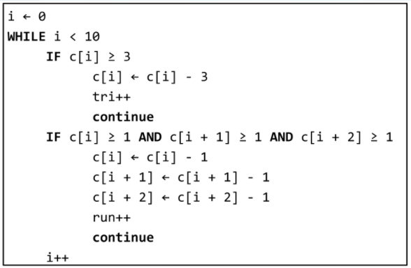

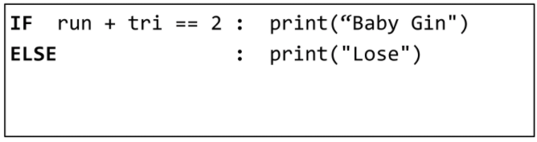

