# [3] 분할 정복 & 백트래킹

## 1. 분할정복

* 거듭 제곱

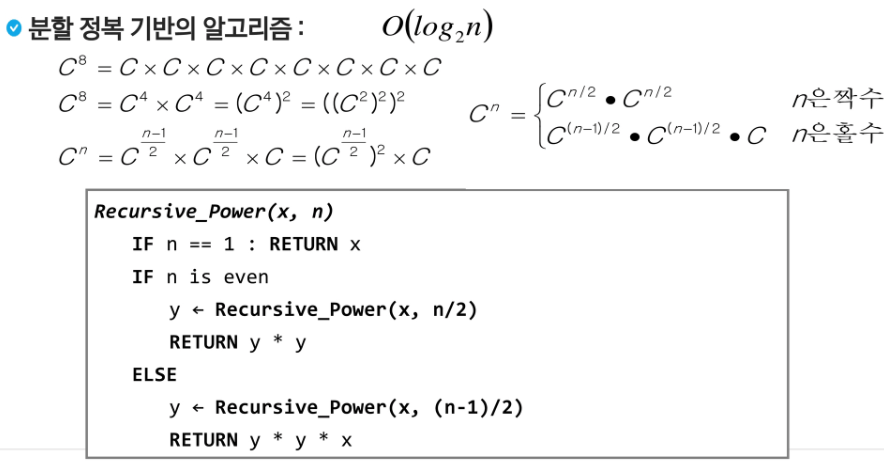

### ◆ 병합 정렬 (Merge Sort)

* 여러 개의 정렬된 자료의 집합을 병합하여 한개의 정렬된 집합으로 만드는 방식
* 분할 정복 알고리즘 활용 - 자료를 최소단위의 문제까지 나눈 후에 차례대로 정렬하여 최종 결과를 얻어냄
* 시간 복잡도 - O(n log n)

* 알고리즘 : 분할 과정
  *  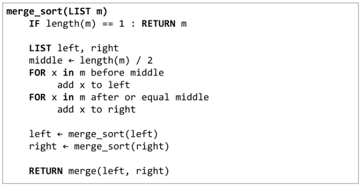
* 알고리즘 : 병합 과정
  *  

### ◆ 퀵 정렬

* 주어진 배열을 두 개로 분할하고, 각각을 정렬한다.
* 병합정렬과 다른점 
  * 분할할 때, 기준아이템을 중심으로 이보다 작은것은 왼 편, 큰 것은 오른편에 위치시킨다.
  * 각 부분 정렬이 끝난 후, 병합정렬은 '병합'이란 후처리 작업이 필요하나, 퀵정렬은 필요로 하지 않는다.
* 알고리즘
  *  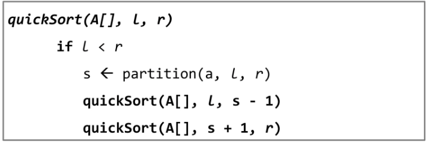
  *  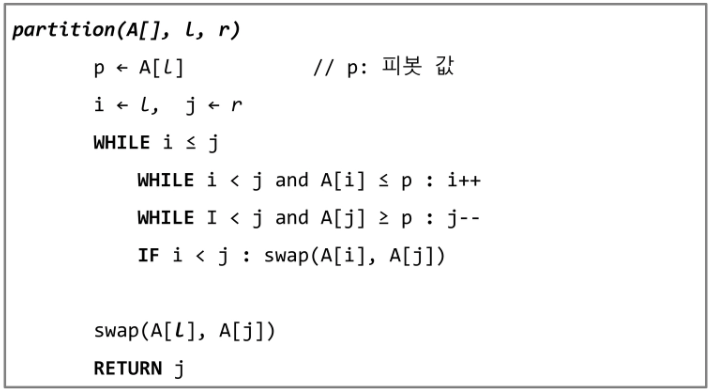 - Hoare-Partition 알고리즘
  *  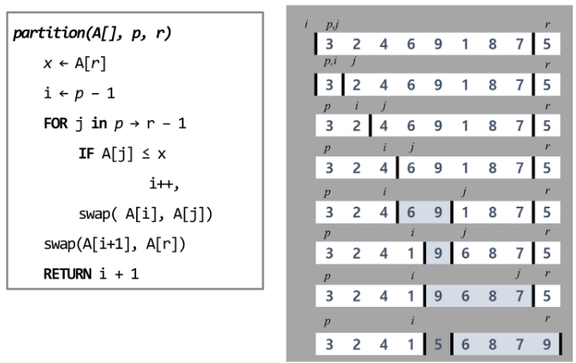 - Lomuto partition 알고리즘

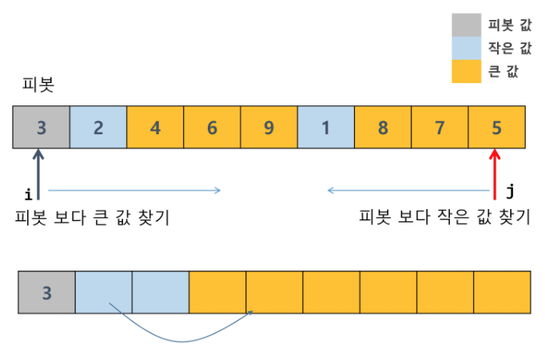

- 피봇보다 큰값 왼쪽부터, 작은값 오른쪽 부터 찾고 바꿈

* i와 j가 교차하면 피봇이 경계사이에 위치함 

### ◆ 이진 검색 (Binary Search)

* 자료의 가운데에 있는 항목의 키 값과 비교하여 다음 검색의 위치를 결정하고 검색을 계속 진행하는 방법

* 자료가 정렬된 상태여야 한다.

* 검색과정

  1. 자료의 중앙에 있응 원소를 고른다.
  2. 중앙 원소의 값과 찾고자 하는 목표값을 비교한다.
  3. 목표 값이 중앙 원소의 값보다 작으면 => 자료 왼쪽 반 새로 검색 수행/ 크면=> 오른쪽 반 새로 수행
  4. 찾고자 하는 값을 찾을 때까지 반복

  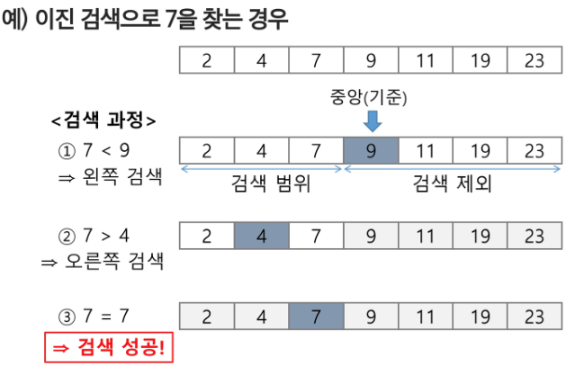

* 알고리즘
  * 반복구조 : 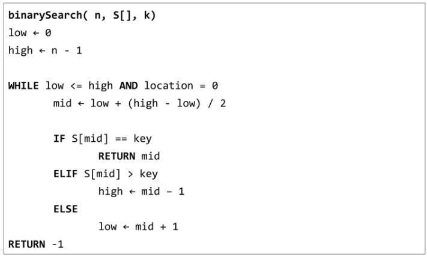
  * 재귀구조 : 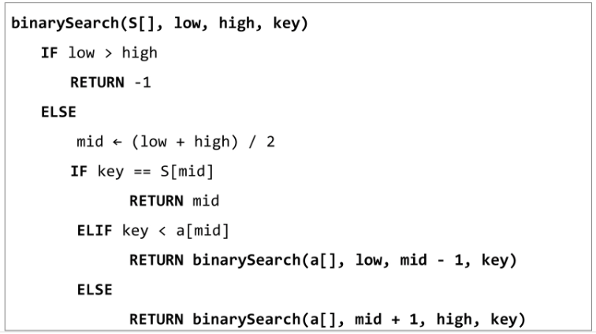

### ◆ 분할 정복의 활용

* 병합 정렬은 외부 정렬의 기본이 되는 정렬 알고리즘이다. 또한, 멀티코어 CPU나 다수의 프로세서에서 정렬 알고리즘을 병렬화하기 위해 병합 정렬 알고리즘이 활용된다.

* 퀵 정렬은 매우 큰 입력 데이터에 대해서 좋은 성능을 보이는 알고리즘이다.

  

## 2. 백트래킹

* 여러가지 선택지들이 존재하는 상황에서 한가지를 선택한다.
* 선택이 이루어지면 새로운 선택지들의 집합이 생성된다.
* 이런 선택을 반복하면서 최종 상태에 도달한다.
  * 올바른 선택을 계속하면 목표 상태(goal state)에 도달한다.

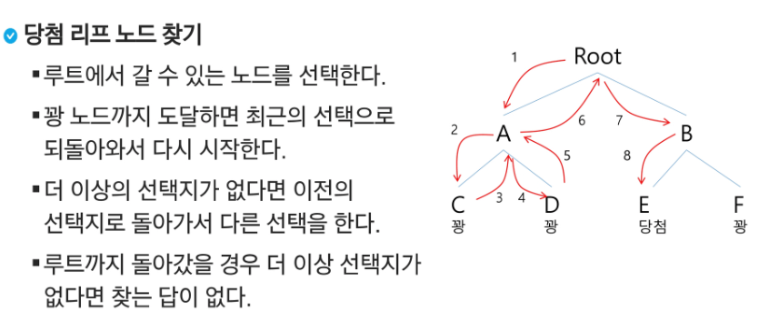

* 깊이 우선 탐색과의 차이
  * 경로가 해결책으로 이어질 것 같지 않으면 더이상 그 경로는 따라가지 않음으로써 시도의 횟수를 줄임(Prunning 가지치기)
  * 불필요한 경로를 조기에 차단. 깊이우선탐색 - 모든 경로를 추적.
  * N! 가지의 경우의 수를 가진 문제 -> 깊이우선탐색을 하기엔 경우의 수가 너무 많음
  * 백트래킹 알고리즘을 적용하면 일반적으로 경우의 수가 줄어들지만 이 역시 최악의 경우에는 여전히 지수함수 시간을 요하므로 처리 불가능

* 백트래킹을 이용한 알고리즘

  1. 상태 공간 트리의 깊이 우선 검색을 실시한다.

  2. 각 노드가 유망한지를 점검한다.

  3. 만일 그 노드가 유망하지 않으면, 그 노드의 부모 노드로 돌아가서 검색을 계속한다.

     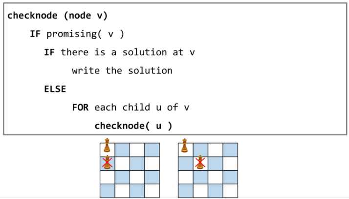

  * 순수한 깊이 우선 검색 = 155노드
  * 백트래킹 = 27노드

### 상태공간트리를 구축하여 문제를 해결

 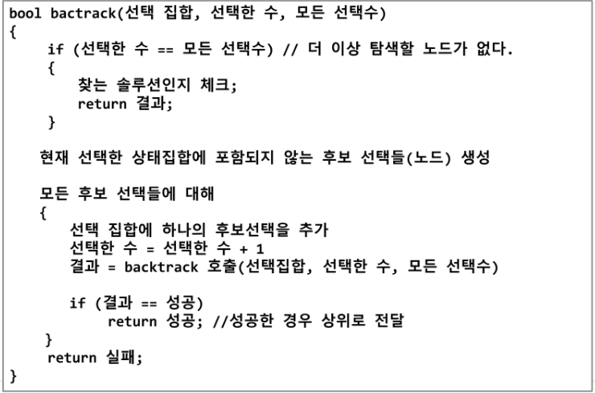

* 순열 구하기

  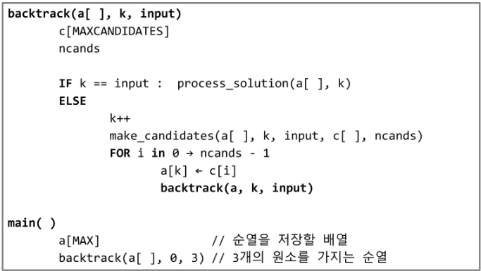

  

  > make_candidates : 사용되지 않은 값들을 저장 c[]

  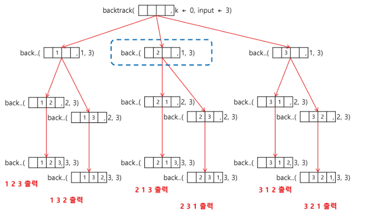

## 3. 트리

* 트리는 싸이클이 없는 무향 연결 그래프이다.
  * 두 노드 사이에는 유일한 경로 존재
  * 각 노드 최대 하나의 부모노드가 존재
  * 각 노드 자식노드가 없거나 하나 이상 존재
* 비선형구조
  * 원소들 간에 1:n 관계를 가지는 자료구조
  * 원소들 간에 계층관계를 가지는 계층형 자료구조

* 한개 이상의 노드로 이루어진 유한 집합.
  * 노드 중 부모가 없는 노드를 루트(root)라 한다.
  * 나머지 노드들은 n개의 분리 집합 T1,...,TN으로 분리될 수 있다
  * 이들 T1,...,TN은 각각 하나의 트리가 되며 루트의 서브트리(subtree)라고 한다.

### ◆ 용어 

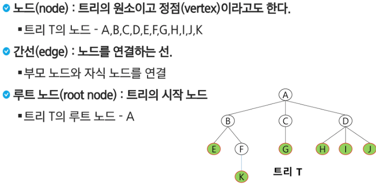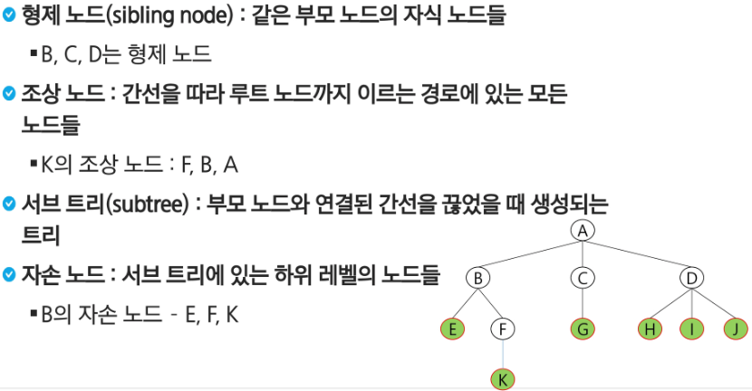

* 차수
  * 노드의 차수 : 노드에 연결된 자식 노드의 수
  * 트리의 차수 : 노드의 차수 중에서 가장 큰 값
  * 단말 노드(리프 노트) : 차수가 0인 노드. 자식 없음
* 높이
  * 노드의 높이 : 루트에서 노드에 이르는 간선의 수. 노드의 레벨 (루트=0)
  * 트리의 높이 : 노드의 높이 중에서 가장 큰 값. 최대 레벨

### ◆ 이진트리

* 모든 노드들이 최대 2개의 서브트리를 갖는 특별한 형태의 트리
* 각 노드가 자식 노드를 최대한 2개까지만 가질 수 있는 트리
* 높이가 h인 이진트리가 가질 수 있는 노드의 최소 개수는 (h+1)개가 되며, 최대 개수는 (2^(h+1)-1)개가 된다.

* 종류
  * 포화 이진 트리(Full Binary Tree)
    * 노드가 포화상태로 채워져있는 이진트리 (노드의 개수 =  (2^(h+1)-1)개)
  * 완전 이진 트리(Complete Binary Tree)
    * 노드 수가 n개일 때(2^h <= n <= 2^(h+1)-1), 포화 이진 트리의 노드번호 1번부터 n번까지 빈자리가 없는 이진트리 
  * 편향 이진 트리(Skewed Binary Tree)
    * 높이 h에 대한 최소 개수를 가지면서 한쪽 방향의 자식 노드만을 가진 이진 트리
      * 왼쪽 / 오른쪽 편향 이진 트리

* 순회 : 각 노드를 중복되지 않게 전부 방문하는 것. 비선형구조이기 때문에 선후 연결관계를 알 수 없다.
  * 트리의 노드들을 체계적으로 방문하는 것
  * 3가지 순회 방법
  
    * 전위순회(preorder traversal) : VLR
      * 부모노드 방문 후, 자식노드를 좌, 우 순서로 방문한다.
    * 중위순회(inorder traversal) : LVR
      * 왼쪽 자식노드, 부모노드, 오른쪽 자식노드 순으로 방문한다.
    * 후위순회(postorder traversal) : LRV
      * 자식노드를 좌우 순서로 방문한 후, 부모노드로 방문한다.

#### 이진 탐색 트리

 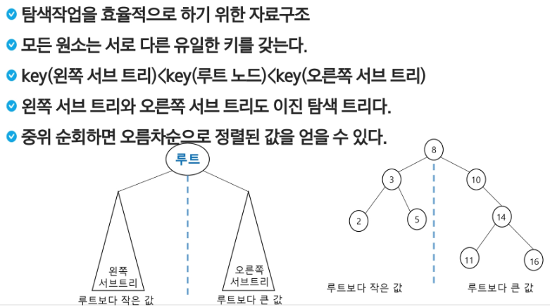

 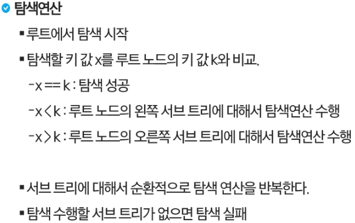

### ◆ 힙

* 완전 이진트리에 있는 노드 중에서 키 값이 가장 큰 노드나 키 값이 가장 작은 노드를 찾기 위해서 만든 자료구조
* 최대 힙
  * 키 값이 가장 큰 노드를 찾기 위한 완전 이진트리
  * 부노 노드의 키 값 > 자식 노드의 키 값
  * 루트 노드 : 키 값이 가장 큰 노드
* 최소 힙
  * 키 값이 가장 작은 노드를 찾기 위한 완전 이진트리
  * 부노 노드의 키 값 < 자식 노드의 키 값
  * 루트 노드 : 키 값이 가장 작은 노드

#### 활용

* 특별한 큐의 구현과 정렬
* 우선순위 큐를 구현하는 가장 효율적인 방법 = 힙 사용
  * 노드 하나의 추가/삭제가 시간복잡도가 O(logN)이고 최대값/최소값을 O(1)에 구할 수 있다.
  * 완전 정렬보다 관리비용이 적다.
* 배열을 통해 트리 형태를 쉽게 구현할 수 있다.

* 힙 정렬은 힙 자료구조를 이용해서 이진 탐색과 유사한 방법으로 수행된다.
* 정렬 - 하나의 값을 힙에 삽입한다(반복) => 힙에서 순차적으로 값을 하나씩 제거한다.
* 시간 복잡도
  * N개의 노드 삽입 연산 + 삭제 연산
  * 삽입과 삭제 연산 각각 O(logN)
  * 전체 정렬은 O(NlogN)
* 힙 정렬은 배연레 저장된 자료를 정렬하기에 유용하다.
